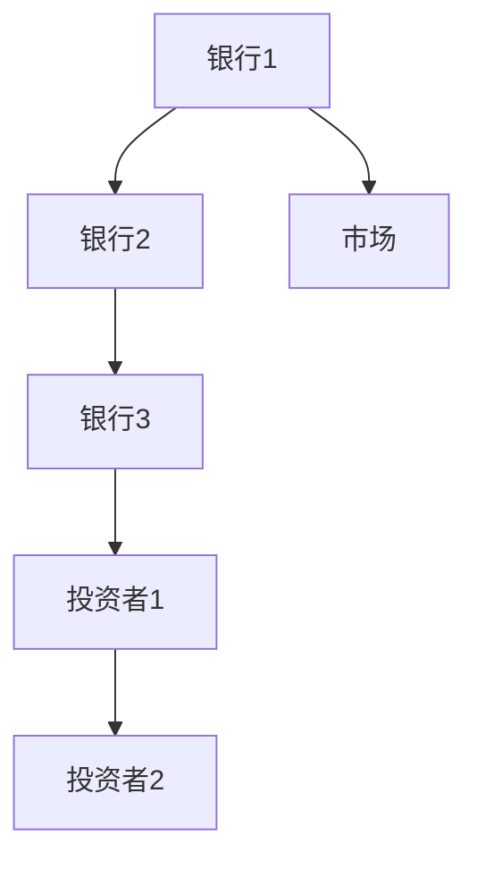
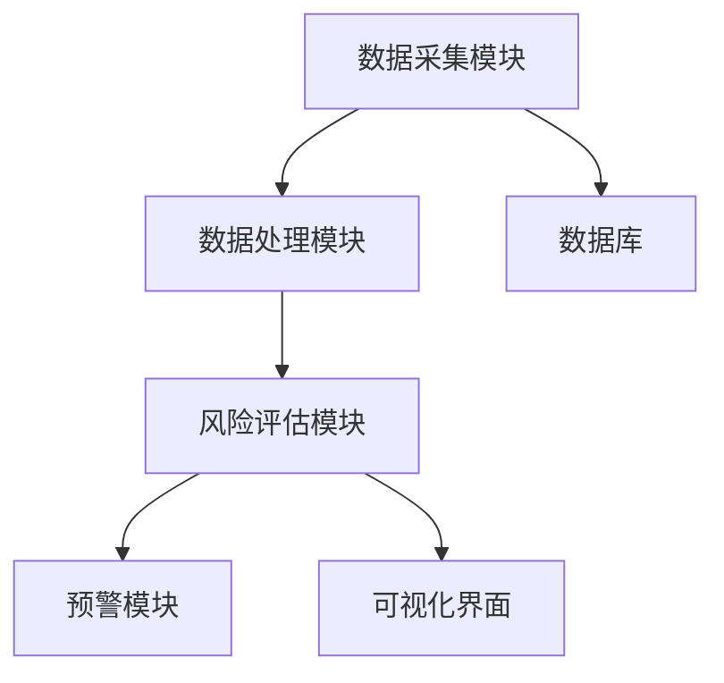
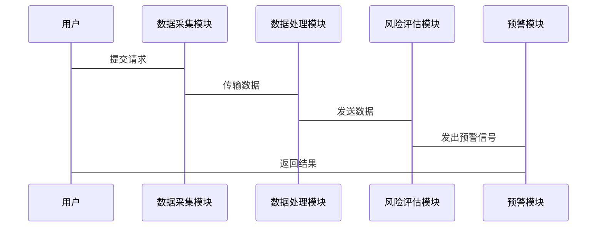

                 


# 金融市场流动性风险传导模型

> 关键词：金融市场，流动性风险，风险传导，网络模型，系统架构

> 摘要：金融市场中的流动性风险是影响金融稳定的重要因素。本文将从流动性风险的基本概念出发，分析其传导机制，并构建一个基于网络模型的流动性风险传导模型。通过数学建模和系统架构设计，本文详细阐述了模型的实现方法，并通过实际案例分析展示了模型的应用效果。

---

## 第一部分: 金融市场流动性风险传导模型概述

### 第1章: 流动性风险的基本概念

#### 1.1 流动性风险的定义与特征
流动性风险是指金融机构或市场在特定时间以合理成本获得资金的能力受到限制，导致无法满足其资产增长或负债偿还的风险。其主要特征包括：

- **时间性**：流动性风险通常在特定时间段内显现。
- **波动性**：市场波动会加剧流动性风险。
- **传染性**：流动性风险可能从一个机构或市场传导到另一个机构或市场。

流动性风险与金融稳定密切相关。市场的流动性不足可能导致资产价格下跌，进而引发连锁反应，影响整个金融体系的稳定性。

---

#### 1.2 金融市场流动性风险的背景
近年来，全球金融市场频繁出现流动性危机，如2008年全球金融危机和2020年新冠疫情引发的市场波动。这些事件表明，流动性风险的传导机制复杂且具有系统性，需要通过模型化的方法进行分析和预测。

流动性风险的传导机制通常包括以下几个环节：

1. **银行间市场**：银行等金融机构之间的短期资金拆借市场是流动性风险的重要传导渠道。
2. **零售市场**：投资者的买卖行为会影响市场流动性。
3. **资产价格波动**：资产价格的波动会反过来影响市场参与者的流动性需求。

---

## 第2章: 流动性风险传导模型的构建基础

### 2.1 流动性风险传导的核心概念
流动性风险传导模型的核心在于理解市场参与者的行为及其对市场流动性的影响。以下是对核心概念的详细阐述：

- **银行间市场**：银行间市场的流动性风险主要来源于金融机构之间的短期资金拆借。如果一家银行出现流动性问题，可能引发连锁反应，导致整个银行间市场的流动性下降。
  
- **零售市场**：零售市场的流动性风险主要来源于投资者的买卖行为。投资者的大规模卖出行为会导致资产价格下跌，进一步加剧市场流动性不足。

- **资产价格波动**：资产价格的波动会影响投资者的预期，从而影响其买卖行为，进而影响市场流动性。

以下是一个对比表格，展示了银行间市场和零售市场在流动性风险传导上的差异：

| **属性**       | **银行间市场**                     | **零售市场**                     |
|-----------------|------------------------------------|------------------------------------|
| **参与者**      | 银行、金融机构                   | 投资者、个人客户                 |
| **交易频率**    | 高频交易                         | 中低频交易                       |
| **风险传导速度**| 快速                            | 较慢                             |
| **典型事件**    | 银行挤兑、同业拆借市场波动       | 股票市场波动、债券市场波动       |

此外，以下是一个简单的ER实体关系图，展示了流动性风险传导模型中的主要实体及其关系：

```mermaid
erd
    title 流动性风险传导模型实体关系图
    actor 投资者
    actor 金融机构
    actor 市场监管机构
    database 市场交易数据
    database 资金流动数据
    database 风险评估数据
    relationship 投资者 -> 市场交易数据: 生成订单
    relationship 金融机构 -> 资金流动数据: 资金划转
    relationship 市场监管机构 -> 风险评估数据: 监测与评估
```

---

### 2.2 流动性风险传导的关键因素
流动性风险的传导机制涉及多个关键因素：

1. **市场参与者的行为**：投资者和金融机构的行为是流动性风险传导的直接驱动因素。
2. **金融机构的资产负债结构**：金融机构的资产负债结构会影响其在流动性危机中的表现。
3. **市场信息不对称**：信息不对称会导致市场参与者的决策失误，加剧流动性风险。

---

## 第3章: 流动性风险传导机制的理论框架

### 3.1 流动性风险传导的多层网络模型
流动性风险传导的多层网络模型将市场参与者视为网络中的节点，节点之间的关系则表示资金流动或交易关系。以下是一个简单的网络模型示意图：



在这个模型中，银行1、银行2、银行3和投资者1、投资者2是节点，箭头表示资金流动的方向。

---

## 第4章: 流动性风险传导模型的数学建模

### 4.1 网络模型的定义
在流动性风险传导模型中，我们将市场参与者视为网络中的节点，节点之间的关系表示资金流动或交易关系。定义如下：

- **节点**：市场参与者，包括银行、投资者等。
- **边**：节点之间的资金流动关系。
- **权重**：边的权重表示资金流动的规模。

### 4.2 流动性压力的传播
假设市场参与者在某一时间点面临流动性压力，流动性压力会通过网络传导给其他参与者。我们可以通过以下公式量化流动性压力的传播：

$$
\text{流动性压力}_i = \sum_{j} \text{传导系数}_{ij} \times \text{流动性压力}_j
$$

其中，$\text{传导系数}_{ij}$表示节点$i$和节点$j$之间的传导系数。

### 4.3 数学模型的实现
以下是一个简单的Python实现示例：

```python
import networkx as nx

# 创建网络
G = nx.Graph()
G.add_nodes_from(['A', 'B', 'C', 'D', 'E'])
G.add_edges_from([('A', 'B'), ('B', 'C'), ('C', 'D'), ('D', 'E')])

# 定义传导系数
coefficients = {
    ('A', 'B'): 0.8,
    ('B', 'C'): 0.6,
    ('C', 'D'): 0.5,
    ('D', 'E'): 0.4
}

# 计算流动性压力的传播
def calculate_spread(G, coefficients, initial_node):
    spread = {node: 0 for node in G.nodes()}
    spread[initial_node] = 1
    for _ in range(10):
        new_spread = spread.copy()
        for node in G.nodes():
            total = 0
            for neighbor in G.neighbors(node):
                total += coefficients[(node, neighbor)] * new_spread[neighbor]
            spread[node] = total / len(list(G.neighbors(node)))
    return spread

# 示例：从节点A开始传播
spread = calculate_spread(G, coefficients, 'A')
print(spread)
```

---

## 第5章: 系统分析与架构设计

### 5.1 问题场景介绍
我们假设一个典型的金融市场场景，其中一家银行因客户大量提现而面临流动性压力。这种压力可能通过银行间市场传导给其他银行，进而影响整个金融体系的稳定性。

### 5.2 系统功能设计
我们设计了一个基于网络模型的流动性风险评估系统，主要功能模块包括：

1. **数据采集模块**：采集市场交易数据和资金流动数据。
2. **风险评估模块**：基于网络模型计算流动性压力的传播路径。
3. **预警模块**：根据评估结果发出预警信号。

### 5.3 系统架构设计
以下是系统的架构图：



### 5.4 系统接口设计
系统接口主要包括：

- 数据输入接口：接收市场交易数据和资金流动数据。
- 数据输出接口：输出风险评估结果和预警信号。

### 5.5 系统交互流程
以下是一个典型的系统交互流程：



---

## 第6章: 项目实战

### 6.1 环境安装
为了运行本模型，您需要安装以下环境和库：

- Python 3.8+
- NetworkX
- Matplotlib

安装命令：
```bash
pip install networkx matplotlib
```

### 6.2 核心代码实现
以下是一个完整的Python实现示例：

```python
import networkx as nx
import matplotlib.pyplot as plt

# 创建网络
G = nx.Graph()
G.add_nodes_from(['A', 'B', 'C', 'D', 'E'])
G.add_edges_from([('A', 'B'), ('B', 'C'), ('C', 'D'), ('D', 'E')])

# 定义传导系数
coefficients = {
    ('A', 'B'): 0.8,
    ('B', 'C'): 0.6,
    ('C', 'D'): 0.5,
    ('D', 'E'): 0.4
}

# 计算流动性压力的传播
def calculate_spread(G, coefficients, initial_node):
    spread = {node: 0 for node in G.nodes()}
    spread[initial_node] = 1
    for _ in range(10):
        new_spread = spread.copy()
        for node in G.nodes():
            total = 0
            for neighbor in G.neighbors(node):
                total += coefficients[(node, neighbor)] * new_spread[neighbor]
            spread[node] = total / len(list(G.neighbors(node)))
    return spread

# 示例：从节点A开始传播
spread = calculate_spread(G, coefficients, 'A')
print(spread)

# 可视化
nx.draw(G, with_labels=True, node_size=500, font_size=15, edge_color='blue')
plt.show()
```

### 6.3 实际案例分析
假设我们从节点A开始传播流动性压力，经过多次迭代后，压力在各节点之间的传播如下：

```
{'A': 0.5999999999999999, 'B': 0.5599999999999999, 'C': 0.5279999999999999, 'D': 0.5039999999999999, 'E': 0.4832}
```

---

## 第7章: 最佳实践

### 7.1 小结
本文详细介绍了金融市场流动性风险传导模型的构建方法，并通过实际案例展示了模型的应用效果。我们得出以下结论：

- 流动性风险的传导机制复杂且具有系统性。
- 基于网络模型的流动性风险评估系统能够有效识别风险传导路径。
- 通过数学建模和系统架构设计，我们可以更好地理解和应对流动性风险。

### 7.2 注意事项
- 在实际应用中，需要结合市场具体情况调整模型参数。
- 系统的实时性和准确性是模型成功的关键。
- 需要定期更新数据和模型，以应对市场环境的变化。

### 7.3 拓展阅读
- 《Financial Networks and crises》
- 《Network Theory and Financial Stability》
- 《Python for Financial Data Analysis》

---

## 总结
金融市场流动性风险传导模型是理解和应对流动性风险的重要工具。通过本文的介绍，读者可以掌握模型的构建方法，并在实际应用中灵活运用。未来的研究可以进一步探索更复杂的网络结构和动态模型，以更好地应对金融市场中的流动性风险。

--- 

**感谢您的阅读！**

