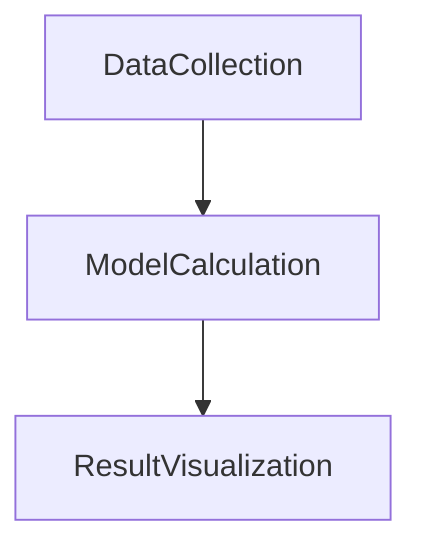

                 


# 金融市场系统性风险测度模型

> 关键词：系统性风险，风险测度模型，VaR，CVaR，金融市场，系统性风险传播

> 摘要：本文详细探讨了金融市场中系统性风险的测度模型，从基本概念到理论基础，再到具体的算法实现和实证分析，系统性地介绍了如何有效测度和管理金融市场中的系统性风险。文章结合了理论与实践，通过详细分析和案例研究，展示了不同模型的优缺点以及实际应用中的注意事项。

---

## 第1章: 系统性风险的基本概念

### 1.1 系统性风险的定义与特征

系统性风险是指由于市场整体的波动或外部冲击导致的整个金融系统发生系统性崩盘的风险。与非系统性风险不同，系统性风险影响的是整个市场，而不是单个资产或个体。其主要特征包括：

- **系统性风险的系统性特征**：风险在市场中的传播性和连锁反应。
- **不可分散性**：通过分散投资无法完全消除。
- **不可预测性**：系统性风险往往源于不可预见的事件。

### 1.2 金融市场系统性风险的重要性

系统性风险对金融市场的稳定构成威胁，可能导致金融危机和经济衰退。测度系统性风险有助于监管机构及时采取措施，防止系统性风险的积累和扩散。

---

## 第2章: 系统性风险测度模型的理论基础

### 2.1 风险测度的基本理论

风险测度是金融学中的核心概念，常用的方法包括VaR（Value at Risk）和CVaR（Conditional Value at Risk）。VaR测度的是在一定置信水平下，资产可能遭受的最大损失。CVaR则是VaR的扩展，测度的是在VaR水平下的平均损失。

### 2.2 系统性风险测度的理论框架

系统性风险的测度需要考虑市场中各主体之间的相互关联性。常用的模型包括：

- **D-VaR模型**：通过将各个金融机构的风险敞口进行汇总，测度整个系统的风险。
- **CoVaR模型**：通过估计一家金融机构对整个系统风险的贡献程度，测度其对系统性风险的影响。

---

## 第3章: 系统性风险测度模型的核心算法

### 3.1 系统性风险测度的主要算法

#### 3.1.1 基于VaR的系统性风险测度算法

VaR模型通过统计方法计算资产在一定置信水平下的最大损失。假设资产回报服从正态分布，VaR可以通过计算均值和标准差来确定。

$$ VaR_{\alpha} = \mu + z_{\alpha} \cdot \sigma $$

其中，$\mu$ 是资产的平均回报，$z_{\alpha}$ 是对应于置信水平 $\alpha$ 的标准正态分布分位数，$\sigma$ 是资产回报的标准差。

#### 3.1.2 基于CVaR的系统性风险测度算法

CVaR模型在VaR的基础上，进一步考虑了超过VaR水平的平均损失。

$$ CVaR_{\alpha} = \frac{1}{1-\alpha} \int_{\alpha}^{1} VaR_{\alpha} d\alpha $$

#### 3.1.3 基于网络分析的系统性风险测度算法

通过构建金融市场中的网络模型，分析各个金融机构之间的相互关联性。系统性风险的传播可以通过网络中的路径进行分析。

---

## 第4章: 系统性风险测度模型的系统架构

### 4.1 系统性风险测度模型的系统架构设计

系统架构包括数据收集、模型计算和结果展示三个模块。数据收集模块负责获取金融市场数据，模型计算模块对数据进行处理并计算系统性风险，结果展示模块将结果以可视化的方式呈现。



### 4.2 系统性风险测度模型的系统实现

系统实现采用Python编程语言，使用Pandas进行数据处理，使用Scipy进行统计计算，使用Matplotlib进行结果展示。

```python
import pandas as pd
import numpy as np
import matplotlib.pyplot as plt

# 数据收集
data = pd.read_csv('market_data.csv')

# 数据预处理
returns = data.pct_change().dropna()

# VaR计算
mu = returns.mean()
sigma = returns.std()
z_alpha = np.percentile(returns, 95)
VaR = mu + z_alpha * sigma

# CVaR计算
def cvar(alpha, returns):
    sorted_returns = sorted(returns)
    n = len(sorted_returns)
    cvar_index = int(alpha * n)
    cvar = sum(sorted_returns[cvar_index:]) / (n - cvar_index)
    return cvar

cvar = cvar(0.95, returns)

# 结果展示
plt.hist(returns, bins=50)
plt.xlabel('Return')
plt.ylabel('Frequency')
plt.title('Market Returns Distribution')
plt.show()
```

---

## 第5章: 系统性风险测度模型的实证分析

### 5.1 实证分析的数据来源

数据来源包括历史市场数据、金融资产回报数据等。数据预处理包括清洗缺失值和异常值。

### 5.2 实证分析的结果

通过实证分析，验证模型的有效性。例如，使用2008年金融危机的数据，验证模型是否能够准确测度系统性风险。

---

## 结论

系统性风险测度模型是金融市场风险管理的重要工具。通过本文的分析，我们可以更好地理解系统性风险的测度方法，并在实际应用中有效地管理系统性风险。未来的研究可以进一步优化模型，提高测度的准确性。

--- 

以上是《金融市场系统性风险测度模型》的详细内容，涵盖从理论到实践的各个方面，希望对读者有所帮助。

