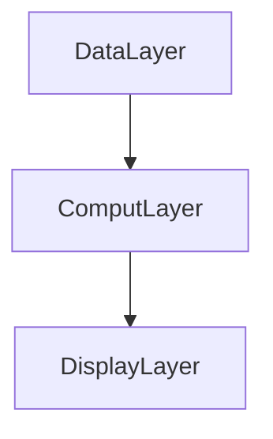

                 


# 金融市场系统性风险评估工具

> **关键词**：系统性风险，金融市场，风险评估，VaR，CVaR，网络效应

> **摘要**：本文深入探讨金融市场系统性风险的评估方法，从统计学模型到网络分析，结合实际案例和代码实现，提供一套完整的系统性风险评估工具解决方案。

---

## 第一部分：金融市场系统性风险概述

### 第1章：系统性风险的基本概念

#### 1.1 系统性风险的定义与特征

**系统性风险**是指影响整个金融市场的风险因素，具有系统性、不可分散性和广泛性的特点。其来源包括经济周期波动、政策变化、市场恐慌等因素。系统性风险与非系统性风险的主要区别在于，非系统性风险可以通过资产多样化来分散，而系统性风险则无法通过分散投资来消除。

#### 1.2 系统性风险的来源与影响

系统性风险的来源复杂多样，包括：

1. **经济因素**：如经济衰退、通货膨胀等。
2. **政策因素**：如货币政策、财政政策的变化。
3. **市场因素**：如市场恐慌、流动性危机等。
4. **技术因素**：如系统故障、数据泄露等。

#### 1.3 系统性风险评估的必要性

评估系统性风险的重要性体现在以下几个方面：

1. **保护投资者利益**：通过评估系统性风险，投资者可以更好地了解市场的整体风险，做出更明智的投资决策。
2. **维护金融稳定**：政府和监管机构可以通过系统性风险评估，制定相应的政策和措施，防范系统性风险的发生，维护金融市场的稳定。
3. **优化投资组合**：机构投资者可以通过系统性风险评估，优化其投资组合，降低整体风险。

---

## 第二部分：系统性风险的理论基础

### 第2章：系统性风险的传播机制

#### 2.1 系统性风险的传播路径

系统性风险的传播路径主要通过以下几个方面实现：

1. **金融机构的资产负债表**：一家金融机构的破产可能会引发连锁反应，导致其他金融机构的损失，从而波及整个金融市场。
2. **金融市场之间的相互关联**：不同金融市场之间的高度关联性使得系统性风险能够在不同市场之间快速传播。
3. **网络效应**：金融市场的网络效应使得系统性风险的传播速度和范围进一步扩大。

#### 2.2 系统性风险的网络效应

网络效应是指金融市场中的各个主体（如银行、保险公司、基金公司等）通过复杂的网络关系相互连接，形成一个巨大的金融网络。系统性风险在这个网络中通过节点之间的相互作用而传播。

#### 2.3 系统性风险的羊群效应

羊群效应是指投资者在市场中的行为具有高度一致性，当市场出现波动时，投资者会跟风操作，导致市场波动加剧。这种行为在金融市场中会导致系统性风险的加剧。

---

## 第三部分：系统性风险的评估方法

### 第3章：基于统计学的系统性风险评估方法

#### 3.1 历史模拟法

**历史模拟法**是一种通过历史数据来模拟未来风险的评估方法。其实现步骤如下：

1. **数据收集**：收集历史市场数据，包括资产价格、收益率等。
2. **排序与计算**：对历史数据进行排序，计算不同置信水平下的VaR值。
3. **结果分析**：分析历史模拟法的结果，评估系统性风险的可能性。

**优点**：简单易行，不需要复杂的模型。

**缺点**：仅依赖历史数据，无法预测未来可能出现的新风险因素。

#### 3.2 VaR（Value at Risk）

**VaR**是一种常用的金融风险度量方法，表示在一定置信水平下，资产可能遭受的最大损失。

**数学公式**：

$$ VaR_{\alpha} = \min_{R} \left\{ R | P(R \leq VaR_{\alpha}) \geq \alpha \right\} $$

其中，$\alpha$ 是置信水平，$R$ 是可能的损失值。

**实现步骤**：

1. **数据准备**：收集资产的历史收益率数据。
2. **计算收益率分布**：对收益率数据进行排序，计算累积概率分布。
3. **计算VaR值**：根据置信水平，找到对应的VaR值。

#### 3.3 CVaR（Conditional Value at Risk）

**CVaR**是VaR的扩展，表示在VaR的基础上，超过VaR的平均损失。

**数学公式**：

$$ CVaR_{\alpha} = \frac{1}{n} \sum_{i=1}^{n} r_i \cdot I(r_i \geq VaR_{\alpha}) $$

其中，$r_i$ 是第i个收益率，$I$ 是指示函数。

**优点**：考虑了超过VaR的平均损失，比VaR更能反映系统的风险。

---

### 第4章：基于网络分析的系统性风险评估方法

#### 4.1 系统性风险的网络模型

**系统性风险的网络模型**通过构建金融市场中的网络关系，分析系统性风险的传播路径。

**实现步骤**：

1. **构建网络模型**：将金融市场中的各个主体视为网络中的节点，节点之间的关联关系表示它们之间的风险传染路径。
2. **分析网络结构**：通过网络分析方法，识别网络中的关键节点和风险传染路径。
3. **评估系统性风险**：根据网络结构，评估系统性风险的传播概率和影响范围。

**优点**：能够捕捉金融市场中的网络效应，准确反映系统性风险的传播路径。

**缺点**：需要大量的数据支持，实现复杂。

---

## 第四部分：系统性风险评估工具的设计与实现

### 第5章：系统性风险评估工具的架构设计

#### 5.1 系统功能设计

系统功能设计包括以下几个模块：

1. **数据采集模块**：采集金融市场中的历史数据和实时数据。
2. **风险计算模块**：基于统计学方法和网络分析方法，计算系统性风险。
3. **结果展示模块**：将系统性风险评估结果以图形化的方式展示。

#### 5.2 系统架构设计

系统架构设计采用分层架构，包括数据层、计算层和展示层。

**系统架构图**：



---

### 第6章：系统性风险评估工具的实现

#### 6.1 数据处理与清洗

**Python代码实现**：

```python
import pandas as pd

# 数据加载
data = pd.read_csv('market_data.csv')

# 数据清洗
data.dropna()
data = data.sort_index()
```

#### 6.2 风险计算

**VaR计算**：

```python
import numpy as np

def calculate_var(data, alpha=0.95):
    sorted_returns = np.sort(data)
    var_index = int(alpha * len(sorted_returns))
    var = sorted_returns[var_index]
    return var

var_value = calculate_var(data['returns'], alpha=0.95)
print(f'VaR at {alpha} confidence level: {var_value}')
```

---

## 第五部分：结果分析与优化

### 第7章：系统性风险评估结果分析

#### 7.1 系统性风险评估结果解读

通过系统性风险评估工具，可以得到系统性风险的VaR和CVaR值，从而评估系统的整体风险水平。

#### 7.2 系统性风险评估工具的优化建议

1. **数据源优化**：引入更多的数据源，提高评估结果的准确性。
2. **模型优化**：结合多种方法，优化系统性风险评估模型，提高评估结果的准确性。
3. **系统优化**：优化系统架构，提高系统的运行效率和稳定性。

---

## 第六部分：总结与展望

### 第8章：总结

通过本文的探讨，我们了解了系统性风险的定义、来源和影响，学习了基于统计学和网络分析的系统性风险评估方法，并通过实际案例和代码实现，展示了系统性风险评估工具的设计与实现过程。

---

### 第9章：展望

未来的研究方向包括：

1. **模型优化**：进一步优化系统性风险评估模型，提高评估结果的准确性。
2. **数据源扩展**：引入更多的数据源，丰富评估工具的数据基础。
3. **系统优化**：优化系统架构，提高系统的运行效率和稳定性。

---

通过本文的系统性风险评估工具的设计与实现，我们能够更有效地评估金融市场中的系统性风险，为投资者和监管机构提供有力的决策支持。

