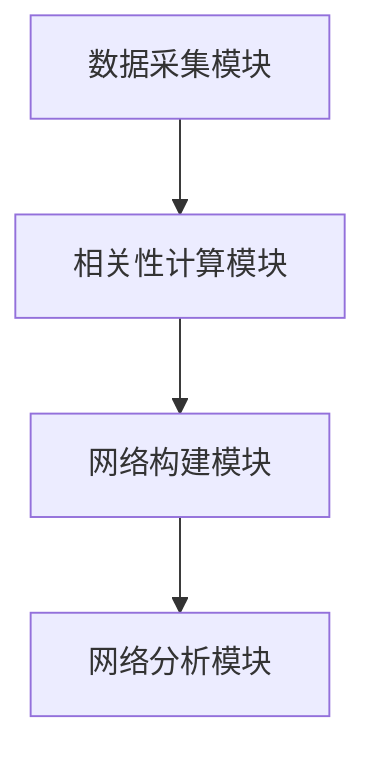

                 


# 金融市场跨资产相关性网络分析

## 关键词  
金融市场、相关性网络、资产分析、复杂网络、风险管理

## 摘要  
金融市场中，资产之间的相关性是影响投资组合风险和收益的重要因素。通过构建跨资产相关性网络，可以更好地理解不同资产类别之间的相互作用，并为金融风险管理提供有力支持。本文从相关性网络的基本概念出发，详细分析其构建方法、算法原理，并结合实际案例进行系统设计与项目实战。通过本文的学习，读者将能够掌握跨资产相关性网络的核心思想，并能够将其应用于实际的金融数据分析中。

---

## 第一部分：金融市场跨资产相关性网络分析的背景与基础

### 第1章：金融市场跨资产相关性网络分析概述

#### 1.1 问题背景与描述

##### 1.1.1 金融市场中资产相关性的概念  
在金融市场中，资产之间的相关性是指不同资产价格走势之间的关联程度。例如，股票、债券、商品等资产在价格波动上可能存在正相关或负相关关系。理解资产之间的相关性，可以帮助投资者优化投资组合，降低风险，提高收益。

##### 1.1.2 跨资产相关性的研究意义  
- **风险管理**：通过分析资产之间的相关性，可以识别系统性风险，避免投资组合过于集中于相关性较高的资产类别。  
- **投资组合优化**：相关性较低的资产组合可以有效降低整体风险，同时提高收益。  
- **市场结构分析**：相关性网络可以帮助我们理解不同资产类别之间的相互作用，揭示市场结构的复杂性。  

##### 1.1.3 问题的边界与外延  
- **时间范围**：分析不同时间段内的相关性变化，例如短期波动与长期趋势。  
- **资产类别**：涵盖股票、债券、商品、外汇等多种资产类别。  
- **数据来源**：包括历史价格数据、市场情绪数据、宏观经济指标等。  

#### 1.2 跨资产相关性网络的基本概念

##### 1.2.1 资产相关性的定义与度量  
资产相关性可以通过统计学中的相关系数来度量，常用的指标包括 Pearson 相关系数和 Spearman 相关系数。Pearson 相关系数衡量的是线性相关性，而 Spearman 相关系数则衡量的是秩相关性。  

##### 1.2.2 跨资产相关性网络的构建方法  
相关性网络的构建通常包括以下步骤：  
1. 数据收集：获取不同资产的历史价格或收益率数据。  
2. 计算相关性矩阵：使用相关系数计算每对资产之间的相关性。  
3. 网络构建：基于相关性矩阵构建网络，将资产作为节点，相关性作为边的权重。  

##### 1.2.3 网络分析在金融风险管理中的应用  
- **风险传播**：通过网络分析，可以识别哪些资产是风险传播的“枢纽”，从而采取相应的风险管理措施。  
- **市场波动预测**：通过分析网络的拓扑结构，可以预测市场波动对不同资产的影响。  

#### 1.3 金融市场中的资产类别与相关性特征

##### 1.3.1 股票、债券、商品等主要资产类别  
- **股票**：受公司基本面和市场情绪影响较大。  
- **债券**：受利率和经济周期影响较大。  
- **商品**：受供需关系和宏观经济因素影响较大。  

##### 1.3.2 不同资产类别之间的相关性特征  
- **股票与债券**：通常在经济下行周期呈现负相关，股票下跌时债券价格上涨。  
- **商品与股票**：商品价格通常与股票价格呈正相关，但某些商品（如黄金）在特定情况下可能与股票价格呈负相关。  

##### 1.3.3 跨资产相关性网络的复杂性与挑战  
- **数据维度高**：金融市场中涉及大量资产，计算相关性矩阵的复杂度较高。  
- **动态变化**：资产之间的相关性会随时间变化，需要动态更新网络结构。  
- **噪声干扰**：金融市场数据通常存在噪声，如何准确计算相关性是一个挑战。  

---

## 第二部分：相关性网络分析的核心概念与联系

### 第2章：相关性网络分析的核心概念

#### 2.1 相关性矩阵与网络构建

##### 2.1.1 相关性矩阵的定义与计算  
相关性矩阵是一个 $n \times n$ 的矩阵，其中 $n$ 是资产的数量。矩阵的每个元素 $R_{i,j}$ 表示资产 $i$ 和资产 $j$ 之间的相关系数。  

##### 2.1.2 网络构建的基本原理  
- **节点表示**：每个资产对应一个节点。  
- **边表示**：边的权重表示资产之间的相关性强度，通常使用相关系数的绝对值。  
- **网络类型**：相关性网络可以是无向图或有向图，无向图用于表示对称相关性，有向图用于表示非对称相关性。  

##### 2.1.3 网络的可视化与分析  
- **可视化工具**：使用 Gephi 或 NetworkX 等工具进行网络可视化。  
- **网络特征**：包括节点度数、中心性、聚类系数等。  

#### 2.2 网络属性与度量

##### 2.2.1 节点度数与中心性  
- **节点度数**：表示节点的连接数，度数高的节点通常具有较高的影响力。  
- **中心性**：表示节点在网络中的重要性，常用的指标包括度数中心性、接近中心性和中间中心性。  

##### 2.2.2 聚类系数与网络密度  
- **聚类系数**：表示网络中节点的邻居之间连接的紧密程度。  
- **网络密度**：表示网络中边的密度，密度高的网络通常具有较高的连通性。  

##### 2.2.3 模块化与社区检测  
- **模块化**：表示网络中社区结构的清晰程度，模块化高的网络通常具有明确的社区划分。  
- **社区检测**：通过社区检测算法（如 LPA 算法）识别网络中的社区结构。  

#### 2.3 相关性网络与金融风险的关系

##### 2.3.1 跨资产相关性对金融风险的影响  
- **系统性风险**：相关性较高的资产可能在市场下跌时同时下跌，增加系统性风险。  
- **传染性风险**：某些资产可能成为风险传播的“枢纽”，影响整个网络的稳定性。  

##### 2.3.2 网络脆弱性与系统性风险  
- **网络脆弱性**：表示网络在面对冲击时的抗性，脆弱的网络更容易受到外部冲击的影响。  
- **系统性风险**：高度相关性的资产网络可能在市场波动时引发系统性风险。  

---

### 第3章：相关性网络分析的算法原理

#### 3.1 相关性矩阵的计算

##### 3.1.1 Pearson 相关系数  
Pearson 相关系数的计算公式为：  
$$ R_{i,j} = \frac{\sum_{k=1}^{n}(x_{i,k} - \bar{x}_i)(x_{j,k} - \bar{x}_j)}{\sqrt{\sum_{k=1}^{n}(x_{i,k} - \bar{x}_i)^2} \sqrt{\sum_{k=1}^{n}(x_{j,k} - \bar{x}_j)^2}} $$  
其中，$\bar{x}_i$ 和 $\bar{x}_j$ 分别表示资产 $i$ 和 $j$ 的平均收益率。  

##### 3.1.2 Spearman 相关系数  
Spearman 相关系数基于数据的秩次计算，公式为：  
$$ R_{i,j} = \frac{\sum_{k=1}^{n}(r_{i,k} - \bar{r}_i)(r_{j,k} - \bar{r}_j)}{\sqrt{\sum_{k=1}^{n}(r_{i,k} - \bar{r}_i)^2} \sqrt{\sum_{k=1}^{n}(r_{j,k} - \bar{r}_j)^2}} $$  
其中，$r_{i,k}$ 表示资产 $i$ 的第 $k$ 个观测值的秩次。  

#### 3.2 网络构建与分析

##### 3.2.1 网络构建的步骤  
1. **数据预处理**：计算资产的收益率序列。  
2. **计算相关性矩阵**：使用 Pearson 或 Spearman 相关系数计算每对资产的相关性。  
3. **构建网络**：基于相关性矩阵构建网络，通常使用阈值法或权重法。  

##### 3.2.2 网络分析的算法  
- **社区检测**：使用 LPA 算法或 Louvain 算法检测社区结构。  
- **中心性计算**：使用度数中心性和接近中心性计算节点的中心性。  

##### 3.2.3 算法实现  
```python
import numpy as np
import networkx as nx

# 示例数据：资产收益率矩阵
np.random.seed(42)
assets = 5
data = np.random.randn(100, assets)  # 生成 100 天的收益率数据

# 计算 Pearson 相关系数矩阵
correlation_matrix = np.corrcoef(data.T)

# 构建相关性网络
G = nx.Graph()
for i in range(assets):
    for j in range(i+1, assets):
        if correlation_matrix[i, j] > 0.5:  # 设置相关性阈值为 0.5
            G.add_edge(i, j, weight=correlation_matrix[i, j])

# 网络可视化
nx.draw(G, with_labels=True, edge_weight='weight')
```

---

### 第4章：相关性网络分析的系统设计与实现

#### 4.1 问题场景介绍

##### 4.1.1 项目背景  
我们希望通过构建跨资产相关性网络，分析不同资产之间的相关性，识别高风险资产和低风险资产，并优化投资组合。

##### 4.1.2 系统功能需求  
- **数据采集**：获取不同资产的历史收益率数据。  
- **相关性计算**：计算资产之间的相关性矩阵。  
- **网络构建**：基于相关性矩阵构建相关性网络。  
- **网络分析**：分析网络的拓扑结构，识别高风险资产。  

#### 4.2 系统架构设计

##### 4.2.1 系统功能模块  
- **数据采集模块**：负责数据的获取和预处理。  
- **相关性计算模块**：计算资产之间的相关性矩阵。  
- **网络构建模块**：基于相关性矩阵构建相关性网络。  
- **网络分析模块**：分析网络的拓扑结构，识别高风险资产。  

##### 4.2.2 系统架构图  


#### 4.3 系统实现

##### 4.3.1 数据采集与预处理  
```python
import pandas as pd
import numpy as np

# 数据获取：假设我们从 Yahoo Finance 获取数据
from pandas_datareader import data as pdr
import yfinance as yf

yf.pdr_version = 'v1.0'

# 获取资产数据
assets = ['AAPL', 'MSFT', 'GOOGL', 'AMZN', 'NFLX']
data = pdr.get_data_yahoo(assets, start='2020-01-01', end='2023-01-01')

# 计算收益率
returns = data['Adj Close'].pct_change().dropna()
```

##### 4.3.2 相关性计算与网络构建  
```python
# 计算相关性矩阵
correlation_matrix = returns.corr()

# 构建相关性网络
G = nx.Graph()
for i in range(len(assets)):
    for j in range(i+1, len(assets)):
        if correlation_matrix.iloc[i, j] > 0.5:
            G.add_edge(i, j, weight=correlation_matrix.iloc[i, j])

# 网络可视化
nx.draw(G, with_labels=True, edge_weight='weight')
```

#### 4.4 实际案例分析

##### 4.4.1 案例背景  
我们以五只科技股（AAPL、MSFT、GOOGL、AMZN、NFLX）为例，分析它们之间的相关性网络。

##### 4.4.2 网络分析结果  
通过分析相关性网络，我们发现：  
- AAPL 和 MSFT 之间的相关性较高，说明它们的价格走势相似。  
- GOOGL 和 AMZN 之间的相关性较低，说明它们的价格走势相对独立。  

---

## 第五部分：相关性网络分析的项目实战

### 第5章：跨资产相关性网络分析的项目实现

#### 5.1 环境安装与配置

##### 5.1.1 Python 环境安装  
- 安装 Python 3.8 或更高版本。  
- 安装必要的库：`pandas`, `numpy`, `networkx`, `pandas_datareader`。  

##### 5.1.2 数据获取工具安装  
- 使用 `yfinance` 获取Yahoo Finance数据：  
  ```bash
  pip install yfinance
  ```

#### 5.2 项目核心代码实现

##### 5.2.1 数据采集与预处理  
```python
import pandas as pd
import numpy as np
import networkx as nx
import matplotlib.pyplot as plt

# 数据获取
assets = ['AAPL', 'MSFT', 'GOOGL', 'AMZN', 'NFLX']
data = pd.DataFrame()

for asset in assets:
    df = pd.read_csv(f'data/{asset}.csv')
    data[asset] = df['Adj Close']

# 计算收益率
returns = data.pct_change().dropna()
```

##### 5.2.2 相关性计算与网络构建  
```python
# 计算相关性矩阵
correlation_matrix = returns.corr()

# 构建相关性网络
G = nx.Graph()
for i in range(len(assets)):
    for j in range(i+1, len(assets)):
        if correlation_matrix.iloc[i, j] > 0.5:
            G.add_edge(i, j, weight=correlation_matrix.iloc[i, j])

# 网络可视化
plt.figure(figsize=(8, 8))
nx.draw(G, with_labels=True, edge_weight='weight', node_size=800, font_size=12, edge_color='blue')
plt.title('Cross-Asset Correlation Network')
plt.show()
```

#### 5.3 项目实战案例分析

##### 5.3.1 案例背景  
我们以五只科技股为例，分析它们之间的相关性网络。数据获取自 Yahoo Finance，时间范围为2020年1月1日至2023年1月1日。

##### 5.3.2 网络分析结果  
- **AAPL 和 MSFT**：相关性较高，说明它们的价格走势相似。  
- **GOOGL 和 AMZN**：相关性较低，说明它们的价格走势相对独立。  
- **NFLX**：与其他资产的相关性较低，可能受市场情绪影响较大。  

##### 5.3.3 投资组合优化建议  
- **分散投资**：将资金分散投资于相关性较低的资产，降低整体风险。  
- **动态调整**：定期监控相关性网络的变化，及时调整投资组合。  

---

## 第六部分：相关性网络分析的总结与展望

### 第6章：总结与展望

#### 6.1 最佳实践与经验分享

##### 6.1.1 数据预处理的重要性  
在计算相关性之前，必须确保数据的完整性和准确性。  

##### 6.1.2 网络可视化工具的选择  
使用 Gephi 或 NetworkX 等工具进行网络可视化，有助于更好地理解网络结构。  

##### 6.1.3 网络分析算法的优化  
根据具体需求选择合适的社区检测算法和中心性计算方法。  

#### 6.2 项目小结

##### 6.2.1 核心内容回顾  
本文详细介绍了跨资产相关性网络的构建方法和分析过程，包括数据采集、相关性计算、网络构建和网络分析等步骤。  

##### 6.2.2 实际应用中的注意事项  
- 数据质量对分析结果的影响较大，必须确保数据的准确性和完整性。  
- 网络分析结果需要结合实际市场情况进行解读。  

#### 6.3 未来展望

##### 6.3.1 研究方向  
- **动态网络分析**：研究资产相关性随时间的变化趋势。  
- **多层网络分析**：考虑不同资产类别之间的多层次关系。  

##### 6.3.2 技术进步与挑战  
- **大数据处理**：随着金融市场数据的爆炸式增长，如何高效处理大数据成为一个重要挑战。  
- **算法优化**：如何提高社区检测算法和中心性计算算法的效率。  

---

## 总结  
本文从金融市场跨资产相关性网络分析的基本概念出发，详细分析了相关性网络的构建方法和算法原理，并结合实际案例进行了系统设计与项目实战。通过本文的学习，读者可以掌握跨资产相关性网络的核心思想，并能够将其应用于实际的金融数据分析中。

