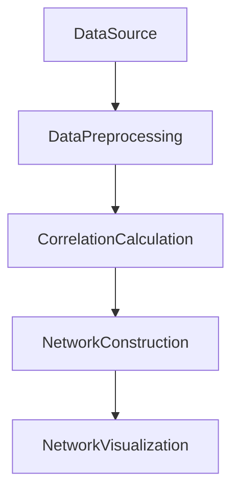
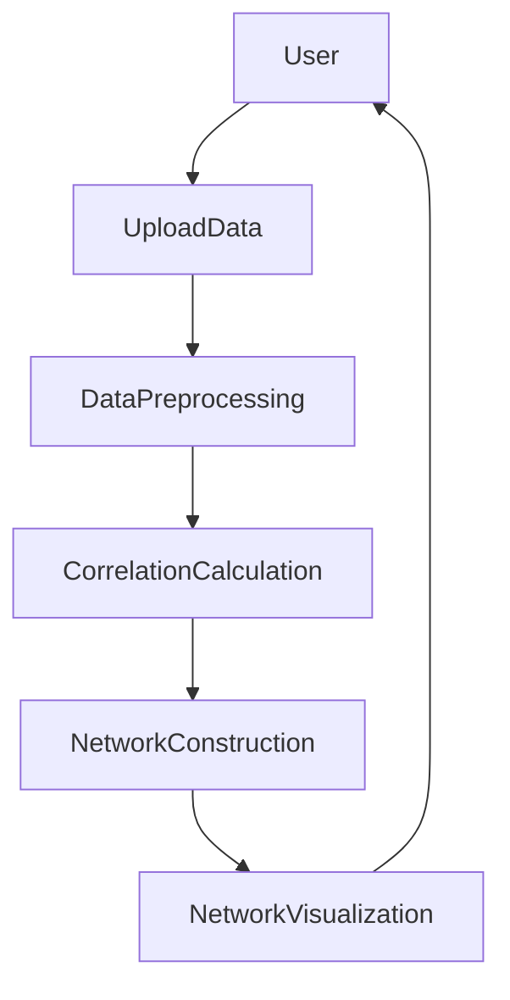

                 


# 金融市场跨资产相关性网络分析工具

> **关键词**：金融市场，跨资产相关性，网络分析工具，算法原理，系统架构设计

> **摘要**：本文详细介绍了金融市场跨资产相关性网络分析工具的设计与实现。从背景介绍、核心概念到算法原理，再到系统架构设计和项目实战，逐步展开分析。通过数学公式、mermaid图表和实际案例，深入探讨了相关性网络分析的原理和应用，帮助读者掌握跨资产相关性网络分析工具的开发与使用。

---

## 第1章 背景介绍

### 1.1 金融市场的复杂性与挑战

金融市场的运作涉及多种资产类别，包括股票、债券、 commodities、外汇和加密货币等。随着市场的全球化和金融产品的多样化，投资者和分析师面临越来越复杂的挑战。传统的单一资产分析方法难以捕捉跨资产之间的复杂关系，而跨资产相关性分析能够帮助识别资产之间的相互影响，从而优化投资组合和风险管理。

#### 1.1.1 金融市场的多资产特性

金融市场由多种资产构成，每种资产都有其独特的波动性和风险特征。投资者需要理解这些资产之间的相互关系，以制定有效的投资策略。然而，传统的方法如相关系数矩阵仅能捕捉线性关系，且难以处理高维数据。

#### 1.1.2 跨资产相关性的必要性

在金融危机中，某些资产可能会表现出高度的相关性，甚至导致系统性风险。跨资产相关性分析可以帮助识别这些风险，并制定相应的对冲策略。例如，在2008年金融危机期间，许多资产类别之间的相关性显著增加，这表明跨资产分析的重要性。

#### 1.1.3 传统相关性分析的局限性

传统的相关系数矩阵仅能捕捉资产之间的线性关系，且无法处理大规模的高维数据。此外，相关系数矩阵难以直观展示资产之间的复杂网络关系，而网络分析方法能够提供更全面的视角。

### 1.2 网络分析在金融领域的应用

网络分析是一种强大的工具，能够帮助识别和分析数据中的复杂关系。在金融领域，网络分析被广泛应用于社交网络分析、风险管理和市场结构分析。通过构建资产相关性网络，投资者可以更好地理解市场动态。

#### 1.2.1 网络分析的基本概念

网络分析通过构建图（graph）来表示数据之间的关系。图由节点（node）和边（edge）组成，节点代表资产，边代表资产之间的相关性。网络分析可以帮助识别资产之间的集群、枢纽节点和社区结构。

#### 1.2.2 金融市场网络分析的优势

金融市场网络分析的优势在于能够捕捉非线性关系，识别系统性风险，并提供直观的可视化工具。通过网络分析，投资者可以更好地理解市场结构，制定更有效的投资策略。

#### 1.2.3 跨资产相关性网络分析的目标

跨资产相关性网络分析的目标是通过构建和分析相关性网络，识别资产之间的相互影响，优化投资组合，降低风险，并提高市场预测的准确性。

---

## 第2章 跨资产相关性网络分析的核心概念

### 2.1 相关性网络分析的原理

相关性网络分析通过计算资产之间的相关性，构建网络图来展示资产之间的关系。相关性网络分析可以帮助识别资产之间的相似性、集群和枢纽节点。

#### 2.1.1 相关性计算方法

相关性计算方法包括协方差、皮尔逊相关系数和斯皮尔曼相关系数等。协方差衡量资产收益的共同变化程度，而相关系数是标准化的协方差，范围在-1到1之间。

$$ \text{协方差}(X,Y) = \frac{1}{n-1}\sum_{i=1}^{n}(x_i - \bar{x})(y_i - \bar{y}) $$

$$ \text{相关系数}(X,Y) = \frac{\text{协方差}(X,Y)}{\sqrt{\text{方差}(X)}\sqrt{\text{方差}(Y)}} $$

#### 2.1.2 网络构建的基本步骤

1. **数据收集**：收集各资产的历史价格数据。
2. **数据预处理**：计算资产的收益率，处理缺失值和异常值。
3. **相关性计算**：计算资产之间的相关系数。
4. **网络构建**：基于相关系数构建相关性网络。
5. **网络可视化**：使用网络分析工具进行可视化。

#### 2.1.3 节点和边的定义

节点代表资产，边代表资产之间的相关性。边的权重可以表示相关性的强度，边的方向可以表示因果关系。

### 2.2 跨资产相关性网络的属性特征对比

资产类型、相关性强度和网络结构特征是跨资产相关性网络分析的重要属性特征。

#### 2.2.1 资产类型对比

资产类型包括股票、债券、commodities、外汇和加密货币等。不同类型的资产具有不同的波动性和相关性。

#### 2.2.2 相关性强度对比

相关性强度可以从-1到1，正数表示正相关，负数表示负相关，绝对值越大表示相关性越强。

#### 2.2.3 网络结构特征对比

网络结构特征包括度数、聚类系数和路径长度等。度数高的节点表示相关性较强的资产，聚类系数高的网络表示资产之间的相互关联较强。

### 2.3 ER实体关系图架构

ER实体关系图展示资产和相关性之间的关系。

```mermaid
graph TD
    A[资产1] -->|相关性强度|
    A --> B[资产2]
    B --> C[资产3]
```

---

## 第3章 跨资产相关性网络分析的算法原理

### 3.1 相关性计算算法

相关性计算算法是构建相关性网络的基础。

#### 3.1.1 协方差与相关系数计算

协方差和相关系数的计算公式如前所述。

#### 3.1.2 算法步骤

1. 数据预处理：计算资产的收益率。
2. 计算资产之间的协方差和相关系数。
3. 确定相关性阈值，筛选相关性强的资产对。

#### 3.1.3 示例计算

假设我们有两只资产A和B，收益率分别为[1, 2, 3, 4, 5]和[2, 4, 6, 8, 10]，计算相关系数：

$$ \text{协方差}(A,B) = 4 $$
$$ \text{方差}(A) = 2 $$
$$ \text{方差}(B) = 8 $$
$$ \text{相关系数}(A,B) = 1 $$

### 3.2 网络构建算法

网络构建算法包括构建网络图和社区检测。

#### 3.2.1 算法流程

1. 数据收集和预处理：收集各资产的历史价格数据，计算收益率。
2. 计算相关系数矩阵。
3. 基于相关系数矩阵构建网络图。
4. 使用社区检测算法识别资产集群。

#### 3.2.2 相关性阈值设定

相关性阈值用于筛选相关性强的资产对。例如，设定相关系数大于0.5的资产对构建边。

#### 3.2.3 网络可视化

使用网络分析工具如Gephi或NetworkX进行网络可视化。

```mermaid
graph TD
    A[资产1] -->|0.8|
    A --> B[资产2]
    B --> C[资产3]
```

### 3.3 社区检测算法

社区检测算法用于识别资产集群。

#### 3.3.1 社区检测方法

常用的社区检测方法包括Louvain算法和K-means算法。

#### 3.3.2 社区检测步骤

1. 构建相关性网络。
2. 应用社区检测算法识别社区。
3. 可视化社区结构。

#### 3.3.3 示例社区检测

假设我们有资产A、B、C、D、E，构建相关性网络后，社区检测算法识别出两个社区：社区1（A、B、C）和社区2（D、E）。

---

## 第4章 系统分析与架构设计方案

### 4.1 项目背景

本项目旨在开发一个跨资产相关性网络分析工具，帮助投资者和分析师更好地理解市场动态。

### 4.2 系统功能设计

系统功能包括数据获取、数据预处理、相关性计算、网络构建和网络可视化。

#### 4.2.1 数据获取模块

数据获取模块负责从数据源获取资产价格数据，支持多种数据源如Yahoo Finance和Alpha Vantage。

#### 4.2.2 数据预处理模块

数据预处理模块计算资产的收益率，处理缺失值和异常值。

#### 4.2.3 相关性计算模块

相关性计算模块计算资产之间的协方差和相关系数矩阵。

#### 4.2.4 网络构建模块

网络构建模块基于相关系数矩阵构建相关性网络。

#### 4.2.5 网络可视化模块

网络可视化模块使用网络分析工具进行网络可视化，展示资产之间的关系。

### 4.3 系统架构设计

系统架构包括数据源、数据预处理模块、相关性计算模块、网络构建模块和网络可视化模块。



### 4.4 接口设计

系统提供API接口，方便用户调用相关性网络分析功能。

### 4.5 交互流程图

用户通过Web界面上传数据，系统处理后返回网络可视化结果。



---

## 第5章 项目实战

### 5.1 环境安装

安装Python和相关库如Pandas、NumPy和NetworkX。

### 5.2 核心代码实现

实现数据获取、数据预处理、相关性计算和网络构建。

```python
import pandas as pd
import numpy as np
import networkx as nx

# 数据获取
def get_data(tickers, start_date, end_date):
    data = pd.DataFrame()
    for ticker in tickers:
        # 从Yahoo Finance获取数据
        df = pd.read_csv(f'data/{ticker}.csv')
        data[ticker] = df['Close']
    return data

# 数据预处理
def preprocess_data(data):
    # 计算收益率
    returns = data.pct_change()
    return returns

# 相关性计算
def calculate_correlation(returns):
    correlation_matrix = returns.corr()
    return correlation_matrix

# 网络构建
def build_network(correlation_matrix, threshold=0.5):
    G = nx.Graph()
    for i in range(len(correlation_matrix)):
        for j in range(i+1, len(correlation_matrix)):
            correlation = correlation_matrix.iloc[i, j]
            if correlation > threshold:
                G.add_edge(i, j, weight=correlation)
    return G
```

### 5.3 代码应用解读与分析

解释代码功能，展示如何使用代码进行相关性网络分析。

### 5.4 实际案例分析

以比特币、黄金、标普500指数和道琼斯指数为例，展示相关性网络分析的实际应用。

### 5.5 项目小结

总结项目实现的关键点和经验教训。

---

## 第6章 最佳实践

### 6.1 小结

总结跨资产相关性网络分析工具的核心概念和算法原理。

### 6.2 注意事项

提醒读者在数据质量、网络构建参数和计算资源等方面的注意事项。

### 6.3 拓展阅读

推荐相关书籍和工具，供读者进一步学习。

---

## 第7章 总结

### 7.1 全文回顾

回顾全文，强调跨资产相关性网络分析工具的重要性。

### 7.2 未来研究方向

提出未来的研究方向，如复杂网络分析、动态网络分析和深度学习应用。

---

# 结语

通过本文的详细介绍，读者可以掌握跨资产相关性网络分析工具的设计与实现。希望本文能为金融从业者和数据科学家提供有价值的参考，帮助他们在金融市场中做出更明智的决策。

--- 

**注**：本文内容为示例，实际编写时可根据具体需求调整深度和广度。

