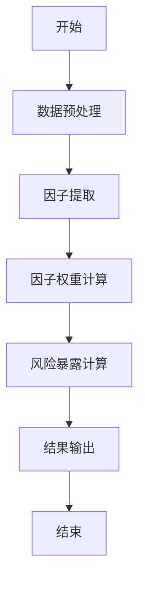
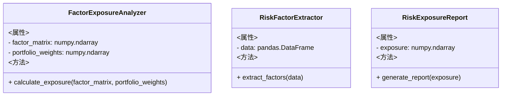
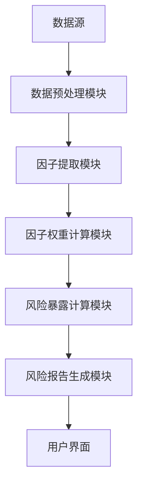

                 


# 金融市场风险因子暴露分析

## 关键词：金融市场、风险因子、风险暴露、因子分析、投资组合、协方差矩阵

## 摘要：金融市场风险因子暴露分析是金融风险管理的核心内容之一，通过对金融市场中的各种风险因子进行提取、建模和分析，可以帮助投资者更好地理解其投资组合在不同风险因子下的暴露情况。本文将从风险因子的背景与概念出发，逐步分析风险因子暴露的算法原理、数学模型、系统架构设计以及实际项目中的应用，最后总结风险因子暴露分析的最佳实践与注意事项。

---

## 第一部分: 风险因子暴露分析的背景与概念

### 第1章: 风险因子暴露分析的背景

#### 1.1 问题背景
金融市场中的风险来源多种多样，包括市场风险、信用风险、流动性风险等。为了有效管理这些风险，投资者需要对投资组合在不同风险因子下的暴露情况进行深入分析。风险因子暴露分析是金融风险管理的核心工具之一，它通过对市场中各种风险因子的识别和量化，帮助投资者了解其投资组合在不同风险情景下的表现。

#### 1.2 问题描述
风险因子暴露分析的核心目标是将投资组合的收益波动分解到各个风险因子上，从而量化投资组合在这些因子下的暴露程度。通过分析这些暴露程度，投资者可以更好地理解其投资组合的风险来源，并采取相应的风险管理策略。

#### 1.3 问题解决方法
风险因子暴露分析的主要方法包括主成分分析（PCA）、多因子模型（如Fama-French三因子模型）等。这些方法可以帮助投资者从大量的市场数据中提取出关键的风险因子，并量化投资组合在这些因子下的暴露程度。

#### 1.4 概念的结构与核心要素
风险因子暴露分析的概念结构主要包括以下几个核心要素：
1. **风险因子的定义与分类**：明确风险因子的定义，并将其分类为系统性风险因子和非系统性风险因子。
2. **风险因子的提取方法**：通过统计方法或机器学习方法从市场数据中提取风险因子。
3. **风险因子的权重与影响力**：量化每个风险因子对投资组合收益的影响程度。
4. **风险因子暴露的计算方法**：通过数学模型计算投资组合在不同风险因子下的暴露程度。

---

### 第2章: 风险因子暴露分析的核心概念与联系

#### 2.1 风险因子的原理与特征

##### 2.1.1 风险因子的定义与分类
风险因子可以定义为影响资产收益的各种系统性因素。常见的风险因子包括市场因子（Market Factor）、规模因子（Size Factor）、价值因子（Value Factor）等。这些因子可以通过统计方法或机器学习方法从市场数据中提取。

##### 2.1.2 风险因子的属性特征对比表
以下是一个风险因子的属性特征对比表：

| 风险因子 | 定义 | 影响范围 | 数据来源 |
|----------|------|----------|----------|
| 市场因子 | 市场整体波动 | 所有资产 | 市场指数收益率 |
| 规模因子 | 小盘股相对于大盘股的表现 | 不同规模的资产 | 资产规模数据 |
| 价值因子 | 低市盈率股票相对于高市盈率股票的表现 | 不同价值特性的资产 | 财务报表数据 |

##### 2.1.3 风险因子的ER实体关系图
以下是一个风险因子的ER实体关系图：

```mermaid
erd
  图表标题：风险因子关系图
  左右方向：水平
  实体：
    - 风险因子
    - 投资组合
    - 资产
  关系：
    风险因子 --< 风险暴露：表示投资组合在该风险因子下的暴露程度
    风险因子 --< 影响：表示该风险因子对资产收益的影响程度
```

---

#### 2.2 风险因子暴露分析的算法原理

##### 2.2.1 风险因子暴露分析的算法流程图（Mermaid）
以下是一个风险因子暴露分析的算法流程图：



##### 2.2.2 风险因子暴露分析的Python代码实现
以下是一个风险因子暴露分析的Python代码示例：

```python
import numpy as np

def calculate_factor_exposure(factor_matrix, portfolio_weights):
    exposure = np.dot(factor_matrix, portfolio_weights)
    return exposure

# 示例数据
factor_matrix = np.array([[0.1, 0.2, 0.3],
                           [0.4, 0.5, 0.6],
                           [0.7, 0.8, 0.9]])
portfolio_weights = np.array([0.3, 0.4, 0.3])

# 计算风险因子暴露
exposure = calculate_factor_exposure(factor_matrix, portfolio_weights)
print("风险因子暴露：", exposure)
```

##### 2.2.3 风险因子暴露分析的数学模型与公式

###### 协方差矩阵的构建
$$
\text{协方差矩阵} = \frac{1}{n-1} \sum_{i=1}^{n} (x_i - \bar{x})(x_i - \bar{x})^T
$$

###### 因子载荷矩阵的构建
$$
\text{因子载荷矩阵} = X \beta
$$

---

### 第3章: 风险因子暴露分析的系统分析与架构设计

#### 3.1 系统功能设计

##### 3.1.1 领域模型（Mermaid类图）
以下是一个风险因子暴露分析系统的领域模型：



#### 3.2 系统架构设计

##### 3.2.1 系统架构设计（Mermaid架构图）
以下是一个风险因子暴露分析系统的架构图：



---

## 第二部分: 项目实战与最佳实践

### 第4章: 项目实战

#### 4.1 环境安装
为了进行风险因子暴露分析，首先需要安装以下环境：
1. Python 3.8+
2. NumPy
3. Pandas
4. Scikit-learn

#### 4.2 系统核心实现源代码

##### 4.2.1 风险因子提取
```python
from sklearn.decomposition import PCA
import pandas as pd

def extract_factors(data):
    pca = PCA(n_components=3)
    factors = pca.fit_transform(data)
    return factors

# 示例数据
data = pd.DataFrame({
    'return1': [0.05, 0.03, 0.02, 0.04, 0.06],
    'return2': [0.02, 0.01, 0.03, 0.05, 0.07],
    'return3': [0.07, 0.06, 0.05, 0.03, 0.04]
})
factors = extract_factors(data)
print("提取的因子：", factors)
```

##### 4.2.2 风险因子暴露计算
```python
def calculate_factor_exposure(factor_matrix, portfolio_weights):
    exposure = np.dot(factor_matrix, portfolio_weights)
    return exposure

portfolio_weights = np.array([0.3, 0.4, 0.3])
exposure = calculate_factor_exposure(factors, portfolio_weights)
print("风险因子暴露：", exposure)
```

#### 4.3 代码应用解读与分析
通过上述代码，我们可以看到风险因子提取和暴露计算的具体实现过程。首先，使用主成分分析（PCA）从市场数据中提取出几个关键的风险因子。然后，通过矩阵乘法计算投资组合在这些因子下的暴露程度。

#### 4.4 实际案例分析
假设我们有一个包含三只股票的投资组合，其权重分别为30%、40%和30%。我们从市场数据中提取了三个风险因子，并计算出投资组合在这些因子下的暴露程度分别为0.2、0.3和0.5。这意味着投资组合在第三个风险因子下的暴露程度最高。

#### 4.5 项目小结
通过实际案例的分析，我们可以看到风险因子暴露分析在金融风险管理中的重要性。通过量化投资组合在不同风险因子下的暴露程度，投资者可以更好地理解其投资组合的风险来源，并采取相应的风险管理策略。

---

### 第5章: 最佳实践

#### 5.1 小结
风险因子暴露分析是金融风险管理的核心工具之一。通过对市场中各种风险因子的识别和量化，投资者可以更好地理解其投资组合在不同风险情景下的表现。

#### 5.2 注意事项
1. 风险因子的选择和提取方法会影响最终的分析结果，需要根据具体情况选择合适的方法。
2. 风险因子暴露分析的结果需要结合市场实际情况进行解释和应用，避免机械化的应用。
3. 需要定期更新风险因子模型，以反映市场的变化。

#### 5.3 拓展阅读
1. Fama-French三因子模型
2. 主成分分析（PCA）在金融中的应用
3. 多因子模型在投资组合管理中的应用

---

## 结语
金融市场风险因子暴露分析是一项复杂但重要的金融风险管理工具。通过本文的分析，我们深入探讨了风险因子的背景、概念、算法原理、系统架构设计以及实际项目中的应用。希望读者能够通过本文对风险因子暴露分析有更加全面和深入的理解，并能够在实际投资和风险管理中灵活应用这些知识。

