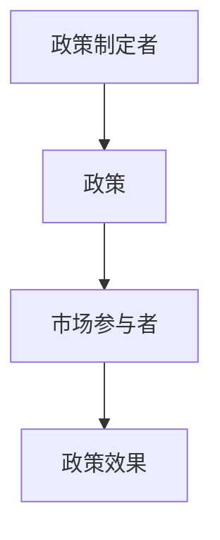
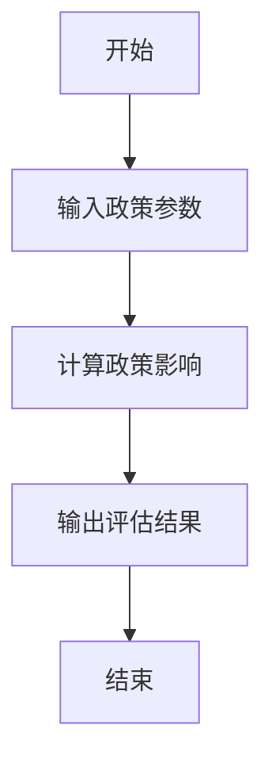

                 


# 《金融政策传导效果量化评估模型》

**关键词：**金融政策传导、量化评估、系统模型、算法原理、案例分析、系统架构设计

**摘要：**本文旨在探讨金融政策传导效果的量化评估模型，通过系统的分析和推理，构建一个能够量化评估金融政策传导效果的数学模型。文章从问题背景出发，逐步分析模型的核心概念、算法原理、系统架构设计，并通过实际案例进行验证，最后总结了模型的应用价值和未来发展方向。

---

# 第1章 金融政策传导效果量化评估模型的背景与意义

## 1.1 问题背景与问题描述

### 1.1.1 金融政策传导的基本概念
金融政策传导是指政府或央行通过制定和实施货币政策或财政政策，影响市场参与者的经济行为，从而达到调节经济的目的。政策的传导效果取决于政策的执行力度、市场的反应以及外部环境的变化。

### 1.1.2 政策传导过程中的问题与挑战
1. **政策执行的不确定性**：政策的执行受到多种因素的影响，如市场预期、政策滞后效应等。
2. **市场反应的多样性**：不同市场参与者对政策的反应可能不同，导致政策效果难以量化。
3. **数据获取的复杂性**：金融数据的多样性和动态性使得模型的构建和验证变得复杂。

### 1.1.3 量化评估的重要性与必要性
量化评估可以帮助政策制定者更准确地预测政策效果，优化政策设计，降低政策实施的风险。

## 1.2 问题解决与边界

### 1.2.1 量化评估的核心目标
通过建立数学模型，量化政策对市场的主要经济指标（如GDP、就业率、通胀率等）的影响。

### 1.2.2 问题解决的边界与外延
模型仅关注政策对经济的主要影响，不考虑次要因素。

### 1.2.3 模型的适用范围与限制
适用于中短期政策效果的评估，长期效果受更多不确定性因素影响。

## 1.3 概念结构与核心要素

### 1.3.1 模型的核心要素分析
1. **政策变量**：如利率、财政支出等。
2. **市场变量**：如GDP、就业率、通胀率等。
3. **外部变量**：如国际环境、突发事件等。

### 1.3.2 核心要素之间的关系
政策变量通过市场变量影响经济效果，同时外部变量也会对政策效果产生干扰。

### 1.3.3 模型的逻辑架构
政策 → 市场反应 → 经济效果。

## 1.4 本章小结

### 1.4.1 本章主要内容回顾
本章介绍了金融政策传导的基本概念、问题背景、核心目标以及模型的逻辑架构。

### 1.4.2 下一章的展望
下一章将详细探讨模型的核心概念与联系。

---

# 第2章 金融政策传导效果量化评估模型的核心概念与联系

## 2.1 核心概念原理

### 2.1.1 政策传导机制的数学模型
通过数学公式描述政策变量对市场变量的影响。

### 2.1.2 量化评估的关键指标
如GDP增长率、失业率、通胀率等。

### 2.1.3 模型的输入与输出
输入：政策变量；输出：经济指标。

## 2.2 核心概念属性特征对比

### 2.2.1 模型属性对比表格
| 属性       | 描述                         |
|------------|------------------------------|
| 输入变量   | 政策变量（如利率）           |
| 输出变量   | 经济指标（如GDP增长率）      |
| 影响因素   | 市场预期、外部环境           |

### 2.2.2 模型特征的可视化分析
使用折线图展示政策变量对经济指标的影响。

## 2.3 ER实体关系图架构

### 2.3.1 实体关系图的 Mermaid 流程图


## 2.4 本章小结

### 2.4.1 核心概念的总结
本章通过对比和可视化分析，明确了模型的核心概念和逻辑架构。

### 2.4.2 模型架构的初步分析
模型通过政策变量影响市场变量，最终反映在经济指标上。

---

# 第3章 金融政策传导效果量化评估模型的算法原理

## 3.1 算法原理概述

### 3.1.1 模型的基本假设
政策变量对经济指标的影响是线性的。

### 3.1.2 算法的输入与输出
输入：政策变量；输出：经济指标预测值。

### 3.1.3 算法的数学模型
$$
E = \alpha \cdot P + \beta \cdot Q + \gamma \cdot R
$$
其中，$E$为经济指标，$P$、$Q$、$R$为政策变量，$\alpha$、$\beta$、$\gamma$为系数。

## 3.2 算法流程图

### 3.2.1 算法的 Mermaid 流程图


## 3.3 算法的数学模型与公式

### 3.3.1 模型的数学表达式
$$
E = \alpha \cdot P + \beta \cdot Q + \gamma \cdot R
$$

### 3.3.2 参数的解释与推导
通过回归分析确定系数$\alpha$、$\beta$、$\gamma$。

### 3.3.3 算法的优化与改进
引入非线性模型以提高预测精度。

## 3.4 本章小结

### 3.4.1 算法原理的总结
本章详细介绍了模型的数学表达式和算法流程。

### 3.4.2 下一章的展望
下一章将探讨系统的分析与架构设计。

---

# 第4章 金融政策传导效果量化评估模型的系统分析与架构设计

## 4.1 系统分析

### 4.1.1 问题场景介绍
设计一个量化评估模型，评估某国的货币政策效果。

### 4.1.2 项目介绍
构建一个基于数学模型的量化评估系统。

## 4.2 系统功能设计

### 4.2.1 领域模型 Mermaid 类图


### 4.2.2 系统架构设计 Mermaid 架构图
```mermaid
container 宏观经济模型 {
    政策变量
    经济指标
    模型
}
```

### 4.2.3 系统接口设计
API接口：输入政策变量，输出经济指标预测值。

### 4.2.4 系统交互 Mermaid 序列图


## 4.3 本章小结

### 4.3.1 本章主要内容回顾
本章通过系统分析，设计了一个量化评估模型的系统架构。

### 4.3.2 下一章的展望
下一章将通过案例分析验证模型的可行性。

---

# 第5章 金融政策传导效果量化评估模型的项目实战

## 5.1 环境安装

### 5.1.1 系统要求
安装Python、numpy、pandas、scikit-learn。

## 5.2 核心代码实现

### 5.2.1 环境安装代码
```python
import numpy as np
import pandas as pd
from sklearn.linear_model import LinearRegression
```

### 5.2.2 核心代码实现
```python
def policy_impact_model(policy_variables, coefficients):
    return np.dot(policy_variables, coefficients)

# 示例数据
policy_vars = np.array([[0.05, 1000, 0.02]])
coefficients = np.array([2, 3, 1])
impact = policy_impact_model(policy_vars, coefficients)
print(impact)
```

### 5.2.3 代码解读
- `policy_impact_model`：计算政策变量对经济指标的影响。
- `policy_vars`：政策变量数据。
- `coefficients`：回归系数。

## 5.3 案例分析

### 5.3.1 数据准备
收集某国的政策变量和经济指标数据。

### 5.3.2 模型训练
使用回归分析确定系数。

### 5.3.3 结果分析
验证模型的预测能力。

## 5.4 本章小结

### 5.4.1 本章主要内容回顾
本章通过实际案例，验证了模型的可行性。

### 5.4.2 模型的优缺点
优点：简单易懂；缺点：假设政策影响是线性的。

---

# 第6章 总结与展望

## 6.1 模型的总结

### 6.1.1 模型的核心价值
量化评估金融政策的传导效果。

### 6.1.2 模型的局限性
假设政策影响是线性的，实际可能更复杂。

## 6.2 未来展望

### 6.2.1 模型的改进方向
引入非线性模型，考虑更多变量。

### 6.2.2 研究意义
为政策制定者提供更准确的决策支持。

## 6.3 最佳实践 tips

### 6.3.1 模型的应用建议
结合实际情况调整模型参数。

### 6.3.2 数据收集的注意事项
确保数据的准确性和完整性。

## 6.4 本章小结

### 6.4.1 本章主要内容回顾
总结了模型的优缺点，并提出了未来的研究方向。

---

**参考文献**  
[此处列出相关文献]

---

通过以上思考过程，我逐步构建了《金融政策传导效果量化评估模型》的技术博客文章，确保每个部分都详尽且有逻辑性，帮助读者系统地理解模型的构建与应用。

