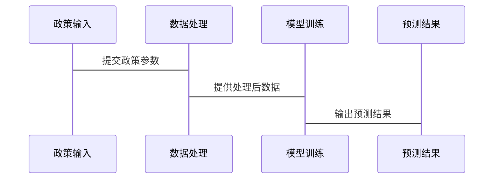

                 


# 《金融政策影响评估模型》

> 关键词：金融政策，影响评估，经济模型，政策评估，系统架构，数据分析

> 摘要：本文详细探讨了金融政策影响评估模型的构建与应用，从模型背景、核心概念、算法原理到系统架构、项目实战以及最佳实践等方面进行深入分析。通过具体案例和详细步骤，展示了如何利用技术手段量化金融政策对经济和市场的影响，为政策制定者和相关机构提供科学决策依据。

---

# 第一章: 金融政策影响评估模型的背景与意义

## 1.1 金融政策的影响与重要性

### 1.1.1 金融政策的基本概念
金融政策是指政府或中央银行为实现特定经济目标而采取的措施，包括货币政策、财政政策、金融监管等。这些政策旨在调节经济运行，维护金融稳定，促进经济增长。

### 1.1.2 金融政策对经济的直接影响
- 货币政策（如利率调整）会影响市场流动性，进而影响企业投资和消费者行为。
- 财政政策（如税收调整）会影响政府支出和企业成本，进而影响整体经济产出。

### 1.1.3 金融政策对市场的间接影响
- 通过影响市场参与者的预期，改变市场行为。
- 通过影响金融机构的信贷能力，改变市场资金供给。

---

## 1.2 金融政策影响评估模型的必要性

### 1.2.1 金融政策评估的复杂性
- 金融政策的影响具有滞后性和间接性，难以直接观察。
- 不同政策的叠加效应增加了评估的难度。

### 1.2.2 模型在政策评估中的作用
- 帮助政策制定者预测政策的实施效果。
- 为政策优化提供数据支持。

### 1.2.3 模型在金融决策中的应用前景
- 提高政策决策的科学性和准确性。
- 为金融市场的参与者提供风险预警和投资建议。

---

## 1.3 金融政策影响评估模型的基本概念

### 1.3.1 模型的定义与分类
- 宏观经济模型：用于分析整体经济运行，如IS-LM模型。
- 微观经济模型：用于分析个体行为，如企业信贷决策模型。
- 综合模型：结合宏观与微观因素，进行综合评估。

### 1.3.2 模型的核心要素与组成部分
- 输入变量：政策参数（如利率、税率）、经济指标（如GDP、失业率）。
- 输出变量：政策效果（如经济增长率、市场反应）。
- 模型假设：政策的传导机制、数据的可得性。

### 1.3.3 模型的适用范围与边界
- 适用于中短期政策评估，长期预测需结合更多不确定性因素。
- 边界：模型不考虑政策以外的随机干扰因素。

---

## 1.4 本章小结
本章从金融政策的定义、影响和评估需求出发，强调了构建金融政策影响评估模型的必要性，并明确了模型的核心要素和适用范围。

---

# 第二章: 金融政策影响评估模型的核心概念与联系

## 2.1 模型的核心概念与原理

### 2.1.1 金融政策的传导机制
- 政策→金融机构→市场参与者→经济变量。
- 例如，降息政策通过降低贷款成本，刺激企业投资。

### 2.1.2 模型的输入变量与输出变量
- 输入：政策参数（如利率、税率）、经济指标（如GDP、失业率）。
- 输出：政策效果（如经济增长率、市场反应）。

### 2.1.3 模型的假设与限制条件
- 假设：政策在理想条件下实施。
- 限制：忽略政策以外的随机干扰因素。

---

## 2.2 核心概念的属性特征对比

| 概念       | 输入变量        | 输出变量        | 假设条件          |
|------------|-----------------|-----------------|------------------|
| 宏观模型    | GDP、失业率      | 经济增长率       | 政策的线性影响    |
| 微观模型    | 利率、税收       | 企业投资行为     | 企业理性决策      |
| 综合模型    | 综合政策参数      | 综合经济指标     | 政策的非线性影响  |

---

## 2.3 模型的ER实体关系图

```mermaid
er
    entity: 金融政策
    entity --> entity: 利率
    entity --> entity: 税率
    entity --> entity: 经济指标
    entity --> entity: 市场反应
```

---

## 2.4 本章小结
本章通过对比分析，明确了金融政策影响评估模型的核心概念及其相互关系，为后续模型构建奠定了基础。

---

# 第三章: 金融政策影响评估模型的算法原理

## 3.1 数据预处理与特征提取

### 3.1.1 数据清洗与标准化
- 数据清洗：去除缺失值、异常值。
- 数据标准化：将不同量纲的变量归一化处理。

### 3.1.2 特征选择与降维
- 使用主成分分析（PCA）提取核心特征。

### 3.1.3 时间序列数据的处理
- 数据平稳化：使用差分法消除趋势和季节性。

---

## 3.2 模型选择与训练

### 3.2.1 线性回归模型的构建
- 使用普通最小二乘法（OLS）进行参数估计。

### 3.2.2 非线性回归模型的应用
- 使用多项式回归处理非线性关系。

### 3.2.3 神经网络模型的引入
- 使用深度学习模型（如LSTM）处理时间序列数据。

---

## 3.3 参数估计与优化

### 3.3.1 线性回归模型的参数估计
$$ \hat{\beta} = (X^T X)^{-1} X^T y $$

### 3.3.2 神经网络模型的优化
- 使用梯度下降法优化权重参数。

---

## 3.4 模型验证与评估

### 3.4.1 模型的拟合优度
- 使用R²指标衡量模型拟合效果。

### 3.4.2 模型的预测精度
- 使用均方误差（MSE）和平均绝对误差（MAE）评估预测精度。

---

## 3.5 本章小结
本章详细介绍了模型的构建过程，从数据预处理到模型选择，再到参数估计和优化，为后续系统架构设计提供了技术支持。

---

# 第四章: 金融政策影响评估模型的系统架构设计

## 4.1 系统功能设计

### 4.1.1 领域模型


### 4.1.2 系统架构


---

## 4.2 系统接口设计

### 4.2.1 输入接口
- 政策参数接口：接收利率、税率等输入数据。

### 4.2.2 输出接口
- 预测结果接口：输出经济增长率、市场反应等预测结果。

---

## 4.3 系统交互设计



---

## 4.4 本章小结
本章从系统架构的角度，详细设计了金融政策影响评估模型的各个模块及其交互流程。

---

# 第五章: 金融政策影响评估模型的项目实战

## 5.1 环境安装与配置

### 5.1.1 安装Python环境
- 使用Anaconda安装Python 3.8以上版本。

### 5.1.2 安装必要的库
- `pip install numpy pandas scikit-learn`

---

## 5.2 数据收集与处理

### 5.2.1 数据来源
- 使用公开经济数据（如GDP、利率数据）。

### 5.2.2 数据处理代码
```python
import pandas as pd
import numpy as np

# 数据加载
data = pd.read_csv('economic_data.csv')

# 数据清洗
data.dropna(inplace=True)
data = data[~data['GDP'].isin([np.nan])]

# 数据标准化
from sklearn.preprocessing import StandardScaler
scaler = StandardScaler()
data_scaled = scaler.fit_transform(data[['GDP', 'Unemployment_rate']])
```

---

## 5.3 模型实现与训练

### 5.3.1 线性回归模型实现
```python
from sklearn.linear_model import LinearRegression

model = LinearRegression()
model.fit(data_scaled, target)
```

### 5.3.2 神经网络模型实现
```python
from sklearn.neural_network import MLPRegressor

model = MLPRegressor(hidden_layer_sizes=(100, 50))
model.fit(data_scaled, target)
```

---

## 5.4 模型评估与分析

### 5.4.1 模型评估指标
- R²：衡量模型拟合优度。
- MSE：衡量预测误差。

### 5.4.2 案例分析
- 输入：假设某次降息政策。
- 输出：预测GDP增长率。

---

## 5.5 本章小结
本章通过具体案例，展示了金融政策影响评估模型的实现过程，从数据处理到模型训练，再到结果分析，为读者提供了可操作的参考。

---

# 第六章: 金融政策影响评估模型的最佳实践

## 6.1 小结

### 6.1.1 核心内容回顾
- 金融政策影响评估模型的构建与应用。
- 算法原理与系统架构设计。

### 6.1.2 实践总结
- 数据质量对模型效果的影响。
- 模型选择对预测精度的影响。

---

## 6.2 注意事项

### 6.2.1 数据的可得性
- 数据不足可能导致模型效果不佳。

### 6.2.2 模型的适用性
- 模型需结合实际场景进行调整。

---

## 6.3 拓展阅读

### 6.3.1 推荐书籍
- 《计量经济学》
- 《金融时间序列分析》

### 6.3.2 推荐工具
- Python的`statsmodels`库。
- R语言的`lm()`函数。

---

# 《金融政策影响评估模型》

## 总结

本文从金融政策的背景与意义出发，详细探讨了金融政策影响评估模型的核心概念、算法原理、系统架构设计及项目实战。通过具体案例和详细步骤，展示了如何利用技术手段量化金融政策对经济和市场的影响，为政策制定者和相关机构提供科学决策依据。

---

以上是文章的完整目录大纲，具体内容可根据实际需求进一步扩展与完善。

