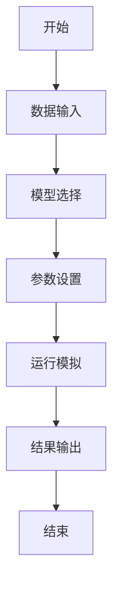
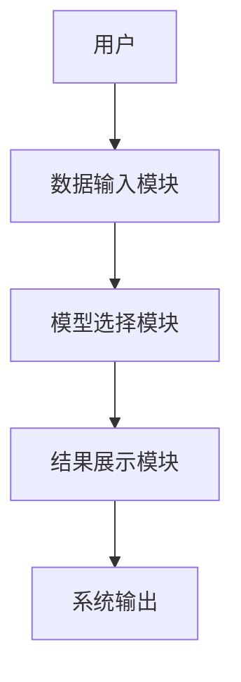
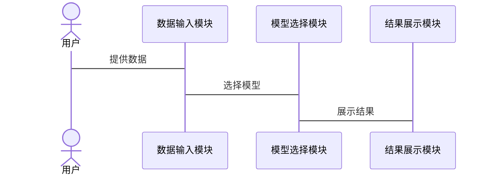

                 


# 金融政策效果评估模拟器

> 关键词：金融政策效果评估，模拟器，政策效果，评估工具，数据驱动决策

> 摘要：本文介绍了一种用于评估金融政策效果的模拟器，通过详细分析其核心概念、算法原理、系统架构和项目实战，帮助读者理解如何利用该工具优化政策制定和评估过程。文章内容包括背景介绍、核心概念与联系、算法原理、系统分析与架构设计、项目实战和最佳实践等部分，旨在为读者提供一个全面的指导。

---

## 第一部分: 金融政策效果评估模拟器的背景与概念

### 第1章: 金融政策效果评估的背景与问题

#### 1.1 金融政策的基本概念
- 1.1.1 金融政策的定义
- 1.1.2 金融政策的主要目标
- 1.1.3 金融政策的作用机制

#### 1.2 政策效果评估的重要性
- 1.2.1 政策效果评估的定义
- 1.2.2 政策效果评估的必要性
- 1.2.3 政策效果评估的难点

#### 1.3 金融政策效果评估模拟器的概念
- 1.3.1 模拟器的定义
- 1.3.2 模拟器的核心功能
- 1.3.3 模拟器的应用场景

### 第2章: 金融政策效果评估的核心概念与联系

#### 2.1 核心概念的原理
- 2.1.1 经济模型的构建
- 2.1.2 数据处理与分析
- 2.1.3 模型验证与优化

#### 2.2 核心概念的对比分析
- 2.2.1 不同模型的特征对比
- 2.2.2 模型的优缺点分析
- 2.2.3 模型选择的依据

#### 2.3 系统架构的ER实体关系图
```mermaid
er
actor: 用户
model: 模型
data: 数据
result: 结果
```

#### 2.4 算法流程的Mermaid图


---

## 第二部分: 金融政策效果评估模拟器的算法原理

### 第3章: 金融政策效果评估的算法原理

#### 3.1 算法选择与原理
- 3.1.1 机器学习算法的选择
- 3.1.2 线性回归模型
  - 数学公式：$$ y = \beta_0 + \beta_1x + \epsilon $$
  - 代码示例：
    ```python
    import numpy as np
    from sklearn.linear_model import LinearRegression

    X = np.array([1, 2, 3, 4, 5]).reshape(-1, 1)
    y = np.array([2, 4, 5, 4, 5])
    model = LinearRegression()
    model.fit(X, y)
    print(model.coef_)
    print(model.intercept_)
    ```
- 3.1.3 随机森林模型
  - 数学公式：$$ y = \sum_{i=1}^{n} (a_i x_i + b_i) $$
  - 代码示例：
    ```python
    from sklearn.ensemble import RandomForestRegressor

    model = RandomForestRegressor(n_estimators=100)
    model.fit(X, y)
    ```

#### 3.2 算法流程的详细说明
- 3.2.1 数据预处理
- 3.2.2 模型训练
- 3.2.3 结果分析

#### 3.3 优化与调参
- 3.3.1 参数调整
- 3.3.2 模型评估指标
- 3.3.3 模型优化策略

---

## 第三部分: 金融政策效果评估模拟器的系统架构

### 第4章: 系统架构与设计方案

#### 4.1 问题场景介绍
- 4.1.1 金融政策模拟器的使用场景
- 4.1.2 用户需求分析
- 4.1.3 系统目标设定

#### 4.2 系统功能设计
- 4.2.1 数据输入模块
- 4.2.2 模型选择模块
- 4.2.3 结果展示模块

#### 4.3 系统架构设计


#### 4.4 系统接口设计
- 4.4.1 API接口定义
- 4.4.2 接口调用流程
- 4.4.3 接口文档编写

#### 4.5 系统交互设计


---

## 第四部分: 金融政策效果评估模拟器的项目实战

### 第5章: 项目实战与案例分析

#### 5.1 环境安装与配置
- 5.1.1 安装Python
- 5.1.2 安装依赖库
- 5.1.3 环境配置

#### 5.2 核心代码实现
- 5.2.1 数据预处理代码
- 5.2.2 模型训练代码
- 5.2.3 结果展示代码

#### 5.3 实际案例分析
- 5.3.1 案例背景介绍
- 5.3.2 数据分析与处理
- 5.3.3 模型应用与结果解读

#### 5.4 项目小结
- 5.4.1 项目成果总结
- 5.4.2 经验与教训
- 5.4.3 未来改进方向

---

## 第五部分: 最佳实践与总结

### 第6章: 最佳实践与总结

#### 6.1 最佳实践 tips
- 6.1.1 数据预处理的注意事项
- 6.1.2 模型选择的策略
- 6.1.3 结果分析的技巧

#### 6.2 项目小结
- 6.2.1 核心收获
- 6.2.2 未来展望

#### 6.3 注意事项
- 6.3.1 数据隐私与安全
- 6.3.2 模型的局限性
- 6.3.3 结果的可解释性

#### 6.4 拓展阅读
- 6.4.1 推荐书籍
- 6.4.2 相关论文
- 6.4.3 在线资源

---

通过以上目录结构，您可以逐步展开每个部分的内容，深入探讨金融政策效果评估模拟器的各个方面。

