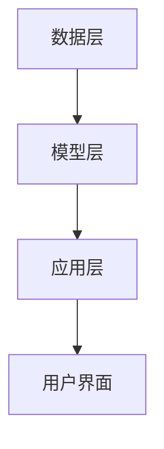

                 


# 《金融教育内容生成》

> 关键词：生成式AI，金融教育，内容生成，深度学习，自然语言处理

> 摘要：本文系统地探讨了生成式AI在金融教育内容生成中的应用，从基本原理到系统架构，从算法实现到项目实战，详细解析了如何利用生成式AI技术高效、准确地生成金融教育内容。文章结合实际案例，深入分析了生成式AI在金融教育中的优势与挑战，并提出了可行的解决方案和实践建议。

---

## 第一部分: 生成式AI的基本原理

### 第1章: 生成式AI的定义与核心概念

#### 1.1 生成式AI的基本概念
生成式AI是一种基于深度学习技术的人工智能，能够根据输入的提示生成新的文本、图像或其他类型的内容。其核心在于模仿人类的创造过程，通过学习大量数据，生成与训练数据相似的新内容。

#### 1.2 生成式AI的主要技术
生成式AI的主要技术包括：
1. **循环神经网络（RNN）**：适用于序列数据的生成。
2. **变分自编码器（VAE）**：通过编码和解码过程生成数据。
3. **生成对抗网络（GAN）**：通过对抗训练生成高质量的数据。

#### 1.3 生成式AI的优缺点
- **优点**：
  - 高效性：能够在短时间内生成大量内容。
  - 多样性：能够生成多样化的内容。
- **缺点**：
  - 可控性：生成的内容可能偏离预期。
  - 训练成本高：需要大量的计算资源。

---

### 第2章: 生成式AI的核心算法

#### 2.1 变量关系与损失函数
生成式AI的核心在于优化损失函数，常见的损失函数包括：
1. **交叉熵损失**：用于衡量生成内容与真实数据的差异。
2. **KL散度**：用于衡量两个概率分布之间的差异。

#### 2.2 深度学习模型的数学基础
生成式AI的数学模型通常涉及概率论和神经网络。例如，生成对抗网络（GAN）的目标是最小化生成器和判别器的损失函数：

$$ \min_{G} \max_{D} \mathbb{E}_{x \sim p_{data}}[\log D(x)] + \mathbb{E}_{z \sim p_z}[ \log (1 - D(G(z)))] $$

其中，\( G \) 是生成器，\( D \) 是判别器，\( z \) 是随机噪声向量。

---

## 第二部分: 生成式AI在金融教育中的应用

### 第3章: 金融教育内容生成的系统架构

#### 3.1 系统功能模块划分
金融教育内容生成系统主要包括以下几个模块：
1. **数据输入模块**：接收用户输入的提示或主题。
2. **模型训练模块**：对生成式模型进行训练和优化。
3. **内容生成模块**：根据输入生成金融教育内容。
4. **输出与反馈模块**：输出生成的内容并收集用户反馈。

#### 3.2 系统架构设计
系统架构设计通常采用分层架构，包括数据层、模型层和应用层。以下是系统的分层架构图：



#### 3.3 数据流与交互流程
数据流与交互流程如下：
1. 用户输入提示。
2. 系统将提示传递给生成模型。
3. 模型生成内容并返回给用户。
4. 用户反馈内容质量，系统根据反馈优化模型。

---

### 第4章: 项目实战

#### 4.1 环境安装
需要安装以下环境和库：
- Python 3.8+
- TensorFlow或PyTorch
- Keras
- scikit-learn

#### 4.2 核心实现代码
以下是生成式AI模型的简单实现代码：

```python
import tensorflow as tf
from tensorflow.keras import layers

# 定义生成器模型
def build_generator():
    model = tf.keras.Sequential()
    model.add(layers.Dense(256, activation='relu', input_dim=100))
    model.add(layers.Dense(128, activation='relu'))
    model.add(layers.Dense(64, activation='relu'))
    model.add(layers.Dense(32, activation='relu'))
    model.add(layers.Dense(16, activation='relu'))
    model.add(layers.Dense(1, activation='sigmoid'))
    return model

# 定义判别器模型
def build_discriminator():
    model = tf.keras.Sequential()
    model.add(layers.Dense(16, activation='relu', input_dim=1))
    model.add(layers.Dense(8, activation='relu'))
    model.add(layers.Dense(4, activation='relu'))
    model.add(layers.Dense(1, activation='sigmoid'))
    return model

# 编译模型
generator = build_generator()
discriminator = build_discriminator()

generator.compile(optimizer='adam', loss='binary_crossentropy')
discriminator.compile(optimizer='adam', loss='binary_crossentropy')
```

#### 4.3 实际案例分析
以生成金融新闻为例：
1. 用户输入提示：“最近股市大跌的原因是什么？”
2. 系统生成内容：“最近股市大跌的主要原因是全球经济下行和投资者信心不足。”
3. 用户反馈：内容准确，但可以更详细。

---

## 第三部分: 总结与展望

### 5.1 最佳实践
- **数据质量**：确保训练数据的多样性和准确性。
- **模型调优**：根据实际需求调整模型参数。
- **用户反馈**：及时收集用户反馈以优化生成内容。

### 5.2 小结
生成式AI为金融教育内容生成提供了强大的技术支持，但同时也面临数据质量、模型可控性等挑战。未来，随着技术的进步，生成式AI在金融教育中的应用将更加广泛和深入。

### 5.3 注意事项
- 生成内容需经过严格验证，确保准确性和合规性。
- 避免生成误导性内容，确保金融教育的严肃性。

### 5.4 拓展阅读
- 《生成式AI：原理与应用》
- 《深度学习在金融领域的应用》

---

通过以上内容，我们可以看到生成式AI在金融教育内容生成中的巨大潜力和实际应用价值。未来，随着技术的不断发展，生成式AI将为金融教育带来更多的创新和可能性。

