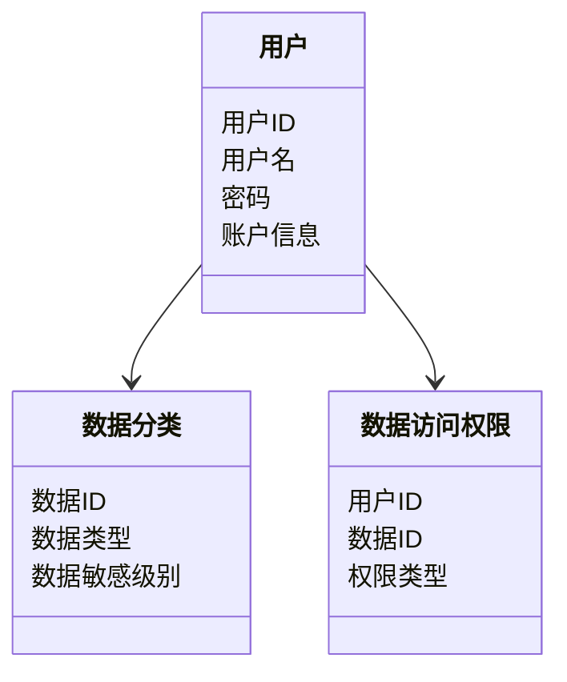
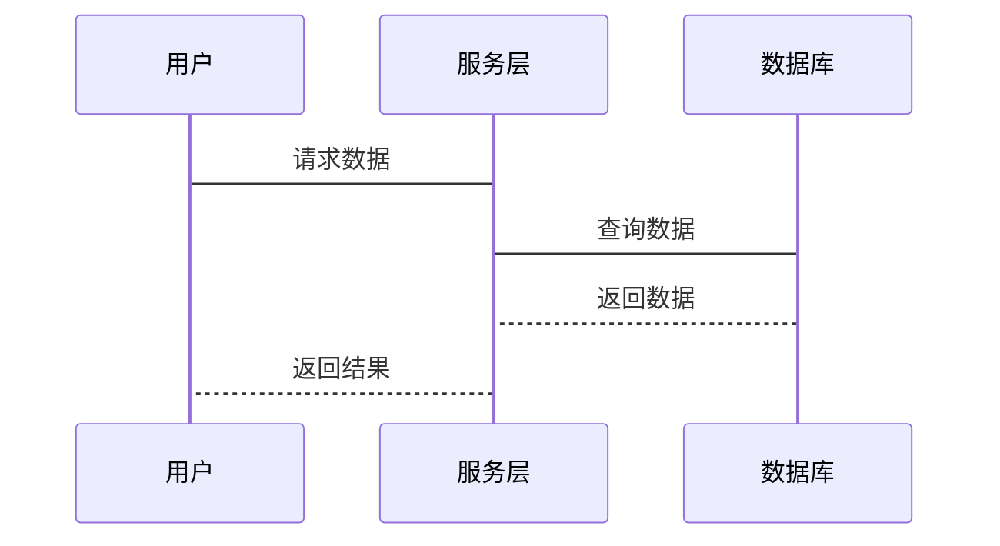

                 


# 《金融数据安全与隐私保护框架设计》

> 关键词：金融数据安全，隐私保护，数据分类，访问控制，隐私计算

> 摘要：本文详细探讨了金融数据安全与隐私保护框架设计的核心问题，从背景介绍、核心概念、技术实现、系统架构到项目实战，系统地分析了如何构建一个高效、安全的金融数据保护体系。通过具体的技术细节和实际案例，本文为金融行业数据安全与隐私保护提供了可操作的解决方案和实践指导。

---

## 第一部分: 金融数据安全与隐私保护背景介绍

### 第1章: 问题背景与描述

#### 1.1 问题背景

##### 1.1.1 数据泄露的现状与趋势
近年来，数据泄露事件频发，金融行业因其数据的高敏感性而成为攻击者的主要目标。根据统计，2022年全球因数据泄露造成的损失超过 trillion，其中金融行业的损失占比超过 30%。攻击手段日益复杂，从传统的钓鱼攻击到高级持续性威胁（APT），金融数据面临前所未有的安全挑战。

##### 1.1.2 金融行业数据安全的重要性
金融数据涵盖用户信息、交易记录、账户余额等，一旦泄露，可能导致身份盗窃、金融诈骗、信用损失等问题。此外，金融数据的完整性直接影响金融系统的稳定性和信任度。

##### 1.1.3 隐私保护的法律与合规要求
随着《通用数据保护条例》（GDPR）等法规的出台，企业必须严格遵守数据隐私保护的相关规定。金融行业作为数据密集型行业，其合规性要求更为严格，任何数据泄露事件都可能面临巨额罚款和声誉损失。

#### 1.2 问题描述

##### 1.2.1 金融数据的敏感性分析
金融数据的敏感性主要体现在以下方面：
- 用户身份信息：如姓名、身份证号、手机号等。
- 账户信息：如银行账号、信用卡号等。
- 交易信息：如交易金额、交易时间、交易对手等。

##### 1.2.2 数据泄露对企业的影响
- **经济损失**：直接的罚款、赔偿和修复成本。
- **信任损失**：客户对金融机构的信任度下降，可能导致客户流失。
- **声誉损失**：企业形象受损，可能影响未来的业务发展。

##### 1.2.3 用户隐私权与数据利用的平衡
在数据利用与隐私保护之间存在矛盾。一方面，金融机构需要利用数据进行风险评估、精准营销等业务；另一方面，用户享有隐私权，反对未经授权的数据使用。

### 第2章: 问题解决与框架概述

#### 2.1 问题解决思路

##### 2.1.1 数据分类与分级管理
将数据按照敏感程度进行分类，如高敏感数据（如账户信息）、中敏感数据（如交易记录）和低敏感数据（如公开信息）。根据不同级别的数据，采取不同的保护措施。

##### 2.1.2 隐私保护的技术手段
采用加密、脱敏、匿名化等技术手段，确保数据在存储和传输过程中的隐私性。

##### 2.1.3 安全框架的设计原则
- **最小化原则**：仅收集实现业务所需的数据。
- **访问控制原则**：基于角色的访问控制（RBAC）和基于属性的访问控制（ABAC）相结合。
- **数据生命周期管理**：从数据生成、存储、使用到销毁的全生命周期管理。

#### 2.2 框架的核心要素

##### 2.2.1 数据生命周期管理
数据生命周期包括数据生成、存储、使用、共享、销毁等阶段。在每个阶段都需要采取相应的安全措施。

##### 2.2.2 安全策略与访问控制
- **安全策略**：制定数据访问、存储、传输的安全策略。
- **访问控制**：基于用户角色和权限，限制数据访问范围。

##### 2.2.3 隐私计算与数据脱敏
- **隐私计算**：通过隐私计算技术（如秘密分享、同态加密）在不泄露原始数据的情况下进行数据计算。
- **数据脱敏**：对敏感数据进行脱敏处理，使其在不授权的情况下无法还原原始数据。

---

## 第二部分: 核心概念与联系

### 第3章: 核心概念原理

#### 3.1 数据安全与隐私保护的定义

##### 3.1.1 数据安全的内涵与外延
数据安全是指保护数据的机密性、完整性、可用性。机密性指只有授权人员才能访问数据；完整性指数据在存储和传输过程中保持一致；可用性指数据在需要时可以被访问。

##### 3.1.2 隐私保护的核心目标
隐私保护的目标是确保个人数据在未经授权的情况下不会被泄露或滥用。隐私保护不仅关注数据的机密性，还关注数据的不可逆性。

##### 3.1.3 两者之间的关系与区别
数据安全关注的是数据的整体安全，而隐私保护关注的是数据中的个人隐私部分。数据安全是隐私保护的基础，而隐私保护是数据安全的延伸。

#### 3.2 核心概念对比分析

##### 3.2.1 数据安全与隐私保护的属性特征对比

| 属性 | 数据安全 | 隐私保护 |
|------|----------|----------|
| 保护对象 | 数据的整体安全 | 数据中的个人隐私 |
| 关注点 | 机密性、完整性、可用性 | 数据的不可逆性、匿名性 |
| 技术手段 | 加密、访问控制、防火墙 | 数据脱敏、隐私计算、匿名化 |

##### 3.2.2 数据安全与隐私保护的ER实体关系图

```mermaid
er
  actor: 用户
  actor --> entity: 用户数据
  entity --> entity: 数据分类
  entity --> entity: 数据访问权限
  entity --> entity: 数据加密算法
  entity --> entity: 安全策略
```

---

### 第4章: 隐私计算与数据脱敏技术

#### 4.1 隐私计算的基本原理

##### 4.1.1 秘密分享机制
秘密分享是一种将秘密数据分割成多个部分的技术。任何未经授权的部分都无法还原秘密数据。

##### 4.1.2 同态加密技术
同态加密允许在加密数据上进行计算，而无需解密数据。这在金融行业的数据计算中尤为重要。

##### 4.1.3 安全多方计算
安全多方计算（SMPC）允许多方在不泄露各自数据的情况下共同计算结果。

#### 4.2 数据脱敏技术实现

##### 4.2.1 数据替换脱敏
将敏感数据替换为不可逆的替代值，例如用虚拟信用卡号替换真实信用卡号。

##### 4.2.2 数据变形脱敏
对数据进行变形处理，使其无法还原。例如，对日期进行随机偏移处理。

##### 4.2.3 数据加密脱敏
对敏感数据进行加密，使其在未授权的情况下无法被读取。

---

## 第三部分: 技术实现与算法原理

### 第5章: 数据加密与访问控制算法

#### 5.1 数据加密算法

##### 5.1.1 对称加密算法
对称加密算法是一种使用相同密钥进行加密和解密的算法。常用的对称加密算法包括AES（高级加密标准）和DES（数据加密标准）。

##### 5.1.2 非对称加密算法
非对称加密算法使用公钥和私钥进行加密和解密。公钥用于加密，私钥用于解密。常用的非对称加密算法包括RSA和 ECC（椭圆曲线加密）。

##### 5.1.3 哈希函数
哈希函数用于将任意长度的数据映射为固定长度的哈希值。常用的哈希函数包括MD5和SHA-256。

#### 5.2 访问控制算法

##### 5.2.1 基于角色的访问控制（RBAC）
RBAC基于用户角色来定义权限。例如，银行的员工可能有不同的角色，如普通员工、部门经理、CEO，每个角色有不同的数据访问权限。

##### 5.2.2 基于属性的访问控制（ABAC）
ABAC基于用户属性（如职位、部门、权限）来动态分配权限。例如，只有符合特定条件的用户才能访问特定数据。

##### 5.2.3 基于权限的访问控制（PBAC）
PBAC基于用户的权限来定义访问范围。例如，普通员工只能访问与其工作相关的数据。

---

### 第6章: 隐私计算技术

#### 6.1 隐私计算的基本原理

##### 6.1.1 秘密分享机制
秘密分享是一种将秘密数据分割成多个部分的技术。任何未经授权的部分都无法还原秘密数据。

##### 6.1.2 同态加密技术
同态加密允许在加密数据上进行计算，而无需解密数据。这在金融行业的数据计算中尤为重要。

##### 6.1.3 安全多方计算
安全多方计算（SMPC）允许多方在不泄露各自数据的情况下共同计算结果。

---

## 第四部分: 系统分析与架构设计方案

### 第7章: 系统架构设计

#### 7.1 问题场景介绍
假设我们正在设计一个金融数据安全与隐私保护系统，旨在保护银行客户的敏感数据。

#### 7.2 项目介绍
项目目标：构建一个安全的金融数据保护系统，确保数据在存储和传输过程中的机密性、完整性和可用性。

#### 7.3 系统功能设计

##### 7.3.1 领域模型


##### 7.3.2 系统架构设计


#### 7.4 系统接口设计
- 用户接口：用户登录、数据查询、数据修改。
- 管理接口：数据分类、权限管理、日志审计。

#### 7.5 系统交互设计


---

## 第五部分: 项目实战

### 第8章: 项目实战

#### 8.1 环境安装
- 操作系统：Linux（Ubuntu 20.04）
- 开发工具：Python 3.8、Django 3.2、Django REST framework
- 数据库：PostgreSQL 13

#### 8.2 核心代码实现

##### 8.2.1 数据分类模块
```python
from django.db import models

class DataClassification(models.Model):
    DATA_TYPE_CHOICES = [
        ('personal', '个人信息'),
        ('account', '账户信息'),
        ('transaction', '交易记录'),
    ]
    data_type = models.CharField(max_length=10, choices=DATA_TYPE_CHOICES)
    sensitivity_level = models.IntegerField(default=1)
```

##### 8.2.2 数据脱敏模块
```python
import re

def mask_credit_card(credit_card):
    return re.sub(r'\d{4}(?!\d)', '*', credit_card)
```

##### 8.2.3 访问控制模块
```python
from rest_framework.permissions import BasePermission

class IsAuthorized(BasePermission):
    def has_permission(self, request, view):
        return request.user and request.user.is_authenticated
```

#### 8.3 案例分析与实现解读
通过一个具体的案例（如银行客户数据保护），详细分析如何设计和实现数据分类、脱敏、访问控制等功能。

---

## 第六部分: 总结与展望

### 第9章: 总结与展望

#### 9.1 小结
本文从背景介绍、核心概念、技术实现、系统架构到项目实战，系统地探讨了金融数据安全与隐私保护框架设计的核心问题。通过具体的技术细节和实际案例，为金融行业数据安全与隐私保护提供了可操作的解决方案和实践指导。

#### 9.2 注意事项
- 数据分类和分级是数据安全的基础，需要根据实际业务需求进行动态调整。
- 隐私计算技术虽然能够保护数据隐私，但其计算效率和性能需要进一步优化。
- 数据安全和隐私保护是一个动态变化的过程，需要持续关注新技术和新威胁。

#### 9.3 未来展望
随着人工智能和大数据技术的快速发展，金融数据安全与隐私保护将面临更多挑战和机遇。未来，隐私计算、区块链等技术将在金融数据保护中发挥更大的作用。同时，数据安全的智能化、自动化也将成为重要研究方向。

---

以上是《金融数据安全与隐私保护框架设计》的技术博客文章的完整内容，涵盖了从理论到实践的各个方面，为金融行业的数据安全与隐私保护提供了系统的解决方案和实践指导。

