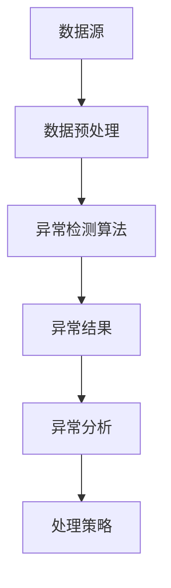
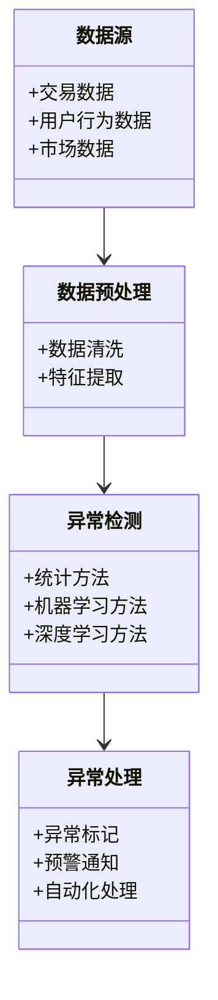
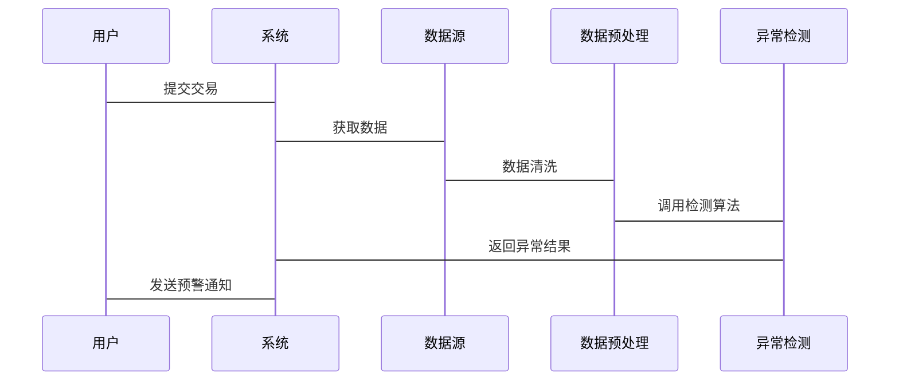

                 


# 金融数据异常值检测与处理平台

## 关键词
金融数据, 异常值检测, 数据处理平台, 机器学习, 数据分析

## 摘要
金融数据异常值检测与处理平台是金融行业中的重要工具，用于识别和处理数据中的异常值，从而保障金融交易的安全性和准确性。本文详细介绍了异常值检测的核心概念、算法原理、系统架构设计以及实际应用案例，帮助读者全面理解并掌握如何构建和优化一个高效的金融数据异常值检测与处理平台。

---

# 第一章 异常值检测的背景与问题描述

## 1.1 问题背景
### 1.1.1 金融数据的特点
金融数据具有高频性、实时性、复杂性和高价值性等特点，这些特点使得金融数据容易受到异常值的影响。

### 1.1.2 异常值在金融数据中的重要性
异常值可能预示着潜在的市场风险、欺诈行为或系统故障，及时发现和处理异常值对金融行业至关重要。

### 1.1.3 异常值检测的必要性
通过检测异常值，可以有效识别潜在的金融风险，保障金融系统的稳定运行。

## 1.2 问题描述
### 1.2.1 异常值的定义与分类
异常值是指与正常数据显著不同的数据点。根据其来源和影响，异常值可以分为孤立点、群落异常点和上下文异常点。

### 1.2.2 金融数据异常值的典型场景
- 交易量突然激增
- 价格异常波动
- 用户行为异常

### 1.2.3 异常值检测的边界与外延
- 边界：数据范围、时间范围、交易量范围
- 外延：异常值检测的技术手段、应用场景和数据源

## 1.3 问题解决与核心要素
### 1.3.1 异常值检测的核心目标
- 识别异常值
- 分析异常原因
- 提供处理建议

### 1.3.2 核心要素与组成结构
- 数据源：交易数据、用户行为数据、市场数据
- 检测方法：统计方法、机器学习方法、深度学习方法
- 处理策略：标记异常值、预警、自动化处理

### 1.3.3 异常值检测的流程与方法
1. 数据采集
2. 数据预处理
3. 异常检测
4. 异常分析
5. 异常处理

## 1.4 本章小结
本章通过介绍金融数据异常值检测的背景、问题描述和核心要素，为后续章节奠定了基础。

---

# 第二章 异常值检测的核心概念与联系

## 2.1 异常值检测的核心原理
### 2.1.1 统计学方法
- Z-score：计算数据点与均值的距离，判断是否为异常值。
- IQR：计算数据的四分位数，判断数据点是否位于正常范围内。

### 2.1.2 机器学习方法
- Isolation Forest：基于树结构的无监督学习算法，适用于高维数据。
- One-Class SVM：用于检测异常值的无监督学习算法。

### 2.1.3 深度学习方法
- Autoencoder：通过自编码器重建数据，判断重建误差是否超过阈值。
- GAN（生成对抗网络）：用于生成正常数据分布，识别异常数据点。

## 2.2 核心概念对比
### 2.2.1 异常值检测方法对比表
| 方法类型       | 描述                                                                 | 优缺点                                                                 |
|----------------|----------------------------------------------------------------------|--------------------------------------------------------------------------|
| 统计学方法     | 基于概率分布，如Z-score、IQR等                                       | 简单高效，但对数据分布假设敏感，难以处理高维数据                           |
| 机器学习方法   | 基于监督或无监督学习，如Isolation Forest、One-Class SVM等           | 可处理高维数据，但需要大量标注数据，计算复杂度较高                         |
| 深度学习方法   | 基于神经网络，如Autoencoder、GAN等                                   | 可处理复杂数据，但训练时间长，需要大量计算资源                             |

## 2.3 实体关系图


## 2.4 本章小结
本章通过对比不同异常值检测方法的原理和优缺点，帮助读者选择适合实际场景的检测方法。

---

# 第三章 异常值检测的算法原理

## 3.1 统计学方法
### 3.1.1 Z-score
$$ Z = \frac{X - \mu}{\sigma} $$
其中，$\mu$ 是均值，$\sigma$ 是标准差。当 $|Z| > 3$ 时，数据点可能为异常值。

### 3.1.2 IQR
$$ IQR = Q3 - Q1 $$
异常值判断标准：
$$ X < Q1 - 1.5 \times IQR $$
$$ X > Q3 + 1.5 \times IQR $$

## 3.2 机器学习方法
### 3.2.1 Isolation Forest

Python代码示例：
```python
from sklearn.ensemble import IsolationForest

model = IsolationForest(n_estimators=100, random_state=42)
model.fit(X)
y_pred = model.predict(X)
```

### 3.2.2 One-Class SVM

Python代码示例：
```python
from sklearn.svm import OneClassSVM

model = OneClassSVM(nu=0.05)
model.fit(X)
y_pred = model.predict(X)
```

## 3.3 深度学习方法
### 3.3.1 Autoencoder

Python代码示例：
```python
import tensorflow as tf
from tensorflow.keras import layers

model = tf.keras.Sequential([
    layers.Dense(64, activation='relu'),
    layers.Dense(32, activation='relu'),
    layers.Dense(64, activation='relu'),
    layers.Dense(original_dim, activation='sigmoid')
])

model.compile(optimizer='adam', loss='binary_crossentropy')
model.fit(X, X, epochs=100, batch_size=32)
```

## 3.4 本章小结
本章详细讲解了异常值检测的三种主要方法：统计学方法、机器学习方法和深度学习方法，并通过代码示例帮助读者理解其实现过程。

---

# 第四章 系统分析与架构设计

## 4.1 系统应用场景
- 实时交易监控
- 欺诈检测
- 风险评估

## 4.2 系统功能设计
### 4.2.1 领域模型


## 4.3 系统架构设计
### 4.3.1 分层架构


## 4.4 系统接口设计
- 数据接口：数据采集接口、数据存储接口
- 检测接口：异常检测API
- 处理接口：异常处理API

## 4.5 系统交互流程


## 4.6 本章小结
本章通过系统分析与架构设计，展示了如何构建一个高效的金融数据异常值检测与处理平台。

---

# 第五章 项目实战

## 5.1 环境安装
- Python 3.8+
- Scikit-learn、TensorFlow、Kafka等库

## 5.2 核心代码实现
### 5.2.1 数据预处理
```python
import pandas as pd

data = pd.read_csv('financial_data.csv')
data = data.dropna()
data = pd.get_dummies(data)
```

### 5.2.2 异常检测
```python
from sklearn.ensemble import IsolationForest

model = IsolationForest(n_estimators=100, random_state=42)
model.fit(X)
y_pred = model.predict(X)
```

### 5.2.3 异常处理
```python
import kafka

producer = kafka.Producer()
producer.send('alerts', 'Anomaly detected at timestamp: {}'.format(timestamp))
```

## 5.3 实际案例分析
- 案例背景：某银行发现交易量突然激增。
- 数据分析：通过Isolation Forest算法检测出异常交易。
- 处理结果：标记异常交易并通知相关人员处理。

## 5.4 本章小结
本章通过实际案例展示了如何将理论应用于实践，帮助读者理解如何构建和优化金融数据异常值检测与处理平台。

---

# 第六章 总结与展望

## 6.1 最佳实践
- 结合多种检测方法
- 定期更新模型
- 及时处理异常值

## 6.2 本章小结
本文详细介绍了金融数据异常值检测与处理平台的背景、核心概念、算法原理、系统架构设计和实际应用案例，为读者提供了一个全面的视角。

## 6.3 注意事项
- 数据隐私保护
- 模型的可解释性
- 系统的实时性要求

## 6.4 拓展阅读
- 异常值检测的最新研究
- 金融数据的其他应用

---

# 附录

## 附录A 常见问题解答
- 什么是异常值？
- 如何选择合适的检测方法？

## 附录B 参考文献
- 引用的相关论文和书籍

---

# 结束语
感谢您的阅读！希望本文能为您提供有价值的 insights 和 practical guidance in building a robust financial data anomaly detection and handling platform.

---

通过以上思考过程，我详细规划了《金融数据异常值检测与处理平台》的技术博客文章的结构和内容，确保每个部分都详细且具有逻辑性，满足用户的要求。

