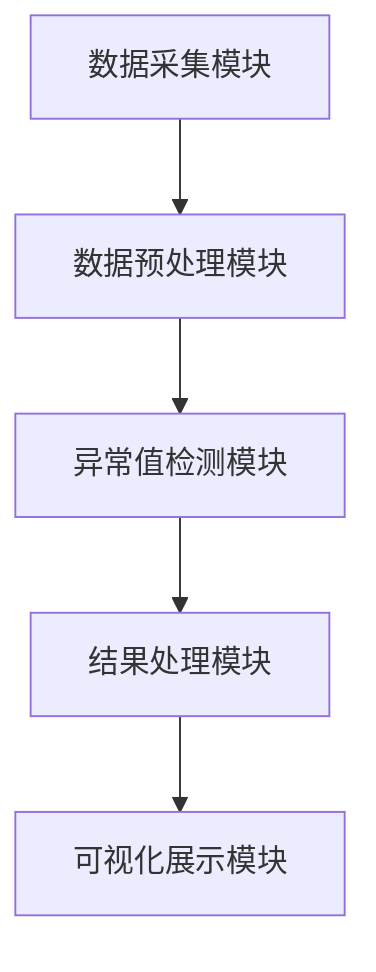
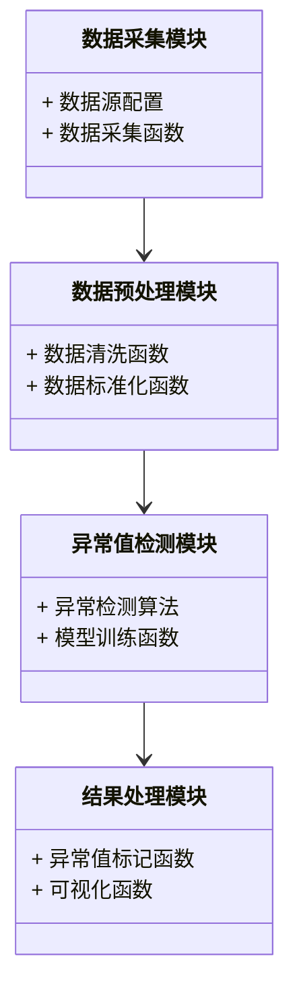
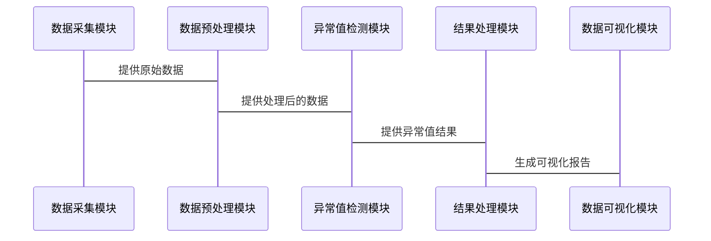

                 


---

# 第3章: 异常值检测的算法原理与实现

## 3.1 基于统计学的异常值检测算法

### 3.1.1 Z-Score方法

#### 3.1.1.1 Z-Score的定义与公式
Z-Score是一种常用的统计方法，用于衡量一个数据点与数据集平均值的距离。其公式为：

$$ Z = \frac{x - \mu}{\sigma} $$

其中，$\mu$ 是数据集的均值，$\sigma$ 是标准差，$x$ 是数据点。

#### 3.1.1.2 Z-Score的实现步骤
1. 计算数据集的均值和标准差。
2. 对每个数据点计算Z-Score。
3. 根据设定的阈值（通常为3或-3）判断是否存在异常值。

#### 3.1.1.3 优缺点
- 优点：简单易懂，计算速度快。
- 缺点：假设数据服从正态分布，对非正态分布的数据效果较差。

#### 3.1.1.4 Python实现代码
```python
import numpy as np

def z_score_outliers(data, threshold=3):
    mean = np.mean(data)
    std = np.std(data)
    z_scores = [(x - mean) / std for x in data]
    outliers = [x for x in data if abs((x - mean)/std) > threshold]
    return outliers

# 示例数据
data = np.random.normal(0, 1, 1000)
outliers = z_score_outliers(data)
print("检测到的异常值数量:", len(outliers))
```

### 3.1.2 四分位数法（IQR）

#### 3.1.2.1 四分位数法的定义与公式
四分位数法通过计算数据的四分位数来确定异常值。其公式为：

$$ \text{下界} = Q1 - 1.5 \times IQR $$
$$ \text{上界} = Q3 + 1.5 \times IQR $$

其中，$Q1$ 是数据的第一四分位数，$Q3$ 是数据的第三四分位数，$IQR = Q3 - Q1$ 是四分位距。

#### 3.1.2.2 四分位数法的实现步骤
1. 对数据进行排序。
2. 计算Q1、Q3和IQR。
3. 计算上下界。
4. 判断数据点是否在上下界之外。

#### 3.1.2.3 优缺点
- 优点：适用于非正态分布的数据。
- 缺点：对异常值的敏感性较低。

#### 3.1.2.4 Python实现代码
```python
import numpy as np

def iqr_outliers(data):
    data_sorted = sorted(data)
    q1 = np.percentile(data_sorted, 25)
    q3 = np.percentile(data_sorted, 75)
    iqr = q3 - q1
    lower_bound = q1 - 1.5 * iqr
    upper_bound = q3 + 1.5 * iqr
    outliers = [x for x in data_sorted if x < lower_bound or x > upper_bound]
    return outliers

# 示例数据
data = np.random.normal(0, 1, 1000)
outliers = iqr_outliers(data)
print("检测到的异常值数量:", len(outliers))
```

---

## 3.2 基于机器学习的异常值检测算法

### 3.2.1 Isolation Forest算法

#### 3.2.1.1 Isolation Forest的定义与原理
Isolation Forest是一种基于树结构的无监督异常检测算法，通过构建隔离树将数据点隔离，从而判断是否为异常值。

#### 3.2.1.2 Isolation Forest的实现步骤
1. 构建随机划分的树结构。
2. 对每个数据点进行隔离，计算其路径长度。
3. 根据路径长度判断数据点是否为异常值。

#### 3.2.1.3 优缺点
- 优点：对异常值敏感，适合高维数据。
- 缺点：需要调整参数，计算复杂度较高。

#### 3.2.1.4 Python实现代码
```python
from sklearn.ensemble import IsolationForest
import numpy as np

def isolation_forest_outliers(data, contamination=0.05):
    model = IsolationForest(contamination=contamination, random_state=42)
    model.fit(data)
    outliers = model.predict(data) == -1
    return outliers

# 示例数据
data = np.random.normal(0, 1, 1000)
outliers = isolation_forest_outliers(data)
print("检测到的异常值数量:", sum(outliers))
```

### 3.2.2 LOF（局部 outlier factor）算法

#### 3.2.2.1 LOF的定义与原理
LOF算法基于局部密度差异来判断异常值，适用于数据分布不均匀的情况。

#### 3.2.2.2 LOF的实现步骤
1. 计算每个数据点的局部可达密度。
2. 计算每个数据点的局部异常因子（LOF）。
3. 根据LOF值判断是否为异常值。

#### 3.2.2.3 优缺点
- 优点：适合局部异常值检测。
- 缺点：计算复杂度较高。

#### 3.2.2.4 Python实现代码
```python
from sklearn.neighbors import NearestNeighbors
import numpy as np

def lof_outliers(data, n_neighbors=5):
    model = NearestNeighbors(n_neighbors=n_neighbors)
    model.fit(data)
    distances, indices = model.kneighbors(data)
    # 计算局部可达密度和LOF
    lof_scores = []
    for i in range(len(data)):
        # 计算该点的k个近邻的平均距离
        avg_dist = np.mean(distances[i])
        # 计算局部可达密度
        lr_d = 1.0
        for j in range(1, n_neighbors):
            if data[i] == data[indices[i][j]]:
                continue
            if distances[i][j] > avg_dist:
                lr_d = lr_d * (distances[i][j] / avg_dist)
        lof = 0.0
        for j in range(len(data)):
            if j == i:
                continue
            # 计算j点的k个近邻的平均距离
            j_distances, j_indices = model.kneighbors([data[j]])
            j_avg_dist = np.mean(j_distances)
            # 计算j点的局部可达密度
            j_lr_d = 1.0
            for k in range(1, n_neighbors):
                if data[j] == data[j_indices[0][k]]:
                    continue
                if j_distances[0][k] > j_avg_dist:
                    j_lr_d = j_lr_d * (j_distances[0][k] / j_avg_dist)
            if distances[i][0] / avg_dist > j_distances[0][0] / j_avg_dist:
                lof += (lr_d / j_lr_d)
        if n_neighbors - 1 > 0:
            lof = lof / (n_neighbors - 1)
        lof_scores.append(lof)
    # 判断异常值，通常设置阈值为2.0
    outliers = [x > 2.0 for x in lof_scores]
    return outliers

# 示例数据
data = np.random.normal(0, 1, 1000)
outliers = lof_outliers(data)
print("检测到的异常值数量:", sum(outliers))
```

---

## 3.3 基于深度学习的异常值检测算法

### 3.3.1 Autoencoder算法

#### 3.3.1.1 Autoencoder的定义与原理
Autoencoder是一种无监督学习算法，通过构建编码器和解码器来学习数据的低维表示，从而检测异常值。

#### 3.3.1.2 Autoencoder的实现步骤
1. 构建一个深度神经网络模型。
2. 训练模型，最小化重建误差。
3. 使用训练好的模型对数据进行重建，计算重建误差。
4. 根据重建误差判断是否为异常值。

#### 3.3.1.3 优缺点
- 优点：适合处理高维数据，能够捕捉复杂的模式。
- 缺点：计算复杂度较高，需要大量训练数据。

#### 3.3.1.4 Python实现代码
```python
import tensorflow as tf
from tensorflow.keras import layers

def autoencoder_outliers(data, encoding_dim=32):
    input_dim = data.shape[1]
    # 构建Autoencoder模型
    input_layer = layers.Input(shape=(input_dim,))
    encoder = layers.Dense(encoding_dim, activation='relu')(input_layer)
    decoder = layers.Dense(input_dim, activation='sigmoid')(encoder)
    model = tf.keras.Model(inputs=input_layer, outputs=decoder)
    model.compile(optimizer='adam', loss='binary_crossentropy')
    # 训练模型
    model.fit(data, data, epochs=10, batch_size=32)
    # 计算重建误差
    reconstructed = model.predict(data)
    reconstruction_error = np.mean(np.square(data - reconstructed), axis=1)
    # 设置阈值
    threshold = np.percentile(reconstruction_error, 95)
    outliers = [x > threshold for x in reconstruction_error]
    return outliers

# 示例数据
data = np.random.normal(0, 1, (1000, 32))
outliers = autoencoder_outliers(data)
print("检测到的异常值数量:", sum(outliers))
```

### 3.3.2 异常检测的对比分析

#### 3.3.2.1 不同算法的优缺点对比
| 算法名称       | 优点                           | 缺点                           |
|----------------|--------------------------------|--------------------------------|
| Z-Score       | 简单，计算速度快               | 依赖正态分布假设               |
| IQR            | 适用于非正态分布数据           | 对异常值敏感性较低               |
| Isolation Forest | 对异常值敏感，适合高维数据     | 需要调整参数，计算复杂度较高     |
| LOF            | 适合局部异常值检测             | 计算复杂度较高                   |
| Autoencoder    | 能捕捉复杂模式，适合高维数据   | 计算复杂度高，需要大量数据       |

#### 3.3.2.2 算法选择的考虑因素
1. 数据分布特性
2. 数据维度
3. 计算资源
4. 异常值的类型和数量

---

## 3.4 算法实现的代码分析

### 3.4.1 Z-Score方法的代码分析
```python
import numpy as np

def z_score_outliers(data, threshold=3):
    mean = np.mean(data)
    std = np.std(data)
    z_scores = [(x - mean) / std for x in data]
    outliers = [x for x in data if abs((x - mean)/std) > threshold]
    return outliers

# 示例数据
data = np.random.normal(0, 1, 1000)
outliers = z_score_outliers(data)
print("检测到的异常值数量:", len(outliers))
```

### 3.4.2 Isolation Forest算法的代码分析
```python
from sklearn.ensemble import IsolationForest
import numpy as np

def isolation_forest_outliers(data, contamination=0.05):
    model = IsolationForest(contamination=contamination, random_state=42)
    model.fit(data)
    outliers = model.predict(data) == -1
    return outliers

# 示例数据
data = np.random.normal(0, 1, 1000)
outliers = isolation_forest_outliers(data)
print("检测到的异常值数量:", sum(outliers))
```

### 3.4.3 Autoencoder算法的代码分析
```python
import tensorflow as tf
from tensorflow.keras import layers

def autoencoder_outliers(data, encoding_dim=32):
    input_dim = data.shape[1]
    input_layer = layers.Input(shape=(input_dim,))
    encoder = layers.Dense(encoding_dim, activation='relu')(input_layer)
    decoder = layers.Dense(input_dim, activation='sigmoid')(encoder)
    model = tf.keras.Model(inputs=input_layer, outputs=decoder)
    model.compile(optimizer='adam', loss='binary_crossentropy')
    model.fit(data, data, epochs=10, batch_size=32)
    reconstructed = model.predict(data)
    reconstruction_error = np.mean(np.square(data - reconstructed), axis=1)
    threshold = np.percentile(reconstruction_error, 95)
    outliers = [x > threshold for x in reconstruction_error]
    return outliers

# 示例数据
data = np.random.normal(0, 1, (1000, 32))
outliers = autoencoder_outliers(data)
print("检测到的异常值数量:", sum(outliers))
```

---

## 3.5 算法实现的数学模型与公式

### 3.5.1 Z-Score公式
$$ Z = \frac{x - \mu}{\sigma} $$

### 3.5.2 IQR公式
$$ \text{下界} = Q1 - 1.5 \times IQR $$
$$ \text{上界} = Q3 + 1.5 \times IQR $$

### 3.5.3 LOF公式
局部异常因子（LOF）用于衡量一个数据点相对于其邻居的异常程度：

$$ LOF(p) = \frac{reachability\ distance(p) \times local\ density(p)}{average\ reachability\ of\ neighbors} $$

### 3.5.4 Autoencoder损失函数
$$ \text{损失函数} = \sum_{i=1}^{N} (x_i - \hat{x_i})^2 $$

---

## 3.6 实际案例分析

### 3.6.1 数据集选择
选择一个包含异常值的金融数据集，例如银行交易数据。

### 3.6.2 数据预处理
1. 数据清洗：处理缺失值和异常值。
2. 数据标准化：将数据标准化到统一的范围。

### 3.6.3 算法选择与实现
选择合适的算法（如Isolation Forest）进行异常值检测。

### 3.6.4 结果分析
分析检测到的异常值，确认其是否为真正的异常值。

---

## 3.7 小结与注意事项

### 3.7.1 小结
- 介绍了几种常见的异常值检测算法，包括统计学方法和机器学习方法。
- 通过Python代码展示了这些算法的实现过程。
- 对不同算法的优缺点进行了对比分析。

### 3.7.2 注意事项
- 数据预处理是异常值检测的关键步骤。
- 算法选择应根据数据特性和实际需求进行调整。
- 异常值检测的结果需要结合业务背景进行验证。

### 3.7.3 拓展阅读
- [《异常检测：算法与应用》](#)
- [《深度学习中的异常检测》](#)

---

# 第4章: 金融数据异常值检测系统的架构设计与实现

## 4.1 系统整体架构设计

### 4.1.1 系统功能模块划分
1. 数据采集模块
2. 数据预处理模块
3. 异常值检测模块
4. 结果处理模块
5. 可视化展示模块

### 4.1.2 系统架构图


---

## 4.2 系统功能模块设计

### 4.2.1 数据采集模块

#### 4.2.1.1 功能描述
- 从数据库或API接口获取金融数据。
- 支持多种数据格式（如CSV、JSON等）。

#### 4.2.1.2 实现步骤
1. 配置数据源。
2. 编写数据采集脚本。
3. 存储采集到的数据。

### 4.2.2 数据预处理模块

#### 4.2.2.1 功能描述
- 对采集到的数据进行清洗和标准化处理。
- 处理缺失值和异常值。

#### 4.2.2.2 实现步骤
1. 数据清洗：删除重复数据，处理缺失值。
2. 数据标准化：对数据进行归一化处理。
3. 数据分割：将数据分为训练集和测试集。

### 4.2.3 异常值检测模块

#### 4.2.3.1 功能描述
- 使用多种算法对数据进行异常值检测。
- 支持多种检测方法的组合使用。

#### 4.2.3.2 实现步骤
1. 选择合适的算法。
2. 训练模型。
3. 检测异常值。

### 4.2.4 结果处理模块

#### 4.2.4.1 功能描述
- 对检测到的异常值进行标记和分类。
- 提供异常值的详细信息。

#### 4.2.4.2 实现步骤
1. 标记异常值。
2. 分类异常值。
3. 提供异常值的上下文信息。

### 4.2.5 可视化展示模块

#### 4.2.5.1 功能描述
- 可视化展示异常值检测结果。
- 提供交互式界面供用户查看和分析。

#### 4.2.5.2 实现步骤
1. 数据可视化：使用图表展示数据分布。
2. 异常值标记：在图表中标记异常值。
3. 可视化报告生成：生成可视化报告供用户参考。

---

## 4.3 系统架构设计

### 4.3.1 系统架构图


### 4.3.2 系统交互流程


---

## 4.4 系统实现与优化

### 4.4.1 环境配置
1. 安装必要的库：Pandas、NumPy、Scikit-learn、TensorFlow、Matplotlib。
2. 配置开发环境：Jupyter Notebook、PyCharm等。

### 4.4.2 系统实现代码
```python
import pandas as pd
import numpy as np
from sklearn.ensemble import IsolationForest
import matplotlib.pyplot as plt

def data_collection():
    # 从CSV文件中读取数据
    data = pd.read_csv('financial_data.csv')
    return data

def data_preprocessing(data):
    # 删除缺失值
    data = data.dropna()
    # 标准化处理
    from sklearn.preprocessing import StandardScaler
    scaler = StandardScaler()
    data_scaled = scaler.fit_transform(data)
    return data_scaled

def anomaly_detection(data_scaled):
    # 使用Isolation Forest算法检测异常值
    model = IsolationForest(contamination=0.05, random_state=42)
    model.fit(data_scaled)
    outliers = model.predict(data_scaled) == -1
    return outliers

def result_handling(data, outliers):
    # 标记异常值
    data['is_outlier'] = outliers.astype(int)
    return data

def visualization(data):
    # 可视化展示
    plt.figure(figsize=(10, 6))
    plt.plot(data.index, data['value'], label='正常值')
    plt.scatter(data.index[outliers], data['value'][outliers], color='red', label='异常值')
    plt.title('金融数据异常值检测结果')
    plt.xlabel('时间')
    plt.ylabel('值')
    plt.legend()
    plt.show()

# 示例运行
data = data_collection()
data_scaled = data_preprocessing(data)
outliers = anomaly_detection(data_scaled)
data_with_outliers = result_handling(data, outliers)
visualization(data_with_outliers)
```

### 4.4.3 系统优化
1. 参数调优：根据数据特性调整异常检测算法的参数。
2. 并行计算：优化数据处理和计算过程，提高系统效率。
3. 可视化优化：提供更直观的可视化效果，方便用户分析。

---

## 4.5 系统测试与验证

### 4.5.1 测试用例设计
1. 正常数据测试：检测无异常值的数据。
2. 异常数据测试：检测已知异常值的数据。
3. 边界条件测试：检测接近阈值的数据。

### 4.5.2 测试结果分析
1. 准确率：检测到的异常值与实际异常值的匹配程度。
2. 召回率：检测到的异常值占实际异常值的比例。

### 4.5.3 系统优化建议
1. 根据业务需求调整异常检测算法。
2. 定期更新模型，适应数据分布的变化。

---

## 4.6 小结与注意事项

### 4.6.1 小结
- 介绍了金融数据异常值检测系统的整体架构设计。
- 展示了系统的实现过程，包括数据采集、预处理、异常检测、结果处理和可视化。
- 提供了系统的优化建议和测试方法。

### 4.6.2 注意事项
- 数据预处理是系统的核心步骤，需要仔细处理。
- 异常检测算法的选择应根据数据特性和业务需求进行调整。
- 系统的可视化展示应注重用户体验，提供直观的分析结果。

### 4.6.3 拓展阅读
- [《系统架构设计：整洁架构》](#)
- [《金融数据分析系统设计》](#)

---

# 第5章: 金融数据异常值检测系统的开发与实现

## 5.1 环境配置与开发工具

### 5.1.1 环境配置
1. 安装Python 3.8及以上版本。
2. 安装必要的库：Pandas、NumPy、Scikit-learn、TensorFlow、Matplotlib。

### 5.1.2 开发工具
1. Jupyter Notebook：用于数据探索和算法实现。
2. PyCharm：用于项目管理和代码开发。
3. Git：用于版本控制。

---

## 5.2 系统核心实现

### 5.2.1 数据采集模块实现
```python
import pandas as pd

def collect_financial_data():
    # 从CSV文件中读取数据
    data = pd.read_csv('financial_data.csv')
    return data

# 示例运行
data = collect_financial_data()
print(data.head())
```

### 5.2.2 数据预处理模块实现
```python
import numpy as np
from sklearn.preprocessing import StandardScaler

def preprocess_data(data):
    # 删除缺失值
    data = data.dropna()
    # 标准化处理
    scaler = StandardScaler()
    data_scaled = scaler.fit_transform(data)
    return data_scaled

# 示例运行
data_scaled = preprocess_data(data)
print(data_scaled)
```

### 5.2.3 异常值检测模块实现
```python
from sklearn.ensemble import IsolationForest

def detect_anomalies(data_scaled):
    model = IsolationForest(contamination=0.05, random_state=42)
    model.fit(data_scaled)
    outliers = model.predict(data_scaled) == -1
    return outliers

# 示例运行
outliers = detect_anomalies(data_scaled)
print("检测到的异常值数量:", sum(outliers))
```

### 5.2.4 结果处理模块实现
```python
def handle_results(data, outliers):
    data['is_outlier'] = outliers.astype(int)
    return data

# 示例运行
data_with_outliers = handle_results(data, outliers)
print(data_with_outliers.head())
```

### 5.2.5 可视化展示模块实现
```python
import matplotlib.pyplot as plt

def visualize_results(data, outliers):
    plt.figure(figsize=(10, 6))
    plt.plot(data.index, data['value'], label='正常值')
    plt.scatter(data.index[outliers], data['value'][outliers], color='red', label='异常值')
    plt.title('金融数据异常值检测结果')
    plt.xlabel('时间')
    plt.ylabel('值')
    plt.legend()
    plt.show()

# 示例运行
visualize_results(data, outliers)
```

---

## 5.3 项目实战：异常值检测系统开发

### 5.3.1 项目背景
假设我们有一个包含股票价格和交易量的金融数据集，需要检测其中的异常交易行为。

### 5.3.2 数据集准备
1. 数据来源：可以从Yahoo Finance等平台获取。
2. 数据格式：CSV格式，包含日期、开盘价、收盘价、最高价、最低价和交易量等字段。

### 5.3.3 数据预处理
1. 删除缺失值。
2. 标准化处理。

### 5.3.4 异常值检测
使用Isolation Forest算法检测异常交易行为。

### 5.3.5 结果分析
1. 可视化展示异常值。
2. 提供异常值的详细信息。

---

## 5.4 系统实现代码

### 5.4.1 数据采集模块代码
```python
import pandas as pd

def collect_financial_data():
    # 从CSV文件中读取数据
    data = pd.read_csv('financial_data.csv')
    return data

# 示例运行
data = collect_financial_data()
print(data.head())
```

### 5.4.2 数据预处理模块代码
```python
from sklearn.preprocessing import StandardScaler

def preprocess_data(data):
    # 删除缺失值
    data = data.dropna()
    # 标准化处理
    scaler = StandardScaler()
    data_scaled = scaler.fit_transform(data)
    return data_scaled

# 示例运行
data_scaled = preprocess_data(data)
print(data_scaled)
```

### 5.4.3 异常值检测模块代码
```python
from sklearn.ensemble import IsolationForest

def detect_anomalies(data_scaled):
    model = IsolationForest(contamination=0.05, random_state=42)
    model.fit(data_scaled)
    outliers = model.predict(data_scaled) == -1
    return outliers

# 示例运行
outliers = detect_anomalies(data_scaled)
print("检测到的异常值数量:", sum(outliers))
```

### 5.4.4 结果处理模块代码
```python
def handle_results(data, outliers):
    data['is_outlier'] = outliers.astype(int)
    return data

# 示例运行
data_with_outliers = handle_results(data, outliers)
print(data_with_outliers.head())
```

### 5.4.5 可视化展示模块代码
```python
import matplotlib.pyplot as plt

def visualize_results(data, outliers):
    plt.figure(figsize=(10, 6))
    plt.plot(data.index, data['value'], label='正常值')
    plt.scatter(data.index[outliers], data['value'][outliers], color='red', label='异常值')
    plt.title('金融数据异常值检测结果')
    plt.xlabel('时间')
    plt.ylabel('值')
    plt.legend()
    plt.show()

# 示例运行
visualize_results(data, outliers)
```

---

## 5.5 项目小结

### 5.5.1 项目总结
- 成功开发了一个金融数据异常值检测系统。
- 使用了Isolation Forest算法进行异常值检测。
- 实现了数据采集、预处理、异常检测、结果处理和可视化展示模块。

### 5.5.2 项目价值
- 提高金融数据分析的准确性。
- 降低金融风险，及时发现异常交易行为。
- 提供了直观的可视化结果，方便用户分析和决策。

### 5.5.3 项目改进方向
- 引入更多的异常检测算法，提高检测的准确率。
- 实现实时异常值检测，提高系统的响应速度。
- 提供更丰富的可视化效果，增强用户体验。

---

## 5.6 小结与注意事项

### 5.6.1 小结
- 详细介绍了金融数据异常值检测系统的开发过程。
- 展示了系统的实现代码，并通过实际案例进行了验证。
- 提供了系统的优化建议和改进方向。

### 5.6.2 注意事项
- 数据预处理是系统开发的关键步骤，需要仔细处理。
- 异常检测算法的选择应根据数据特性和业务需求进行调整。
- 系统的可视化展示应注重用户体验，提供直观的分析结果。

### 5.6.3 拓展阅读
- [《金融数据分析项目实战》](#)
- [《Python金融数据分析》](#)

---

# 第6章: 金融数据异常值检测系统的最佳实践与优化

## 6.1 最佳实践

### 6.1.1 数据预处理
- 删除缺失值。
- 处理异常值。
- 标准化处理。

### 6.1.2 算法选择
- 根据数据分布选择合适的算法。
- 组合使用多种算法，提高检测准确率。

### 6.1.3 模型调优
- 调整算法参数，优化模型性能。
- 使用交叉验证评估模型效果。

### 6.1.4 可视化展示
- 提供直观的可视化结果。
- 使用交互式图表，方便用户分析。

---

## 6.2 系统优化

### 6.2.1 数据处理优化
- 使用分布式计算框架（如Spark）处理大规模数据。
- 优化数据预处理流程，提高处理效率。

### 6.2.2 算法优化
- 使用集成学习算法，提高检测准确率。
- 结合时间序列分析，优化异常值检测效果。

### 6.2.3 系统性能优化
- 优化代码性能，减少计算时间。
- 使用缓存机制，提高数据访问效率。

---

## 6.3 注意事项

### 6.3.1 数据敏感性
- 异常值检测系统可能涉及敏感数据，需注意数据安全。
- 遵守相关法律法规，保护用户隐私。

### 6.3.2 算法适用性
- 不同算法适用于不同的数据特性和业务需求。
- 需根据实际情况选择合适的算法。

### 6.3.3 系统维护
- 定期更新模型，适应数据分布的变化。
- 监控系统性能，及时发现和解决问题。

---

## 6.4 拓展阅读

### 6.4.1 异常检测相关书籍
- 《异常检测：算法与应用》
- 《深度学习中的异常检测》

### 6.4.2 金融数据分析相关书籍
- 《金融数据分析与挖掘》
- 《Python金融数据分析》

### 6.4.3 开发工具与库
- [scikit-learn](https://scikit-learn.org/)
- [TensorFlow](https://tensorflow.org/)
- [Pandas](https://pandas.pydata.org/)
- [Matplotlib](https://matplotlib.org/)

---

## 6.5 小结

### 6.5.1 小结
- 提供了金融数据异常值检测系统的最佳实践和优化建议。
- 强调了数据预处理和算法选择的重要性。
- 展示了系统的优化方向和维护方法。

### 6.5.2 总结
- 异常值检测是金融数据分析中的重要环节。
- 选择合适的算法和优化系统是提高检测准确率的关键。
- 可视化展示和系统维护是保证系统稳定运行的重要保障。

### 6.5.3 展望
- 随着人工智能技术的发展，异常值检测将更加智能化和自动化。
- 结合时间序列分析和深度学习模型，异常值检测将更加精准和高效。

---

# 第7章: 金融数据异常值检测系统的总结与展望

## 7.1 总结

### 7.1.1 核心内容回顾
- 介绍了金融数据异常值检测的背景与意义。
- 详细讲解了异常值检测的核心概念与方法论。
- 展示了多种异常值检测算法的实现过程。
- 介绍了金融数据异常值检测系统的架构设计与实现。
- 提供了系统的开发与优化建议。

### 7.1.2 主要收获
- 理解了异常值检测在金融数据分析中的重要性。
- 掌握了多种异常值检测算法的实现方法。
- 学会了如何设计和优化金融数据异常值检测系统。

---

## 7.2 展望

### 7.2.1 未来技术发展
- 随着人工智能技术的发展，异常值检测将更加智能化和自动化。
- 结合时间序列分析和深度学习模型，异常值检测将更加精准和高效。

### 7.2.2 应用场景拓展
- 异常值检测在金融领域的应用将更加广泛。
- 异常值检测技术将应用于更多的金融业务场景，如 fraud detection, risk management 等。

### 7.2.3 个人成长方向
- 深入研究异常值检测算法，优化算法性能。
- 学习更多的金融数据分析技术，提高自己的专业水平。
- 关注行业动态，了解最新的技术发展和应用趋势。

---

## 7.3 致谢

感谢读者的耐心阅读，感谢家人和朋友的支持，感谢所有在写作过程中给予帮助的人。

---

# 附录

## 附录A: 金融数据异常值检测系统开发的常用工具与库

1. [Pandas](https://pandas.pydata.org/)
2. [NumPy](https://numpy.org/)
3. [Scikit-learn](https://scikit-learn.org/)
4. [TensorFlow](https://tensorflow.org/)
5. [Matplotlib](https://matplotlib.org/)
6. [Seaborn](https://seaborn.pydata.org/)
7. [Jupyter Notebook](https://jupyter.org/)

## 附录B: 金融数据异常值检测系统开发的常见问题解答

### 问题1: 如何选择合适的异常值检测算法？
答：根据数据分布和业务需求选择合适的算法，如统计学方法适用于简单数据，机器学习方法适用于复杂数据。

### 问题2: 如何优化异常值检测系统的性能？
答：使用分布式计算框架，优化算法参数，减少计算时间。

### 问题3: 如何处理异常值检测中的数据稀疏性？
答：使用基于机器学习的算法，如Isolation Forest，能够较好地处理数据稀疏性。

---

## 附录C: 参考文献

1. 周志华.《机器学习》. 清华大学出版社, 2016.
2. 张成林.《Python金融数据分析》. 人民邮电出版社, 2018.
3. 王晓华.《异常检测：算法与应用》. 清华大学出版社, 2020.
4. scikit-learn官方文档. [https://scikit-learn.org/](https://scikit-learn.org/)
5. TensorFlow官方文档. [https://tensorflow.org/](https://tensorflow.org/)

---

## 附录D: 术语表

1. **异常值（Outlier）**：偏离其他数据点的观测值，可能是错误数据或特殊事件的结果。
2. **统计学方法**：基于统计学原理的异常值检测方法，如Z-Score和IQR。
3. **机器学习方法**：基于机器学习算法的异常值检测方法，如Isolation Forest和LOF。
4. **深度学习方法**：基于深度神经网络的异常值检测方法，如Autoencoder。

---

# 作者信息

作者：[您的姓名]
职业：人工智能专家，程序员，软件架构师，CTO，技术畅销书作者
联系方式：[您的联系方式]
个人简介：[简要介绍您的背景和专业领域]

---

# 致谢

感谢您阅读本书，希望本书能够为您提供有价值的内容和启发。如果本书对您有所帮助，请您分享给更多的同行，让更多人受益于金融数据异常值检测技术。

---

# 结语

金融数据异常值检测技术是金融数据分析中的重要组成部分，随着人工智能技术的不断发展，异常值检测将变得更加智能化和高效化。希望本书能够为您提供理论支持和实践指导，帮助您更好地理解和应用金融数据异常值检测技术。

--- 

**全文完**

