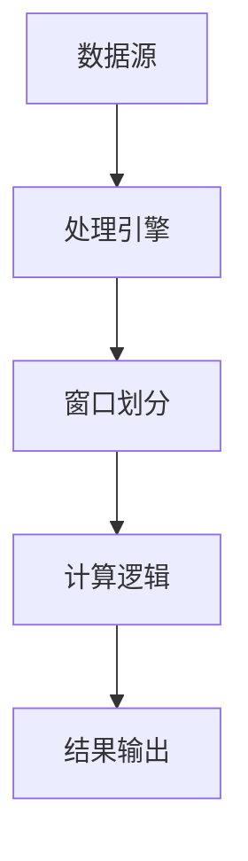
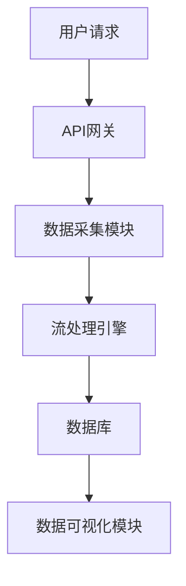
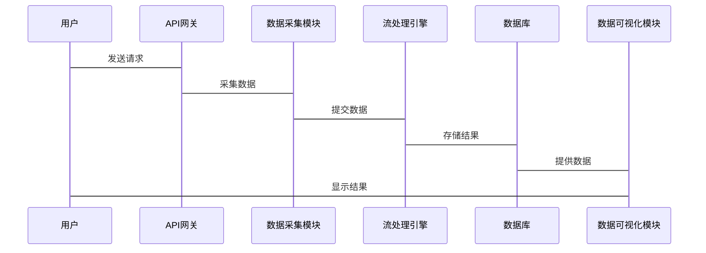

                 

<think>
好的，我将按照您的要求撰写一篇关于《金融数据的实时处理与分析》的技术博客文章。由于篇幅限制，我先提供目录大纲和摘要部分，后续内容可以根据您的反馈继续展开。

# 目录大纲

# 金融数据的实时处理与分析

> 关键词：金融数据，实时处理，流处理，分布式计算，数据可视化，金融监管

> 摘要：本文深入探讨金融数据实时处理与分析的关键技术与应用场景，从数据采集到系统架构设计，结合实际案例，分析实时处理的核心算法与实现方案，帮助读者全面理解如何在金融领域高效处理和利用实时数据。

---

# 第一部分：金融数据实时处理与分析的背景与核心概念

## 第1章：金融数据实时处理与分析概述

### 1.1 金融数据的特性与重要性

#### 1.1.1 金融数据的定义与分类

金融数据是指与金融活动相关的各种数据，包括股票价格、交易数据、市场指数、用户行为数据等。根据数据来源和用途，金融数据可以分为以下几类：

1. **市场数据**：如股票价格、汇率、指数等，反映市场的实时动态。
2. **交易数据**：记录交易发生的详细信息，如时间、金额、交易双方等。
3. **用户行为数据**：反映用户在金融平台上的操作行为，如登录、交易、查询等。
4. **新闻数据**：包括财经新闻、市场评论等，可能影响市场情绪和价格走势。

#### 1.1.2 金融数据的实时性要求

在金融领域，实时性是数据处理的核心要求之一。金融市场瞬息万变，任何延迟都可能导致决策失误，从而带来巨大的经济损失。因此，金融数据的实时处理需要满足以下几点要求：

1. **低延迟**：数据从生成到处理的时间间隔尽可能短，通常在毫秒级别。
2. **高可用性**：系统必须能够在故障发生时快速恢复，确保数据处理不中断。
3. **准确性**：处理后的数据必须准确无误，避免因数据错误导致的决策失误。

#### 1.1.3 金融数据处理的挑战与意义

金融数据处理面临以下主要挑战：

1. **数据量大**：金融市场每天产生的交易数据和市场数据量巨大，需要高效的存储和处理能力。
2. **数据复杂性**：数据来源多样，格式和结构差异大，增加了数据整合和处理的难度。
3. **实时性要求高**：需要在极短时间内完成数据处理和分析，这对系统架构和算法提出了更高要求。
4. **数据安全与隐私保护**：金融数据往往涉及用户隐私和企业机密，必须确保数据在处理过程中的安全性。

金融数据处理的意义在于通过实时分析数据，帮助金融机构做出更快、更准确的决策，从而提升竞争力和风险控制能力。

---

### 1.2 金融数据实时处理的背景与需求

#### 1.2.1 金融行业数字化转型的背景

随着信息技术的飞速发展，金融行业正在经历数字化转型。传统的金融业务模式逐渐被数字化、智能化的金融解决方案所取代。数字化转型的核心之一是实时处理和分析金融数据，以支持智能化决策。

#### 1.2.2 实时数据分析在金融领域的应用场景

实时数据分析在金融领域有广泛的应用场景，主要包括：

1. **高频交易**：通过实时数据分析，交易系统可以在极短时间内完成交易决策，抓住市场机会。
2. **风险管理**：实时监控市场风险和信用风险，及时发现并应对潜在风险。
3. **智能投资**：基于实时数据和机器学习算法，提供个性化的投资建议。
4. **客户行为分析**：实时分析客户行为数据，优化客户服务和产品推荐。

#### 1.2.3 金融监管与合规要求对实时处理的需求

金融监管机构对金融机构提出了严格的合规要求，包括数据的实时报送和风险指标的实时监控。实时数据处理能力是金融机构满足监管要求的重要能力。

---

### 1.3 本章小结

本章主要介绍了金融数据的特性与重要性，强调了实时处理的必要性，并分析了金融数据处理面临的挑战与意义。同时，结合金融行业的数字化转型背景，阐述了实时数据分析在金融领域的广泛应用场景和监管需求。

---

## 第2章：金融数据实时处理的核心概念

### 2.1 数据流与实时处理的基本概念

#### 2.1.1 数据流的定义与特征

数据流是指连续不断地从数据源生成的数据序列。在金融领域，数据流通常具有以下特征：

1. **实时性**：数据流中的数据是实时生成的，需要及时处理。
2. **异步性**：数据流中的数据项可能不按顺序到达，需要进行时间戳处理。
3. **不可预测性**：数据流的生成速度和内容可能随市场波动而变化。

#### 2.1.2 实时处理的定义与特点

实时处理是指对数据流中的数据进行连续的、及时的处理和分析。实时处理的特点包括：

1. **连续性**：处理过程是连续的，没有批量处理的间隔。
2. **及时性**：处理结果需要在尽可能短的时间内输出。
3. **动态性**：处理逻辑可以根据数据流的变化进行动态调整。

#### 2.1.3 数据流与实时处理的关系

数据流是实时处理的对象，实时处理是对数据流进行分析和计算的过程。实时处理的核心在于如何高效地处理数据流中的数据，以满足金融领域的实时性要求。

---

### 2.2 金融数据实时处理的关键技术

#### 2.2.1 流处理技术

流处理技术是实时处理的核心技术之一，主要包括以下内容：

1. **流处理框架**：如Apache Flink、Apache Kafka等，提供实时数据处理和流数据管理的功能。
2. **事件时间与处理时间**：在流处理中，事件时间是指数据生成的时间，处理时间是指数据被处理的时间。
3. **窗口机制**：将数据流划分为多个窗口，对每个窗口内的数据进行处理。

#### 2.2.2 分布式计算框架

分布式计算框架是实时处理的重要技术，主要用于处理大规模数据。常见的分布式计算框架包括：

1. **Apache Flink**：支持流处理和批处理，适合金融领域的实时数据分析。
2. **Apache Spark**：支持分布式计算，适合大规模数据处理和机器学习应用。
3. **Kafka**：用于实时数据流的收集和分发，是金融数据实时处理的重要工具。

#### 2.2.3 数据存储与查询优化

实时处理需要高效的存储和查询能力。金融数据通常采用分布式数据库和存储系统，如：

1. **时序数据库**：如InfluxDB，适合存储时间序列数据，如股票价格、交易数据等。
2. **分布式文件系统**：如HDFS，适合大规模数据的存储和管理。
3. **内存数据库**：如Redis，适合需要快速查询和处理的实时数据。

---

### 2.3 核心概念对比分析

#### 2.3.1 流处理与批量处理的对比

| 特性                | 流处理               | 批量处理            |
|---------------------|--------------------|--------------------|
| 数据生成方式        | 实时生成             | 批量生成            |
| 处理时间            | 实时处理，低延迟     | 批量处理，高延迟    |
| 处理粒度            | 单条数据            | 多条数据            |
| 适用场景            | 需要实时反馈的场景    | 需要批量处理的场景   |

#### 2.3.2 不同流处理技术的优缺点对比

| 技术                | 优点                  | 缺点                |
|---------------------|-----------------------|--------------------|
| Apache Flink       | 支持流处理和批处理，延迟低 | 配置复杂，学习曲线高 |
| Apache Kafka        | 高效数据分发         | 不支持计算，仅支持存储 |
| Apache Pulsar       | 分布式架构，性能稳定  | 新手上手较难         |

#### 2.3.3 数据一致性与实时性的权衡

在实时处理中，数据一致性与实时性是需要权衡的两个关键因素。高一致性意味着数据是准确的，但可能需要较高的延迟；高实时性意味着数据处理速度快，但可能有一定的数据不一致性。金融领域通常更倾向于高一致性，因为数据准确性对决策至关重要。

---

### 2.4 本章小结

本章主要介绍了金融数据实时处理的核心概念，包括数据流、实时处理、流处理技术以及分布式计算框架。通过对比分析流处理与批量处理的优缺点，帮助读者更好地理解实时处理的特点和适用场景。

---

## 第3章：金融数据实时处理的算法原理

### 3.1 流处理模型与算法

#### 3.1.1 流处理的基本模型

流处理的基本模型包括数据源、处理引擎和结果输出三个部分。数据源负责生成数据流，处理引擎对数据流进行处理，输出结果。

#### 3.1.2 时间戳与事件时间的处理

在流处理中，时间戳是数据生成的时间，事件时间是数据对应的时间。处理引擎需要根据时间戳对数据进行排序和处理。

#### 3.1.3 处理时间与结果的计算

处理时间是指数据被处理的时间，处理引擎需要在尽可能短的时间内完成数据处理并输出结果。

---

### 3.2 基于Flink的流处理算法

#### 3.2.1 Flink核心算子的实现原理

Flink的核心算子包括：

1. **Map算子**：对数据流中的每个数据项进行转换。
2. **Filter算子**：根据条件筛选数据项。
3. **Join算子**：将两个数据流中的数据进行关联。
4. **Reduce算子**：对数据流中的数据进行聚合操作。

#### 3.2.2 窗口机制与事件驱动的处理流程

窗口机制是流处理中的重要概念，用于将数据流划分为多个窗口，对每个窗口内的数据进行处理。事件驱动的处理流程是指根据事件的发生顺序进行数据处理。

#### 3.2.3 检查点与容错机制的数学模型

Flink通过检查点机制确保数据处理的容错性。检查点是指在特定时间点对数据流的状态进行快照，用于在发生故障时恢复处理。

---

### 3.3 算法流程图

以下是基于Flink的流处理算法流程图：



---

### 3.4 本章小结

本章主要介绍了金融数据实时处理的算法原理，包括流处理模型、Flink核心算子以及窗口机制的实现原理。通过流程图的形式，展示了基于Flink的流处理流程。

---

## 第4章：金融数据实时处理的系统架构设计

### 4.1 系统功能设计

#### 4.1.1 数据采集模块

数据采集模块负责从数据源采集数据，包括市场数据、交易数据和用户行为数据等。常用的数据采集工具包括Kafka和Pulsar。

#### 4.1.2 数据处理模块

数据处理模块负责对采集到的数据进行实时处理，包括数据清洗、转换和计算。常用的数据处理框架包括Flink和Spark。

#### 4.1.3 数据分析模块

数据分析模块负责对处理后的数据进行分析，生成实时报告和预警信息。常用的数据分析工具包括Python的Pandas库和机器学习框架。

#### 4.1.4 数据可视化模块

数据可视化模块负责将分析结果以图形化的方式展示给用户，常用的数据可视化工具包括D3.js和ECharts。

---

### 4.2 系统架构图

以下是金融数据实时处理系统的架构图：



---

### 4.3 接口设计与交互流程

#### 4.3.1 API接口定义

以下是系统API接口的定义：

1. **数据采集接口**：用于接收数据源发送的数据。
2. **数据处理接口**：用于对数据进行实时处理。
3. **数据分析接口**：用于对处理后的数据进行分析和计算。
4. **数据可视化接口**：用于将分析结果展示给用户。

#### 4.3.2 系统交互流程图

以下是系统交互流程图：



---

### 4.4 本章小结

本章主要介绍了金融数据实时处理系统的功能设计和架构设计，包括数据采集模块、数据处理模块、数据分析模块和数据可视化模块的设计。通过架构图和交互流程图，展示了系统的整体结构和工作流程。

---

## 第5章：金融数据实时处理的项目实战

### 5.1 环境搭建

#### 5.1.1 安装与配置

以下是项目实战的环境搭建步骤：

1. **安装JDK**：配置Java开发环境，确保系统能够运行Java程序。
2. **安装Flink**：下载并安装Apache Flink，配置环境变量。
3. **安装Kafka**：下载并安装Apache Kafka，配置生产者和消费者。
4. **安装Python环境**：安装Python和必要的库，如pandas、numpy等。

#### 5.1.2 快速上手指南

以下是快速上手的代码示例：

```python
from kafka import KafkaProducer
from kafka import KafkaConsumer

# 生产者代码
producer = KafkaProducer(bootstrap_servers='localhost:9092')
producer.send('financial_data', 'test message')
producer.close()

# 消费者代码
consumer = KafkaConsumer('financial_data', bootstrap_servers='localhost:9092')
for message in consumer:
    print(message.value)
    consumer.close()
```

---

### 5.2 核心实现代码

#### 5.2.1 Flink流处理代码

以下是基于Flink的流处理代码示例：

```java
public class FinancialDataProcessing {
    public static void main(String[] args) throws Exception {
        StreamExecutionEnvironment env = StreamExecutionEnvironment.getExecutionEnvironment();
        DataStream<String> input = env.addSource(new KafkaSource("financial_data"));

        DataStream<Double> processedData = input.map(new MapFunction<String, Double>() {
            public Double map(String value) throws Exception {
                return Double.parseDouble(value);
            }
        });

        processedData.reduce(new ReduceFunction<Double, Double>() {
            public Double reduce(Double a, Double b) {
                return a + b;
            }
        }).print();

        env.execute("Financial Data Processing");
    }
}
```

#### 5.2.2 数据分析代码

以下是基于Python的数据分析代码示例：

```python
import pandas as pd
import numpy as np

# 读取数据
data = pd.read_csv('financial_data.csv')

# 数据清洗
data.dropna(inplace=True)

# 数据分析
data['moving_average'] = data['price'].rolling(window=5).mean()

# 可视化
import matplotlib.pyplot as plt
plt.plot(data['date'], data['moving_average'])
plt.show()
```

---

### 5.3 代码应用解读与分析

#### 5.3.1 Flink流处理代码解读

以上Flink代码实现了从Kafka主题`financial_data`中读取数据，将数据转换为Double类型，并进行求和操作，最后输出结果。代码的主要部分包括：

1. **StreamExecutionEnvironment**：创建流处理环境。
2. **KafkaSource**：从Kafka主题读取数据。
3. **Map函数**：将字符串数据转换为Double类型。
4. **Reduce函数**：对数据进行求和操作。
5. **Print操作**：输出处理结果。

#### 5.3.2 Python数据分析代码解读

以上Python代码实现了从CSV文件中读取数据，进行数据清洗和移动平均计算，并生成可视化图表。代码的主要部分包括：

1. **数据读取**：使用pandas读取CSV文件。
2. **数据清洗**：删除缺失值。
3. **数据计算**：计算移动平均值。
4. **数据可视化**：使用matplotlib生成图表。

---

### 5.4 实际案例分析与详细讲解

#### 5.4.1 案例背景

假设我们有一个金融交易平台，需要实时监控交易数据，计算交易量的移动平均值，并在图表中展示。

#### 5.4.2 数据流设计

以下是数据流设计：

1. **数据源**：交易平台生成交易数据，包括交易时间、交易金额等。
2. **数据采集模块**：通过Kafka采集交易数据。
3. **数据处理模块**：使用Flink对数据流进行处理，计算交易量的移动平均值。
4. **数据分析模块**：生成实时报告。
5. **数据可视化模块**：将报告以图表形式展示给用户。

#### 5.4.3 系统实现

以下是系统实现的详细步骤：

1. **安装环境**：安装JDK、Flink、Kafka和Python环境。
2. **数据采集**：编写Kafka生产者代码，将交易数据发送到Kafka主题。
3. **数据处理**：编写Flink流处理代码，计算交易量的移动平均值。
4. **数据分析**：编写Python代码，读取处理后的数据并生成报告。
5. **数据可视化**：编写可视化代码，将报告以图表形式展示。

---

### 5.5 项目小结

本章通过一个实际案例，详细讲解了金融数据实时处理项目的环境搭建、核心实现和案例分析。通过代码示例和流程图，展示了如何使用Flink和Python实现金融数据的实时处理和分析。

---

## 第6章：总结与展望

### 6.1 最佳实践 Tips

1. **数据一致性与实时性的权衡**：在金融领域，数据一致性通常比实时性更重要，需要根据具体场景进行调整。
2. **系统架构设计**：建议采用分布式架构，确保系统的高可用性和可扩展性。
3. **数据安全与隐私保护**：在数据处理和存储过程中，必须严格遵守数据安全和隐私保护的相关法规。

### 6.2 总结

本文系统地介绍了金融数据实时处理与分析的核心技术与应用场景，从数据流的基本概念到系统架构设计，结合实际案例，详细讲解了实时处理的算法原理和实现方案。通过本文的学习，读者可以全面理解金融数据实时处理的技术要点和实际应用。

### 6.3 展望

随着人工智能和大数据技术的不断发展，金融数据实时处理与分析将更加智能化和自动化。未来，实时处理技术将在金融领域发挥更大的作用，帮助金融机构更好地应对市场变化和风险挑战。

---

以上是《金融数据的实时处理与分析》的技术博客文章的目录大纲和摘要部分。如需进一步扩展各章节内容，请随时告知！

