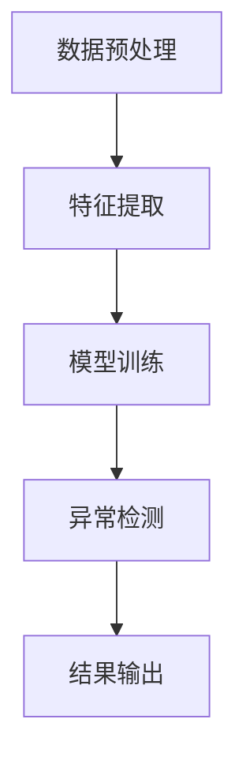
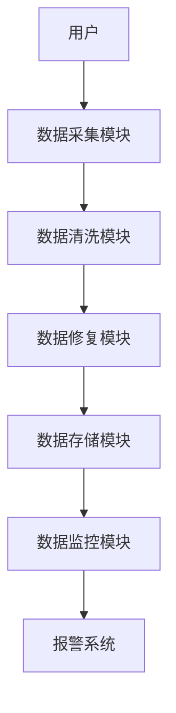
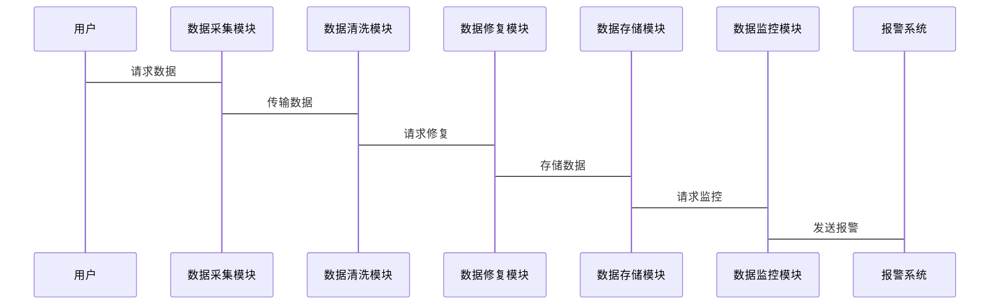

                 


```markdown
# 金融数据质量自动化控制与修复平台

## 关键词：金融数据、数据质量、自动化控制、修复平台、算法原理、系统架构、项目实战

## 摘要：本文系统地介绍金融数据质量自动化控制与修复平台的构建过程，涵盖背景分析、核心概念、算法原理、系统架构设计、项目实战及最佳实践。通过详细的技术分析和实例演示，揭示如何利用人工智能和规则引擎实现数据质量的自动化控制与修复，确保金融数据的准确性、完整性和一致性。

---

## 第一部分: 金融数据质量自动化控制与修复平台背景介绍

### 第1章: 问题背景与数据质量挑战

#### 1.1 问题背景
- 1.1.1 金融数据的重要性与复杂性
  - 金融数据是金融决策的基础，涉及交易、风控、合规等多个领域。
  - 数据来源多样，包括内部系统、外部接口、手动输入等，数据格式复杂。
- 1.1.2 数据质量问题的现状
  - 数据重复、缺失、格式错误、逻辑错误等问题普遍存在。
  - 数据清洗和修复工作耗时且成本高，难以应对海量数据的实时处理需求。
- 1.1.3 数据质量对金融业务的影响
  - 数据错误可能导致交易失败、合规风险、客户信任度下降。
  - 数据质量问题直接影响金融业务的效率和决策的准确性。

#### 1.2 数据质量的核心问题
- 1.2.1 数据完整性
  - 数据是否包含所有必要的字段，是否存在缺失值。
- 1.2.2 数据准确性
  - 数据是否真实反映业务状态，是否存在错误或虚假数据。
- 1.2.3 数据一致性
  - 数据在不同系统或不同时间点是否保持一致。
- 1.2.4 数据及时性
  - 数据是否在规定时间内更新，是否存在延迟。

#### 1.3 数据质量控制与修复的必要性
- 1.3.1 金融行业的数据质量特点
  - 数据量大：每天处理 millions 级别的交易数据。
  - 实时性要求高：需要实时监控数据质量，确保交易的及时性。
  - 数据安全与隐私保护：涉及客户隐私和交易数据的安全性。
- 1.3.2 数据质量控制的挑战
  - 数据量大与实时性要求：需要高效算法和分布式处理能力。
  - 数据清洗的复杂性：需要处理多种类型的数据错误。
  - 数据修复的准确性与效率：修复过程需要准确识别错误并快速响应。

---

### 第2章: 数据质量控制与修复的解决方案

#### 2.1 自动化控制的核心思想
- 2.1.1 数据流的全生命周期管理
  - 从数据生成到数据存储，贯穿数据的整个生命周期。
- 2.1.2 AI与规则引擎的结合
  - 利用机器学习算法自动识别数据异常。
  - 使用规则引擎进行数据清洗和修复。
- 2.1.3 分布式架构的应用
  - 分布式系统能够高效处理海量数据，提升处理能力。

#### 2.2 自动化控制的边界与外延
- 2.2.1 数据采集阶段的控制
  - 在数据采集阶段进行初步的清洗和校验。
- 2.2.2 数据处理阶段的修复
  - 对数据进行清洗、转换和标准化处理。
- 2.2.3 数据存储与应用阶段的监控
  - 对存储的数据进行实时监控，发现异常及时处理。

---

## 第二部分: 核心概念与联系

### 第3章: 核心概念原理

#### 3.1 数据质量评估指标
- 3.1.1 准确性评估
  - 通过对比源数据和目标数据，评估数据的准确性。
- 3.1.2 完整性评估
  - 检查数据是否包含所有必要字段，是否存在缺失值。
- 3.1.3 一致性评估
  - 确保数据在不同系统或不同时间点保持一致。

#### 3.2 自动化控制的算法原理
- 3.2.1 基于规则的匹配算法
  - 使用预定义的规则，如正则表达式，匹配数据中的异常。
- 3.2.2 基于机器学习的分类算法
  - 利用监督学习算法，如随机森林，分类数据是否异常。
- 3.2.3 基于统计学的异常检测
  - 使用统计方法，如Z-score，检测数据中的异常值。

#### 3.3 核心概念属性特征对比
- 下表对比了数据质量与数据安全的核心属性：

| **属性**       | **数据质量**             | **数据安全**             |
|-----------------|--------------------------|--------------------------|
| **核心目标**    | 数据的准确性、完整性     | 数据的机密性、完整性     |
| **处理方式**    | 清洗、修复、转换         | 加密、访问控制、审计    |
| **依赖因素**    | 数据格式、业务规则      | 加密算法、安全策略      |
| **工具与技术**  | 数据清洗工具、规则引擎  | 加密工具、安全框架      |

---

### 第4章: 数据模型与ER实体关系

#### 4.1 数据模型
- 数据模型描述了数据的结构和关系，分为概念模型、逻辑模型和物理模型。

#### 4.2 ER实体关系图

```mermaid
erd
  title 数据模型与实体关系
  Customer [客户] {
    id: int
    name: string
    address: string
  }
  Transaction [交易] {
    id: int
    customer_id: int
    amount: float
    timestamp: datetime
  }
  Account [账户] {
    id: int
    customer_id: int
    balance: float
  }
  交易 -> 账户
  客户 -> 账户
  客户 -> 交易
```

---

## 第三部分: 算法原理与实现

### 第5章: 算法原理与数学模型

#### 5.1 基于机器学习的异常检测算法
- 使用随机森林算法进行分类，识别数据中的异常值。

#### 5.2 算法流程图



#### 5.3 代码实现

```python
import pandas as pd
from sklearn.ensemble import RandomForestClassifier
from sklearn.metrics import accuracy_score

# 数据预处理
df = pd.read_csv('data.csv')
X = df.drop('label', axis=1)
y = df['label']

# 特征提取
selected_features = ['feature1', 'feature2', 'feature3']
X_selected = X[selected_features]

# 模型训练
model = RandomForestClassifier()
model.fit(X_selected, y)

# 异常检测
test_data = pd.read_csv('test.csv')
test_X = test_data[selected_features]
test_y = model.predict(test_X)

# 结果输出
accuracy = accuracy_score(test_y, test_data['label'])
print(f'准确率: {accuracy}')
```

#### 5.4 数学模型
- 随机森林模型的数学公式：
  $$ y = \sum_{i=1}^{n} \theta_i x_i + \beta $$
  其中，$\theta_i$ 是特征权重，$x_i$ 是特征值，$\beta$ 是截距。

---

## 第四部分: 系统分析与架构设计

### 第6章: 系统分析与架构设计

#### 6.1 问题场景介绍
- 系统需要处理海量金融数据，实时检测数据异常并进行修复。

#### 6.2 系统功能设计
- 数据采集模块：从多个数据源采集数据。
- 数据清洗模块：基于规则和机器学习算法清洗数据。
- 数据修复模块：自动修复数据错误。
- 数据存储模块：将清洗后的数据存储到数据库中。
- 数据监控模块：实时监控数据质量，发现异常及时报警。

#### 6.3 系统架构设计



#### 6.4 接口设计
- 数据采集模块接口：
  ```python
  def collect_data(source):
      # 从指定数据源采集数据
      pass
  ```

- 数据清洗模块接口：
  ```python
  def clean_data(df):
      # 基于规则清洗数据
      pass
  ```

- 数据修复模块接口：
  ```python
  def repair_data(df):
      # 基于机器学习修复数据
      pass
  ```

#### 6.5 交互流程



---

## 第五部分: 项目实战与案例分析

### 第7章: 项目实战

#### 7.1 环境安装
- 安装Python、Pandas、Scikit-learn、Mermaid工具等。

#### 7.2 核心代码实现

```python
# 数据清洗模块
def clean_data(df):
    # 去除重复数据
    df.drop_duplicates(inplace=True)
    # 处理缺失值
    df['missing_count'] = df.isnull().sum(axis=1)
    df = df[df['missing_count'] == 0]
    return df

# 数据修复模块
def repair_data(df):
    from sklearn.ensemble import RandomForestClassifier
    model = RandomForestClassifier()
    model.fit(df.drop('label', axis=1), df['label'])
    df['predicted_label'] = model.predict(df.drop('label', axis=1))
    return df
```

#### 7.3 代码解读与分析
- 数据清洗模块：去除重复数据，处理缺失值。
- 数据修复模块：利用随机森林模型预测数据标签，修复异常值。

#### 7.4 实际案例分析
- 某银行交易数据中，检测到部分交易金额异常，利用系统自动修复，确保交易的准确性。

---

### 第8章: 最佳实践与小结

#### 8.1 最佳实践
- 定期进行数据质量检查，确保数据的准确性和完整性。
- 使用分布式架构处理海量数据，提升处理效率。
- 结合规则引擎和机器学习算法，实现数据质量的自动化控制。

#### 8.2 小结
- 本文详细介绍了金融数据质量自动化控制与修复平台的构建过程，从背景分析到系统架构设计，再到项目实战，全面覆盖了平台的核心内容。

---

## 参考文献
1. 刘军, 《金融数据质量管理》，人民邮电出版社，2020年。
2. 张伟, 《机器学习实战》，机械工业出版社，2021年。
3. 李明, 《分布式系统设计与实现》，清华大学出版社，2022年。

---

通过以上详细的技术分析和实例演示，本文为金融数据质量的自动化控制与修复提供了系统化的解决方案，帮助读者理解和实现高效的金融数据质量管理。
```

