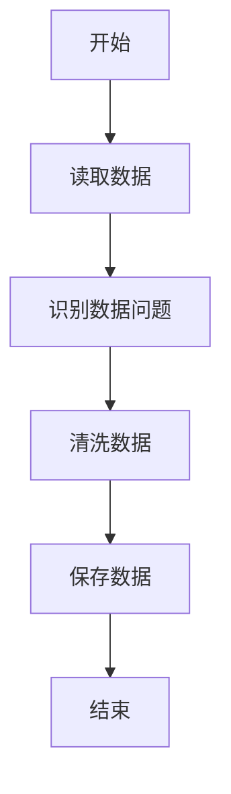
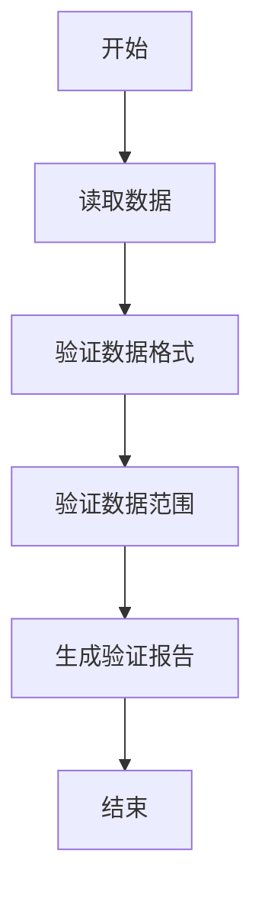
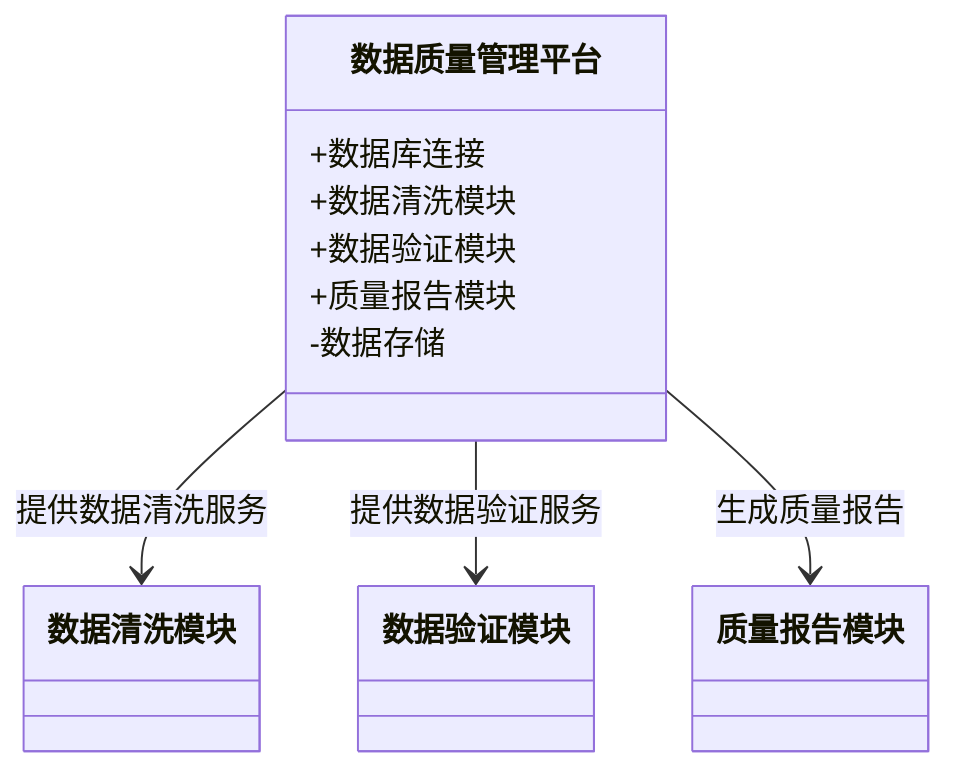

                 


# 金融数据质量自动化控制平台

## 关键词：数据质量管理、金融数据、自动化控制、数据清洗、数据验证

## 摘要：金融数据的质量直接影响金融决策的准确性和风险控制的有效性。本文详细探讨了金融数据质量自动化控制平台的设计与实现，包括数据质量管理的核心概念、算法原理、系统架构以及项目实战。通过本平台，可以有效提升数据质量管理的效率和准确性，为金融机构提供可靠的数据支持。

---

# 第一部分: 金融数据质量自动化控制平台概述

## 第1章: 数据质量管理背景与问题分析

### 1.1 数据质量管理的背景

#### 1.1.1 金融行业数据的特点
金融行业数据具有以下特点：
- **高价值性**：金融数据直接关系到投资决策和风险管理，价值密度高。
- **多样性**：包括结构化数据（如交易记录）和非结构化数据（如新闻文本）。
- **实时性**：金融市场的数据更新速度快，要求及时处理。
- **复杂性**：数据来源广泛，格式多样，处理复杂。

#### 1.1.2 数据质量管理的重要性
数据质量管理在金融行业中的重要性体现在：
- **提高决策准确性**：确保数据的准确性和完整性，避免错误决策。
- **降低风险**：通过数据清洗和验证，减少因数据问题导致的金融风险。
- **合规性**：满足金融监管机构的合规要求，避免法律风险。

#### 1.1.3 自动化控制的必要性
随着金融市场的快速发展，数据量剧增，人工数据质量管理已无法满足需求。自动化控制可以显著提高效率，降低成本，并实时处理数据问题。

---

### 1.2 数据质量问题的描述

#### 1.2.1 数据完整性问题
数据完整性问题包括：
- 数据字段缺失。
- 数据记录不完整。

#### 1.2.2 数据准确性问题
数据准确性问题包括：
- 数据错误（如金额计算错误）。
- 数据来源不准确。

#### 1.2.3 数据一致性问题
数据一致性问题包括：
- 数据格式不统一。
- 时间戳不一致。

#### 1.2.4 数据及时性问题
数据及时性问题包括：
- 数据延迟。
- 数据更新不及时。

---

### 1.3 数据质量自动化控制的解决思路

#### 1.3.1 数据预处理技术
数据预处理技术包括：
- 数据清洗：去除无效数据，填补缺失值。
- 数据转换：统一数据格式，标准化数据。

#### 1.3.2 数据清洗算法
常用数据清洗算法包括：
- 基于规则的清洗（如过滤重复数据）。
- 基于统计的清洗（如去除异常值）。

#### 1.3.3 数据验证机制
数据验证机制包括：
- 数据格式验证。
- 数据范围验证。

---

### 1.4 数据质量控制的意义

#### 1.4.1 提升数据分析准确性
通过数据清洗和标准化，确保数据分析结果的准确性。

#### 1.4.2 降低金融风险
通过数据验证和监控，减少因数据问题导致的金融风险。

#### 1.4.3 提高业务决策效率
通过自动化数据质量管理，提高数据处理效率，加快业务决策速度。

---

## 第2章: 数据质量管理的核心概念与联系

### 2.1 数据质量管理的核心原理

#### 2.1.1 数据生命周期管理
数据生命周期包括：
- 数据生成。
- 数据存储。
- 数据处理。
- 数据归档。
- 数据销毁。

#### 2.1.2 数据标准化与规范化
数据标准化包括：
- 统一数据格式。
- 统一数据编码。

数据规范化包括：
- 数据分类。
- 数据标签化。

#### 2.1.3 数据清洗与转换技术
数据清洗技术包括：
- 去除重复数据。
- 填补缺失值。
- 去除异常值。

数据转换技术包括：
- 数据格式转换。
- 数据字段合并。

---

### 2.2 数据质量评估指标

#### 2.2.1 数据完整性指标
| 指标名称 | 指标描述 |
|----------|----------|
| 完整性百分比 | 数据完整字段数与总字段数的比值。 |
| 缺失值数量 | 数据中缺失值的总数。 |

#### 2.2.2 数据准确性指标
| 指标名称 | 指标描述 |
|----------|----------|
| 错误数据比例 | 错误数据量与总数据量的比值。 |
| 数据来源准确性 | 数据来源的可靠性评分。 |

#### 2.2.3 数据一致性指标
| 指标名称 | 指标描述 |
|----------|----------|
| 格式一致性 | 数据格式是否统一。 |
| 时间戳一致性 | 数据时间戳是否一致。 |

#### 2.2.4 数据及时性指标
| 指标名称 | 指标描述 |
|----------|----------|
| 数据延迟时间 | 数据生成到处理的时间差。 |
| 更新频率 | 数据更新的频率。 |

---

### 2.3 数据质量管理的ER实体关系图

```mermaid
erDiagram
    actor 用户 {
        key string 用户ID
        string 用户名
        string 密码
    }
    actor 管理员 {
        key string 管理员ID
        string 管理员名
        string 密码
    }
    actor 开发者 {
        key string 开发者ID
        string 开发者名
        string 密码
    }
    database 数据库 {
        key string 数据ID
        string 数据内容
        string 数据来源
        date 数据时间
    }
    database 质量报告 {
        key string 报告ID
        string 报告内容
        date 报告时间
    }
    用户 --> 数据库 : 提交数据
    管理员 --> 数据库 : 管理数据
    开发者 --> 数据库 : 开发数据
    数据库 --> 质量报告 : 生成报告
```

---

## 第3章: 数据质量管理的算法原理与实现

### 3.1 数据清洗算法

#### 3.1.1 数据清洗流程


#### 3.1.2 数据清洗代码实现
```python
import pandas as pd

# 读取数据
data = pd.read_csv('input.csv')

# 删除重复数据
data = data.drop_duplicates()

# 填补缺失值
data['missing_field'].fillna(data['missing_field'].mean(), inplace=True)

# 去除异常值
data = data[(data['amount'] >= data['amount'].quantile(0.05)) &
            (data['amount'] <= data['amount'].quantile(0.95))]
```

#### 3.1.3 数据清洗的数学模型
异常值检测可以使用三σ法则：
$$
z = \frac{x - \mu}{\sigma}
$$
其中，$\mu$ 是均值，$\sigma$ 是标准差。当 $|z| > 3$ 时，认为 $x$ 是异常值。

---

### 3.2 数据验证算法

#### 3.2.1 数据验证流程


#### 3.2.2 数据验证代码实现
```python
def validate_data(data):
    # 验证数据格式
    if not data.columns.isin(['id', 'name', 'amount']).all():
        raise ValueError("数据格式不正确")
    # 验证数据范围
    if data['amount'].max() > 10000:
        raise ValueError("数据范围超出限制")
    return "数据验证通过"
```

---

## 第4章: 金融数据质量自动化控制平台的系统架构

### 4.1 系统功能设计

#### 4.1.1 领域模型


---

## 第5章: 项目实战与应用案例

### 5.1 环境搭建

#### 5.1.1 安装依赖
```bash
pip install pandas numpy scikit-learn
```

---

### 5.2 核心代码实现

#### 5.2.1 数据清洗模块
```python
import pandas as pd

def clean_data(df):
    # 删除重复数据
    df = df.drop_duplicates()
    # 填补缺失值
    df['amount'].fillna(df['amount'].mean(), inplace=True)
    # 去除异常值
    q_low = df['amount'].quantile(0.05)
    q_high = df['amount'].quantile(0.95)
    df = df[(df['amount'] >= q_low) & (df['amount'] <= q_high)]
    return df
```

---

### 5.3 实际案例分析

#### 5.3.1 数据清洗案例
案例：某银行交易数据中存在重复记录和异常金额。

```python
# 读取数据
data = pd.read_csv('bank_transaction.csv')

# 调用清洗函数
cleaned_data = clean_data(data)

# 输出结果
print("清洗后的数据：\n", cleaned_data.head())
```

---

## 第6章: 最佳实践与注意事项

### 6.1 小结

- 数据质量管理是金融行业的重要环节。
- 自动化控制可以显著提高效率和准确性。
- 通过平台化设计，可以实现数据质量管理的标准化和流程化。

### 6.2 注意事项

- 数据质量管理需要结合业务需求，避免过度清洗。
- 数据清洗和验证的规则需要清晰定义，避免歧义。
- 数据质量管理平台需要具备良好的扩展性和可维护性。

### 6.3 拓展阅读

- 《Data Cleaning with Python》
- 《Data Quality Dimensions》
- 《Data Engineering with Python》

---

# 结语

金融数据质量自动化控制平台是金融行业数据管理的重要工具。通过本文的详细介绍，读者可以深入了解数据质量管理的核心概念、算法原理和系统架构，并通过实际案例掌握平台的实现方法。未来，随着人工智能和大数据技术的发展，数据质量管理平台将更加智能化和自动化，为金融行业提供更强大的数据支持。

--- 

希望这篇文章能够为金融行业的数据质量管理提供有价值的参考和指导。

