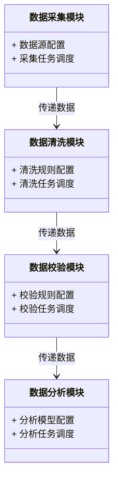
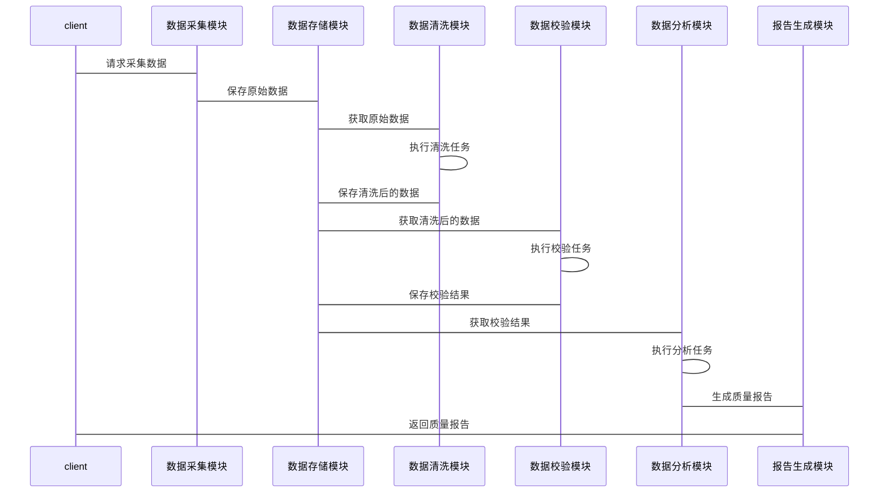

                 


# 《金融数据质量自动化监控系统》

## 关键词：金融数据，数据质量，自动化监控，系统架构，数据清洗，数据校验

## 摘要：  
金融数据的质量直接影响金融决策的准确性和可靠性，而数据质量管理是金融行业的重要环节。本篇文章详细探讨了金融数据质量监控的核心概念、算法原理、系统架构设计以及项目实战。通过深入分析数据清洗、校验和分析的原理，结合实际案例，展示如何通过自动化监控系统提高金融数据质量。文章还详细介绍了系统架构设计和核心代码实现，为读者提供全面的解决方案。

---

# 第1章: 金融数据质量监控的背景与挑战

## 1.1 数据质量管理的核心概念
### 1.1.1 金融数据质量的定义与特征
- 金融数据是指用于金融交易、分析和决策的结构化和非结构化数据。
- 数据质量特征：完整性、准确性、一致性、及时性、规范性。

### 1.1.2 数据质量管理的重要性
- 数据质量直接影响金融决策的准确性和合规性。
- 数据质量管理是金融系统稳定运行的基础。

### 1.1.3 金融数据质量监控的边界与外延
- 数据范围：包括交易数据、客户数据、市场数据等。
- 监控边界：从数据生成到数据使用的全生命周期。

## 1.2 金融数据质量监控的背景与需求
### 1.2.1 金融行业数据的特点与痛点
- 数据量大、类型多样、更新频繁。
- 数据来源复杂，存在脏数据和错误数据。

### 1.2.2 数据质量管理在金融领域的应用现状
- 手动监控的低效性。
- 自动化监控的需求日益迫切。

### 1.2.3 自动化监控的必要性与优势
- 提高效率，减少人工成本。
- 实时监控，快速响应数据问题。

## 1.3 本章小结
本章介绍了金融数据质量监控的背景、核心概念和必要性，为后续内容奠定基础。

---

# 第2章: 数据质量管理的核心概念与联系

## 2.1 数据质量管理的核心原理
### 2.1.1 数据清洗的原理与步骤
- 数据清洗：识别和处理脏数据，确保数据的完整性和准确性。
- 常见步骤：删除重复数据、填充缺失值、删除异常值。

### 2.1.2 数据校验的机制与方法
- 数据校验：通过规则或算法验证数据的正确性。
- 常见方法：正则表达式校验、业务规则校验。

### 2.1.3 数据分析的基本流程
- 数据分析：通过对数据的统计和挖掘，发现数据中的问题和规律。

## 2.2 数据质量管理的核心要素
### 2.2.1 数据完整性
- 定义：数据是否包含所有必要的信息。
- 重要性：确保数据的完整性和可用性。

### 2.2.2 数据准确性
- 定义：数据是否真实反映实际情况。
- 重要性：确保数据的可靠性和准确性。

### 2.2.3 数据一致性
- 定义：数据是否在不同系统中保持一致。
- 重要性：避免数据冲突和错误。

## 2.3 数据质量管理的ER实体关系图
```mermaid
er
    entity 金融数据 {
        key 数据ID
        attribute 数据类型
        attribute 数据值
        attribute 数据来源
    }
    entity 数据质量规则 {
        key 规则ID
        attribute 规则名称
        attribute 规则描述
        attribute 规则类型
    }
    entity 数据质量检查结果 {
        key 检查结果ID
        attribute 数据ID
        attribute 规则ID
        attribute 检查结果
        attribute 备注
    }
    relationship 数据质量管理 {
        金融数据 --> 数据质量规则: 应用
        金融数据 --> 数据质量检查结果: 生成
    }
```

## 2.4 本章小结
本章详细讲解了数据质量管理的核心概念和要素，以及如何通过ER图描述数据实体之间的关系。

---

# 第3章: 数据质量管理的算法原理与数学模型

## 3.1 数据清洗算法
### 3.1.1 基于规则的清洗算法
- 通过预定义的规则识别和处理脏数据。
- 例如：删除重复数据、填充缺失值。

### 3.1.2 基于统计的清洗算法
- 使用统计方法识别异常值。
- 例如：Z-score方法、IQR方法。

### 3.1.3 基于机器学习的清洗算法
- 使用聚类、分类算法识别异常数据。
- 例如：K-means聚类算法。

## 3.2 数据校验算法
### 3.2.1 正则表达式校验
- 通过正则表达式匹配数据格式。
- 例如：验证电话号码格式。

### 3.2.2 基于规则的校验
- 根据业务规则验证数据。
- 例如：验证交易金额是否合理。

### 3.2.3 基于模式匹配的校验
- 通过模式匹配识别数据是否符合预期。
- 例如：验证身份证号码长度。

## 3.3 数据分析算法
### 3.3.1 统计分析
- 使用均值、中位数等统计指标分析数据。
- 例如：分析客户年龄分布。

### 3.3.2 数据挖掘
- 使用关联规则挖掘发现数据中的模式。
- 例如：发现客户的购买行为模式。

### 3.3.3 机器学习模型
- 使用回归、分类模型预测数据质量。
- 例如：预测客户违约概率。

## 3.4 数据质量管理的数学模型
### 3.4.1 数据完整性模型
$$ 完整性 = \sum_{i=1}^{n} (1 - \frac{缺失值}{总记录数}) $$
### 3.4.2 数据准确性模型
$$ 准确性 = 1 - \frac{错误记录数}{总记录数} $$
### 3.4.3 数据一致性模型
$$ 一致性 = \sum_{i=1}^{m} (1 - \frac{冲突记录数}{总记录数}) $$

## 3.5 本章小结
本章详细讲解了数据质量管理的算法原理和数学模型，为后续系统设计提供理论基础。

---

# 第4章: 金融数据质量监控系统架构设计

## 4.1 系统功能设计
### 4.1.1 系统功能模块
- 数据采集模块：采集金融数据。
- 数据清洗模块：处理脏数据。
- 数据校验模块：验证数据准确性。
- 数据分析模块：分析数据质量。

### 4.1.2 领域模型类图


## 4.2 系统架构设计
### 4.2.1 系统架构图


## 4.3 系统接口设计
### 4.3.1 数据采集接口
- 接口名称：`fetch_financial_data`
- 参数：`source`, `start_time`, `end_time`
- 返回：`data`

### 4.3.2 数据清洗接口
- 接口名称：`clean_data`
- 参数：`data`, `clean_rules`
- 返回：`cleaned_data`

## 4.4 系统交互流程


## 4.5 本章小结
本章详细讲解了金融数据质量监控系统的架构设计，包括功能模块、架构图和交互流程。

---

# 第5章: 项目实战——金融数据质量监控系统实现

## 5.1 环境安装与配置
### 5.1.1 系统环境
- 操作系统：Linux
- 开发工具：Python 3.8+
- 数据库：MySQL 8.0+

### 5.1.2 依赖安装
```bash
pip install pymysql
pip install numpy
pip install pandas
pip install matplotlib
```

## 5.2 核心代码实现
### 5.2.1 数据采集模块
```python
import pymysql

def fetch_financial_data(source, start_time, end_time):
    # 数据库连接
    conn = pymysql.connect(host='localhost', user='root', password='password', db='financial_db')
    cursor = conn.cursor()
    # SQL 查询
    query = f"SELECT * FROM {source} WHERE date BETWEEN '{start_time}' AND '{end_time}'"
    cursor.execute(query)
    data = cursor.fetchall()
    conn.close()
    return data
```

### 5.2.2 数据清洗模块
```python
import numpy as np
import pandas as pd

def clean_data(data, clean_rules):
    df = pd.DataFrame(data)
    # 删除重复数据
    df = df.drop_duplicates()
    # 填充缺失值
    df = df.fillna(method='ffill')
    # 删除异常值
    z_scores = (df - df.mean()).abs() / df.std()
    df = df[z_scores < 3]
    return df.to_list()
```

### 5.2.3 数据校验模块
```python
import re

def validate_data(data, validation_rules):
    for rule in validation_rules:
        if rule['type'] == 'regex':
            pattern = re.compile(rule['pattern'])
            valid = data.apply(lambda x: bool(pattern.match(str(x))))
            if not valid.all():
                return False
        elif rule['type'] == 'business':
            valid = data.apply(lambda x: eval(rule['condition']))
            if not valid.all():
                return False
    return True
```

### 5.2.4 数据分析模块
```python
import matplotlib.pyplot as plt

def analyze_data(data):
    df = pd.DataFrame(data)
    # 绘制分布图
    df.hist()
    plt.show()
    # 绘制箱线图
    df.boxplot()
    plt.show()
    return df.describe()
```

## 5.3 案例分析与实现
### 5.3.1 数据来源
- 数据集：金融交易数据，包含交易金额、时间、客户ID等字段。

### 5.3.2 数据清洗与校验
- 清洗数据：删除重复记录，填充缺失值，删除异常值。
- 校验数据：验证交易金额是否合理，时间格式是否正确。

### 5.3.3 数据分析
- 分析交易金额的分布，发现异常交易。
- 分析客户ID的一致性，确保数据一致性。

## 5.4 本章小结
本章通过实际案例展示了如何实现金融数据质量监控系统，包括环境配置、核心代码实现和案例分析。

---

# 第6章: 系统优化与最佳实践

## 6.1 系统优化建议
### 6.1.1 数据清洗优化
- 使用分布式计算框架（如Spark）处理大数据量。
- 优化清洗规则，减少不必要的清洗操作。

### 6.1.2 数据校验优化
- 使用并行校验提高效率。
- 优化正则表达式，减少校验时间。

## 6.2 最佳实践 tips
### 6.2.1 数据质量管理的关键点
- 数据清洗前先了解数据来源和业务规则。
- 数据校验时结合业务规则和统计规则。

### 6.2.2 系统设计注意事项
- 系统架构要灵活，方便扩展。
- 确保数据安全，防止数据泄露。

## 6.3 本章小结
本章总结了系统优化的建议和最佳实践，帮助读者更好地设计和实施金融数据质量监控系统。

---

# 第7章: 项目小结与展望

## 7.1 项目总结
- 本项目通过自动化监控系统提高了金融数据质量。
- 系统架构设计合理，功能模块清晰。

## 7.2 未来展望
- 引入更多机器学习算法，提高数据质量预测能力。
- 实现数据质量管理的智能化和自动化。

## 7.3 本章小结
本章总结了项目成果，并展望了未来的发展方向。

---

# 附录: 项目源代码

## 附录A: 数据采集模块代码
```python
# 附录内容省略
```

## 附录B: 数据清洗模块代码
```python
# 附录内容省略
```

## 附录C: 数据校验模块代码
```python
# 附录内容省略
```

## 附录D: 数据分析模块代码
```python
# 附录内容省略
```

---

# 参考文献
1. 《数据质量管理：方法与实践》
2. 《金融数据处理与分析》
3. 《自动化监控系统设计与实现》

---

# 感谢
感谢读者的支持，希望本书能为您提供有价值的内容和启发。

