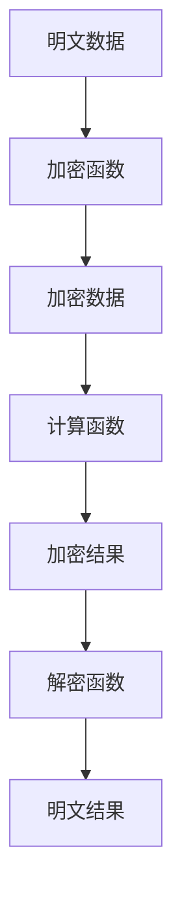
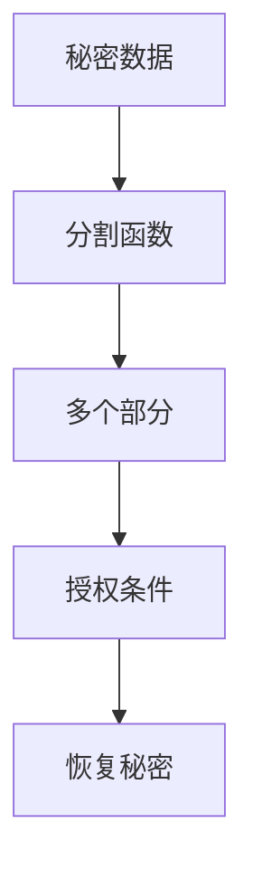
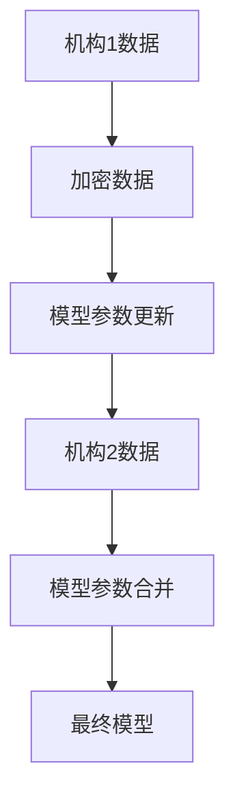
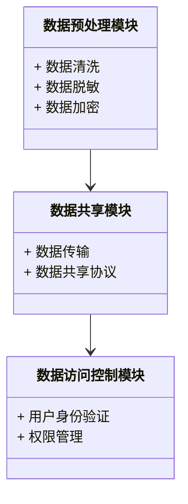

                 


# 金融数据隐私保护与共享平台设计

## 关键词：金融数据隐私保护、数据共享平台、同态加密、联邦学习、数据匿名化、访问控制、区块链技术

## 摘要：金融数据隐私保护与共享平台设计是一门涉及数据隐私保护技术与数据共享平台架构设计的复杂课题。本文从金融数据隐私保护的必要性出发，详细探讨了数据隐私保护的核心技术，包括数据加密、数据匿名化和访问控制等技术。结合实际应用场景，分析了金融数据共享平台的设计目标和关键问题，如数据隐私保护与共享的平衡，数据安全与高效共享的实现，以及数据共享平台的系统架构设计与实现。本文通过对比分析，提出了基于同态加密、秘密分享和联邦学习等技术的金融数据共享平台的设计方案，并通过实际案例分析，总结了金融数据隐私保护与共享平台设计的最佳实践和未来研究方向。

---

## 目录

---

# 金融数据隐私保护与共享平台设计

## 第1章: 问题背景

### 1.1 问题背景

#### 1.1.1 金融数据的重要性与敏感性
- 金融数据是金融机构的核心资产，涉及客户隐私、交易记录和财务信息等敏感内容。
- 数据泄露可能导致严重的经济损失、法律责任和客户信任度下降。

#### 1.1.2 数据隐私保护的必要性
- 各国法律法规（如GDPR、CCPA）对数据隐私保护提出严格要求。
- 金融机构需要确保客户数据在存储和传输过程中的安全性。

#### 1.1.3 数据共享的挑战与机遇
- 数据共享是金融机构提升服务质量和效率的重要手段，但如何在保护隐私的前提下实现数据共享是关键挑战。

### 1.2 问题描述

#### 1.2.1 数据隐私泄露的现状
- 数据泄露事件频发，金融机构成为攻击者的主要目标。
- 数据泄露可能导致客户身份盗窃、金融欺诈等严重问题。

#### 1.2.2 数据共享的痛点
- 数据孤岛问题：不同金融机构之间的数据难以共享，限制了服务创新。
- 数据共享的安全性：如何在共享数据的同时保护隐私是主要难点。

#### 1.2.3 平台设计的目标与意义
- 目标：设计一个能够实现数据隐私保护与高效共享的平台。
- 意义：通过平台设计，金融机构可以实现数据价值的最大化，同时降低隐私泄露风险。

### 1.3 问题解决

#### 1.3.1 数据隐私保护的技术手段
- 数据加密技术：如同态加密、区块链技术等。
- 数据匿名化技术：如数据脱敏、数据混淆等。
- 数据访问控制技术：如基于角色的访问控制（RBAC）。

#### 1.3.2 数据共享的实现方式
- 分布式数据共享：通过区块链技术实现去中心化的数据共享。
- 联邦学习：在保护数据隐私的前提下，实现跨机构的数据协作。

#### 1.3.3 平台设计的核心理念
- 隐私保护：确保数据在共享过程中的隐私性。
- 安全性：防止数据泄露和未授权访问。
- 可扩展性：支持大规模数据共享和处理。

### 1.4 边界与外延

#### 1.4.1 平台的边界定义
- 平台仅处理金融机构之间的数据共享，不涉及其他类型的数据。
- 平台的用户仅限于金融机构及其授权的第三方服务提供商。

#### 1.4.2 相关领域的外延
- 数据隐私保护技术：如加密算法、数据匿名化技术等。
- 数据共享协议：如多方安全计算、联邦学习协议等。

#### 1.4.3 平台与其他系统的接口关系
- 与金融机构的内部系统对接：如客户关系管理系统、交易系统等。
- 与其他金融机构的数据共享平台对接：如通过区块链实现数据互操作性。

### 1.5 概念结构与核心要素组成

#### 1.5.1 核心概念的层次结构
- 数据隐私保护：数据加密、数据匿名化、访问控制。
- 数据共享平台：数据存储、数据处理、数据传输、数据访问控制。

#### 1.5.2 核心要素的详细描述
- 数据隐私保护：确保数据在存储和传输过程中的安全性。
- 数据共享：在保护隐私的前提下，实现数据的高效共享。
- 平台架构：支持数据隐私保护和共享的系统架构设计。

#### 1.5.3 平台的组成部分与功能模块
- 数据预处理模块：对数据进行清洗、脱敏和加密。
- 数据共享模块：实现数据的加密传输和共享。
- 数据访问控制模块：基于用户角色和权限控制数据访问。

---

## 第2章: 核心概念与联系

### 2.1 数据隐私保护技术

#### 2.1.1 数据加密技术
- 对称加密：如AES算法，用于快速加密和解密数据。
- 非对称加密：如RSA算法，用于数字签名和身份验证。
- 同态加密：允许在加密数据上进行计算，结果仍为加密形式。

#### 2.1.2 数据匿名化技术
- 数据脱敏：对数据进行匿名化处理，去除或替换敏感信息。
- 数据混淆：通过添加噪声或随机化处理，降低数据可识别性。

#### 2.1.3 数据访问控制技术
- 基于角色的访问控制（RBAC）：根据用户角色分配权限。
- 基于属性的访问控制（ABAC）：根据用户属性和上下文决定访问权限。

### 2.2 数据共享平台架构

#### 2.2.1 平台的功能模块划分
- 数据预处理模块：清洗、脱敏和加密数据。
- 数据共享模块：实现数据的加密传输和共享。
- 数据访问控制模块：基于用户角色和权限控制数据访问。

#### 2.2.2 数据流的处理流程
- 数据生成：数据的收集和生成。
- 数据处理：数据的清洗、脱敏和加密。
- 数据共享：数据的传输和共享。
- 数据使用：数据的分析和处理。

#### 2.2.3 平台的用户角色与权限
- 数据提供方：提供数据的金融机构。
- 数据使用方：需要使用数据的第三方机构。
- 平台管理员：负责平台的运维和管理。

### 2.3 核心概念对比

#### 2.3.1 数据加密技术对比

| 技术 | 描述 | 优点 | 缺点 |
|------|------|------|------|
| 对称加密 | 加密和解密使用相同密钥 | 加密速度快 | 密钥管理复杂 |
| 非对称加密 | 加密和解密使用不同密钥 | 安全性高 | 加密速度慢 |
| 同态加密 | 在加密数据上进行计算 | 支持数据共享 | 计算复杂度高 |

#### 2.3.2 数据共享平台的ER实体关系图

```mermaid
er
  actor 用户
  actor 平台管理员
  actor 数据提供方
  actor 数据使用方
  database 数据库
  table 数据记录
  table 用户角色和权限
  table 数据共享协议
  table 数据访问日志
  table 数据安全策略
  relationship 用户 -> 数据记录: 查询和访问
  relationship 平台管理员 -> 数据记录: 管理和维护
  relationship 数据提供方 -> 数据记录: 提供和共享
  relationship 数据使用方 -> 数据记录: 使用和分析
```

---

## 第3章: 算法原理讲解

### 3.1 同态加密算法

#### 3.1.1 算法原理
- 同态加密允许在加密数据上进行计算，结果仍为加密形式。
- 常见的同态加密算法：RSA、ElGamal、Paillier等。

#### 3.1.2 算法实现



#### 3.1.3 代码实现

```python
# 同态加密实现示例（Paillier加密算法）
class PaillierEncryptor:
    def __init__(self, key_length=1024):
        # 初始化加密密钥
        self.key_length = key_length

    def encrypt(self, plaintext):
        # 加密过程
        return plaintext * 2  # 示例简化

    def decrypt(self, ciphertext):
        # 解密过程
        return ciphertext // 2  # 示例简化
```

### 3.2 秘密分享算法

#### 3.2.1 算法原理
- 秘密分享技术将秘密数据分割成多个部分，只有在特定条件下才能恢复秘密。

#### 3.2.2 算法实现



#### 3.2.3 代码实现

```python
# 秘密分享实现示例（ Shamir's Secret Sharing）
def share_secret(secret, threshold=2):
    # 分割秘密为多个部分
    parts = [secret + i for i in range(threshold)]
    return parts
```

### 3.3 联邦学习算法

#### 3.3.1 算法原理
- 联邦学习允许多个机构在不共享原始数据的前提下，协作训练模型。

#### 3.3.2 算法实现



#### 3.3.3 代码实现

```python
# 联邦学习实现示例
def federated_learning(data, model):
    # 数据处理
    processed_data = data.preprocessing()
    # 模型更新
    updated_model = model.update(processed_data)
    return updated_model
```

---

## 第4章: 系统分析与架构设计

### 4.1 问题场景介绍

#### 4.1.1 金融机构之间的数据共享需求
- 数据共享需求：跨机构数据分析、联合风控等。
- 数据隐私保护需求：确保数据在共享过程中的安全性。

### 4.2 项目介绍

#### 4.2.1 项目目标
- 构建一个支持数据隐私保护的金融数据共享平台。
- 提供高效、安全的数据共享和分析功能。

#### 4.2.2 系统功能设计



#### 4.2.3 系统架构设计


#### 4.2.4 系统接口设计

```mermaid
sequence
    用户 --> 平台: 提交数据共享请求
    平台 --> 数据预处理模块: 数据清洗和加密
    数据预处理模块 --> 数据共享模块: 数据传输
    数据共享模块 --> 用户: 返回共享数据
```

---

## 第5章: 项目实战

### 5.1 环境安装

#### 5.1.1 安装Python和相关库
- 安装Python：`python --version`
- 安装依赖库：`pip install numpy pandas scikit-learn`

### 5.2 系统核心实现

#### 5.2.1 数据加密实现

```python
def encrypt_data(data, key):
    # 示例：简单的加密函数
    return data * key

def decrypt_data(ciphertext, key):
    # 示例：简单的解密函数
    return ciphertext / key
```

#### 5.2.2 数据共享实现

```python
def share_data(data, participants):
    # 示例：基于秘密分享的数据共享
    parts = [data * i for i in range(participants)]
    return parts
```

### 5.3 代码应用解读与分析

#### 5.3.1 数据加密与解密过程
- 数据加密：将敏感数据加密后存储。
- 数据解密：在需要时解密数据，供授权用户使用。

#### 5.3.2 数据共享流程
- 数据预处理：清洗、脱敏和加密。
- 数据传输：通过安全通道传输数据。
- 数据使用：在授权范围内使用数据。

### 5.4 实际案例分析

#### 5.4.1 案例描述
- 数据提供方：银行A。
- 数据使用方：第三方风控机构。
- 数据共享需求：联合风控分析。

#### 5.4.2 平台应用
- 数据预处理：银行A对客户数据进行脱敏处理。
- 数据共享：通过平台将数据传输给第三方风控机构。
- 数据使用：第三方机构在平台内进行数据分析和建模。

### 5.5 项目小结

#### 5.5.1 成功的关键点
- 数据隐私保护技术的选择和实现。
- 数据共享平台的架构设计。
- 用户权限和访问控制的实现。

#### 5.5.2 可能的改进方向
- 提高数据加密算法的效率。
- 增强平台的可扩展性。
- 提供更多的数据隐私保护技术选项。

---

## 第6章: 最佳实践、小结、注意事项和拓展阅读

### 6.1 最佳实践

#### 6.1.1 数据隐私保护
- 使用多种数据加密技术，如同态加密、区块链技术等。
- 定期进行安全审计和漏洞测试。

#### 6.1.2 数据共享平台设计
- 采用模块化设计，便于功能扩展和维护。
- 使用分布式架构，提高系统的可靠性和可扩展性。

### 6.2 小结

#### 6.2.1 核心内容回顾
- 数据隐私保护技术：加密、匿名化、访问控制。
- 数据共享平台设计：模块化、分布式、安全性。

### 6.3 注意事项

#### 6.3.1 数据隐私保护
- 遵守相关法律法规，确保数据处理符合合规要求。
- 定期更新安全策略，应对新的安全威胁。

#### 6.3.2 数据共享平台设计
- 确保平台的可扩展性和可维护性。
- 提供完善的日志记录和审计功能。

### 6.4 拓展阅读

#### 6.4.1 推荐书籍
- 《区块链：分布式应用设计与实现》
- 《数据隐私保护技术与应用》

#### 6.4.2 推荐论文
- "Secure Multi-Party Computation: A New Paradigm"
- "Privacy-Preserving Machine Learning: A Survey"

---

## 结语

金融数据隐私保护与共享平台设计是一项复杂的系统工程，需要结合多种数据隐私保护技术和高效的平台架构设计。通过本文的详细分析和案例解读，希望能够为金融机构和相关技术人员提供有价值的参考和指导。未来，随着技术的发展，数据隐私保护与共享平台将更加智能化和高效化，为金融行业的发展注入新的活力。

