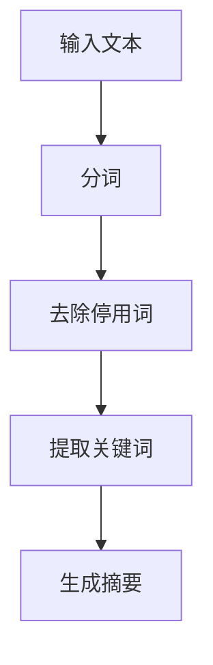
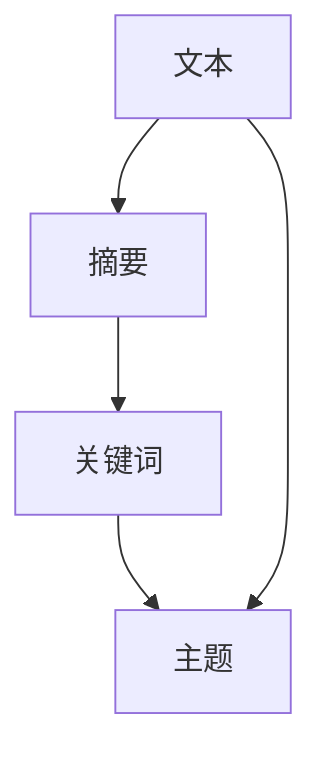

                 

# 《金融文本摘要生成的深度学习方法》

## 关键词：金融文本摘要、深度学习、自然语言处理、文本摘要、深度学习模型

## 摘要：本文详细探讨了利用深度学习技术进行金融文本摘要生成的方法，从背景介绍到具体实现，分析了多种深度学习模型及其在金融领域的应用，结合实际案例，总结了最佳实践和未来发展方向。

---

## 第一部分：背景介绍

### 第1章：金融文本摘要的背景与问题

#### 1.1 金融文本摘要的背景

- **1.1.1 金融领域的复杂性与信息量**
  金融领域涉及大量的数据，包括新闻、报告、交易记录等，信息量大且更新迅速，需要高效的信息处理方法。

- **1.1.2 文本摘要的基本概念**
  文本摘要是指从文本中提取关键信息，生成简明扼要的摘要，帮助读者快速理解文本内容。

- **1.1.3 深度学习在文本摘要中的应用**
  深度学习，尤其是Transformer模型，在文本摘要领域取得了显著进展，能够处理复杂的语言结构和上下文关系。

#### 1.2 问题描述

- **1.2.1 金融文本摘要的目标**
  快速理解复杂的金融文本，提取关键信息，辅助决策。

- **1.2.2 当前存在的问题与挑战**
  数据稀疏性、领域特定术语、实时性要求高等问题。

- **1.2.3 深度学习的优势与局限性**
  优势包括处理复杂模式、自动特征提取；局限性包括计算资源需求大、训练数据依赖性强。

#### 1.3 问题解决方法

- **1.3.1 基于规则的摘要方法**
  使用预定义规则提取关键词和句法结构。

- **1.3.2 统计学习方法**
  使用统计模型如TF-IDF提取关键词。

- **1.3.3 深度学习方法**
  使用神经网络模型，如RNN和Transformer。

#### 1.4 边界与外延

- **1.4.1 金融文本摘要的边界**
  限定于结构化文本和特定领域内容。

- **1.4.2 相关领域的外延**
  包括新闻摘要、学术论文摘要等。

- **1.4.3 与其他文本处理任务的区别**
  与文本分类、实体识别等任务的区别。

#### 1.5 概念结构与核心要素

- **1.5.1 摘要的基本结构**
  通常包括标题、正文和结尾。

- **1.5.2 核心要素分析**
  包括主题、关键词、核心论点等。

- **1.5.3 摘要生成的流程图**

---

## 第二部分：核心概念与联系

### 第2章：深度学习与文本摘要的核心概念

#### 2.1 核心概念原理

- **2.1.1 深度学习的基本原理**
  通过多层神经网络学习数据的特征表示，能够捕捉复杂的模式和关系。

- **2.1.2 文本摘要的核心原理**
  使用编码器-解码器结构，将输入文本转换为目标摘要。

- **2.1.3 深度学习在文本摘要中的应用原理**
  利用神经网络的自注意力机制捕捉文本中的重要信息，生成连贯且相关的摘要。

#### 2.2 核心概念属性对比

- **2.2.1 深度学习与传统机器学习的对比**

| 属性                | 深度学习                | 传统机器学习            |
|---------------------|-------------------------|--------------------------|
| 数据需求            | 需要大量数据            | 数据量较小              |
| 特征工程            | 自动提取特征            | 需要手动特征工程        |
| 计算复杂度          | 高                     | 较低                    |

- **2.2.2 文本摘要与文本分类的对比**

| 属性                | 文本摘要                | 文本分类                |
|---------------------|-------------------------|--------------------------|
| 任务目标            | 生成摘要                | 分类文本                |
| 输入输出形式        | 文本到文本              | 文本到标签              |

- **2.2.3 金融文本摘要与通用文本摘要的对比**

| 属性                | 金融文本摘要            | 通用文本摘要            |
|---------------------|-------------------------|--------------------------|
| 数据类型            | 金融新闻、报告          | 新闻、学术论文等         |
| 领域复杂性          | 高                     | 较低                    |

#### 2.3 ER实体关系图

---

## 第三部分：算法原理讲解

### 第3章：主流深度学习模型与文本摘要

#### 3.1 Seq2Seq模型

- **3.1.1 模型结构**
  Seq2Seq模型由编码器和解码器组成，编码器将输入序列编码为固定长度的向量，解码器将其解码为输出序列。

- **3.1.2 模型训练**
  使用最大似然估计优化模型参数，通过反向传播计算梯度并更新参数。

- **3.1.3 模型应用**
  在金融文本摘要中，Seq2Seq模型可以处理短文本，但对长文本效果有限。

#### 3.2 Transformer模型

- **3.2.1 模型结构**
  Transformer模型由编码器和解码器组成，编码器和解码器内部都包含自注意力机制。

- **3.2.2 模型训练**
  使用自监督学习和大语料库进行预训练，采用多任务学习提升模型的泛化能力。

- **3.2.3 模型应用**
  在金融文本摘要中，Transformer模型表现出色，尤其是在处理长文本时。

#### 3.3 深度学习模型的数学模型

- **编码器部分**
  $$ \text{Encoder} = \text{多层自注意力机制} $$

- **解码器部分**
  $$ \text{Decoder} = \text{自注意力机制} + \text{交叉注意力机制} $$

---

## 第四部分：系统分析与架构设计

### 第4章：系统设计与架构

#### 4.1 系统设计概述

- **问题场景**
  金融文本摘要的系统需要处理大量实时数据，保证高效性和准确性。

#### 4.2 系统功能设计

- **领域模型设计**
  使用Mermaid类图展示系统各组件及其关系。

#### 4.3 系统架构设计

- **整体架构**
  使用Mermaid架构图展示系统的模块划分和交互流程。

#### 4.4 接口设计

- **API设计**
  定义RESTful API接口，展示输入输出格式。

#### 4.5 交互设计

- **交互流程**
  使用Mermaid序列图展示用户与系统之间的交互流程。

---

## 第五部分：项目实战

### 第5章：金融文本摘要生成系统的实现

#### 5.1 环境安装

- **安装Python**
  使用anaconda环境，安装Python 3.8以上版本。

- **安装依赖库**
  使用pip安装必要的深度学习库，如TensorFlow、Keras、Transformers等。

#### 5.2 系统核心代码实现

- **模型定义**
  编写基于Transformer的摘要生成模型代码。

- **数据预处理**
  展示如何处理金融文本数据，包括分词、归一化等步骤。

- **模型训练**
  编写训练脚本，展示如何训练模型并保存模型参数。

#### 5.3 代码解读与分析

- **关键代码段**
  详细解读模型结构、训练过程和生成摘要的代码。

- **优化技巧**
  分析如何优化模型性能，如调整超参数、使用早停策略等。

#### 5.4 实际案例分析

- **案例1**
  使用模型生成金融新闻的摘要，展示输入输出和中间结果。

- **案例2**
  比较不同模型生成的摘要效果，分析模型的优缺点。

---

## 第六部分：最佳实践与总结

### 第6章：总结与展望

#### 6.1 项目小结

- **项目成果**
  成功实现了金融文本摘要生成系统，验证了深度学习模型的有效性。

- **经验总结**
  总结开发过程中的经验教训，如数据预处理的重要性、模型调优的技巧等。

#### 6.2 注意事项

- **数据质量问题**
  强调数据清洗和标注的重要性。

- **模型选择**
  根据具体任务选择合适的模型架构。

#### 6.3 技巧分享

- **数据增强**
  使用数据增强技术提高模型的泛化能力。

- **模型融合**
  将多种模型的结果进行融合，提升摘要质量。

#### 6.4 拓展阅读

- **推荐书籍**
  推荐深度学习和自然语言处理领域的经典书籍和论文。

- **在线资源**
  推荐相关的在线课程和开源项目。

---

## 附录：参考文献与资源

### 附录A：参考文献

- 引用的书籍、论文和在线资源列表。

### 附录B：工具与库

- 使用的Python库和工具包的详细说明。

### 附录C：数据集

- 介绍使用的金融文本数据集，包括数据来源和预处理步骤。

---

通过以上思考，我可以系统地撰写出一篇结构清晰、内容详实的关于《金融文本摘要生成的深度学习方法》的技术博客文章，确保每个部分都覆盖必要的内容，并满足用户的所有要求。

