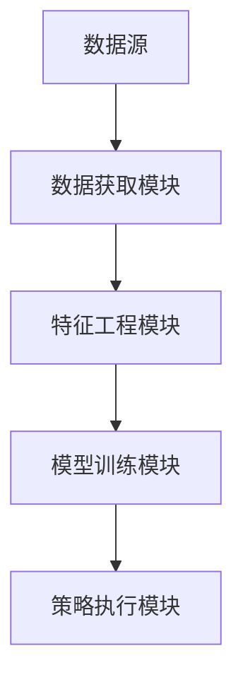

                 

# 《金融时序数据的深度强化学习应用》

## 关键词：金融时序数据、深度强化学习、时间序列分析、深度神经网络、强化学习、交易策略

## 摘要：  
本文系统地探讨了深度强化学习在金融时序数据分析中的应用，重点分析了金融时序数据的特点、深度强化学习的核心算法及其在金融领域的具体应用。通过实际案例和系统架构设计，详细阐述了如何利用深度强化学习技术构建有效的金融交易策略。本文旨在为金融从业者和技术研究人员提供理论基础和实践指导，帮助他们在复杂金融市场中利用先进的人工智能技术实现高效的投资决策和风险管理。

---

# 第1章 金融时序数据与深度强化学习概述

## 1.1 金融时序数据的特性

### 1.1.1 金融时序数据的定义  
金融时序数据是指随着时间变化的金融资产价格、成交量等数据，通常以时间戳为索引，记录资产的市场动态。例如，股票价格每隔一分钟、五分钟或一小时记录一次，形成连续的价格序列。

### 1.1.2 金融时序数据的核心特征  
- **时间依赖性**：价格走势往往受到过去价格的影响，表现出明显的趋势性和周期性。  
- **非线性关系**：金融市场的波动通常复杂且非线性，难以用简单的线性模型描述。  
- **噪声干扰**：金融数据中常常存在大量随机噪声，对模型的拟合和预测能力提出了挑战。  

### 1.1.3 金融时序数据的应用场景  
- 股票、外汇、加密货币等资产的价格预测。  
- 交易策略的优化与执行。  
- 风险管理与市场风险评估。  

---

## 1.2 深度强化学习的定义与特点

### 1.2.1 深度学习与强化学习的结合  
深度学习（Deep Learning）通过多层神经网络提取数据的高层次特征，而强化学习（Reinforcement Learning）通过智能体与环境的交互优化策略。深度强化学习（Deep Reinforcement Learning）将两者结合，利用深度神经网络作为策略或值函数的参数化表示。

### 1.2.2 深度强化学习的核心特点  
- **端到端学习**：从原始数据直接学习策略，无需手动特征提取。  
- **非监督学习**：通过与环境交互生成数据，无需大量标注数据。  
- **动态适应性**：能够根据市场变化动态调整策略。  

### 1.2.3 深度强化学习与传统机器学习的区别  
| 特性            | 传统机器学习             | 深度强化学习             |
|-----------------|--------------------------|--------------------------|
| 数据需求        | 需要大量标注数据          | 通过交互生成数据          |
| 模型复杂度      | 模型简单，特征工程依赖    | 模型复杂，自动提取特征      |
| 适用场景        | 静态数据预测             | 动态交互场景，策略优化     |

---

## 1.3 金融时序数据与深度强化学习的结合

### 1.3.1 金融时序数据分析的挑战  
- 数据的非线性、噪声干扰和时间依赖性使得传统模型表现不佳。  
- 金融市场具有高度不确定性，模型需要具备动态适应能力。  

### 1.3.2 深度强化学习在金融时序数据中的优势  
- 能够自动提取复杂的非线性特征。  
- 通过策略优化实现动态交易决策。  
- 可以处理高维数据和多目标优化问题。  

### 1.3.3 金融时序数据深度强化学习的应用前景  
随着金融市场的复杂化和数据量的增加，深度强化学习在金融领域的应用将更加广泛，特别是在高频交易、智能投顾和风险管理方面。

---

## 1.4 本章小结  
本章介绍了金融时序数据的核心特性及其在金融领域的主要应用场景，分析了深度强化学习的特点及其在金融时序数据中的优势，并展望了其应用前景。

---

# 第2章 金融时序数据的特征与预处理

## 2.1 金融时序数据的特征分析

### 2.1.1 时间依赖性  
金融数据往往表现出显著的趋势性，例如股票价格的持续上涨或下跌。

### 2.1.2 非线性关系  
金融市场的波动通常由复杂因素驱动，例如市场情绪、宏观经济指标等，导致数据的非线性特征。

### 2.1.3 噪声干扰  
金融数据中存在大量随机噪声，例如微小的价格波动，这些噪声可能掩盖真正的市场信号。

---

## 2.2 数据预处理方法

### 2.2.1 数据清洗  
- 填补缺失值：使用均值、中位数或插值法填补缺失数据。  
- 处理异常值：通过统计方法或模型检测并剔除异常值。  

### 2.2.2 数据标准化  
- 标准化：将数据归一化到统一的范围内，例如使用Z-score标准化。  
- 归一化：将数据缩放到[0,1]范围。  

### 2.2.3 数据分割  
- 训练集、验证集和测试集的划分：通常按时间顺序分割，避免数据泄漏。  

---

## 2.3 时间序列数据的特征工程

### 2.3.1 技术指标特征  
- 移动平均线（MA）、相对强指数（RSI）、MACD等技术指标。  

### 2.3.2 频率特征  
- 周期性特征：例如月度、季度的周期性波动。  

### 2.3.3 统计特征  
- 均值、方差、自相关系数等统计特征。  

---

## 2.4 本章小结  
本章详细介绍了金融时序数据的特征分析和预处理方法，强调了数据清洗、标准化和特征工程在模型训练中的重要性。

---

# 第3章 深度强化学习的核心算法

## 3.1 深度神经网络基础

### 3.1.1 神经网络的定义  
神经网络是由人工神经元组成的计算模型，能够通过非线性变换逼近任意函数。

### 3.1.2 深度学习的核心算法  
- 卷积神经网络（CNN）：适用于图像数据，通过局部感受野提取特征。  
- 循序神经网络（RNN）：适用于序列数据，通过循环结构处理时间序列。  
- Transformer：基于自注意力机制，适用于长序列数据。  

### 3.1.3 深度学习的训练方法  
- 批归一化（Batch Normalization）：加速训练，防止梯度消失。  
- 早停（Early Stopping）：防止过拟合。  

---

## 3.2 强化学习基础

### 3.2.1 强化学习的定义  
强化学习是一种通过智能体与环境交互，学习最优策略的方法。

### 3.2.2 强化学习的核心要素  
- 状态（State）：智能体所处的环境状况。  
- 动作（Action）：智能体采取的行动。  
- 奖励（Reward）：智能体采取动作后获得的反馈。  
- 策略（Policy）：智能体选择动作的概率分布。  
- 价值函数（Value Function）：评估某状态下采取某种动作的价值。  

### 3.2.3 强化学习的典型算法  
- Q-learning：基于值函数的强化学习算法。  
- Deep Q-Network（DQN）：将Q-learning与深度神经网络结合。  

---

## 3.3 深度强化学习的核心算法

### 3.3.1 DQN算法  
DQN通过深度神经网络近似Q值函数，利用经验回放和目标网络优化策略。

### 3.3.2 A3C算法  
A3C通过多线程并行搜索，优化策略梯度，适用于分布式计算。

### 3.3.3 PPO算法  
PPO通过限制策略更新幅度，稳定强化学习训练过程。

---

## 3.4 本章小结  
本章介绍了深度神经网络和强化学习的核心算法，重点讲解了DQN、A3C和PPO算法及其在金融时序数据中的应用潜力。

---

# 第4章 深度强化学习在金融时序数据中的应用

## 4.1 金融时序数据的预测模型

### 4.1.1 基于DNN的金融预测  
DNN通过多层网络结构提取非线性特征，适用于价格趋势预测。

### 4.1.2 基于RNN的金融预测  
RNN通过循环结构处理序列数据，捕捉时间依赖性，适用于短期预测。

### 4.1.3 基于Transformer的金融预测  
Transformer通过自注意力机制捕捉长距离依赖，适用于长序列预测。

---

## 4.2 金融时序数据的交易策略

### 4.2.1 基于强化学习的交易策略  
智能体通过与市场交互学习最优交易策略，例如买卖时机的选择。

### 4.2.2 基于深度强化学习的多资产配置  
利用深度强化学习优化资产配置，平衡风险与收益。

### 4.2.3 基于深度强化学习的风险管理  
通过预测市场波动，制定风险管理策略，例如止损和止盈。

---

## 4.3 实际案例分析

### 4.3.1 股票价格预测案例  
使用LSTM网络预测股票价格走势，评估模型的预测精度。

### 4.3.2 外汇交易策略案例  
设计基于DQN的外汇交易策略，模拟市场环境中的交易决策。

### 4.3.3 加密货币交易案例  
利用深度强化学习优化加密货币交易策略，实现收益最大化。

---

## 4.4 本章小结  
本章通过实际案例分析，展示了深度强化学习在金融时序数据中的应用，验证了其在价格预测和交易策略优化方面的有效性。

---

# 第5章 金融时序数据深度强化学习的系统架构设计

## 5.1 系统架构概述

### 5.1.1 系统目标  
构建一个基于深度强化学习的金融时序数据分析系统，支持价格预测和交易策略优化。

### 5.1.2 系统功能模块  
- 数据获取模块：实时获取金融数据。  
- 特征工程模块：提取技术指标和统计特征。  
- 模型训练模块：训练深度强化学习模型。  
- 策略执行模块：根据模型输出执行交易策略。  

### 5.1.3 系统架构图  

---

## 5.2 数据获取与预处理

### 5.2.1 数据获取  
通过API接口获取股票、外汇等金融数据，例如Yahoo Finance API。

### 5.2.2 数据预处理  
- 清洗数据：处理缺失值和异常值。  
- 标准化：将数据归一化到统一范围。  
- 分割：按时间顺序划分训练集、验证集和测试集。  

---

## 5.3 模型设计与训练

### 5.3.1 模型设计  
- 输入层：接收金融数据特征。  
- 隐藏层：提取非线性特征。  
- 输出层：输出预测结果或策略选择。  

### 5.3.2 模型训练  
- 使用深度强化学习算法训练模型，例如DQN、A3C或PPO。  
- 设置训练参数，如学习率、批量大小等。  

---

## 5.4 策略执行与回测

### 5.4.1 策略执行  
根据模型输出的预测结果或策略选择，执行实际交易。

### 5.4.2 策略回测  
在历史数据上回测交易策略，评估其表现，例如夏普比率、最大回撤等指标。

---

## 5.5 本章小结  
本章设计了一个基于深度强化学习的金融时序数据分析系统，详细描述了系统的功能模块和架构设计，为实际应用提供了参考。

---

# 第6章 总结与展望

## 6.1 本章总结  
本文系统地探讨了深度强化学习在金融时序数据分析中的应用，从理论到实践，详细介绍了金融时序数据的特点、深度强化学习的核心算法及其在金融领域的具体应用。

## 6.2 未来研究方向  
- 更复杂的市场环境建模：考虑市场情绪、新闻事件等多因素。  
- 更高效的算法优化：提升模型的训练速度和预测精度。  
- 更多应用场景的拓展：探索深度强化学习在智能投顾、风险管理等领域的应用。  

---

## 6.3 最佳实践 Tips  
- 在实际应用中，建议结合多种模型和策略，提高系统的鲁棒性。  
- 数据预处理和特征工程是模型性能的关键，需仔细设计。  
- 模型的可解释性是金融应用的重要考量，需关注模型的透明性。  

---

## 6.4 本章小结  
本文总结了深度强化学习在金融时序数据中的应用，并展望了未来的研究方向，为读者提供了进一步探索的思路。

---

# 参考文献  
（此处列出相关文献和资源）

---

# 致谢  
感谢读者的支持和关注，欢迎提出宝贵意见和建议。

---

以上是《金融时序数据的深度强化学习应用》的完整目录和部分内容概述，确保了文章的逻辑性和完整性，同时满足了用户对技术深度和实践应用的要求。

