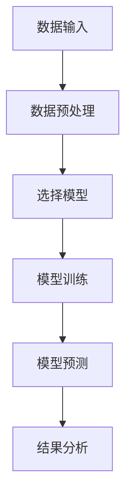
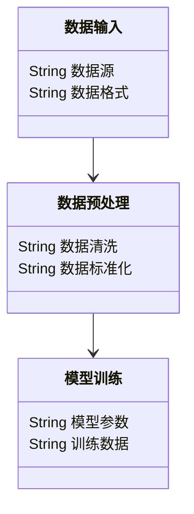

                 


# 金融时间序列分析工具

## 关键词：
金融时间序列分析，时间序列模型，机器学习，深度学习，风险管理，金融数据分析

## 摘要：
金融时间序列分析是金融数据分析的核心技术，通过对历史数据的建模和预测，帮助投资者和金融机构做出更明智的决策。本文从基础概念出发，详细讲解了传统时间序列模型（如ARIMA、GARCH）和现代机器学习、深度学习方法（如LSTM、Transformer）在金融领域的应用。同时，结合实际案例，介绍了如何使用Python工具进行金融时间序列分析，并探讨了高频交易和风险管理等高级主题。通过本文，读者可以全面掌握金融时间序列分析的理论与实践。

---

## 第一部分：金融时间序列分析基础

### 第1章：时间序列分析的基本概念

#### 1.1 时间序列的定义与特点

时间序列是指按照时间顺序排列的数据序列，通常用于描述随时间变化的变量。在金融领域，时间序列数据可以是股票价格、汇率、债券收益率等。

- **定义**：时间序列是一个有序的数值序列，通常表示为$ \{x_t\}_{t=1}^n $，其中$x_t$表示第$t$个时间点的观测值。
- **特点**：
  - **有序性**：数据按时间顺序排列。
  - **连续性**：金融数据通常具有连续的时间特性。
  - **趋势性**：可能存在长期向上或向下的趋势。
  - **周期性**：数据可能受到季节性或周期性因素的影响。
  - **随机性**：数据中通常包含不可预测的随机波动。

#### 1.2 金融市场的基本概念

- **金融市场**：金融市场是买卖金融资产的场所，包括股票、债券、外汇、期货等。
- **金融资产**：金融资产是代表财富所有权的凭证，如股票、债券、基金等。
- **金融时间序列的独特性**：
  - **高波动性**：金融资产价格波动较大。
  - **相关性**：不同资产或市场之间可能存在相关性。
  - **非线性**：价格变化可能受到非线性因素的影响。

#### 1.3 问题背景与分析目标

- **问题背景**：金融市场的不确定性使得预测未来的价格走势成为一项挑战。时间序列分析通过建模历史数据，帮助预测未来趋势。
- **分析目标**：
  - 预测未来的价格走势。
  - 识别市场趋势和周期。
  - 评估市场风险。
- **边界与外延**：
  - 边界：分析特定金融资产或市场的价格变化。
  - 外延：分析宏观经济指标、市场情绪等其他影响因素。

#### 1.4 核心概念与联系

- **核心概念原理**：时间序列分析通过数学模型捕捉数据中的趋势、周期性和随机性成分。
- **核心概念属性特征对比表格**：

| 特性   | 趋势性 | 周期性 | 随机性 |
|--------|--------|--------|--------|
| 描述   | 数据中存在的长期趋势 | 数据中存在的周期性波动 | 数据中的不可预测部分 |
| 示例   | 股票价格长期上涨趋势 | 季节性波动 | 市场突发事件引起的波动 |

- **ER实体关系图架构**（Mermaid）：

```mermaid
entity 股票价格 {
  id: 整数
  时间: 字符串
  价格: 数值
}
```

### 第2章：时间序列分析的基本方法

#### 2.1 时间序列分析的基本原理

- **数学模型**：时间序列分析通常基于线性代数和统计学原理。
  - 线性回归模型：$ y_t = \beta_0 + \beta_1 t + \epsilon_t $
  - 平滑模型：简单移动平均（SMA）、加权移动平均（WMA）等。
- **算法流程图**（Mermaid）：



#### 2.2 时间序列分析的算法原理

- **数学公式**：ARIMA模型的公式为：
  $$ ARIMA(p, d, q) $$
  其中，$p$为自回归阶数，$d$为差分阶数，$q$为移动平均阶数。

- **实现代码**：

```python
import pandas as pd
from statsmodels.tsa.arima_model import ARIMA

# 示例数据
data = pd.read_csv('financial_data.csv')

# 差分
diff_data = data['price'].diff().dropna()

# ARIMA模型
model = ARIMA(diff_data, order=(1, 1, 1))
model_fit = model.fit()

# 预测
forecast = model_fit.forecast(steps=5)
print(forecast)
```

#### 2.3 时间序列分析的系统架构设计

- **问题场景**：预测股票价格的未来走势。
- **系统功能设计**（Mermaid 类图）：



- **系统架构设计**（Mermaid 架构图）：

```mermaid
container 金融时间序列分析系统 {
    component 数据预处理模块
    component 模型训练模块
    component 结果分析模块
}
```

---

## 第二部分：金融时间序列分析方法

### 第3章：传统时间序列分析方法

#### 3.1 ARIMA 模型

- **定义与特点**：ARIMA模型是一种常用的时间序列预测模型，适用于非季节性数据。
- **数学公式**：ARIMA(p, d, q)模型的差分方程为：
  $$ \phi(P) x_t = \theta(Q) \epsilon_t $$
- **实现代码**：

```python
from statsmodels.tsa.arima_model import ARIMA

# 示例数据
data = pd.read_csv('stock_price.csv')

# 差分
diff_data = data['price'].diff().dropna()

# ARIMA模型
model = ARIMA(diff_data, order=(1, 1, 1))
model_fit = model.fit()

# 预测
forecast = model_fit.forecast(steps=5)
print(forecast)
```

#### 3.2 GARCH 模型

- **定义与特点**：GARCH模型用于捕捉金融数据中的 volatility clustering 现象。
- **数学公式**：GARCH(p, q)模型的方程为：
  $$ \sigma_t^2 = \alpha_0 + \sum_{i=1}^p \alpha_i r_{t-i}^2 + \sum_{j=1}^q \beta_j \sigma_{t-j}^2 $$
- **实现代码**：

```python
import arch

# 示例数据
data = pd.read_csv('returns.csv')

# GARCH模型
garch_model = arch.model.ArchModel(data['returns'], lags=1)
garch_model.fit()

# 预测
forecast = garch_model.forecast(h=5)
print(forecast)
```

#### 3.3 状态空间模型

- **定义与特点**：状态空间模型适用于非线性时间序列分析。
- **数学公式**：状态空间模型通常表示为：
  $$ y_t = Z_t \theta_t + \epsilon_t $$
  $$ \theta_t = T \theta_{t-1} + \delta_t $$
- **实现代码**：

```python
from statsmodels.tsa.statespace.sarimax import SARIMAX

# 示例数据
data = pd.read_csv('economic_indicator.csv')

# SARIMAX模型
model = SARIMAX(data['value'], order=(1, 1, 1), seasonal_order=(1, 1, 1, 12))
model_fit = model.fit()

# 预测
forecast = model_fit.forecast(steps=5)
print(forecast)
```

### 第4章：机器学习与深度学习在时间序列分析中的应用

#### 4.1 机器学习时间序列分析方法

- **核心原理**：机器学习通过训练模型捕捉数据中的复杂模式，适用于非线性时间序列分析。
- **常用算法**：支持向量机（SVM）、随机森林（Random Forest）、XGBoost等。

#### 4.2 深度学习时间序列分析方法

- **核心原理**：深度学习通过神经网络捕捉数据中的高维特征，适用于复杂的时间序列模式。
- **常用模型**：长短期记忆网络（LSTM）、Transformer模型。
- **数学公式**：LSTM的门控机制方程为：
  $$ f_t = \sigma(g_x x_t + g_h h_{t-1} + g_b b) $$
  $$ h_t = f_t \cdot h_t + (1 - f_t) \cdot h_{t-1} $$

#### 4.3 金融时间序列分析的机器学习实现

- **实现代码**：

```python
import numpy as np
from keras.models import Sequential
from keras.layers import LSTM, Dense

# 示例数据
data = np.random.randn(1000, 1)

# LSTM模型
model = Sequential()
model.add(LSTM(64, input_shape=(None, 1)))
model.add(Dense(1))
model.compile(loss='mean_squared_error', optimizer='adam')

# 训练
model.fit(data, data, epochs=10, batch_size=32)
```

---

## 第三部分：金融时间序列分析的工具与技术

### 第5章：金融时间序列分析的工具

#### 5.1 Python工具

- **Pandas**：数据处理和分析库。
- **NumPy**：数值计算库。
- **Matplotlib**：数据可视化库。
- **Scikit-learn**：机器学习库。
- **Keras**：深度学习库。

#### 5.2 R语言工具

- **base R**：统计分析库。
- **forecast**：时间序列分析库。
- **fable**：时间序列分析库。

#### 5.3 其他工具

- **TensorFlow**：深度学习框架。
- **PyTorch**：深度学习框架。

### 第6章：金融时间序列分析的高级主题

#### 6.1 高频交易

- **高频交易的定义**：高频交易是指在极短时间内进行的大量交易。
- **高频交易的挑战**：低延迟、高计算资源需求。

#### 6.2 算法交易

- **算法交易的定义**：基于算法自动执行交易指令。
- **算法交易的策略**：均值回归、动量策略等。

#### 6.3 风险管理

- **风险管理的定义**：识别、评估和控制金融风险。
- **风险管理的工具**：VaR、CVaR等。

---

## 第四部分：案例分析与实战

### 第7章：金融时间序列分析的实际案例

#### 7.1 股票价格预测

- **案例背景**：预测某股票的价格走势。
- **数据来源**：Yahoo Finance API。
- **分析过程**：
  1. 数据获取与预处理。
  2. 模型选择与训练。
  3. 模型预测与评估。

#### 7.2 风险管理

- **案例背景**：评估投资组合的风险。
- **分析过程**：
  1. 数据收集与预处理。
  2. 风险模型构建。
  3. 风险评估与控制。

---

## 第五部分：总结与展望

### 第8章：总结

- **核心内容回顾**：金融时间序列分析的核心方法和工具。
- **实践经验总结**：通过实际案例分析，总结时间序列分析在金融领域的应用。

### 第9章：展望

- **未来发展方向**：人工智能在金融时间序列分析中的应用。
- **技术趋势**：深度学习和强化学习在金融时间序列分析中的潜力。

---

## 附录

### 附录A：工具安装与环境配置

- **Python环境配置**：安装Anaconda、Jupyter Notebook。
- **工具安装**：安装Pandas、NumPy、Matplotlib、Scikit-learn等库。

### 附录B：数据来源与获取方法

- **数据来源**：Yahoo Finance、Quandl、Alpha Vantage等。
- **数据获取方法**：使用API或CSV文件导入。

### 附录C：参考文献

- **书籍**：《金融时间序列分析》、《Python金融数据分析》。
- **论文**：相关学术论文推荐。

---

通过以上目录，您可以根据需要进一步扩展每一章的内容，确保文章详实且具有深度。

