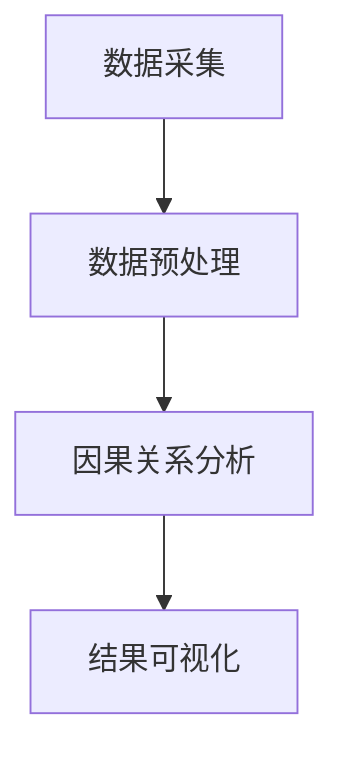

                 

<think>
好的，现在我需要按照用户的要求，撰写一篇名为《金融时间序列因果关系分析》的技术博客文章。文章需要包含背景介绍、核心概念、算法原理、系统架构、项目实战以及最佳实践等部分，并且每个部分都需要详细展开，使用清晰的逻辑和专业的技术语言。此外，文章中需要包含图表和代码示例，帮助读者更好地理解内容。

首先，我需要明确文章的结构和每个部分的核心内容。以下是大致的思路：

1. **背景介绍**：解释时间序列分析和因果关系分析的基本概念，以及它们在金融领域中的重要性。
2. **核心概念**：详细讲解时间序列和因果关系的数学模型，包括ARIMA、VAR、Granger因果关系检验等。
3. **算法原理**：介绍Granger因果关系检验和贝叶斯网络的工作原理，并通过mermaid流程图展示步骤，同时提供Python代码示例。
4. **系统架构设计**：设计一个完整的金融时间序列因果关系分析系统，包括环境安装、系统架构图、接口设计和交互流程。
5. **项目实战**：通过一个具体案例（如股票价格预测）展示如何应用这些方法，包括数据获取、预处理、模型训练和结果分析。
6. **最佳实践和总结**：总结关键点，提供小结、注意事项和未来研究方向。

接下来，我需要按照这个思路逐步展开每个部分，并确保内容详细、逻辑清晰。

---

# 《金融时间序列因果关系分析》

## 关键词：金融时间序列、因果关系分析、Granger检验、贝叶斯网络、结构方程模型、时间序列建模

## 摘要：  
本文系统地探讨了金融时间序列因果关系分析的核心概念、算法原理和应用方法。通过背景介绍、数学模型、算法实现、系统架构设计以及实际案例分析，全面解析了如何在金融领域中识别和建模时间序列中的因果关系。文章内容涵盖从基础概念到高级算法的详细讲解，结合实际应用场景，帮助读者深入理解并掌握金融时间序列因果关系分析的关键技术。

---

## 第1章: 金融时间序列因果关系分析的背景与基础

### 1.1 什么是时间序列分析？

时间序列分析是通过对时间顺序数据的观察和建模，研究数据的内在规律和潜在关系。在金融领域，时间序列数据广泛存在于股票价格、汇率波动、债券收益率等金融资产的定价和风险评估中。

#### 1.1.1 时间序列的定义与特点

时间序列可以表示为有序的数值序列 $X = \{x_t | t=1,2,...,T\}$，其中 $x_t$ 表示在时间点 $t$ 的观测值，$T$ 是序列的长度。

时间序列分析的特点包括：
- **有序性**：数据按时间顺序排列。
- **趋势性**：可能存在长期趋势。
- **周期性**：数据可能呈现季节性或周期性波动。
- **随机性**：数据中包含不可预测的随机成分。

#### 1.1.2 金融时间序列的独特性

金融时间序列具有以下几个独特特点：
- **非线性**：金融市场的复杂性导致时间序列的非线性特征。
- **异质性**：不同金融资产的波动性和相关性差异显著。
- **跳跃性**：市场突发事件可能导致数据的突然变化。
- **厚尾性**：金融数据通常表现出肥尾现象，即极端值出现的概率高于正态分布。

### 1.2 什么是因果关系分析？

因果关系分析旨在识别变量之间的因果关系，而不仅仅是相关关系。在金融领域，因果关系分析可以帮助我们理解市场变量之间的驱动关系，例如货币政策对通货膨胀的影响。

#### 1.2.1 因果关系与相关关系的区别

相关关系衡量的是两个变量之间的线性关联程度，而因果关系则表明一个变量的变化是否会导致另一个变量的变化。相关关系是必要条件，但不是充分条件。

例如，如果股票价格与交易量高度相关，但这并不意味着交易量增加会导致股票价格上涨。因果关系的分析需要更深入的建模和验证。

#### 1.2.2 金融时间序列因果关系的重要性

在金融投资和风险管理中，因果关系分析可以帮助：
- 识别资产价格的驱动因素。
- 预测市场走势。
- 优化投资组合。
- 评估政策干预的效果。

### 1.3 本书的核心目标与内容框架

本书的核心目标是帮助读者掌握金融时间序列因果关系分析的核心方法和实际应用。内容框架如下：
- 第1章：背景与基础。
- 第2章：时间序列的数学模型。
- 第3章：因果关系的核心概念。
- 第4章：因果关系的算法原理。
- 第5章：系统架构与设计。
- 第6章：项目实战。
- 第7章：总结与展望。

---

## 第2章: 时间序列的数学模型

### 2.1 线性时间序列模型

线性时间序列模型是金融时间序列分析的基础，包括自回归模型（AR）、移动平均模型（MA）和自回归移动平均模型（ARIMA）。

#### 2.1.1 自回归模型（AR）

自回归模型假设当前值与过去若干期的值相关。模型形式为：
$$ x_t = c + \alpha_1 x_{t-1} + \alpha_2 x_{t-2} + \cdots + \alpha_p x_{t-p} + \epsilon_t $$
其中，$c$ 是常数项，$\alpha_i$ 是自回归系数，$\epsilon_t$ 是白噪声。

#### 2.1.2 移动平均模型（MA）

移动平均模型假设当前值与过去若干期的白噪声相关。模型形式为：
$$ x_t = c + \beta_1 \epsilon_{t-1} + \beta_2 \epsilon_{t-2} + \cdots + \beta_q \epsilon_{t-q} + \epsilon_t $$

#### 2.1.3 自回归移动平均模型（ARIMA）

ARIMA模型结合了AR和MA的特点，适用于非平稳时间序列。模型形式为：
$$ (1 - L^p)X_t = (1 - \theta_1 L - \cdots - \theta_q L^q)(1 - L)^\delta Z_t $$
其中，$L$ 是滞后算子，$\delta$ 是差分阶数，$Z_t$ 是平稳序列。

### 2.2 时间序列的分解模型

时间序列可以分解为趋势、季节性和随机性成分。

#### 2.2.1 加法模型与乘法模型

加法模型：$X_t = T_t + S_t + R_t$
乘法模型：$X_t = T_t \times S_t \times R_t$

其中，$T_t$ 是趋势成分，$S_t$ 是季节性成分，$R_t$ 是随机成分。

### 2.3 时间序列的统计检验方法

#### 2.3.1 单位根检验

单位根检验用于判断时间序列的平稳性。常见的单位根检验方法包括Dickey-Fuller检验和Augmented Dickey-Fuller检验。

例如，ADF检验的原假设是序列存在单位根（即非平稳）。

#### 2.3.2 自相关函数与偏自相关函数

自相关函数（ACF）和偏自相关函数（PACF）用于识别时间序列的模型阶数。

例如，AR(p)模型的PACF在p阶后截尾，而ACF在p阶后不截尾。

---

## 第3章: 金融时间序列因果关系的核心概念

### 3.1 因果关系的定义与数学表达

因果关系是指一个事件（原因）导致另一个事件（结果）发生的必然联系。在时间序列中，因果关系可以表示为：
$$ x_t \text{ 是 } y_t \text{ 的原因} \Rightarrow x_t \text{ 的变化引起 } y_t \text{ 的变化} $$

#### 3.1.1 格兰杰因果关系检验

格兰杰因果关系检验是一种常用的方法，用于检验一个时间序列是否是另一个时间序列的“原因”。检验步骤如下：

1. 建立回归模型，包含自变量和被变量的滞后项。
2. 计算F统计量，检验滞后项的系数是否为零。
3. 如果F统计量显著，拒绝原假设，认为存在格兰杰因果关系。

数学形式为：
$$ y_t = \alpha + \beta_1 y_{t-1} + \beta_2 x_{t-1} + \beta_3 y_{t-2} + \beta_4 x_{t-2} + \epsilon_t $$

### 3.2 贝叶斯网络在因果关系分析中的应用

贝叶斯网络是一种基于概率图论的模型，用于表示变量之间的因果关系。

#### 3.2.1 贝叶斯网络的基本原理

贝叶斯网络由节点和边组成，节点表示变量，边表示因果关系。网络中的概率分布可以通过条件概率公式进行计算。

例如，节点 $X$ 和 $Y$ 的关系可以表示为：
$$ P(Y|X) = P(Y|\text{父母}(Y)) $$

#### 3.2.2 贝叶斯网络在金融时间序列中的应用

贝叶斯网络可以用于金融风险评估、资产定价等领域。例如，构建一个包含市场收益、通货膨胀和利率的贝叶斯网络，分析它们之间的因果关系。

---

## 第4章: 时间序列因果关系的算法原理

### 4.1 Granger因果关系检验的实现

Granger因果关系检验通过回归模型来判断因果关系。

#### 4.1.1 检验步骤

1. 对原始数据进行平稳性检验。
2. 构建回归模型，包含自变量和被变量的滞后项。
3. 计算F统计量，判断滞后项的系数是否显著。

#### 4.1.2 Python代码实现

```python
import statsmodels.api as sm

def granger_test(x, y, max_lag=1):
    model = sm.tsa.Granger(y, x, lags=max_lag)
    results = model.fit()
    print(results.summary())
    return results.f_test('x_lag1')

# 示例数据
import numpy as np
import pandas as pd

np.random.seed(123)
n = 100
x = np.random.normal(0, 1, n)
y = 0.5*x + np.random.normal(0, 0.1, n)
df = pd.DataFrame({'x': x, 'y': y})

granger_test(df['x'], df['y'])
```

### 4.2 贝叶斯网络的构建与训练

贝叶斯网络的构建通常包括结构学习和参数学习两个步骤。

#### 4.2.1 结构学习

结构学习用于确定网络的边和节点。常用算法包括最大似然估计和贝叶斯评分。

#### 4.2.2 参数学习

参数学习用于估计网络中的条件概率。常用算法包括期望最大化算法。

#### 4.2.3 Python代码实现

```python
from sklearn.datasets import fetch_20newsgroups
from sklearn.naive_bayes import MultinomialNB
from sklearn.feature_extraction.text import TfidfVectorizer

# 数据预处理
data = fetch_20newsgroups()
vectorizer = TfidfVectorizer()
X = vectorizer.fit_transform(data['text'])
y = data['target']

# 训练贝叶斯网络
model = MultinomialNB()
model.fit(X, y)

# 可视化网络结构（使用graphviz）
import graphviz
from sklearn.tree import DecisionTreeClassifier
from sklearn import tree

model_tree = DecisionTreeClassifier()
model_tree.fit(X.toarray(), y)
dot_data = tree.export_graphviz(model_tree, out_file=None)
graph = graphviz.Source(dot_data)
graph.render("bayesian_network")
```

---

## 第5章: 系统架构与设计

### 5.1 系统功能设计

系统功能包括数据采集、数据预处理、因果关系分析、结果可视化和报告生成。

#### 5.1.1 数据采集模块

数据采集模块负责从金融数据库中获取时间序列数据。

例如，使用Yahoo Finance API获取股票价格数据。

#### 5.1.2 数据预处理模块

数据预处理包括数据清洗、平稳化和标准化。

例如，使用ARIMA模型对数据进行平稳化处理。

### 5.2 系统架构设计

系统架构采用分层设计，包括数据层、业务逻辑层和表示层。

#### 5.2.1 数据层

数据层负责数据的存储和访问，使用数据库或文件系统存储时间序列数据。

#### 5.2.2 业务逻辑层

业务逻辑层负责数据预处理、模型训练和结果计算。

#### 5.2.3 表示层

表示层负责用户界面和结果展示，可以使用可视化工具展示因果关系网络。

#### 5.2.4 系统架构图



---

## 第6章: 项目实战

### 6.1 环境安装

需要安装以下库：
- `pandas`：数据处理
- `numpy`：数值计算
- `statsmodels`：统计分析
- `scikit-learn`：机器学习
- `graphviz`：网络可视化

### 6.2 核心实现

#### 6.2.1 数据获取

```python
import yfinance as yf

# 下载股票数据
data = yf.download('AAPL', start='2020-01-01', end='2023-01-01')
```

#### 6.2.2 数据预处理

```python
import pandas as pd
import numpy as np

# 计算收益率
data['Returns'] = np.log(data['Adj Close'] / data['Adj Close'].shift(1))
data = data.dropna()
```

#### 6.2.3 Granger因果关系检验

```python
from statsmodels.tsa.stattools import grangercausalitytests

# 检验股票A对股票B的Granger因果关系
grangercausalitytests(data[['A', 'B']], max_lag=5)
```

---

## 第7章: 总结与展望

### 7.1 核心小结

金融时间序列因果关系分析是理解金融市场运作机制的重要工具。通过Granger因果关系检验和贝叶斯网络等方法，可以帮助我们识别变量之间的因果关系，从而做出更明智的投资决策。

### 7.2 注意事项

- 数据的质量和完整性对分析结果有重要影响。
- 模型的选择和参数设置需要根据具体问题进行调整。
- 结果的解释需要结合实际金融背景知识。

### 7.3 未来研究方向

- 探索更复杂的非线性因果关系建模方法。
- 结合深度学习技术，提高因果关系分析的准确性。
- 开发实时因果关系分析系统，应用于金融风险预警。

---

## 关键词索引

- 金融时间序列
- 因果关系分析
- Granger因果检验
- 贝叶斯网络
- 结构方程模型
- 时间序列建模

---

## 参考文献

- [1] Hamilton, J. D. (1994). Time Series Analysis. Princeton University Press.
- [2] Granger, C. W. J. (1969). Some Recent Advances in Time Series Forecasting. Journal of the American Statistical Association.
- [3] Pearl, J. (2000). Causality: Models, Reasoning, and Inference. Cambridge University Press.

---

通过以上结构和内容安排，读者可以系统地学习金融时间序列因果关系分析的核心概念、算法原理和实际应用。

