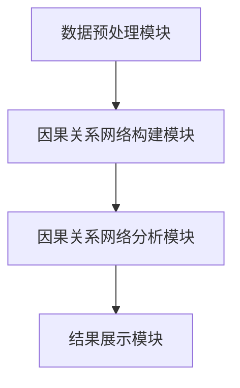
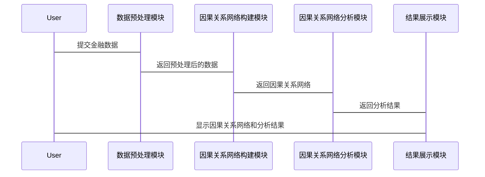

                 


# 《金融时间序列因果关系网络分析》

> 关键词：金融时间序列，因果关系网络，贝叶斯网络，格兰格因果检验，股票价格预测

> 摘要：本文深入探讨了金融时间序列因果关系网络分析的核心概念、算法原理、系统架构及实际应用。首先介绍了金融时间序列分析的基础知识和因果关系网络的基本概念，接着详细讲解了基于贝叶斯网络和格兰格因果检验的因果推断算法，随后分析了系统的架构设计与实现，最后通过股票价格预测案例展示了因果关系网络分析的实际应用。本文内容丰富，逻辑清晰，旨在为金融领域的从业者和技术人员提供理论与实践相结合的深度分析。

---

## 第一部分: 金融时间序列因果关系网络分析概述

### 第1章: 金融时间序列分析基础

#### 1.1 金融时间序列的基本概念

时间序列是指按照时间顺序排列的数据，其核心特征是数据的时序性和动态性。在金融领域，时间序列数据无处不在，例如股票价格、汇率、经济指标等。这些数据往往具有波动性、趋势性、周期性等特点，且受到多种复杂因素的影响。

**1.1.1 时间序列的定义与特点**

- **定义**：时间序列是指将某种指标按照时间顺序记录下来的数据序列。
- **特点**：
  - **趋势性**：数据呈现出长期向上的或向下的趋势。
  - **周期性**：数据呈现一定的周期性波动，如季度性、月度性等。
  - **随机性**：数据中包含不可预测的随机波动。
  - **相关性**：当前时刻的值可能与过去时刻的值相关。

**1.1.2 金融时间序列的常见类型**

- **股票价格**：反映市场对公司的估值变化。
- **汇率**：反映两种货币之间的兑换比例变化。
- **经济指标**：如GDP、CPI、失业率等，反映经济运行状况。

**1.1.3 金融时间序列分析的重要性**

- **投资决策**：通过分析历史数据，预测未来的价格走势，辅助投资决策。
- **风险管理**：识别市场的波动性，评估和管理金融风险。
- **政策制定**：帮助政策制定者理解经济运行规律，制定科学的政策。

#### 1.2 因果关系网络的基本概念

因果关系网络是一种用于描述变量之间因果关系的图论模型。在金融领域，因果关系网络可以帮助我们理解不同金融资产或经济指标之间的相互影响关系。

**1.2.1 因果关系与相关关系的区别**

- **相关关系**：变量之间存在统计上的关联，但不一定存在因果关系。
- **因果关系**：变量之间存在直接或间接的因果影响关系。

**1.2.2 金融领域中因果关系网络的应用场景**

- **股票价格预测**：分析不同股票之间的因果关系，预测价格走势。
- **市场风险评估**：识别系统性风险的来源和传播路径。
- **政策效果分析**：评估政策对经济指标的影响。

**1.2.3 因果关系网络的构建方法**

- **基于贝叶斯网络的方法**：通过概率推理构建因果关系网络。
- **基于格兰格因果检验的方法**：通过统计检验判断变量之间的因果关系。
- **基于关联规则挖掘的方法**：通过挖掘数据中的关联规则，构建因果关系网络。

---

## 第二部分: 金融时间序列因果关系网络的核心概念与联系

### 第2章: 金融时间序列因果关系网络的理论基础

#### 2.1 因果关系网络的数学模型

因果关系网络可以用图论和概率论的方法来描述。贝叶斯网络是一种有向无环图（DAG），用于表示变量之间的因果关系。

**2.1.1 贝叶斯网络与因果关系**

- **贝叶斯网络的定义**：贝叶斯网络是一种概率图模型，由节点和边组成。节点代表随机变量，边代表变量之间的因果关系。
- **贝叶斯网络的因果推断**：通过贝叶斯网络可以进行条件概率的计算，从而推断因果关系。

**2.1.2 格兰格因果检验的基本原理**

格兰格因果检验是一种用于判断时间序列变量之间是否存在因果关系的方法。其基本思想是，如果变量A对变量B有因果关系，则变量A的过去值可以显著预测变量B的当前值。

**2.1.3 信息论中的因果关系度量**

信息论中，因果关系可以通过信息量的变化来度量。如果变量A的变化能够提供关于变量B的信息量，则可以认为A对B有因果关系。

#### 2.2 金融时间序列因果关系网络的构建方法

**2.2.1 基于贝叶斯网络的因果推断**

- **贝叶斯网络的构建步骤**：
  1. 确定变量之间的因果关系。
  2. 构建贝叶斯网络的结构。
  3. 训练网络参数。
  4. 进行因果推断。

- **贝叶斯网络的因果推断示例**：
  例如，假设我们有股票A和股票B的数据，我们可以通过贝叶斯网络推断股票A对股票B的因果影响。

**2.2.2 基于格兰格因果检验的网络构建**

- **格兰格因果检验的步骤**：
  1. 对每个变量进行单位根检验，确保数据的平稳性。
  2. 构建VAR模型。
  3. 进行格兰格因果检验，判断变量之间的因果关系。

**2.2.3 基于关联规则挖掘的因果关系发现**

- **关联规则挖掘的基本原理**：通过挖掘数据中的关联规则，发现变量之间的因果关系。
- **关联规则挖掘的步骤**：
  1. 数据预处理。
  2. 确定关联规则的最小支持度和置信度。
  3. 挖掘关联规则。
  4. 分析关联规则，发现因果关系。

#### 2.3 因果关系网络的属性特征对比

**2.3.1 相关关系与因果关系的对比分析**

| 特性                | 相关关系                     | 因果关系                     |
|---------------------|----------------------------|----------------------------|
| 是否存在方向性      | 无方向性                    | 有方向性                    |
| 是否存在传递性      | 无传递性                    | 有传递性                    |
| 是否受变量间距离影响 | 受变量间距离影响            | 不受变量间距离影响          |

**2.3.2 因果关系网络的密度与节点度分布**

- **密度**：因果关系网络的密度反映了网络中因果关系的紧密程度。
- **节点度分布**：节点度反映了每个变量在因果关系网络中的影响力。

**2.3.3 因果关系网络的稳定性与鲁棒性**

- **稳定性**：因果关系网络在数据变化中的保持能力。
- **鲁棒性**：因果关系网络在噪声干扰中的抗干扰能力。

---

## 第三部分: 金融时间序列因果关系网络的算法原理

### 第3章: 基于贝叶斯网络的因果推断算法

#### 3.1 贝叶斯网络的基本原理

**3.1.1 贝叶斯网络的定义与结构**

贝叶斯网络是一种概率图模型，由节点和边组成。节点代表随机变量，边代表变量之间的因果关系。

**3.1.2 贝叶斯网络的变量关系表示**

- **条件概率公式**：$P(B|A) = \frac{P(A,B)}{P(A)}$
- **贝叶斯定理**：$P(B|A) = \frac{P(A|B)P(B)}{P(A)}$

**3.1.3 贝叶斯网络的推理方法**

- **前向推理**：从已知变量的值推导其他变量的条件概率。
- **反向推理**：从目标变量的条件概率推导已知变量的值。

#### 3.2 基于贝叶斯网络的因果推断算法

**3.2.1 因果关系的贝叶斯网络表示**

- **因果关系的有向无环图（DAG）**：通过DAG表示变量之间的因果关系。
- **贝叶斯网络的结构学习**：通过数据学习贝叶斯网络的结构。

**3.2.2 贝叶斯网络中的因果推理步骤**

1. **数据预处理**：对数据进行标准化、去噪等处理。
2. **构建贝叶斯网络结构**：通过结构学习算法确定变量之间的因果关系。
3. **训练网络参数**：通过最大似然估计或贝叶斯估计训练网络参数。
4. **进行因果推断**：通过贝叶斯推理进行因果推断。

**3.2.3 贝叶斯网络的因果推断实现**

- **Python代码示例**：
  ```python
  import numpy as np
  import pandas as pd
  from sklearn.preprocessing import StandardScaler
  from pgmpy.models import BayesianNetwork
  from pgmpy.estimators import MaximumLikelihoodEstimator
  from pgmpy.inference import VariableElimination

  # 数据预处理
  data = pd.read_csv('stock_data.csv')
  scaler = StandardScaler()
  data_scaled = scaler.fit_transform(data)

  # 构建贝叶斯网络结构
  model = BayesianNetwork([('A', 'B'), ('B', 'C')])
  model.fit(data_scaled, estimator=MaximumLikelihoodEstimator())

  # 进行因果推断
  inference = VariableElimination(model)
  result = inference.query(['C'], evidence={'A': 0.5})
  print(result)
  ```

**3.3 算法实现与案例分析**

**3.3.1 案例分析：股票价格因果关系网络构建**

- **数据来源**：假设我们有三只股票A、B、C的历史价格数据。
- **算法步骤**：
  1. 数据预处理：标准化数据。
  2. 构建贝叶斯网络结构：确定变量之间的因果关系。
  3. 训练网络参数：通过最大似然估计训练网络。
  4. 进行因果推断：分析变量之间的因果关系。

**3.3.2 贝叶斯网络的因果推断结果分析**

- **结果解读**：通过贝叶斯网络可以发现变量之间的因果关系，例如，股票A的价格变化会影响股票B的价格，进而影响股票C的价格。

---

## 第四部分: 金融时间序列因果关系网络的系统架构与实现

### 第4章: 系统分析与架构设计方案

#### 4.1 项目介绍

本项目旨在构建一个金融时间序列因果关系网络分析系统，通过贝叶斯网络和格兰格因果检验等方法，分析金融数据中的因果关系，辅助投资决策。

#### 4.2 系统功能设计

- **数据预处理模块**：对金融时间序列数据进行清洗、标准化等处理。
- **因果关系网络构建模块**：基于贝叶斯网络和格兰格因果检验，构建因果关系网络。
- **因果关系网络分析模块**：对因果关系网络进行分析，提取关键变量和因果关系路径。

#### 4.3 系统架构设计

**4.3.1 系统架构图**



**4.3.2 系统交互图**



#### 4.4 系统接口设计

- **数据预处理模块接口**：
  - 输入：原始金融时间序列数据
  - 输出：预处理后的数据
- **因果关系网络构建模块接口**：
  - 输入：预处理后的数据
  - 输出：因果关系网络
- **因果关系网络分析模块接口**：
  - 输入：因果关系网络
  - 输出：分析结果

---

## 第五部分: 项目实战与案例分析

### 第5章: 项目实战

#### 5.1 股票价格预测案例

**5.1.1 环境安装**

- **Python环境**：建议使用Anaconda
- **依赖库安装**：
  ```bash
  pip install numpy pandas matplotlib pgmpy
  ```

**5.1.2 系统核心实现源代码**

```python
import numpy as np
import pandas as pd
from sklearn.preprocessing import StandardScaler
from pgmpy.models import BayesianNetwork
from pgmpy.estimators import MaximumLikelihoodEstimator
from pgmpy.inference import VariableElimination

# 数据预处理
data = pd.read_csv('stock_data.csv')
scaler = StandardScaler()
data_scaled = scaler.fit_transform(data)

# 构建贝叶斯网络结构
model = BayesianNetwork([('A', 'B'), ('B', 'C')])
model.fit(data_scaled, estimator=MaximumLikelihoodEstimator())

# 进行因果推断
inference = VariableElimination(model)
result = inference.query(['C'], evidence={'A': 0.5})
print(result)
```

**5.1.3 代码应用解读与分析**

- **数据预处理**：对股票价格数据进行标准化处理，确保数据的可比性。
- **贝叶斯网络构建**：定义变量之间的因果关系，训练网络参数。
- **因果推断**：通过贝叶斯网络进行因果推断，分析变量之间的因果关系。

**5.1.4 案例分析**

假设我们有三只股票A、B、C的历史价格数据，我们通过贝叶斯网络构建因果关系网络，分析股票A对股票B的因果影响，进而分析股票B对股票C的因果影响。

---

## 第六部分: 最佳实践与总结

### 第6章: 最佳实践与总结

#### 6.1 小结

本文深入探讨了金融时间序列因果关系网络分析的核心概念、算法原理、系统架构及实际应用。通过贝叶斯网络和格兰格因果检验等方法，我们能够有效地分析金融数据中的因果关系，辅助投资决策和风险管理。

#### 6.2 注意事项

- **数据质量**：数据的准确性和完整性对分析结果至关重要。
- **模型选择**：根据具体问题选择合适的因果关系网络构建方法。
- **结果验证**：通过多种方法验证因果关系网络的可靠性和有效性。

#### 6.3 未来的研究方向

- **多模态数据融合**：结合文本数据、社交媒体数据等多种数据源，构建更全面的因果关系网络。
- **实时分析**：研究实时因果关系网络构建方法，实现金融市场的实时监控。
- **深度学习应用**：探索深度学习方法在因果关系网络构建中的应用。

---

## 结语

金融时间序列因果关系网络分析是一项复杂但极具价值的 task。通过本文的深入分析，我们不仅掌握了核心概念和算法原理，还通过实际案例展示了其在金融领域的广泛应用。希望本文能为金融领域的从业者和技术人员提供理论与实践相结合的深度分析，助力他们在金融数据分析和决策中取得更大的成功。

