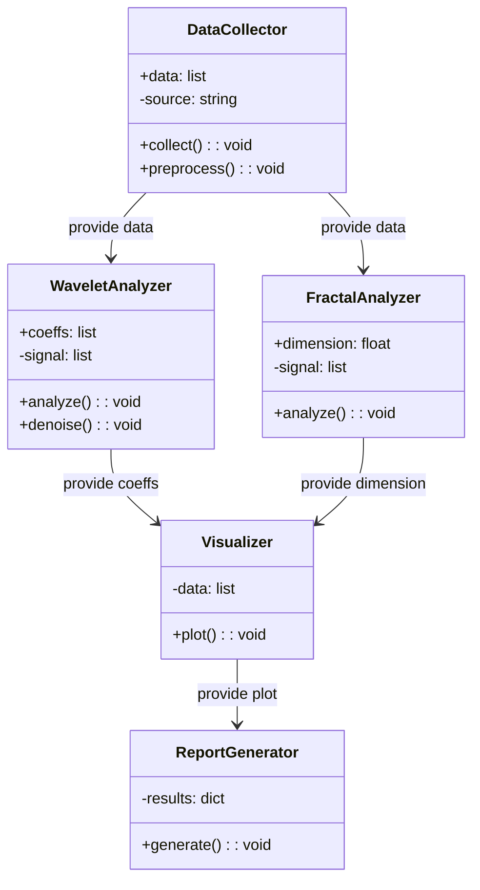
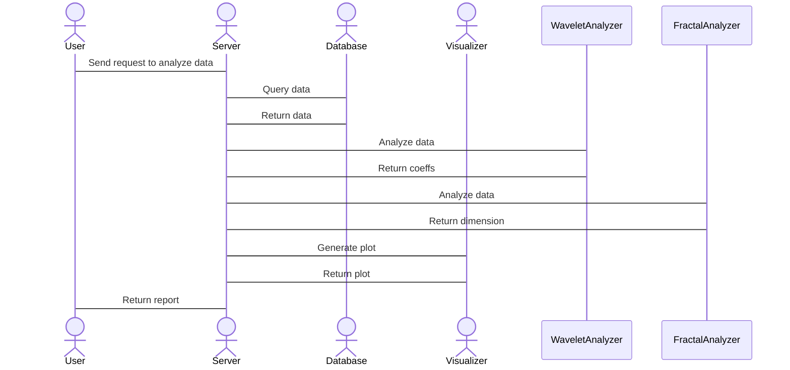

                 


# 《金融时间序列多尺度分析平台》

## 关键词：金融时间序列，多尺度分析，小波分析，分形分析，系统架构，数据分析

## 摘要：本文介绍了一种基于多尺度分析的金融时间序列分析平台，旨在通过深入分析金融数据的多时间尺度特征，帮助投资者和分析师更好地识别市场趋势和潜在机会。文章从背景与概述、核心概念、算法原理、系统架构、项目实战、最佳实践等多个方面展开，详细讲解了平台的设计思路、实现方法和实际应用。

---

# 第1章: 金融时间序列多尺度分析平台背景与概述

## 1.1 金融时间序列分析的背景与挑战

### 1.1.1 金融数据的特点
金融数据具有高度的动态性、随机性和复杂性，通常表现为以下特点：
- **非线性**：金融市场价格波动通常是非线性的，难以用简单的线性模型描述。
- **异形分布**：金融数据往往呈现厚尾、非正态分布的特点。
- **时间依赖性**：价格走势通常表现出较强的时间依赖性，即存在趋势和周期性。

### 1.1.2 时间序列分析在金融中的应用
时间序列分析在金融领域有广泛的应用，包括：
- **趋势预测**：通过分析历史价格数据，预测未来的价格走势。
- **异常检测**：识别市场中的异常波动，及时发现潜在风险。
- **交易信号生成**：基于时间序列分析结果，生成交易信号。

### 1.1.3 金融市场的复杂性与不确定性
金融市场是一个典型的复杂系统，受到多种因素的影响，包括经济指标、政策变化、市场情绪等。这些因素使得金融时间序列分析面临以下挑战：
- **多时间尺度特征**：金融数据在不同时间尺度上表现出不同的特征，例如分钟级别数据可能反映短期波动，而日级别数据可能反映长期趋势。
- **噪声干扰**：金融市场数据中通常存在大量噪声，如何有效提取有用信号是一个关键问题。
- **非平稳性**：金融时间序列通常是非平稳的，这使得传统的统计方法难以直接应用。

## 1.2 多尺度分析的必要性

### 1.2.1 不同时间尺度的金融数据特征
金融数据在不同时间尺度上具有不同的特征：
- **短期波动**：分钟级别或小时级别的数据通常反映市场的短期波动，受交易情绪和市场微观结构的影响较大。
- **中期趋势**：日级别或周级别的数据通常反映市场的中期趋势，受宏观经济指标和市场情绪的影响较大。
- **长期周期**：月级别或年级别的数据通常反映市场的长期周期，受经济周期和政策变化的影响较大。

### 1.2.2 多尺度分析的优势
多尺度分析可以通过在不同时间尺度上分解数据，提取不同层次的特征，从而提高分析的准确性和鲁棒性：
- **噪声抑制**：通过多尺度分解，可以有效去除噪声，突出有用信号。
- **特征提取**：在不同时间尺度上提取特征，可以更好地捕捉市场的多维度信息。
- **信号增强**：通过多尺度分析，可以增强有用信号的可检测性。

### 1.2.3 多尺度分析在金融投资中的应用
多尺度分析在金融投资中具有广泛的应用，例如：
- **风险控制**：通过分析不同时间尺度上的波动性，优化投资组合的风险控制。
- **交易策略开发**：基于多尺度分析结果，开发多时间框架的交易策略。
- **市场情绪分析**：通过多尺度分析，捕捉市场情绪的变化趋势。

## 1.3 金融时间序列多尺度分析平台的目标

### 1.3.1 平台的设计目标
金融时间序列多尺度分析平台的设计目标是：
- 提供一个高效、灵活的多尺度分析工具，支持用户在不同时间尺度上进行数据可视化、特征提取和信号分析。
- 提供丰富的算法库，支持多种多尺度分析方法，如小波分析、分形分析等。

### 1.3.2 平台的核心功能
金融时间序列多尺度分析平台的核心功能包括：
- 数据采集与预处理：支持多种数据源的接入，提供数据清洗和标准化功能。
- 多尺度数据可视化：支持在不同时间尺度上进行数据可视化，提供直观的图形界面。
- 多尺度特征提取：基于小波分析、分形分析等方法，提取不同时间尺度上的特征。
- 信号分析与预测：支持基于提取特征的信号分析和预测功能。

### 1.3.3 平台的预期价值
金融时间序列多尺度分析平台的预期价值包括：
- 帮助投资者和分析师更好地理解金融数据的多尺度特征，优化投资决策。
- 提供高效、灵活的分析工具，提高分析效率和准确性。
- 为金融研究提供技术支持，推动金融数据分析技术的发展。

## 1.4 本章小结
本章从金融时间序列分析的背景与挑战出发，介绍了多尺度分析的必要性，并提出了金融时间序列多尺度分析平台的设计目标和核心功能。通过多尺度分析，可以更好地捕捉金融数据的复杂特征，为金融投资和研究提供有力支持。

---

# 第2章: 金融时间序列多尺度分析的核心概念

## 2.1 时间序列分析的基本概念

### 2.1.1 时间序列的定义与特征
时间序列是指按照时间顺序排列的一组数据，通常表示为$X = \{x_1, x_2, \ldots, x_n\}$，其中$x_i$表示第$i$个时间点的观测值。时间序列分析的目标是通过分析这些观测值之间的关系，揭示隐藏在数据中的规律和特征。

### 2.1.2 时间序列分析的分类
时间序列分析可以分为以下几类：
1. **平稳时间序列分析**：假设时间序列是平稳的（即均值、方差等统计量在时间上不变），通常采用ARIMA（自回归积分滑动平均模型）等方法。
2. **非平稳时间序列分析**：假设时间序列是非平稳的，通常需要进行差分或其他预处理步骤，将其转化为平稳时间序列。
3. **趋势时间序列分析**：关注时间序列中的趋势成分，例如线性趋势或非线性趋势。
4. **周期性时间序列分析**：关注时间序列中的周期性成分，例如日周期、周周期等。

### 2.1.3 时间序列分析的关键指标
时间序列分析的关键指标包括：
- **均值**：表示时间序列的中心趋势。
- **方差**：表示时间序列的波动程度。
- **自相关系数**：表示时间序列中不同时间点之间的相关性。
- **偏自相关系数**：表示在控制其他时间点的影响下，时间序列中不同时间点之间的相关性。
- **白噪声检验**：用于判断时间序列是否为随机噪声。

## 2.2 多尺度分析的原理

### 2.2.1 多尺度分析的定义
多尺度分析是指在不同时间尺度上对数据进行分析，以捕捉数据在不同层次上的特征。多尺度分析的核心思想是通过分解数据到不同时间尺度，提取有用的信息，同时抑制噪声。

### 2.2.2 多尺度分析的数学基础
多尺度分析的数学基础包括：
1. **傅里叶变换**：用于将时间序列从时域转换到频域，分析数据的频率成分。
2. **小波分析**：通过小波变换，在不同尺度上分解数据，提取局部特征。
3. **分形分析**：通过计算分形维数，分析数据的复杂性和自相似性。

### 2.2.3 多尺度分析的实现方法
多尺度分析的实现方法包括：
1. **小波分析**：使用小波变换，在不同尺度上分解时间序列，提取不同层次的特征。
2. **分形分析**：通过计算分形维数，分析时间序列的复杂性和自相似性。
3. **多分辨率分析**：在不同分辨率上分析数据，提取不同层次的特征。

## 2.3 金融时间序列多尺度分析的关联性

### 2.3.1 时间序列与多尺度分析的关系
时间序列与多尺度分析的关系可以总结为：
- **时间序列分析**关注数据在时间上的变化规律，通常用于预测和信号检测。
- **多尺度分析**关注数据在不同时间尺度上的特征，通常用于信号分解和特征提取。

### 2.3.2 多尺度分析在金融时间序列中的应用
多尺度分析在金融时间序列中的应用包括：
1. **信号分解**：通过小波分析等方法，将时间序列分解为不同时间尺度上的成分，例如趋势成分和噪声成分。
2. **特征提取**：在不同时间尺度上提取特征，例如在短期波动中提取高频特征，在中期趋势中提取低频特征。
3. **噪声抑制**：通过多尺度分析，抑制噪声成分，突出有用信号。

### 2.3.3 多尺度分析的优缺点对比
多尺度分析的优缺点对比如下：

| **优缺点** | **详细说明** |
|------------|---------------|
| **优点**   | - 提高分析的准确性，通过多尺度分解，捕捉不同层次的特征。<br>- 提高分析的鲁棒性，通过多尺度分析，抑制噪声成分。 |
| **缺点**   | - 实施复杂性较高，需要掌握多尺度分析方法和工具。<br>- 计算资源消耗较大，尤其是对于大规模数据。 |

## 2.4 核心概念的ER实体关系图

```mermaid
erDiagram
    actor User {
        <to> id : integer
        <to> username : string
    }
    actor DataProvider {
        <to> id : integer
        <to> data_type : string
    }
    actor Analyst {
        <to> id : integer
        <to> username : string
    }
    relation "分析" {
        User --> DataProvider : 提供数据
        User --> Analyst : 分析数据
        DataProvider --> Analyst : 提供数据
    }
```

---

# 第3章: 金融时间序列多尺度分析的算法原理

## 3.1 多尺度分析的核心算法

### 3.1.1 小波分析
小波分析是一种常用的多尺度分析方法，通过小波变换将时间序列分解为不同尺度上的成分。小波分析的核心思想是通过选择合适的小波基函数，将时间序列分解为多个层次，每个层次对应不同的尺度。

#### 小波分析的步骤
1. **选择小波基函数**：根据数据特点选择合适的小波基函数，例如Daubechies小波、Mexican Hat小波等。
2. **小波变换**：对时间序列进行小波变换，得到不同尺度上的系数。
3. **阈值去噪**：对小波系数进行阈值处理，去除噪声成分。
4. **小波逆变换**：将去噪后的系数还原为时间序列。

#### 小波分析的数学模型
小波变换的数学公式可以表示为：
$$
W_{\psi}(t) = \sum_{k=-\infty}^{\infty} x(k) \psi_{j}(t - k)
$$
其中，$W_{\psi}(t)$表示小波变换系数，$\psi_{j}(t)$表示小波基函数在尺度$j$上的伸缩和平移。

### 3.1.2 分形分析
分形分析是一种用于描述数据复杂性的方法，通过计算分形维数来衡量数据的自相似性和复杂性。

#### 分形分析的步骤
1. **数据预处理**：对时间序列进行标准化或归一化处理。
2. **计算分形维数**：使用盒计数法、曲线长度法等方法计算分形维数。
3. **分析分形特征**：根据分形维数分析数据的复杂性和自相似性。

#### 分形分析的数学模型
分形维数的数学公式可以表示为：
$$
D = \frac{\ln N}{\ln \frac{L}{\epsilon}}
$$
其中，$N$表示在尺度$\epsilon$下划分的区域数量，$L$表示划分的总长度，$D$表示分形维数。

---

## 3.2 金融时间序列多尺度分析的实现流程

### 3.2.1 数据预处理
1. **数据清洗**：去除缺失值、异常值等。
2. **数据标准化**：对数据进行标准化或归一化处理，使其具有相似的尺度。

### 3.2.2 数据分解
1. **小波分解**：使用小波分析将时间序列分解为不同尺度上的成分。
2. **分形分解**：使用分形分析方法，计算时间序列的分形维数。

### 3.2.3 特征提取
1. **提取小波系数**：从小波分解中提取不同尺度上的小波系数。
2. **提取分形特征**：从分形分析中提取分形维数等特征。

### 3.2.4 特征分析
1. **特征可视化**：将不同尺度上的特征进行可视化，例如绘制不同尺度上的小波系数图。
2. **特征分析与对比**：对不同尺度上的特征进行对比分析，识别有用信号。

---

## 3.3 金融时间序列多尺度分析的代码实现

### 3.3.1 Python实现小波分析

```python
import pywt

def wavelet_analysis(signal, wavelet='db4'):
    # 小波分解
    coeffs = pywt.wavedec(signal, wavelet)
    # 计算阈值
    threshold = np.sqrt(np.mean(np.square(coeffs[-1])))
    # 小波去噪
    for i in range(len(coeffs)):
        if i == 0:
            coeffs[i] = coeffs[i] * 0  # 去除趋势成分
        else:
            coeffs[i] = pywt.threshold(coeffs[i], threshold)
    # 小波重构
    denoised_signal = pywt.waverec(coeffs, wavelet)
    return denoised_signal
```

### 3.3.2 Python实现分形分析

```python
import numpy as np

def calculate_fractal_dimension(signal):
    # 箱计数法计算分形维数
    n = len(signal)
    # 计算盒计数
    box_counts = []
    for r in np.arange(1, n):
        boxes = []
        for i in range(n):
            if i % r == 0:
                boxes.append(1)
            else:
                boxes.append(0)
        boxes = np.array(boxes, dtype=int)
        box_counts.append(sum(boxes))
    box_counts = np.array(box_counts)
    # 计算分形维数
    D = np.log(box_counts).sum() / np.log(n).sum()
    return D
```

---

# 第4章: 金融时间序列多尺度分析的系统分析与架构设计

## 4.1 问题场景介绍

### 4.1.1 问题背景
金融时间序列数据具有复杂性、非平稳性和多尺度性等特点，传统的单尺度分析方法难以有效捕捉数据的特征。

### 4.1.2 问题描述
如何在不同时间尺度上对金融时间序列数据进行分析，提取有用特征，支持投资决策和风险控制。

## 4.2 系统功能设计

### 4.2.1 功能模块设计
金融时间序列多尺度分析系统的功能模块包括：
- 数据采集模块：负责数据的采集和预处理。
- 数据分析模块：负责多尺度分析，包括小波分析和分形分析。
- 数据可视化模块：负责分析结果的可视化展示。
- 报告生成模块：负责生成分析报告。

### 4.2.2 功能模块的类图设计



## 4.3 系统架构设计

### 4.3.1 系统架构图


### 4.3.2 系统接口设计
系统接口包括：
- 数据接口：提供数据采集和预处理功能。
- 分析接口：提供小波分析和分形分析功能。
- 可视化接口：提供数据可视化功能。
- 报告接口：提供报告生成功能。

### 4.3.3 系统交互流程



---

# 第5章: 金融时间序列多尺度分析的项目实战

## 5.1 环境安装

### 5.1.1 安装Python环境
```bash
python --version
pip install numpy
pip install matplotlib
pip install pywt
```

### 5.1.2 安装依赖库
```bash
pip install pandas
pip install scikit-learn
pip install plotly
```

## 5.2 系统核心实现

### 5.2.1 数据采集与预处理
```python
import pandas as pd
import numpy as np

# 数据采集
data = pd.read_csv('financial_data.csv')
# 数据预处理
data_clean = data.dropna()
data_normal = (data_clean - data_clean.mean()) / data_clean.std()
```

### 5.2.2 多尺度分析实现
```python
import pywt

def perform_wavelet_analysis(signal):
    # 小波分解
    coeffs = pywt.wavedec(signal, 'db4')
    # 小波去噪
    threshold = np.sqrt(np.mean(np.square(coeffs[-1])))
    coeffs_denoised = [pywt.threshold(c, threshold) for c in coeffs]
    # 小波重构
    signal_denoised = pywt.waverec(coeffs_denoised, 'db4')
    return signal_denoised
```

### 5.2.3 可视化实现
```python
import matplotlib.pyplot as plt

def visualize_results(original_signal, denoised_signal):
    plt.figure(figsize=(10, 6))
    plt.plot(original_signal, label='Original Signal')
    plt.plot(denoised_signal, label='Denoised Signal')
    plt.xlabel('Time')
    plt.ylabel('Value')
    plt.legend()
    plt.show()
```

## 5.3 实际案例分析

### 5.3.1 数据来源与说明
假设我们使用的是某股票的历史收盘价数据，数据时间为每天收盘价，数据范围为过去一年。

### 5.3.2 数据分析与结果
通过小波分析，我们可以在不同尺度上观察股票价格的变化：
- **短期波动**：分钟级别和小时级别数据反映市场的短期波动。
- **中期趋势**：日级别和周级别数据反映市场的中期趋势。
- **长期周期**：月级别和年级别数据反映市场的长期周期。

### 5.3.3 数据可视化与解读
通过可视化分析，我们可以观察到不同尺度上的特征：
- **短期波动**：高频成分反映了市场的交易情绪和微观结构。
- **中期趋势**：低频成分反映了市场的中期趋势和宏观经济因素。
- **长期周期**：更低频成分反映了市场的长期周期和政策变化。

---

# 第6章: 金融时间序列多尺度分析的最佳实践

## 6.1 小结
金融时间序列多尺度分析平台通过在不同时间尺度上分析数据，能够更好地捕捉金融数据的复杂特征，为金融投资和研究提供有力支持。

## 6.2 注意事项
在实际应用中，需要注意以下几点：
1. **数据质量**：确保数据的完整性和准确性。
2. **算法选择**：根据具体需求选择合适的多尺度分析方法。
3. **计算资源**：多尺度分析通常需要较大的计算资源，尤其是在处理大规模数据时。

## 6.3 拓展阅读
推荐以下拓展阅读资料：
- 《Wavelet Analysis and Its Applications》
- 《Fractal Geometry: Mathematical Foundations and Applications》
- 《Financial Time Series Analysis: Methods and Applications》

---

# 结语
金融时间序列多尺度分析平台是一个复杂的系统工程，需要结合多尺度分析方法和系统架构设计，才能有效提取金融数据的特征，支持投资决策和风险控制。通过本文的介绍，希望能够为读者提供一个清晰的思路和方法，帮助他们在金融数据分析领域取得更好的成果。

