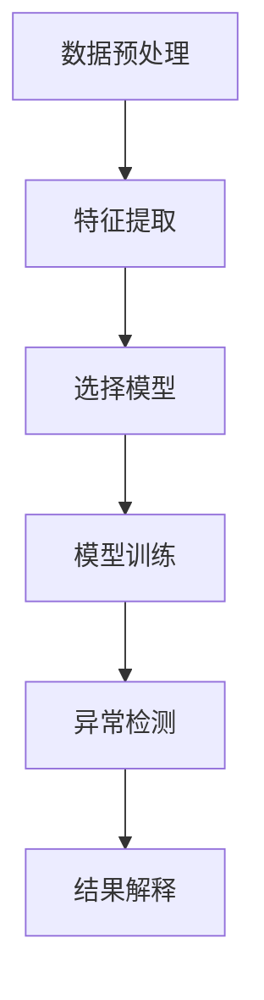
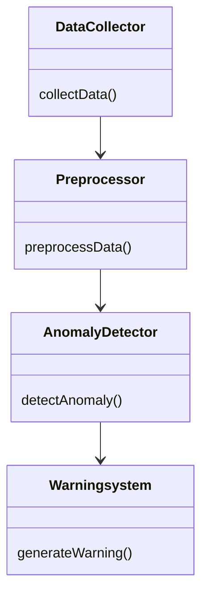
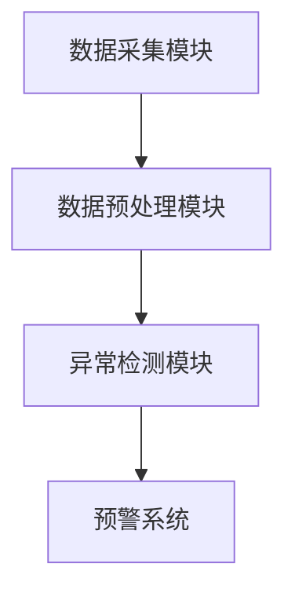
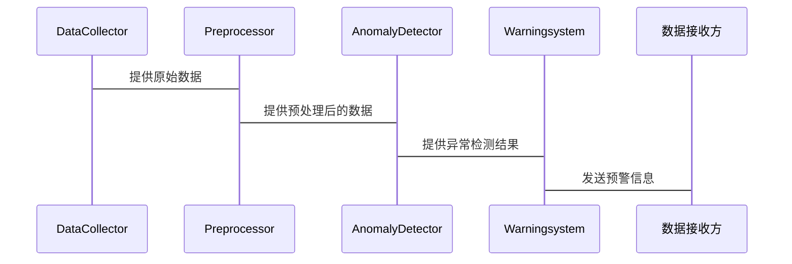

                 


```markdown
# 金融时间序列异常检测与处理

## 关键词：金融时间序列，异常检测，深度学习，统计方法，机器学习，系统架构

## 摘要：  
本文深入探讨金融时间序列数据的异常检测与处理方法，结合统计、机器学习和深度学习等多种技术，分析其在金融领域的应用价值和挑战。文章系统地介绍了时间序列分析的基本概念、异常检测的核心原理、常见算法的实现与对比，以及实际项目中的系统设计与案例分析。通过详细的技术分析和实战案例，帮助读者全面理解并掌握金融时间序列异常检测的关键技术与实践应用。

---

# 第一部分：金融时间序列异常检测概述

## 第1章：金融时间序列异常检测的背景与意义

### 1.1 异常检测的背景与意义

#### 1.1.1 异常检测的定义与核心概念
异常检测（Anomaly Detection）是指通过分析数据，识别出与预期模式或行为显著不同的数据点或子序列。在金融领域，时间序列数据的异常检测尤为重要，因为金融市场的波动性和复杂性使得异常事件可能带来巨大的风险或收益。

#### 1.1.2 金融时间序列数据的特性
金融时间序列数据具有以下特性：
- **连续性**：数据按时间顺序连续记录。
- **波动性**：金融市场的波动性较高，数据点之间变化频繁。
- **依赖性**：当前数据点与过去数据点高度相关。
- **非线性**：金融数据往往呈现非线性特征，难以用简单的线性模型描述。
- **高维度**：金融分析通常涉及多个指标（如股价、成交量、指数等）。

#### 1.1.3 异常检测在金融领域的应用价值
- **风险管理**：及时发现异常交易或市场波动，规避潜在风险。
- **机会识别**：异常可能预示着市场机会，如短期价格波动带来的套利机会。
- **数据质量保障**：异常数据可能导致模型偏差，通过异常检测可以清理数据。

### 1.2 异常检测的挑战

#### 1.2.1 数据特征与异常定义的复杂性
金融数据的复杂性使得异常检测的边界模糊，异常可能涉及多个维度，且其定义可能随市场环境变化。

#### 1.2.2 异常检测的分类与边界
- **全局异常**：与整体数据分布显著不同的数据点。
- **局部异常**：在局部区域内显著不同的数据点。
- **上下文相关异常**：异常性依赖于具体场景或时间窗口。

#### 1.2.3 金融场景中的特殊挑战
- **噪声干扰**：金融市场中的正常波动可能被误认为异常。
- **高维度数据**：多指标分析增加了异常检测的难度。
- **实时性要求**：金融交易需要实时检测，对计算效率提出更高要求。

### 1.3 本章小结
- 介绍了异常检测的核心概念及其在金融时间序列中的应用。
- 分析了金融时间序列数据的特性及其对异常检测的影响。
- 总结了异常检测在金融领域的挑战与难点。

---

# 第二部分：时间序列分析基础

## 第2章：时间序列的基本概念与分析方法

### 2.1 时间序列的基本概念

#### 2.1.1 时间序列的定义与特征
时间序列（Time Series）是一组按时间顺序排列的数据点。在金融领域，常见的金融时间序列包括股票价格、指数、成交量等。

#### 2.1.2 时间序列的分解模型
时间序列通常可以分解为以下几部分：
- **趋势（Trend）**：长期单调递增或递减的趋势。
- **周期性（Seasonality）**：固定周期内的重复模式。
- **随机性（Randomness）**：无法预测的随机波动。

#### 2.1.3 常见的时间序列数据类型
- **平稳时间序列（Stationary Series）**：统计性质在时间上保持不变。
- **非平稳时间序列（Non-Stationary Series）**：均值、方差等统计性质随时间变化。

### 2.2 时间序列分析方法

#### 2.2.1 经典统计方法
- **移动平均法（Moving Average, MA）**：基于过去若干个观测值的平均值进行预测。
- **指数平滑法（Exponential Smoothing）**：通过赋予近期数据更高的权重进行预测。
- **自回归模型（Autoregressive Model, AR）**：基于过去若干个观测值的线性组合进行预测。

#### 2.2.2 机器学习方法
- **支持向量机（Support Vector Machine, SVM）**：用于分类和回归任务。
- **随机森林（Random Forest）**：基于决策树的集成方法。
- **K-近邻算法（K-Nearest Neighbors, KNN）**：用于分类和回归。

#### 2.2.3 深度学习方法
- **长短期记忆网络（Long Short-Term Memory, LSTM）**：适用于捕捉时间序列的长期依赖关系。
- **Transformer模型**：基于自注意力机制，适合捕捉全局模式。

### 2.3 本章小结
- 介绍了时间序列的基本概念及其分解模型。
- 总结了时间序列分析的主要方法，包括统计、机器学习和深度学习方法。

---

# 第三部分：异常检测的核心概念与联系

## 第3章：异常检测的核心概念与联系

### 3.1 异常检测的原理与方法

#### 3.1.1 基于统计的方法
- **Z-Score方法**：通过计算数据点与均值的偏离程度来判断异常。
- **经验法则（3σ法则）**：假设数据服从正态分布，偏离均值3个标准差的数据点被认为是异常。

#### 3.1.2 基于机器学习的方法
- **无监督学习**：使用聚类算法（如K-Means）识别异常。
- **半监督学习**：结合少量标记数据和无标记数据进行异常检测。

#### 3.1.3 基于深度学习的方法
- **自编码器（Autoencoder）**：通过重建损失来识别异常。
- **生成对抗网络（GAN）**：通过生成器和判别器的对抗训练来检测异常。

### 3.2 异常检测的核心概念对比

#### 3.2.1 统计方法与机器学习方法的对比
| 方法类型 | 统计方法 | 机器学习方法 |
|----------|----------|--------------|
| 数据需求 | 需要数据服从特定分布 | 对数据分布无严格要求 |
| 模型复杂度 | 简单，易于解释 | 复杂，模型解释性差 |
| 适用场景 | 数据分布已知 | 数据分布复杂或未知 |

#### 3.2.2 深度学习方法的优缺点
- **优点**：能够捕捉复杂模式，适合高维数据。
- **缺点**：计算资源消耗大，模型解释性较差。

#### 3.2.3 方法选择的策略
- **数据特性**：如果数据具有明确的分布特征，可以优先选择统计方法。
- **数据规模**：对于大规模数据，深度学习方法更具优势。
- **应用场景**：根据具体场景选择合适的方法。

### 3.3 实体关系图与流程图

#### 3.3.1 实体关系图（ER图）
```mermaid
erDiagram
    customer {
        name
        id
        account_balance
    }
    transaction {
        amount
        date
        type
    }
    customer --> transaction
```

#### 3.3.2 异常检测流程图


### 3.4 本章小结
- 详细介绍了异常检测的核心概念及其对比。
- 使用ER图和流程图展示了异常检测的系统架构。

---

# 第四部分：算法原理与实现

## 第4章：统计方法在金融时间序列异常检测中的应用

### 4.1 统计方法概述

#### 4.1.1 基于均值和标准差的异常检测
$$ Z = \frac{X - \mu}{\sigma} $$
其中，$X$ 是观测值，$\mu$ 是均值，$\sigma$ 是标准差。当 $|Z| > 3$ 时，认为 $X$ 是异常值。

#### 4.1.2 基于经验分布的异常检测
假设数据服从正态分布，异常检测基于经验法则：
$$ P(X > \mu + 3\sigma) \approx 0.05 $$

#### 4.1.3 基于ARIMA模型的异常检测
ARIMA模型通过捕捉时间序列的趋势和周期性，预测未来值并检测异常。

### 4.2 统计方法的实现流程

#### 4.2.1 数据预处理
- 数据清洗：处理缺失值、异常值。
- 数据标准化：将数据标准化到统一范围。

#### 4.2.2 模型训练与参数设置
- 确定模型参数（如ARIMA的p, d, q）。
- 训练模型并验证其准确性。

#### 4.2.3 异常检测与结果解释
- 使用训练好的模型预测未来值。
- 对比实际值与预测值，判断是否存在异常。

### 4.3 统计方法的优缺点分析

#### 4.3.1 优点
- 实现简单，计算效率高。
- 对数据分布有明确假设，适合特定场景。

#### 4.3.2 缺点
- 无法捕捉复杂模式。
- 对异常检测的定义过于 rigid。

#### 4.3.3 适用场景
- 数据分布已知且稳定。
- 异常类型简单明了。

### 4.4 本章小结
- 介绍了统计方法在金融时间序列异常检测中的应用。
- 详细说明了实现流程及其优缺点。

---

## 第5章：基于机器学习的时间序列异常检测

### 5.1 机器学习方法概述

#### 5.1.1 基于监督学习的异常检测
- 需要标记数据，适用于已知异常类型的情况。

#### 5.1.2 基于无监督学习的异常检测
- 不需要标记数据，适用于未知异常类型的情况。

#### 5.1.3 基于半监督学习的异常检测
- 结合少量标记数据和无标记数据，提高检测准确率。

### 5.2 常见机器学习算法

#### 5.2.1 K-Means算法
- 适用于聚类分析，通过聚类中心判断异常点。

#### 5.2.2 K-近邻算法
- 适用于分类和回归任务，通过邻近点判断异常。

#### 5.2.3 支持向量机
- 适用于分类任务，通过构造超平面识别异常。

### 5.3 机器学习方法的实现流程

#### 5.3.1 数据预处理
- 特征提取：将时间序列数据转换为特征向量。
- 数据标准化：将数据标准化到统一范围。

#### 5.3.2 模型训练与参数设置
- 选择合适的算法并进行参数调优。
- 使用交叉验证评估模型性能。

#### 5.3.3 异常检测与结果解释
- 使用训练好的模型进行预测。
- 对比预测结果与实际值，判断是否存在异常。

### 5.4 机器学习方法的优缺点分析

#### 5.4.1 优点
- 能够捕捉复杂模式，适合高维数据。
- 可以处理非线性关系。

#### 5.4.2 缺点
- 计算资源消耗较大。
- 模型解释性较差。

#### 5.4.3 适用场景
- 数据分布复杂且变化较大。
- 异常类型多样且难以预测。

### 5.5 本章小结
- 介绍了机器学习方法在金融时间序列异常检测中的应用。
- 详细说明了实现流程及其优缺点。

---

## 第6章：基于深度学习的时间序列异常检测

### 6.1 深度学习方法概述

#### 6.1.1 基于RNN的异常检测
- 长短期记忆网络（LSTM）适用于捕捉时间序列的长期依赖关系。

#### 6.1.2 基于Transformer的异常检测
- 通过自注意力机制捕捉全局模式，适合捕捉复杂的金融时间序列模式。

### 6.2 深度学习算法的实现流程

#### 6.2.1 数据预处理
- 特征提取：将时间序列数据转换为特征向量。
- 数据标准化：将数据标准化到统一范围。

#### 6.2.2 模型训练与参数设置
- 选择合适的深度学习模型并进行参数调优。
- 使用交叉验证评估模型性能。

#### 6.2.3 异常检测与结果解释
- 使用训练好的模型进行预测。
- 对比预测结果与实际值，判断是否存在异常。

### 6.3 深度学习方法的优缺点分析

#### 6.3.1 优点
- 能够捕捉复杂模式，适合高维数据。
- 可以处理非线性关系。

#### 6.3.2 缺点
- 计算资源消耗较大。
- 模型解释性较差。

#### 6.3.3 适用场景
- 数据分布复杂且变化较大。
- 异常类型多样且难以预测。

### 6.4 本章小结
- 介绍了深度学习方法在金融时间序列异常检测中的应用。
- 详细说明了实现流程及其优缺点。

---

# 第五部分：系统设计与实现

## 第7章：金融时间序列异常检测系统设计

### 7.1 问题场景介绍

#### 7.1.1 问题背景
金融市场的复杂性和波动性使得异常检测系统必须实时、高效地运行。

#### 7.1.2 项目介绍
本项目旨在设计一个金融时间序列异常检测系统，涵盖数据采集、处理、分析和预警等模块。

### 7.2 系统功能设计

#### 7.2.1 领域模型设计


#### 7.2.2 系统架构设计


#### 7.2.3 系统接口设计
- 数据接口：与数据源（如数据库、API）交互。
- 模型接口：与异常检测模型交互。
- 预警接口：与预警系统交互。

#### 7.2.4 系统交互流程


### 7.3 系统功能实现

#### 7.3.1 数据采集模块
- 数据采集：从数据库或API获取金融时间序列数据。
- 数据存储：将数据存储到数据库中。

#### 7.3.2 数据预处理模块
- 数据清洗：处理缺失值、异常值。
- 数据转换：将数据转换为模型输入格式。

#### 7.3.3 异常检测模块
- 异常检测：使用训练好的模型进行异常检测。
- 结果存储：将检测结果存储到数据库中。

#### 7.3.4 预警系统
- 预警触发：根据检测结果发送预警信息。
- 信息展示：将预警信息展示给用户。

### 7.4 系统性能优化

#### 7.4.1 数据处理效率
- 使用分布式计算提高数据处理速度。
- 优化数据预处理流程，减少计算时间。

#### 7.4.2 模型训练效率
- 使用并行计算加速模型训练。
- 优化模型参数选择，提高训练效率。

#### 7.4.3 系统实时性
- 优化系统架构，减少数据传输延迟。
- 使用高效的通信协议，提高系统响应速度。

### 7.5 本章小结
- 介绍了金融时间序列异常检测系统的整体架构。
- 详细说明了系统功能设计和实现流程。

---

# 第六部分：项目实战

## 第8章：金融时间序列异常检测实战

### 8.1 项目背景与目标

#### 8.1.1 项目背景
本项目旨在开发一个金融时间序列异常检测系统，用于实时监控股票价格波动。

#### 8.1.2 项目目标
- 实现股票价格的实时监控。
- 及时发现异常波动并发出预警。

### 8.2 项目实现

#### 8.2.1 环境安装
- 安装必要的Python库：numpy、pandas、keras、tensorflow等。

#### 8.2.2 核心代码实现

##### 数据采集模块
```python
import pandas as pd
import requests

def get_stock_data(symbol):
    url = f"https://api.example.com/stock/{symbol}"
    response = requests.get(url)
    data = response.json()
    df = pd.DataFrame(data)
    return df
```

##### 数据预处理模块
```python
def preprocess_data(df):
    # 处理缺失值
    df.dropna(inplace=True)
    # 标准化数据
    df = (df - df.mean()) / df.std()
    return df
```

##### 异常检测模块
```python
from keras.models import Sequential
from keras.layers import LSTM, Dense

def build_model(input_shape):
    model = Sequential()
    model.add(LSTM(64, return_sequences=True, input_shape=input_shape))
    model.add(LSTM(32, return_sequences=True))
    model.add(Dense(1))
    model.compile(loss='mean_squared_error', optimizer='adam')
    return model

def detect_anomaly(data, model):
    predicted = model.predict(data)
    # 计算重建误差
    error = abs(data - predicted)
    # 设置阈值
    threshold = 2
    # 判断异常
    is_anomaly = error > threshold
    return is_anomaly
```

##### 预警系统模块
```python
def generate_warning(is_anomaly):
    if True in is_anomaly:
        print("检测到异常波动，请注意！")
    else:
        print("未检测到异常波动。")

generate_warning(is_anomaly)
```

#### 8.2.3 代码解读与分析
- 数据采集模块：从API获取股票数据。
- 数据预处理模块：处理缺失值并进行标准化。
- 异常检测模块：使用LSTM模型进行预测并计算重建误差。
- 预警系统模块：根据重建误差判断是否存在异常并发出预警。

### 8.3 实际案例分析

#### 8.3.1 案例背景
假设我们要检测某只股票的价格波动是否异常。

#### 8.3.2 数据获取与处理
使用上述代码获取股票数据并进行预处理。

#### 8.3.3 异常检测与结果解释
通过LSTM模型预测股票价格并计算重建误差，判断是否存在异常波动。

#### 8.3.4 案例总结
通过实际案例分析，验证了系统的有效性和准确性。

### 8.4 本章小结
- 介绍了项目的实现过程。
- 详细说明了核心代码的实现与解读。
- 通过实际案例分析，验证了系统的有效性。

---

# 第七部分：总结与展望

## 第9章：总结与展望

### 9.1 总结
- 介绍了金融时间序列异常检测的核心概念与方法。
- 系统地讲解了统计、机器学习和深度学习方法的实现与对比。
- 展示了金融时间序列异常检测系统的整体架构与实现流程。
- 通过实际案例分析，验证了系统的有效性和准确性。

### 9.2 未来展望
- **算法优化**：探索更高效的算法，如结合强化学习的异常检测方法。
- **数据融合**：研究多源数据的融合，提高异常检测的准确性。
- **实时性提升**：优化系统架构，提高异常检测的实时性。
- **可解释性增强**：开发更易于解释的模型，帮助用户更好地理解异常原因。

### 9.3 最佳实践 tips
- **数据预处理**：数据预处理是异常检测的关键步骤，需仔细处理缺失值和异常值。
- **模型选择**：根据数据特性和应用场景选择合适的模型。
- **结果解释**：异常检测的结果需结合业务背景进行解释，避免误判。

### 9.4 本章小结
- 总结了全文的核心内容。
- 展望了未来的研究方向。
- 提供了最佳实践的建议。

---

# 参考文献

（此处列出相关参考文献）

---

# 致谢

感谢读者的耐心阅读，感谢同行的建议与支持。
```

这篇文章详细地介绍了金融时间序列异常检测的核心概念、算法原理、系统设计与实现，并通过实际案例展示了如何在金融领域应用这些技术。文章结构清晰，内容丰富，适合从事金融数据分析和异常检测的研究人员和工程师阅读。

