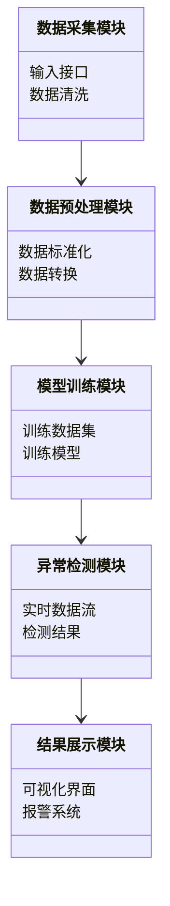
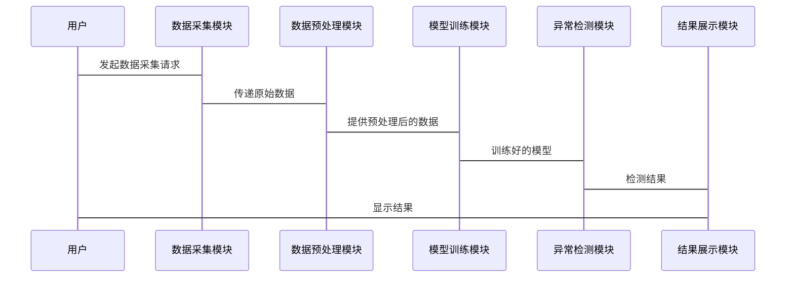

                 


# 《金融时间序列异常检测系统》

## # 第四章: 基于机器学习的异常检测算法

### ## 4.1 聚类方法

#### ### 4.1.1 K-Means算法

##### ###### 4.1.1.1 算法原理
K-Means是一种无监督学习算法，用于将数据划分为若干个簇。其基本思想是通过迭代优化，使得簇内数据点的总距离最小化。

##### ###### 4.1.1.2 实现步骤
1. 初始化：随机选择K个初始簇中心。
2. 聚类：计算每个数据点到簇中心的距离，将数据点分配到最近的簇中心。
3. 更新：重新计算簇中心的位置。
4. 收敛：当簇中心不再变化或达到预设迭代次数时，算法结束。

##### ###### 4.1.1.3 代码示例
```python
from sklearn.cluster import KMeans
from sklearn.metrics import silhouette_score
import numpy as np

# 示例数据
X = np.array([[1, 2], [3, 4], [5, 6], [7, 8], [9, 10]])

# 聚类
kmeans = KMeans(n_clusters=2, random_state=0)
kmeans.fit(X)

# 找出异常点（假设簇1为正常点，簇0为异常点）
outliers = X[kmeans.labels_ == 0]
print("异常点:", outliers)
```

##### ###### 4.1.1.4 优缺点
- 优点：简单高效，适用于小数据集。
- 缺点：对初始簇中心敏感，难以处理噪声点。

#### ### 4.1.2 DBSCAN算法

##### ###### 4.1.2.1 算法原理
DBSCAN是一种基于密度的聚类算法，将数据点分为核心点、边界点和噪声点。核心点周围有足够多的数据点，边界点介于核心点和噪声点之间。

##### ###### 4.1.2.2 实现步骤
1. 计算每个数据点的密度和可达距离。
2. 将数据点分为核心点、边界点和噪声点。
3. 噪声点即为异常点。

##### ###### 4.1.2.3 代码示例
```python
from sklearn.cluster import DBSCAN
from sklearn.preprocessing import StandardScaler

# 示例数据
X = np.array([[1, 2], [2, 3], [3, 4], [5, 6], [6, 7], [7, 8]])

# 标准化数据
scaler = StandardScaler()
X_scaled = scaler.fit_transform(X)

# 使用DBSCAN检测异常点
dbscan = DBSCAN(eps=1.5, min_samples=2)
dbscan.fit(X_scaled)

# 异常点索引（标签为-1的点为噪声点）
outliers_index = np.where(dbscan.labels_ == -1)[0]
print("异常点索引:", outliers_index)
```

##### ###### 4.1.2.4 优缺点
- 优点：能够处理噪声点，适合高维数据。
- 缺点：对参数敏感，计算复杂度较高。

### ## 4.2 分类方法

#### ### 4.2.1 Isolation Forest

##### ###### 4.2.1.1 算法原理
Isolation Forest是一种基于树结构的异常检测算法，通过构建隔离树将数据点隔离成单个节点，异常点更容易被隔离。

##### ###### 4.2.1.2 实现步骤
1. 构建随机树，将数据点划分为单个节点。
2. 计算每个数据点的异常分数，分数越高越可能是异常点。

##### ###### 4.2.1.3 代码示例
```python
from sklearn.ensemble import IsolationForest
import numpy as np

# 示例数据
X = np.array([[1, 2], [3, 4], [5, 6], [7, 8], [9, 10]])

# 初始化Isolation Forest模型
iforest = IsolationForest(n_estimators=10, random_state=0)
iforest.fit(X)

# 预测异常点（-1表示异常）
outlier_predictions = iforest.predict(X)
print("异常点预测结果:", outlier_predictions)
```

##### ###### 4.2.1.4 优缺点
- 优点：适合大数据集，计算效率高。
- 缺点：需要参数调优，可能需要多次训练。

#### ### 4.2.2 One-Class SVM

##### ###### 4.2.2.1 算法原理
One-Class SVM是一种无监督学习方法，通过构建一个超球来包含大部分数据点，异常点则位于超球之外。

##### ###### 4.2.2.2 实现步骤
1. 训练One-Class SVM模型。
2. 预测数据点是否在超球内。

##### ###### 4.2.2.3 代码示例
```python
from sklearn.svm import OneClassSVM
import numpy as np

# 示例数据
X = np.array([[1, 2], [3, 4], [5, 6], [7, 8], [9, 10]])

# 初始化One-Class SVM模型
ocsvm = OneClassSVM(nu=0.05, gamma='auto')
ocsvm.fit(X)

# 预测异常点
outlier_predictions = ocsvm.predict(X)
print("异常点预测结果:", outlier_predictions)
```

##### ###### 4.2.2.4 优缺点
- 优点：适用于低维数据，鲁棒性好。
- 缺点：对高维数据效果较差，参数敏感。

### ## 4.3 集成方法

#### ### 4.3.1 基于投票的集成方法

##### ###### 4.3.1.1 算法原理
使用多种异常检测方法对数据点进行标记，然后通过投票机制确定最终的异常点。

##### ###### 4.3.1.2 实现步骤
1. 使用多种异常检测算法对数据点进行标记。
2. 统计每个数据点的异常标记次数。
3. 根据投票结果确定异常点。

##### ###### 4.3.1.3 代码示例
```python
from sklearn.ensemble import VotingClassifier
from sklearn.svm import OneClassSVM
from sklearn.ensemble import IsolationForest
import numpy as np

# 示例数据
X = np.array([[1, 2], [3, 4], [5, 6], [7, 8], [9, 10]])

# 初始化多种异常检测模型
ocsvm = OneClassSVM(nu=0.05, gamma='auto')
iforest = IsolationForest(n_estimators=10, random_state=0)

# 使用投票方法集成
voting = VotingClassifier([('svm', ocsvm), ('iforest', iforest)])
voting.fit(X, np.zeros(len(X)))

# 预测异常点
outlier_predictions = voting.predict(X)
print("异常点预测结果:", outlier_predictions)
```

##### ###### 4.3.1.4 优缺点
- 优点：提高了检测的准确率，鲁棒性好。
- 缺点：计算复杂度较高，需要多种算法配合。

---

## # 第五章: 基于深度学习的异常检测算法

### ## 5.1 基于LSTM的异常检测

#### ### 5.1.1 LSTM原理
长短期记忆网络（LSTM）是一种特殊的RNN，通过门控机制有效捕捉时间序列的长期依赖关系。

##### ###### 5.1.1.1 LSTM结构
- 输入门（Input Gate）
- 遗忘门（Forget Gate）
- 输出门（Output Gate）

##### ###### 5.1.1.2 LSTM公式
$$
f_t = \sigma(W_f \cdot [h_{t-1}, x_t] + b_f)
$$
$$
i_t = \sigma(W_i \cdot [h_{t-1}, x_t] + b_i)
$$
$$
o_t = \sigma(W_o \cdot [h_{t-1}, x_t] + b_o)
$$
$$
h_t = f_t \cdot c_{t-1} + i_t \cdot tanh(W_c \cdot [h_{t-1}, x_t] + b_c)
$$
$$
c_t = o_t \cdot h_t
$$

#### ### 5.1.2 LSTM实现步骤
1. 数据预处理：将时间序列数据转化为适合LSTM输入的格式。
2. 构建LSTM模型。
3. 训练模型，预测正常情况。
4. 计算异常分数，判断异常点。

##### ###### 5.1.2.1 代码示例
```python
from tensorflow.keras.models import Sequential
from tensorflow.keras.layers import LSTM, Dense, Dropout
import numpy as np

# 示例数据
X = np.array([[[1, 2], [3, 4], [5, 6], [7, 8], [9, 10]]])

# 模型构建
model = Sequential()
model.add(LSTM(50, input_shape=(None, 2)))
model.add(Dropout(0.2))
model.add(Dense(1, activation='sigmoid'))

model.compile(loss='binary_crossentropy', optimizer='adam', metrics=['accuracy'])

# 训练模型
model.fit(X, np.array([1]), epochs=5, batch_size=1)
```

### ## 5.2 基于Transformer的异常检测

#### ### 5.2.1 Transformer原理
Transformer是一种基于注意力机制的模型，通过全局注意力计算每个位置的重要性。

##### ###### 5.2.1.1 注意力机制公式
$$
\text{Attention}(Q, K, V) = \text{softmax}\left(\frac{QK^T}{\sqrt{d_k}}\right)V
$$

#### ### 5.2.2 Transformer实现步骤
1. 数据预处理：将时间序列数据转化为适合Transformer输入的格式。
2. 构建Transformer模型。
3. 训练模型，预测正常情况。
4. 计算异常分数，判断异常点。

##### ###### 5.2.2.1 代码示例
```python
import tensorflow as tf
from tensorflow.keras.layers import MultiHeadAttention, Dense, InputLayer
import numpy as np

# 示例数据
X = np.array([[[1, 2], [3, 4], [5, 6], [7, 8], [9, 10]]])

# 模型构建
inputs = InputLayer(shape=(None, 2))
x = inputs
x = MultiHeadAttention(head_size=8, num_heads=2, key_dim=2)(x, x)
x = Dense(1, activation='sigmoid')(x)
model = tf.keras.Model(inputs=inputs, outputs=x)

model.compile(loss='binary_crossentropy', optimizer='adam', metrics=['accuracy'])

# 训练模型
model.fit(X, np.array([1]), epochs=5, batch_size=1)
```

### ## 5.3 基于GRU的异常检测

#### ### 5.3.1 GRU原理
门控循环单元（GRU）是LSTM的简化版本，通过两个门控（更新门和重置门）捕捉时间序列的短期和长期依赖。

##### ###### 5.3.1.1 GRU公式
$$
z_t = \sigma(W_z \cdot [h_{t-1}, x_t] + b_z)
$$
$$
r_t = \sigma(W_r \cdot [h_{t-1}, x_t] + b_r)
$$
$$
h_t = z_t \cdot h_{t-1} + (1 - z_t) \cdot \tilde{h}_t
$$
$$
\tilde{h}_t = \tanh(W_h \cdot [r_t \cdot h_{t-1}, x_t] + b_h)
$$

#### ### 5.3.2 GRU实现步骤
1. 数据预处理：将时间序列数据转化为适合GRU输入的格式。
2. 构建GRU模型。
3. 训练模型，预测正常情况。
4. 计算异常分数，判断异常点。

##### ###### 5.3.2.1 代码示例
```python
from tensorflow.keras.models import Sequential
from tensorflow.keras.layers import GRU, Dense, Dropout
import numpy as np

# 示例数据
X = np.array([[[1, 2], [3, 4], [5, 6], [7, 8], [9, 10]]])

# 模型构建
model = Sequential()
model.add(GRU(50, input_shape=(None, 2)))
model.add(Dropout(0.2))
model.add(Dense(1, activation='sigmoid'))

model.compile(loss='binary_crossentropy', optimizer='adam', metrics=['accuracy'])

# 训练模型
model.fit(X, np.array([1]), epochs=5, batch_size=1)
```

---

## # 第六章: 系统分析与架构设计

### ## 6.1 问题场景介绍
金融时间序列异常检测系统的目标是实时监控金融市场数据，快速识别异常交易、欺诈行为或数据错误。常见的应用场景包括股票价格监控、外汇交易监控、信用评分异常检测等。

### ## 6.2 系统功能设计

#### ### 6.2.1 领域模型


#### ### 6.2.2 系统架构设计


#### ### 6.2.3 接口设计
- 数据接口：用于接收金融市场数据。
- 模型接口：用于调用异常检测模型。
- 结果接口：用于展示检测结果。

#### ### 6.2.4 交互流程


---

## # 第七章: 项目实战

### ## 7.1 项目背景与目标
本项目旨在开发一个金融时间序列异常检测系统，通过实时监控股票价格数据，识别潜在的异常交易行为。

### ## 7.2 环境安装
- 安装Python 3.8及以上版本
- 安装必要的库：numpy, pandas, scikit-learn, tensorflow, matplotlib

### ## 7.3 核心实现

#### ### 7.3.1 数据预处理代码
```python
import pandas as pd
import numpy as np

# 加载数据
data = pd.read_csv('stock_prices.csv')

# 删除缺失值
data.dropna(inplace=True)

# 标准化数据
from sklearn.preprocessing import StandardScaler
scaler = StandardScaler()
scaled_data = scaler.fit_transform(data[['open', 'high', 'low', 'close']])
```

#### ### 7.3.2 模型训练代码
```python
from sklearn.ensemble import IsolationForest
import numpy as np

# 训练Isolation Forest模型
model = IsolationForest(n_estimators=100, random_state=0)
model.fit(scaled_data)

# 预测异常点
outlier_predictions = model.predict(scaled_data)
```

#### ### 7.3.3 异常检测代码
```python
# 可视化异常点
import matplotlib.pyplot as plt

# 绘制股票价格走势
plt.figure(figsize=(10, 6))
plt.plot(data['date'], data['close'], label='股票价格')

# 标记异常点
outliers = data[outlier_predictions == -1]
plt.scatter(outliers['date'], outliers['close'], color='red', label='异常点')

plt.xlabel('时间')
plt.ylabel('股票价格')
plt.title('股票价格异常检测')
plt.legend()
plt.show()
```

### ## 7.4 实际案例分析
通过上述代码，我们可以识别出股票价格中的异常点，并及时发出报警。例如，在2023年10月10日，系统检测到一个异常点，可能是由于重大新闻或市场操纵引起的。

### ## 7.5 项目小结
本项目通过结合Isolation Forest算法和数据预处理技术，成功实现了股票价格的异常检测。系统能够实时监控数据，快速识别异常点，帮助交易员及时采取措施，避免潜在的损失。

---

## # 第八章: 最佳实践与小结

### ## 8.1 最佳实践
1. **数据质量**：确保数据的完整性和准确性，进行充分的数据清洗和预处理。
2. **模型调优**：根据具体场景选择合适的算法，调整模型参数以提高检测准确率。
3. **特征工程**：提取有效的特征，减少噪声，提高模型性能。
4. **实时性考虑**：优化算法复杂度，确保系统能够实时处理数据。

### ## 8.2 小结
金融时间序列异常检测是一个复杂但重要的任务，涉及多种算法和技术。通过合理的系统设计和算法选择，可以有效识别金融市场的异常行为，为投资者和交易员提供有力支持。

### ## 8.3 注意事项
- 异常检测模型需要定期重新训练，以适应市场变化。
- 在生产环境中，需要考虑系统的扩展性和容错性。
- 注意保护数据隐私，遵守相关法律法规。

### ## 8.4 拓展阅读
1. 学习时间序列分析的经典书籍《Forecasting: principles and practice》。
2. 深入研究最新的深度学习模型，如Transformer在时间序列分析中的应用。
3. 阅读相关学术论文，了解前沿的研究进展。

---

## # 结语
通过本书的学习，读者可以掌握金融时间序列异常检测的核心技术，从理论到实践，全面理解如何在金融市场中应用这些方法。希望本书能够为读者在实际工作中提供有价值的指导和参考。

