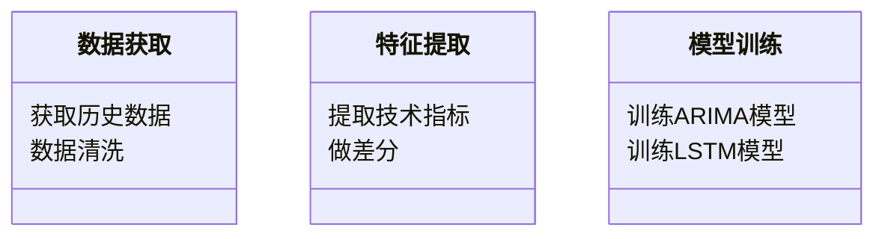
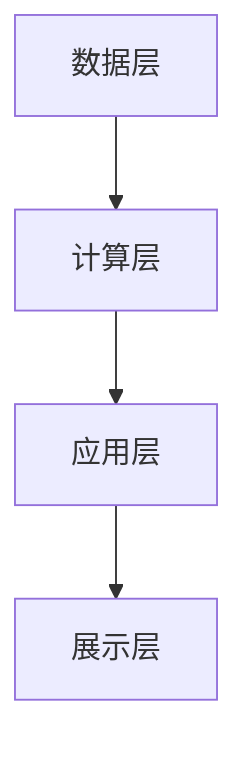

                 


# 金融时间序列数据预测：模型与方法

> 关键词：金融时间序列，数据预测，ARIMA，LSTM，机器学习，深度学习

> 摘要：本文深入探讨了金融时间序列数据预测的核心模型与方法，从传统统计模型到现代机器学习和深度学习方法，结合实际案例和系统设计，为读者提供从理论到实践的全面指导。

---

## 第1章: 金融时间序列数据概述

### 1.1 金融时间序列数据的基本概念
金融时间序列数据是指在金融市场上，按照时间顺序记录的资产价格、指数、成交量等数据。这些数据通常具有以下特点：
- **连续性**：数据按时间顺序记录，无间断。
- **波动性**：金融市场的波动性较高，受多种因素影响。
- **非线性**：价格波动往往呈现非线性特征。
- **周期性**：存在明显的季节性或周期性波动。

### 1.2 金融时间序列数据预测的背景与重要性
金融时间序列预测在投资决策、风险管理等领域具有重要意义。通过预测未来的价格走势，投资者可以制定更科学的投资策略。然而，金融数据的复杂性（如噪声、异形分布等）使得预测极具挑战性。

### 1.3 本文的核心内容
本文将从以下几个方面展开：
- **传统统计模型**：如ARIMA、SARIMA等。
- **机器学习模型**：如随机森林、XGBoost等。
- **深度学习模型**：如LSTM、Transformer等。
- **系统设计**：从数据获取到模型部署的完整流程。

---

## 第2章: 时间序列数据的核心概念与分析方法

### 2.1 时间序列的基本属性
时间序列数据可以分解为以下几个基本成分：
- **趋势（Trend）**：数据整体的上升或下降趋势。
- **季节性（Seasonality）**：周期性重复的模式，如月度或季度波动。
- **周期性（Cyclicality）**：更长周期的波动，可能与经济周期相关。
- **随机性（Randomness）**：不可预测的噪声。

### 2.2 时间序列数据的特征提取
特征提取是时间序列预测的关键步骤，常见的特征包括：
- 均值、方差、标准差。
- 自相关性（ACF）和偏自相关性（PACF）。
- 滚动平均（Moving Average）和移动平均绝对偏差（MADE）。

### 2.3 时间序列数据的可视化
通过可视化工具（如Matplotlib、Plotly）可以直观分析数据的特征。例如，绘制股价的K线图或收益率分布图。

---

## 第3章: 时间序列预测的传统模型

### 3.1 自动回归积分移动平均模型（ARIMA）
ARIMA是一种常用的统计模型，适用于线性时间序列数据。

#### 3.1.1 ARIMA模型的基本原理
ARIMA由三个参数组成：p（自回归阶数）、d（差分阶数）、q（移动平均阶数）。其数学表达式为：
$$ ARIMA(p,d,q) = y_t = \phi_1 y_{t-1} + \dots + \phi_p y_{t-p} + \theta_1 \epsilon_{t-1} + \dots + \theta_q \epsilon_{t-q} + \epsilon_t $$

#### 3.1.2 ARIMA模型的参数选择
参数选择通常基于ACF和PACF图。例如：
- 如果ACF在q步后截断，选择q。
- 如果PACF在p步后截断，选择p。

#### 3.1.3 ARIMA模型的优缺点
- **优点**：简单易用，适合线性数据。
- **缺点**：无法捕捉非线性特征。

---

## 第4章: 基于机器学习的时间序列预测

### 4.1 随机森林与时间序列预测
随机森林可以用于时间序列分类或回归任务。例如，预测明天的股价涨跌。

#### 4.1.1 随机森林的基本原理
随机森林通过构建多个决策树并集成预测结果。其数学表达式为：
$$ y = \sum_{i=1}^n \text{Tree}_i(x) $$

#### 4.1.2 随机森林的时间序列应用
将历史数据作为特征输入，预测未来价格。

---

## 第5章: 基于深度学习的时间序列预测

### 5.1 长短期记忆网络（LSTM）
LSTM是一种特殊的RNN，适合处理时间序列数据中的长期依赖关系。

#### 5.1.1 LSTM的基本结构
LSTM单元包括输入门、遗忘门和输出门。其数学表达式为：
$$
i_t = \sigma(w_i x_t + u_i h_{t-1}) \\
f_t = \sigma(w_f x_t + u_f h_{t-1}) \\
o_t = \sigma(w_o x_t + u_o h_{t-1}) \\
h_t = o_t \cdot \cosh(w_c x_t + u_c h_{t-1})
$$

#### 5.1.2 LSTM的时间序列应用
广泛应用于股票价格预测、外汇交易等场景。

---

## 第6章: 系统架构设计与实现

### 6.1 系统功能设计
系统功能包括数据获取、特征提取、模型训练、预测和结果分析。

#### 6.1.1 领域模型（Domain Model）
领域模型描述系统的核心业务逻辑，例如：


### 6.2 系统架构设计
系统架构采用分层设计，包括数据层、计算层和应用层。

#### 6.2.1 系统架构图


---

## 第7章: 项目实战与案例分析

### 7.1 环境安装
安装必要的Python库：
```bash
pip install numpy pandas matplotlib scikit-learn tensorflow
```

### 7.2 核心代码实现
例如，使用LSTM预测股票价格：
```python
import numpy as np
import tensorflow as tf
from tensorflow.keras.models import Sequential
from tensorflow.keras.layers import LSTM, Dense

# 示例数据
data = np.random.rand(100, 1)
model = Sequential()
model.add(LSTM(64, input_shape=(None, 1)))
model.add(Dense(1))
model.compile(loss='mse', optimizer='adam')
model.fit(data, data, epochs=10, batch_size=1)
```

### 7.3 案例分析
以股票价格预测为例，分析模型的预测效果，并对比不同模型的优缺点。

---

## 第8章: 最佳实践与小结

### 8.1 最佳实践
- 数据预处理是关键。
- 选择合适的模型需要结合数据特征。
- 避免过拟合，使用交叉验证。

### 8.2 小结
本文系统地介绍了金融时间序列数据预测的核心模型与方法，从传统统计模型到深度学习模型，结合实际案例，为读者提供了全面的指导。

### 8.3 注意事项
- 金融数据具有高度的噪声，模型需要充分调优。
- 预测结果仅供参考，需结合市场实际情况。

---

## 附录

### 附录A: 数据集推荐
- Yahoo Finance API
- Quandl

### 附录B: 工具与技术推荐
- Python库：Pandas、NumPy、Scikit-learn、TensorFlow。
- 可视化工具：Matplotlib、Plotly。

---

以上是本文的主要内容，通过系统化的分析与实践，读者可以掌握金融时间序列数据预测的核心方法与技巧。

