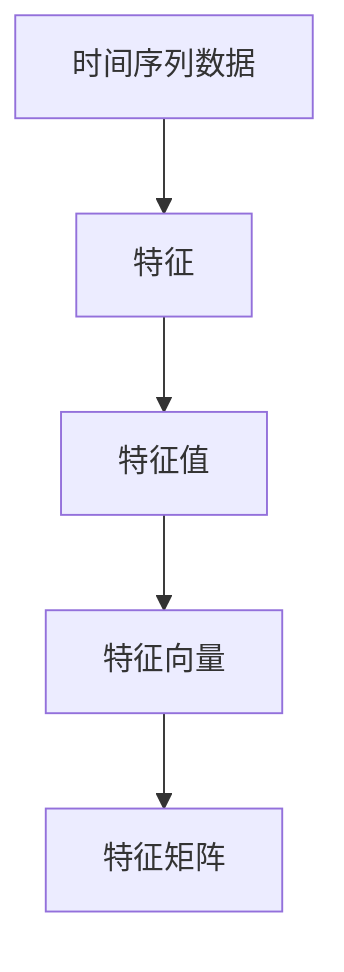
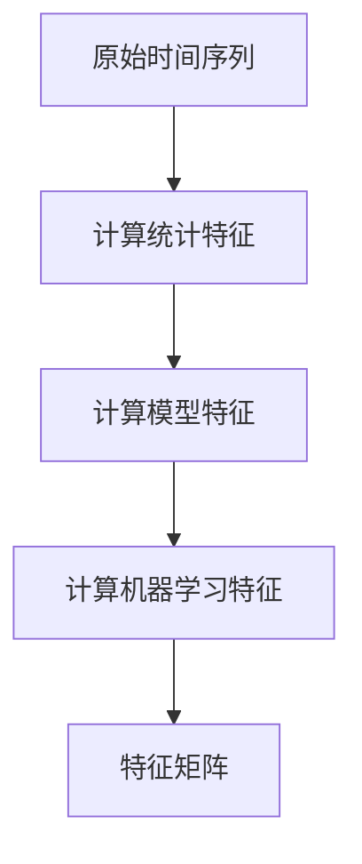
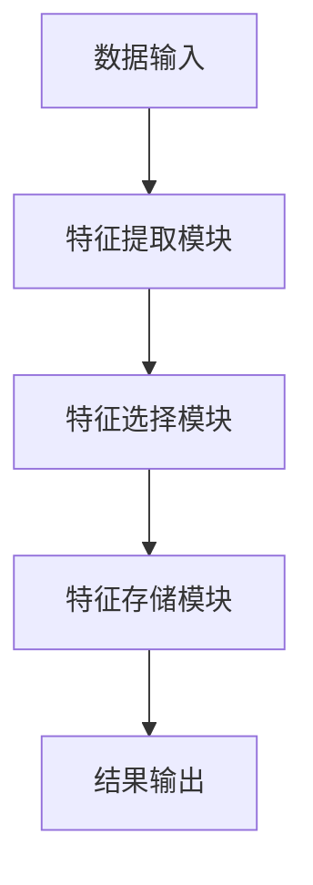

                 


# 《金融时间序列特征提取工具集》

> 关键词：金融时间序列，特征提取，统计特征，机器学习，小波分析

> 摘要：本文系统介绍了金融时间序列特征提取的核心概念、算法原理、系统架构设计以及实际应用案例。通过结合统计方法、机器学习算法和小波分析，本文深入探讨了如何有效提取金融时间序列中的关键特征，为后续的金融分析和预测提供了理论和实践基础。

---

# 第一部分: 金融时间序列特征提取概述

## 第1章: 金融时间序列分析基础

### 1.1 金融时间序列的基本概念

#### 1.1.1 时间序列的定义与特点
时间序列是指按时间顺序排列的数据点，通常表示为有序的数值序列。在金融领域，时间序列数据通常包括股票价格、汇率、利率等金融指标，这些数据具有以下特点：
- **有序性**：数据按照时间顺序排列。
- **连续性**：金融数据通常在连续的时间段内记录。
- **波动性**：金融市场的不确定性导致数据波动较大。
- **相关性**：时间序列数据往往表现出自相关性，即当前时刻的值与过去时刻的值相关。

#### 1.1.2 金融时间序列的特殊性
金融时间序列具有以下特殊性：
- **非平稳性**：金融数据通常不具有平稳性，即均值、方差等统计量可能随时间变化。
- **异质性**：不同金融资产或市场的时间序列可能表现出不同的特征。
- **噪声干扰**：金融市场受到多种因素影响，数据中可能包含噪声，影响特征提取的效果。

#### 1.1.3 金融时间序列分析的目标
金融时间序列分析的目标包括：
- **趋势识别**：识别数据中的趋势，如上升、下降或平稳趋势。
- **周期性分析**：发现数据中的周期性模式，如日、周、月周期。
- **异常检测**：识别数据中的异常点或突变点。
- **预测建模**：基于历史数据预测未来的金融走势。

### 1.2 特征提取在金融分析中的重要性

#### 1.2.1 特征提取的基本概念
特征提取是将原始数据转换为一组能够反映数据本质特征的低维表示的过程。在金融时间序列分析中，特征提取的目标是将复杂的时间序列数据转换为一组简洁且有意义的特征，以便后续的分析和建模。

#### 1.2.2 金融时间序列特征提取的挑战
金融时间序列特征提取面临以下挑战：
- **高维性**：金融数据可能包含大量时间点，导致特征维度高。
- **非线性**：金融数据往往具有复杂的非线性关系，难以用简单的线性模型描述。
- **噪声干扰**：数据中可能包含噪声，影响特征提取的效果。
- **样本不平衡**：某些金融事件可能较为罕见，导致样本不平衡问题。

#### 1.2.3 特征提取在金融决策中的应用
特征提取在金融决策中的应用包括：
- **风险评估**：通过提取特征识别高风险资产。
- **交易策略**：基于特征提取结果制定交易策略。
- **市场预测**：利用特征提取结果预测市场走势。

---

## 第2章: 时间序列特征提取的核心概念

### 2.1 时间序列分析的数学基础

#### 2.1.1 随机过程与时间序列
随机过程是指在时间或空间上随机变化的量。时间序列可以看作是一个随机过程的实现。在金融领域，时间序列通常表现出随机性和不确定性。

#### 2.1.2 时间序列的分解模型
时间序列可以分解为以下几个部分：
- **趋势（Trend）**：长期的上升或下降趋势。
- **周期性（Seasonality）**：固定周期的重复模式。
- **随机性（Randomness）**：无法预测的随机波动。

分解模型通常采用加法模型或乘法模型：
$$
Y_t = T_t + S_t + R_t
$$

其中，\( Y_t \) 是观测值，\( T_t \) 是趋势，\( S_t \) 是季节性，\( R_t \) 是随机成分。

#### 2.1.3 时间序列的平稳性与 Stationarity
平稳时间序列是指统计性质在时间上保持不变的序列。非平稳时间序列需要通过差分或其他方法转化为平稳序列。

### 2.2 时间序列特征的分类与属性

#### 2.2.1 基本统计特征
基本统计特征包括：
- 均值（Mean）
- 方差（Variance）
- 标准差（Standard Deviation）
- 峰度（Kurtosis）
- 偏度（Skewness）

#### 2.2.2 频率域特征
频率域特征包括：
- 周期性（Periodicity）
- 频率响应（Frequency Response）
- 主频成分（Dominant Frequency Components）

#### 2.2.3 时域与频域特征对比分析
以下表格对比了时域和频域特征的主要区别：

| 特征类型 | 特征描述 | 优点 | 缺点 |
|----------|----------|------|------|
| 时域特征 | 基于时间序列的统计量 | 易计算，适合捕捉短期波动 | 可能无法捕捉长期模式 |
| 频域特征 | 基于频率的成分 | 能捕捉周期性模式 | 计算复杂，可能需要先验知识 |

#### 2.2.4 特征提取的实体关系图
以下是一个简单的实体关系图，展示了时间序列数据、特征、特征值和特征向量之间的关系：



### 2.3 时间序列特征提取的实体关系图
以下是时间序列特征提取的实体关系图：


---

## 第3章: 时间序列特征提取算法原理

### 3.1 常见的时间序列特征提取方法

#### 3.1.1 基于统计的特征提取
基于统计的特征提取方法包括计算均值、方差、自相关函数等统计量。

#### 3.1.2 基于模型的特征提取
基于模型的特征提取方法包括ARIMA模型、GARCH模型等。

#### 3.1.3 基于机器学习的特征提取
基于机器学习的特征提取方法包括主成分分析（PCA）、LDA等。

### 3.2 统计特征提取的数学模型

#### 3.2.1 均值与方差的计算
$$
\mu = \frac{1}{n}\sum_{i=1}^{n}x_i
$$
$$
\sigma^2 = \frac{1}{n}\sum_{i=1}^{n}(x_i - \mu)^2
$$

#### 3.2.2 自相关函数的计算
$$
\rho(k) = \frac{\sum_{i=1}^{n-k}(x_i - \mu)(x_{i+k} - \mu)}{\sum_{i=1}^{n}(x_i - \mu)^2}
$$`

#### 3.2.3 偏自相关函数
偏自相关函数可以用来识别时间序列的阶数，例如AR模型的阶数。

### 3.3 机器学习特征提取方法

#### 3.3.1 主成分分析（PCA）
PCA是一种无监督降维技术，可以将高维特征映射到低维空间。

#### 3.3.2 小波分析
小波分析是一种信号处理技术，可以将时间序列分解为不同频率的成分。

### 3.4 特征提取的流程图



---

## 第4章: 金融时间序列特征提取系统设计

### 4.1 系统功能设计
系统功能包括数据预处理、特征提取、特征选择和特征存储。

### 4.2 系统架构设计
系统架构包括数据输入模块、特征提取模块、特征存储模块和结果输出模块。

### 4.3 系统交互流程
系统交互流程包括数据输入、特征提取、特征选择和结果输出。

### 4.4 系统架构图
以下是系统架构图：



---

## 第5章: 项目实战

### 5.1 项目背景与目标
项目目标是基于股票价格数据，提取时间序列特征，为后续的预测模型提供输入。

### 5.2 数据预处理
数据预处理包括数据清洗、标准化和分段处理。

### 5.3 特征提取实现
特征提取实现包括计算统计特征、模型特征和机器学习特征。

### 5.4 代码实现
以下是Python代码实现：

```python
import pandas as pd
import numpy as np
from sklearn.decomposition import PCA

# 假设我们有一个时间序列数据集
data = pd.read_csv('stock_prices.csv')

# 1. 计算统计特征
stats = data.describe()

# 2. 计算自相关函数
acf = data['price'].autocorr(lag=1)

# 3. 小波分析
import pywt
coeffs = pywt.wavedec(data['price'], 'db5')

# 4. PCA特征提取
pca = PCA(n_components=2)
principal_components = pca.fit_transform(data[['open', 'high', 'low', 'close']])
```

### 5.5 应用解读
通过上述代码，我们可以提取出股票价格的统计特征、自相关函数和小波分解系数，以及通过PCA提取的主要成分。

### 5.6 项目总结
项目展示了如何将统计特征、模型特征和机器学习特征结合起来，用于金融时间序列的特征提取。

---

## 第6章: 总结与展望

### 6.1 总结
本文系统介绍了金融时间序列特征提取的核心概念、算法原理和系统设计，同时提供了具体的项目实战案例。

### 6.2 未来展望
未来的研究方向包括：
- 更高效的时间序列特征提取算法
- 更加鲁棒的特征选择方法
- 结合深度学习的特征提取技术

### 6.3 最佳实践 Tips
- 在实际应用中，建议结合业务背景选择合适的特征提取方法。
- 注意处理数据的噪声和异常值。
- 定期更新特征提取模型以适应市场变化。

---

通过本文的系统介绍，读者可以全面了解金融时间序列特征提取的工具和方法，并能够将其应用于实际的金融分析和预测中。

