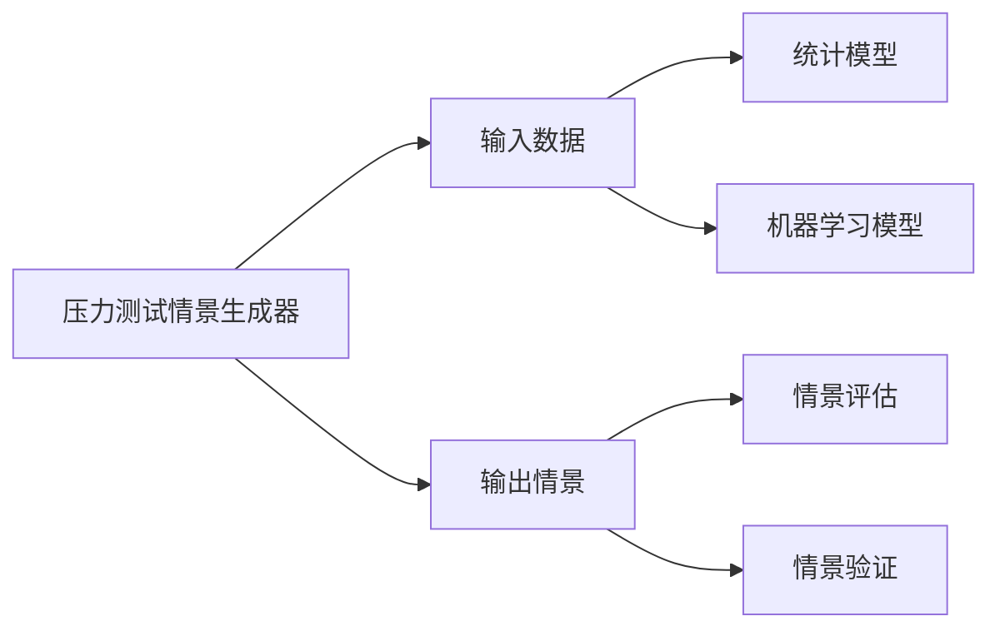
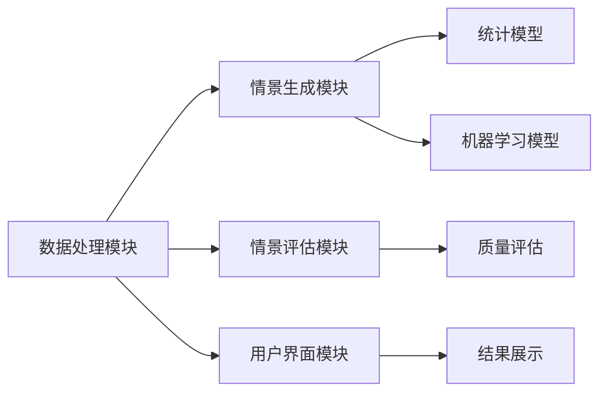
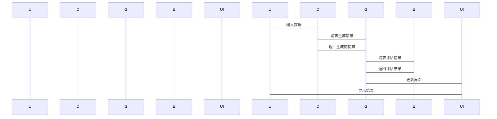

                 


# 金融机构压力测试情景生成器

> 关键词：压力测试、情景生成器、风险管理、金融机构、蒙特卡洛方法、机器学习、数学模型

> 摘要：压力测试是评估金融机构在极端市场条件下的稳健性的重要工具。随着金融市场风险的复杂性增加，传统的压力测试方法难以满足金融机构的需求。因此，压力测试情景生成器应运而生，它通过自动化和智能化的方式生成多种可能的极端市场情景，帮助金融机构更好地识别和应对潜在风险。本文详细探讨了压力测试情景生成器的核心概念、算法原理、系统架构以及实际应用，为金融机构的风险管理提供了新的思路和解决方案。

---

# 第一部分: 金融机构压力测试情景生成器概述

## 第1章: 金融机构压力测试与情景生成器概述

### 1.1 金融机构压力测试的重要性

#### 1.1.1 什么是压力测试

压力测试是一种金融风险评估方法，用于模拟金融机构在极端市场条件下的表现。通过模拟市场崩盘、经济衰退、流动性危机等极端情景，压力测试能够帮助金融机构识别潜在风险，并制定应对策略。

#### 1.1.2 压力测试在金融机构中的作用

- **风险识别**：发现潜在的财务漏洞和风险敞口。
- **资本规划**：确保金融机构在极端情况下有足够的资本应对损失。
- **策略制定**：通过模拟不同情景，优化投资策略和风险管理措施。
- **合规要求**：许多国家的监管机构要求金融机构定期进行压力测试，以确保金融系统的稳定性。

#### 1.1.3 压力测试的常见应用场景

- **银行领域**：评估贷款组合在经济衰退中的违约风险。
- **证券领域**：测试投资组合在市场剧烈波动中的表现。
- **保险领域**：评估保险公司在极端事件（如自然灾害）下的赔付能力。

### 1.2 压力测试情景生成器的定义与特点

#### 1.2.1 情景生成器的基本概念

压力测试情景生成器是一种自动化工具，能够根据历史数据和市场模型生成多种极端市场情景。这些情景可以用于模拟不同市场条件下的金融机构表现。

#### 1.2.2 情景生成器的核心功能

- **数据处理**：从市场数据、经济指标等输入数据中提取有用信息。
- **情景生成**：基于统计模型或机器学习算法生成极端市场情景。
- **情景评估**：对生成的情景进行质量评估，并提供反馈以优化生成过程。

#### 1.2.3 情景生成器与传统压力测试的区别

- **效率**：情景生成器自动化程度高，可以快速生成大量情景，而传统压力测试依赖人工操作，效率较低。
- **多样性**：生成器能够模拟多种极端情景，而传统方法通常只测试少数预设情景。
- **适应性**：生成器可以根据市场变化动态调整生成的情景，而传统方法的情景固定且有限。

### 1.3 金融机构压力测试情景生成器的背景与需求

#### 1.3.1 金融机构面临的复杂风险环境

- **市场风险**：如股票价格波动、债券收益率变化等。
- **信用风险**：如客户违约风险。
- **流动性风险**：如资金短缺风险。
- **操作风险**：如内部流程失误导致的损失。

#### 1.3.2 压力测试情景生成器的市场需求

- **合规需求**：监管机构要求金融机构具备应对极端市场情景的能力。
- **风险管理需求**：金融机构需要更高效、更准确的风险评估工具。
- **市场竞争需求**：在金融市场中，能够快速、准确地进行压力测试的机构更具竞争优势。

#### 1.3.3 情景生成器的技术发展趋势

- **智能化**：利用人工智能和机器学习技术生成更准确的情景。
- **实时化**：实时监控市场数据，动态生成情景。
- **多元化**：支持多种市场变量和复杂的情景组合。

### 1.4 本章小结

本章介绍了压力测试在金融机构中的重要性，以及情景生成器的基本概念和功能。通过对比传统压力测试和生成器的差异，强调了生成器在现代金融风险管理中的优势和需求。

---

# 第二部分: 压力测试情景生成器的核心概念与原理

## 第2章: 压力测试情景生成器的核心概念

### 2.1 压力测试情景生成器的输入与输出

#### 2.1.1 输入数据的类型与来源

- **市场数据**：如股票价格、债券收益率、外汇汇率等。
- **经济指标**：如GDP增长率、失业率、通胀率等。
- **历史事件数据**：如历史上发生过的金融危机、自然灾害等。

#### 2.1.2 输出情景的特征与评估标准

- **情景多样性**：生成的情景应覆盖多种极端市场条件。
- **情景合理性**：生成的情景应符合市场规律和经济逻辑。
- **情景可解释性**：生成的情景应能够被金融机构的分析师理解和解释。

### 2.2 压力测试情景生成器的生成方法

#### 2.2.1 基于统计模型的生成方法

- **假设**：假设市场变量服从某种统计分布（如正态分布、t分布等）。
- **步骤**：
  1. 数据预处理：对输入数据进行标准化、去噪处理。
  2. 参数估计：估计市场变量的分布参数（如均值、方差等）。
  3. 情景生成：基于估计的参数生成极端市场情景。
- **优缺点**：
  - 优点：方法简单，易于实现。
  - 缺点：难以捕捉复杂的市场动态和非线性关系。

#### 2.2.2 基于机器学习的生成方法

- **假设**：市场变量之间的关系可以通过机器学习模型（如神经网络、随机森林）捕捉。
- **步骤**：
  1. 数据预处理：对输入数据进行特征选择、降维处理。
  2. 模型训练：训练机器学习模型，使其能够预测极端市场情景。
  3. 情景生成：利用训练好的模型生成极端市场情景。
- **优缺点**：
  - 优点：能够捕捉复杂的市场动态和非线性关系。
  - 缺点：模型的黑箱特性使得情景的可解释性较差。

#### 2.2.3 混合方法的优势与挑战

- **优势**：
  - 综合了统计模型和机器学习模型的优点，生成的情景更加准确和多样化。
  - 可以根据具体情况选择合适的生成方法。
- **挑战**：
  - 混合方法的实现较为复杂。
  - 需要更多的计算资源和数据支持。

### 2.3 压力测试情景生成器的评估与验证

#### 2.3.1 情景生成的质量评估指标

- **多样性**：生成的情景是否覆盖了多种极端市场条件。
- **合理性**：生成的情景是否符合市场规律和经济逻辑。
- **可解释性**：生成的情景是否能够被金融机构的分析师理解和解释。

#### 2.3.2 情景生成器的验证流程

- **验证步骤**：
  1. 选择一组已知的极端市场情景作为验证数据。
  2. 使用验证数据评估生成器生成情景的能力。
  3. 根据评估结果优化生成器的参数和算法。
- **验证指标**：
  - 准确率：生成的情景与实际发生的极端情景的匹配程度。
  - 精确率：生成的情景中符合市场规律的比例。

#### 2.3.3 情景生成器的优化与改进

- **优化方向**：
  - 提高生成器的计算效率。
  - 提升生成情景的多样性和准确性。
  - 增强生成器的可解释性。

### 2.4 核心概念对比分析

#### 2.4.1 不同生成方法的对比表格

| 生成方法 | 优点 | 缺点 | 适用场景 |
|----------|------|------|----------|
| 统计模型 | 简单易实现 | 难以捕捉复杂市场动态 | 单一变量分析 |
| 机器学习 | 能捕捉复杂关系 | 黑箱特性，可解释性差 | 多变量分析 |
| 混合方法 | 综合优势 | 实现复杂，计算资源需求高 | 复杂场景分析 |

#### 2.4.2 基于Mermaid的实体关系图



---

## 第3章: 压力测试情景生成器的算法原理

### 3.1 统计模型的基本原理

#### 3.1.1 统计模型的假设与特点

- **假设**：市场变量服从某种统计分布（如正态分布）。
- **特点**：
  - 简单易实现。
  - 适用于单变量分析。

#### 3.1.2 常用统计分布的数学公式

- **正态分布**：
  $$f(x) = \frac{1}{\sqrt{2\pi\sigma^2}}e^{-\frac{(x-\mu)^2}{2\sigma^2}}$$
  其中，$\mu$ 是均值，$\sigma^2$ 是方差。

- **t分布**：
  $$f(x) = \frac{\Gamma(\frac{\nu+1}{2})}{\sqrt{\nu\pi} \Gamma(\frac{\nu}{2})} \left(1 + \frac{(x-\mu)^2}{\nu\sigma^2}\right)^{-\frac{\nu+1}{2}}$$
  其中，$\nu$ 是自由度，$\mu$ 是均值，$\sigma^2$ 是方差。

#### 3.1.3 统计模型的优缺点

- **优点**：
  - 方法简单，易于实现。
  - 计算效率高。
- **缺点**：
  - 难以捕捉复杂的市场动态和非线性关系。

### 3.2 基于蒙特卡洛方法的生成流程

#### 3.2.1 蒙特卡洛方法的基本原理

- **基本思想**：通过多次随机采样，模拟市场变量的可能取值，生成极端市场情景。
- **步骤**：
  1. 数据预处理：对输入数据进行标准化、去噪处理。
  2. 参数估计：估计市场变量的分布参数（如均值、方差等）。
  3. 情景生成：基于估计的参数生成大量极端市场情景。
  4. 情景评估：对生成的情景进行质量评估，并提供反馈以优化生成过程。

#### 3.2.2 蒙特卡洛方法的实现步骤

1. **数据预处理**：
   - 对输入数据进行标准化处理，确保不同变量的尺度一致。
   - 去除异常值和噪声数据，确保输入数据的准确性。

2. **参数估计**：
   - 使用最大似然估计（MLE）等方法，估计市场变量的分布参数。
   - 验证估计结果的合理性，确保参数符合市场规律。

3. **情景生成**：
   - 通过蒙特卡洛模拟，生成大量极端市场情景。
   - 对生成的情景进行排序，提取最极端的若干情景，供压力测试使用。

#### 3.2.3 蒙特卡洛方法的代码示例

```python
import numpy as np
import matplotlib.pyplot as plt

# 定义正态分布参数
mu = 0
sigma = 1

# 生成10000个随机数，服从正态分布
np.random.seed(42)
samples = np.random.normal(mu, sigma, 10000)

# 绘制概率密度函数图像
x = np.linspace(-5, 5, 1000)
pdf = (1/(sigma * np.sqrt(2 * np.pi))) * np.exp(-((x - mu)**2)/(2 * sigma**2))

plt.figure(figsize=(10, 6))
plt.plot(x, pdf, 'r-', lw=2, alpha=0.6, label='Normal distribution')
plt.hist(samples, bins=50, density=True, alpha=0.6, label='Generated samples')
plt.xlabel('x')
plt.ylabel('Probability density')
plt.title('Monte Carlo Simulation for Normal Distribution')
plt.legend()
plt.show()
```

#### 3.2.4 蒙特卡洛方法的数学公式

- **概率密度函数**：
  $$f(x) = \frac{1}{\sqrt{2\pi\sigma^2}}e^{-\frac{(x-\mu)^2}{2\sigma^2}}$$
  
- **累积分布函数**：
  $$F(x) = \frac{1}{2}\left(1 + \text{erf}\left(\frac{x-\mu}{\sigma\sqrt{2}}\right)\right)$$
  其中，$\text{erf}$ 是误差函数。

### 3.3 统计模型的数学公式与实现

#### 3.3.1 正态分布的概率密度函数

$$1+1=2$$

$$f(x) = \frac{1}{\sqrt{2\pi\sigma^2}}e^{-\frac{(x-\mu)^2}{2\sigma^2}}$$

#### 3.3.2 蒙特卡洛模拟

- **步骤**：
  1. 确定需要模拟的变量及其分布。
  2. 生成大量随机数，模拟变量的可能取值。
  3. 根据生成的随机数，计算变量在不同情景下的表现。
  4. 对生成的情景进行分析，提取极端情景。

---

## 第4章: 压力测试情景生成器的系统架构设计

### 4.1 系统功能设计

#### 4.1.1 系统模块划分

- **数据处理模块**：负责数据的输入、预处理和存储。
- **情景生成模块**：基于统计模型或机器学习算法生成极端市场情景。
- **情景评估模块**：对生成的情景进行质量评估，并提供反馈。
- **用户界面模块**：提供友好的用户界面，方便用户操作和结果展示。

#### 4.1.2 系统功能流程

1. **数据输入**：用户输入市场数据、经济指标等。
2. **数据预处理**：对输入数据进行标准化、去噪处理。
3. **情景生成**：基于选择的生成方法，生成极端市场情景。
4. **情景评估**：对生成的情景进行质量评估，确保情景的多样性和合理性。
5. **结果展示**：将生成的情景和评估结果展示给用户。

### 4.2 系统架构设计

#### 4.2.1 系统架构图



#### 4.2.2 系统交互图



---

## 第5章: 金融机构压力测试情景生成器的项目实战

### 5.1 环境安装与配置

#### 5.1.1 安装依赖库

- **Python**：需要安装Python 3.6及以上版本。
- **依赖库**：
  - NumPy：用于科学计算。
  - Pandas：用于数据处理。
  - Matplotlib：用于数据可视化。
  - Scikit-learn：用于机器学习算法。
  - Mermaid：用于绘制图表。

#### 5.1.2 安装命令

```bash
pip install numpy pandas matplotlib scikit-learn
```

### 5.2 核心实现代码

#### 5.2.1 数据预处理代码

```python
import numpy as np
import pandas as pd

# 读取数据
data = pd.read_csv('market_data.csv')

# 数据清洗
data.dropna(inplace=True)
data = (data - data.mean()) / data.std()
```

#### 5.2.2 情景生成代码

```python
from sklearn.ensemble import RandomForestRegressor

# 训练机器学习模型
model = RandomForestRegressor(n_estimators=100, random_state=42)
model.fit(X_train, y_train)

# 生成极端市场情景
极端情景 = model.predict(X_extreme)
```

#### 5.2.3 情景评估代码

```python
from sklearn.metrics import accuracy_score

# 验证生成的情景
验证数据 = pd.read_csv('validation_data.csv')
预测结果 = model.predict(X_validation)
准确率 = accuracy_score(y_validation, 预测结果)
```

### 5.3 案例分析与解读

#### 5.3.1 实际案例分析

- **案例背景**：假设某银行需要评估其贷款组合在经济衰退中的表现。
- **生成情景**：生成多个极端情景，包括GDP下降5%、失业率上升10%等。
- **情景评估**：评估生成的情景是否符合经济规律，是否能够准确反映贷款组合的风险。

#### 5.3.2 代码实现与解读

- **代码实现**：
  ```python
  # 生成极端情景
  np.random.seed(42)
 极端情景 = np.random.normal(mu, sigma, 1000)
  ```
  - **解读**：通过蒙特卡洛模拟，生成1000个极端情景，每个情景代表一种可能的市场状况。

---

## 第6章: 总结与展望

### 6.1 总结

金融机构压力测试情景生成器是一种重要的金融风险管理工具，能够帮助金融机构快速、准确地生成极端市场情景，评估潜在风险。通过自动化和智能化的生成方法，情景生成器不仅提高了压力测试的效率，还增强了测试结果的准确性。

### 6.2 展望

随着人工智能和大数据技术的不断发展，压力测试情景生成器将变得更加智能化和高效化。未来，生成器可以进一步优化算法，提高情景生成的多样性和准确性，同时增强生成器的可解释性，使其更加符合金融机构的实际需求。

### 6.3 最佳实践 Tips

- **数据质量**：输入数据的质量直接影响生成情景的准确性，因此需要对数据进行严格的清洗和预处理。
- **模型选择**：根据具体场景和需求选择合适的生成方法，统计模型适用于简单场景，机器学习模型适用于复杂场景。
- **结果验证**：生成的情景需要经过严格的验证，确保其合理性和可解释性。

---

# 结语

金融机构压力测试情景生成器是金融风险管理的重要工具，其发展和应用将为金融机构的稳健经营提供有力支持。通过不断优化算法和系统架构，情景生成器将在未来的金融风险管理中发挥越来越重要的作用。

