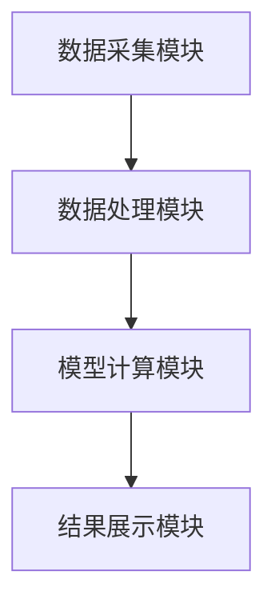

                 


# 金融机构压力测试自动化工具

> 关键词：压力测试，金融机构，自动化工具，风险管理，系统架构

> 摘要：本文详细探讨了金融机构压力测试自动化工具的设计与实现，涵盖压力测试的背景、核心概念、算法原理、系统架构、项目实战及最佳实践，旨在为金融机构的技术人员和开发人员提供系统化的指导和参考。

---

## 第1章: 金融机构压力测试背景与需求

### 1.1 金融机构压力测试的重要性

#### 1.1.1 什么是压力测试
压力测试是一种评估金融机构在极端市场条件或系统性风险下的承受能力的测试。通过模拟潜在的负面情景，压力测试帮助机构识别和量化潜在风险，并制定应对策略。

#### 1.1.2 压力测试的目的与意义
压力测试的主要目的是评估金融机构在极端情况下的稳健性，确保其能够抵御潜在的系统性风险。其意义在于：
- 识别潜在风险点。
- 评估资本充足性。
- 制定应对策略。
- 提升市场信心。

#### 1.1.3 金融机构面临的挑战
金融机构在进行压力测试时面临以下挑战：
- 数据量大且复杂。
- 测试情景多样化。
- 手工测试效率低。
- 成本高，时间长。

---

### 1.2 压力测试的类型与方法

#### 1.2.1 压力测试的类型
压力测试主要分为以下几种类型：
- **信用风险压力测试**：评估借款人违约风险。
- **市场风险压力测试**：评估资产价格波动对机构的影响。
- **操作风险压力测试**：评估操作失误或系统故障带来的风险。

#### 1.2.2 压力测试的方法
压力测试的方法包括：
- **情景分析法**：基于假设情景进行分析。
- **敏感性分析法**：评估单个变量变化对整体风险的影响。
- **蒙特卡洛模拟法**：通过随机抽样模拟多种可能的情景。

#### 1.2.3 压力测试模型对比
以下表格对比了常用压力测试模型的特点：

| 模型类型       | 输入数据         | 输出结果         | 优缺点           |
|----------------|------------------|------------------|------------------|
| 线性回归模型     | 历史数据         | 预测结果         | 简单易懂，但假设线性关系 |
| 时间序列模型   | 历史时间序列数据 | 预测结果         | 能捕捉趋势，但假设平稳性 |
| 蒙特卡洛模拟    | 概率分布参数     | 情景模拟结果     | 灵活性高，但计算复杂 |

---

### 1.3 压力测试自动化的需求

#### 1.3.1 传统压力测试的局限性
传统压力测试主要依赖人工操作，存在以下问题：
- 时间成本高。
- 数据处理复杂。
- 情景覆盖有限。
- 结果一致性差。

#### 1.3.2 自动化工具的优势
自动化工具通过技术手段优化压力测试流程，具有以下优势：
- 提高测试效率。
- 减少人为错误。
- 支持大规模测试。
- 实现情景快速迭代。

#### 1.3.3 自动化工具的适用场景
压力测试自动化工具适用于以下场景：
- **日常风险监控**：实时监控市场波动。
- **压力测试报告生成**：定期生成压力测试报告。
- **应急演练**：模拟极端情景下的应对策略。

---

## 第2章: 压力测试自动化工具的核心概念

### 2.1 压力测试模型与方法

#### 2.1.1 线性回归模型
线性回归模型是压力测试中最常用的模型之一，其基本公式为：
$$ y = \beta_0 + \beta_1x + \epsilon $$
其中，$y$ 是目标变量，$x$ 是自变量，$\beta_0$ 和 $\beta_1$ 是回归系数，$\epsilon$ 是误差项。

#### 2.1.2 时间序列模型
时间序列模型用于分析随时间变化的数据，常用ARIMA模型。其核心思想是通过历史数据预测未来趋势。

#### 2.1.3 蒙特卡洛模拟
蒙特卡洛模拟是一种基于随机抽样的方法，用于模拟多种可能的市场情景。其基本步骤如下：
1. 确定输入变量的概率分布。
2. 生成随机数。
3. 计算输出结果。
4. 统计结果并分析。

---

### 2.2 压力测试工具的功能模块

#### 2.2.1 数据采集模块
数据采集模块负责收集压力测试所需的数据，包括市场数据、客户数据和交易数据。

#### 2.2.2 数据处理模块
数据处理模块对采集到的数据进行清洗、转换和预处理，确保数据符合模型输入要求。

#### 2.2.3 模型计算模块
模型计算模块是压力测试的核心模块，负责根据输入数据计算压力测试结果。

#### 2.2.4 结果展示模块
结果展示模块将计算结果以可视化的方式呈现，便于用户理解和分析。

---

### 2.3 工具的核心算法与实现

#### 2.3.1 算法原理概述
压力测试工具的核心算法包括：
- **线性回归算法**：用于预测目标变量。
- **蒙特卡洛模拟**：用于生成多种市场情景。

#### 2.3.2 算法实现步骤
1. 数据预处理：清洗和标准化数据。
2. 模型训练：训练回归模型或模拟情景。
3. 情景生成：生成多种市场情景。
4. 结果分析：统计分析和可视化展示。

#### 2.3.3 算法优化建议
- 使用并行计算优化蒙特卡洛模拟。
- 采用更复杂的模型提高预测精度。

---

## 第3章: 压力测试自动化工具的系统架构

### 3.1 系统功能模块设计

#### 3.1.1 数据采集模块
数据采集模块通过API接口获取实时市场数据。

#### 3.1.2 数据处理模块
数据处理模块对数据进行清洗和转换，确保数据质量。

#### 3.1.3 模型计算模块
模型计算模块运行压力测试算法，计算风险指标。

#### 3.1.4 结果展示模块
结果展示模块将测试结果以图表形式展示，方便用户查看。

---

### 3.2 系统架构设计

#### 3.2.1 系统功能设计
系统功能模块包括：
- 数据采集模块。
- 数据处理模块。
- 模型计算模块。
- 结果展示模块。

#### 3.2.2 系统架构图
以下是系统架构的Mermaid图：



---

### 3.3 系统接口设计

#### 3.3.1 接口定义
系统通过RESTful API接口实现模块之间的通信。

#### 3.3.2 接口交互
接口交互流程如下：
1. 数据采集模块调用数据接口获取数据。
2. 数据处理模块调用数据处理接口处理数据。
3. 模型计算模块调用计算接口运行模型。
4. 结果展示模块调用结果接口展示结果。

---

## 第4章: 压力测试自动化工具的项目实战

### 4.1 环境配置

#### 4.1.1 系统环境
- 操作系统：Linux/Windows。
- 开发工具：Python、Jupyter Notebook。
- 数据库：MySQL/PostgreSQL。

#### 4.1.2 依赖安装
安装以下依赖：
- Python：3.8+。
- 库：pandas、numpy、scikit-learn、matplotlib。

---

### 4.2 核心实现

#### 4.2.1 数据采集与处理
代码示例：

```python
import pandas as pd
import requests

# 数据采集
def fetch_data(api_url):
    response = requests.get(api_url)
    return response.json()

# 数据处理
def preprocess_data(data):
    df = pd.DataFrame(data)
    df.dropna(inplace=True)
    return df

# 使用示例
data = fetch_data("https://api.example.com/markets")
df = preprocess_data(data)
```

---

#### 4.2.2 压力测试算法实现

```python
import numpy as np
from sklearn.linear_model import LinearRegression

# 数据准备
X = df[['market_value', 'interest_rate']]
y = df['risk_score']

# 模型训练
model = LinearRegression()
model.fit(X, y)

# 模型预测
new_X = np.array([[100, 5]])
predicted_y = model.predict(new_X)
print(predicted_y)
```

---

### 4.3 案例分析

#### 4.3.1 案例背景
假设某银行需要测试其贷款组合在市场利率上升3%时的违约风险。

#### 4.3.2 实施步骤
1. 数据采集：获取贷款组合的历史数据。
2. 数据处理：清洗和预处理数据。
3. 模型训练：训练违约预测模型。
4. 情景模拟：模拟利率上升3%的情况。
5. 结果分析：评估违约风险。

---

## 第5章: 总结与展望

### 5.1 本章总结
本文详细介绍了金融机构压力测试自动化工具的设计与实现，涵盖了背景、核心概念、算法原理、系统架构和项目实战等内容。

### 5.2 未来展望
未来，压力测试自动化工具将朝着以下方向发展：
- 更智能化的算法。
- 更高效的系统架构。
- 更广泛的应用场景。

---

### 5.3 最佳实践 Tips

- **数据质量**：确保数据准确性和完整性。
- **模型选择**：根据需求选择合适的模型。
- **系统维护**：定期更新数据和模型。

---

### 5.4 小结
压力测试自动化工具是金融机构风险管理的重要工具，通过自动化技术可以显著提高测试效率和准确性。

---

通过以上内容，您可以系统地学习和理解金融机构压力测试自动化工具的设计与实现。

