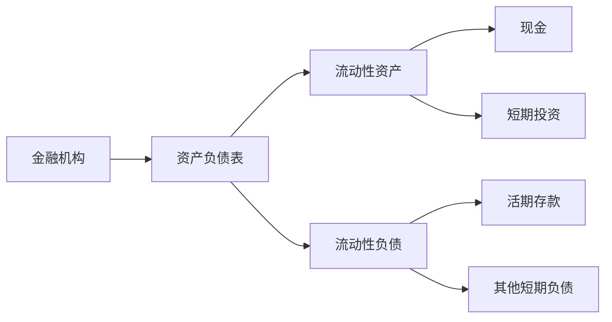
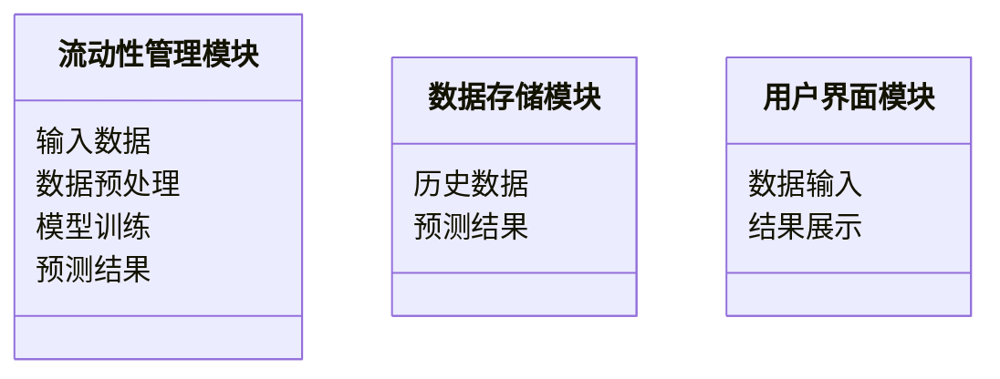
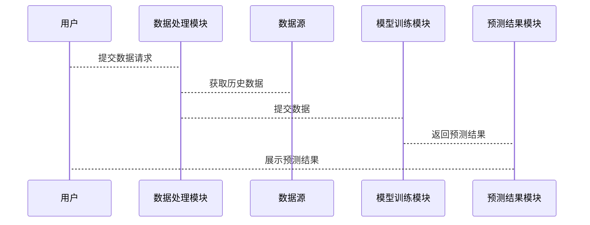

                 


# 金融机构流动性覆盖率预测

**关键词**：流动性覆盖率、金融机构、风险管理、预测模型、机器学习、深度学习、系统架构

**摘要**：  
金融机构的流动性管理是确保其稳健经营的核心要素之一，而流动性覆盖率是衡量金融机构短期流动性风险的重要指标。本文将从流动性覆盖率的基本概念、预测方法、算法原理、系统架构设计到实际项目实现，全面探讨如何通过技术手段准确预测流动性覆盖率，帮助金融机构有效管理流动性风险。通过结合时间序列分析、机器学习和深度学习等方法，本文将提供一套完整的解决方案，从理论到实践，为金融机构的风险管理提供有力支持。

---

## 目录

### 第1章：流动性覆盖率预测的背景与概念

#### 1.1 金融机构流动性管理概述
- 1.1.1 流动性管理的基本概念  
- 1.1.2 流动性覆盖率的定义与作用  
- 1.1.3 流动性覆盖率与金融机构稳健经营的关系  

#### 1.2 流动性覆盖率预测的重要性
- 1.2.1 金融机构面临的流动性风险  
- 1.2.2 流动性覆盖率预测在风险管理中的作用  
- 1.2.3 监管机构对流动性覆盖率的要求  

#### 1.3 国内外流动性覆盖率监管要求
- 1.3.1 巴塞尔协议对流动性覆盖率的规定  
- 1.3.2 中国银保监会对流动性覆盖率的要求  
- 1.3.3 其他国家的流动性覆盖率监管框架  

#### 1.4 本章小结  
---

### 第2章：流动性覆盖率预测的核心概念与联系

#### 2.1 流动性覆盖率预测的核心要素
- 2.1.1 资产负债表结构与流动性分析  
- 2.1.2 现金流预测与流动性需求  
- 2.1.3 市场环境对流动性的影响  

#### 2.2 流动性覆盖率预测的关键影响因素
- 2.2.1 资金来源的稳定性分析  
- 2.2.2 资金运用的流动性特征  
- 2.2.3 市场波动对流动性的影响  

#### 2.3 流动性覆盖率预测的数学模型
- 2.3.1 流动性覆盖率的计算公式  
$$ \text{流动性覆盖率} = \frac{\text{合格流动性资产}}{\text{净现金流出}} $$  

#### 2.4 实体关系图（ER图）  


#### 2.5 本章小结  
---

### 第3章：流动性覆盖率预测的算法原理

#### 3.1 时间序列分析方法
- 3.1.1 ARIMA模型原理  
- 3.1.2 案例分析：使用ARIMA模型预测流动性覆盖率  
- 3.1.3 ARIMA模型的优缺点  

#### 3.2 机器学习方法
- 3.2.1 支持向量回归（SVR）原理  
- 3.2.2 神经网络模型（如LSTM）的应用  
- 3.2.3 机器学习模型的训练与优化  

#### 3.3 深度学习方法
- 3.3.1 LSTM网络在时间序列预测中的应用  
- 3.3.2 基于Transformer的流动性预测模型  
- 3.3.3 深度学习模型的训练技巧  

#### 3.4 算法流程图  


#### 3.5 本章小结  
---

### 第4章：系统分析与架构设计

#### 4.1 系统功能设计
- 4.1.1 问题场景介绍  
- 4.1.2 系统功能模块划分  
- 4.1.3 领域模型设计（类图）  


#### 4.2 系统架构设计
- 4.2.1 系统架构图  


#### 4.3 系统接口设计
- 4.3.1 数据接口  
- 4.3.2 模型接口  
- 4.3.3 用户接口  

#### 4.4 系统交互流程图  


#### 4.5 本章小结  
---

### 第5章：项目实战与案例分析

#### 5.1 环境安装与配置
- 5.1.1 安装Python环境（如Anaconda）  
- 5.1.2 安装相关库（如pandas、numpy、scikit-learn、Keras等）  

#### 5.2 核心算法实现
- 5.2.1 使用ARIMA模型实现流动性覆盖率预测  
```python
from statsmodels.tsa.arima_model import ARIMA
import pandas as pd

# 假设data是时间序列数据
model = ARIMA(data, order=(5,1,0))
model_fit = model.fit()
forecast = model_fit.forecast(steps=10)
print(forecast)
```

- 5.2.2 使用LSTM网络实现预测  
```python
from tensorflow.keras.models import Sequential
from tensorflow.keras.layers import LSTM, Dense

model = Sequential()
model.add(LSTM(50, input_shape=(1, look_back)))
model.add(Dense(1))
model.compile(loss='mean_squared_error', optimizer='adam')
model.fit(train_data, train_labels, epochs=50, batch_size=1)
```

#### 5.3 数据处理与分析
- 5.3.1 数据清洗与特征工程  
- 5.3.2 模型调优与验证  

#### 5.4 实际案例分析
- 5.4.1 数据来源与预处理  
- 5.4.2 模型训练与预测  
- 5.4.3 预测结果分析与解读  

#### 5.5 本章小结  
---

### 第6章：总结与展望

#### 6.1 本章总结
- 6.1.1 核心内容回顾  
- 6.1.2 关键技术总结  

#### 6.2 最佳实践与建议
- 6.2.1 数据质量的重要性  
- 6.2.2 模型选择的注意事项  
- 6.2.3 系统架构的优化建议  

#### 6.3 未来研究方向
- 6.3.1 更先进的深度学习模型（如Transformer）的应用  
- 6.3.2 多因素模型的优化与改进  
- 6.3.3 流动性覆盖率预测的实时性提升  

#### 6.4 拓展阅读
- 推荐书籍与论文  
- 在线资源与工具  

#### 6.5 本章小结  
---

通过以上目录结构，文章将从理论到实践，全面解析金融机构流动性覆盖率预测的核心概念、算法实现和系统设计，为金融机构的风险管理提供有力的技术支持。

