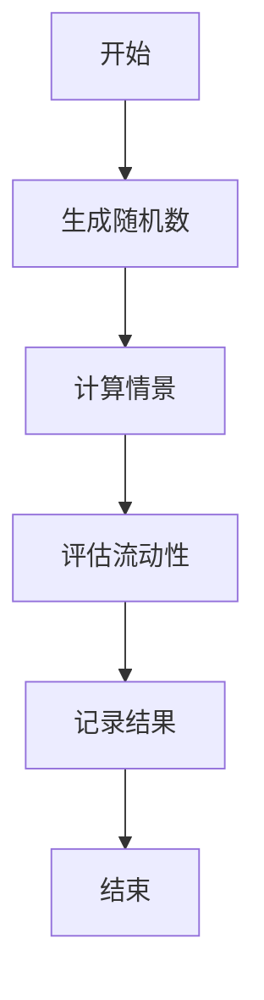
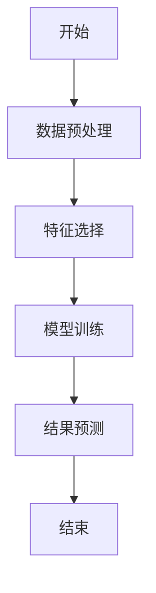
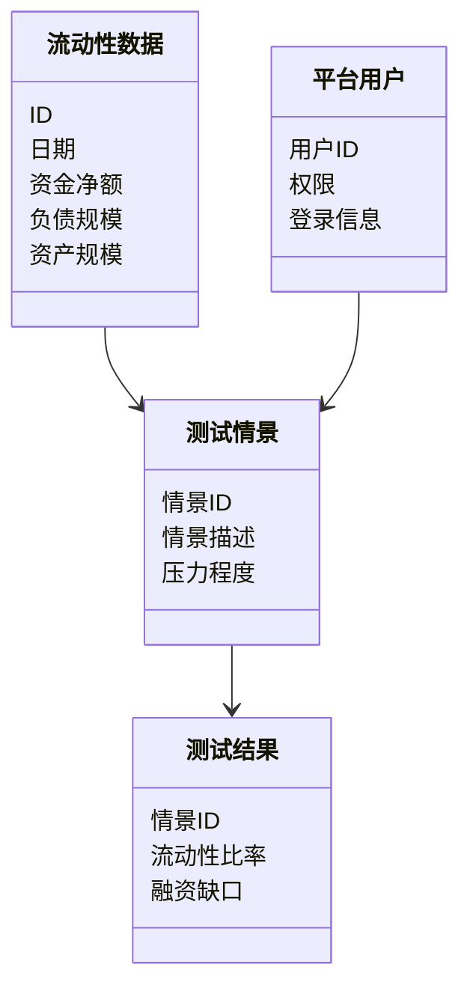
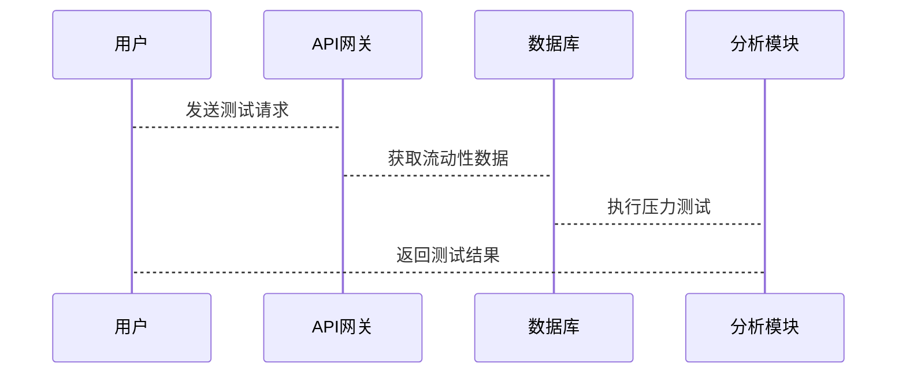

                 


# 金融机构流动性风险压力测试平台

> 关键词：金融机构，流动性风险，压力测试，系统架构，Python代码，蒙特卡洛模拟

> 摘要：本文详细探讨了金融机构流动性风险压力测试平台的设计与实现，从背景介绍到核心算法，再到系统架构和项目实战，结合实际案例分析，为读者提供全面的技术解读。

---

## 第一部分：背景介绍

### 第1章：流动性风险压力测试的背景与意义

#### 1.1 问题背景

- **1.1.1 金融机构流动性风险的定义**  
  流动性风险是指金融机构在短时间内无法以合理成本获得足够资金来满足其资产增长或负债减少的需求，从而导致资金链断裂的风险。

- **1.1.2 流动性风险对金融系统的潜在影响**  
  流动性风险可能导致金融机构破产，进而引发系统性金融危机，影响整个金融市场的稳定性。

- **1.1.3 压力测试在风险管理中的重要性**  
  压力测试是一种模拟极端市场条件下的情景分析方法，用于评估金融机构在极端情况下的流动性状况，帮助机构制定应对策略。

#### 1.2 问题描述

- **1.2.1 流动性风险的形成机制**  
  由市场波动、投资者行为、资金流动不畅等因素引发，可能在短时间内迅速恶化。

- **1.2.2 压力测试的目标与范围**  
  评估金融机构在极端情况下的流动性状况，确保其能够应对潜在的资金短缺。

- **1.2.3 金融机构面临的外部与内部压力**  
  外部压力包括市场波动、政策变化等，内部压力则涉及资产流动性差、负债结构不合理等。

#### 1.3 问题解决

- **1.3.1 压力测试方法的选择与优化**  
  根据金融机构的规模和复杂性，选择适合的测试方法，如情景分析和敏感性测试。

- **1.3.2 数据收集与处理的挑战**  
  需要收集和处理大量实时数据，确保数据的准确性和完整性。

- **1.3.3 测试结果的解读与应对策略**  
  根据测试结果制定应急计划，优化资产负债结构，提高流动性管理能力。

#### 1.4 边界与外延

- **1.4.1 流动性风险与其他金融风险的关系**  
  流动性风险与其他风险（如信用风险、市场风险）相互关联，共同影响金融机构的稳定性。

- **1.4.2 压力测试平台的适用范围与限制**  
  平台适用于各类金融机构，但其效果受数据质量和模型准确性限制。

- **1.4.3 平台与其他风险管理工具的协同作用**  
  平台可与其他工具（如信用评级系统）结合使用，形成全面的风险管理体系。

#### 1.5 概念结构与核心要素

- **1.5.1 流动性风险压力测试的核心要素**  
  包括测试情景、测试指标、测试模型和测试结果解读。

- **1.5.2 平台功能模块的组成与关系**  
  包括数据采集模块、测试引擎模块、结果分析模块和报告生成模块。

- **1.5.3 核心要素的对比分析**  
  通过对比分析，明确各要素之间的关系和作用。

---

## 第二部分：流动性风险压力测试的核心概念与联系

### 第2章：压力测试框架与模型

#### 2.1 核心概念原理

- **2.1.1 压力测试的基本原理**  
  通过模拟极端市场条件，评估金融机构在压力情景下的流动性状况。

- **2.1.2 压力测试的分类与特点**  
  包括敏感性测试、情景分析和历史模拟，各有优缺点。

- **2.1.3 压力测试的实施步骤**  
  包括数据收集、情景设计、模型构建和结果分析。

#### 2.2 核心概念对比分析

- **2.2.1 不同压力测试方法的对比**  
  列表对比敏感性测试、情景分析和历史模拟的优缺点。

- **2.2.2 压力测试与情景分析的异同**  
  情景分析是一种更具体的压力测试方法，而压力测试是更广泛的概念。

- **2.2.3 压力测试与敏感性分析的联系**  
  两者都用于评估金融机构在极端情况下的表现，但侧重点不同。

#### 2.3 ER实体关系图

```mermaid
er
  actor: 金融机构
  actor --> 流动性风险压力测试平台
  流动性风险压力测试平台 --> 数据采集模块
  流动性风险压力测试平台 --> 测试引擎模块
  流动性风险压力测试平台 --> 结果分析模块
  数据采集模块 --> 流动性数据
  数据采集模块 --> 市场数据
  测试引擎模块 --> 测试情景
  测试引擎模块 --> 测试指标
  结果分析模块 --> 测试结果
  结果分析模块 --> 应对策略
```

---

## 第三部分：算法原理

### 第3章：算法原理

#### 3.1 蒙特卡洛模拟

- **3.1.1 算法流程图**



- **3.1.2 Python实现代码**

```python
import numpy as np
import pandas as pd

def monte_carlo_simulation(data, iterations=10000):
    np.random.seed(42)
    scenarios = np.random.normal(data.mean(), data.std(), size=(iterations, len(data)))
    results = []
    for scenario in scenarios:
        # 计算流动性指标
        liquidity_ratio = np.sum(scenario > 0) / iterations
        results.append(liquidity_ratio)
    return pd.DataFrame(results)
```

#### 3.2 线性回归分析

- **3.2.1 算法流程图**



- **3.2.2 Python实现代码**

```python
import statsmodels.api as sm

def linear_regression(X, y):
    model = sm.OLS(y, sm.add_constant(X))
    results = model.fit()
    return results
```

---

## 第四部分：系统分析与架构设计

### 第4章：系统分析与架构设计

#### 4.1 项目介绍

- **4.1.1 项目目标**  
  开发一个高效的流动性风险压力测试平台，帮助金融机构评估和管理流动性风险。

#### 4.2 系统功能设计

- **4.2.1 领域模型**



#### 4.3 系统架构设计

- **4.3.1 系统架构图**


#### 4.4 接口与交互设计

- **4.4.1 系统交互图**



---

## 第五部分：项目实战

### 第5章：项目实战

#### 5.1 环境安装

- **5.1.1 安装Python和相关库**

```bash
pip install numpy pandas matplotlib scikit-learn
```

#### 5.2 核心代码实现

- **5.2.1 流动性数据处理**

```python
import pandas as pd

# 读取数据
data = pd.read_csv('liquidity_data.csv')
# 数据清洗
data = data.dropna()
# 数据转换
data['日期'] = pd.to_datetime(data['日期'])
```

- **5.2.2 测试引擎实现**

```python
import numpy as np

def run_stress_test(data, scenarios):
    results = []
    for scenario in scenarios:
        # 计算流动性比率
        liquidity_ratio = np.sum(data['资金净额'] > scenario) / len(data)
        results.append(liquidity_ratio)
    return results
```

#### 5.3 案例分析与结果解读

- **5.3.1 案例分析**

```python
# 示例数据
data = pd.DataFrame({
    '日期': ['2023-01-01', '2023-01-02', '2023-01-03'],
    '资金净额': [100, -50, 200]
})

# 运行压力测试
scenarios = [ -100, -200, -300 ]
results = run_stress_test(data, scenarios)
print(results)
```

#### 5.4 项目小结

- **5.4.1 项目总结**  
  通过实际案例展示了平台的实现过程，验证了其有效性和实用性。

---

## 第六部分：最佳实践与小结

### 第6章：最佳实践

#### 6.1 小结

- **6.1.1 平台的关键点**  
  数据质量、模型选择和结果解读是平台成功的关键。

#### 6.2 注意事项

- **6.2.1 数据质量管理**  
  确保数据的准确性和完整性，避免因数据问题导致测试结果偏差。

- **6.2.2 模型的动态调整**  
  根据市场变化和机构需求，定期更新和优化测试模型。

#### 6.3 未来发展方向

- **6.3.1 技术创新**  
  探索人工智能和大数据技术在压力测试中的应用，提高测试的精准性和效率。

#### 6.4 拓展阅读

- **6.4.1 推荐书籍与资源**  
  建议阅读《风险管理与压力测试》和《Python金融数据分析》等书籍，深入了解相关知识。

---

以上是《金融机构流动性风险压力测试平台》的技术博客文章的完整目录和内容概览。

