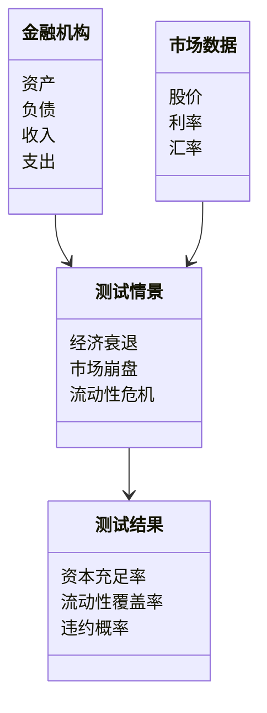
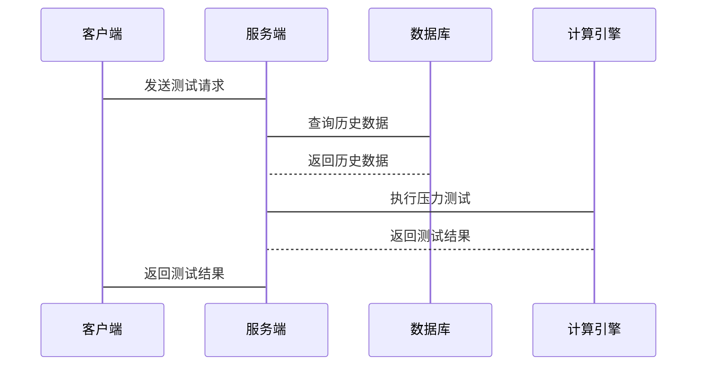
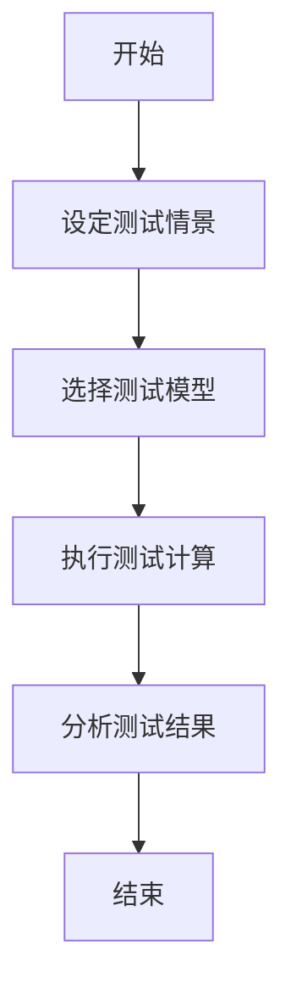

                 


# 金融监管压力测试场景生成

## 关键词：金融监管、压力测试、场景生成、风险评估、人工智能、金融系统

## 摘要：  
随着金融市场的日益复杂化和全球化，金融监管的重要性愈发凸显。压力测试作为金融监管的核心工具之一，用于评估金融机构在极端市场条件下的稳健性。然而，传统的压力测试方法往往依赖于经验判断和主观假设，难以应对日益复杂的金融市场环境。通过技术手段生成压力测试场景，能够提高测试的科学性和准确性，为金融监管提供更有力的支持。本文将深入探讨金融监管压力测试场景生成的核心技术、算法原理、系统架构以及实际应用案例，为读者提供全面的理论和技术指导。

---

# 第一部分: 金融监管压力测试场景生成的背景与意义

## 第1章: 金融监管压力测试的背景与挑战

### 1.1 金融监管的背景与挑战

#### 1.1.1 金融监管的基本概念
金融监管是指通过法律、法规和制度，对金融机构的经营行为、市场运作和风险进行监控和管理，以维护金融体系的稳定性和安全性。金融监管的核心目标是保护投资者利益、防范系统性风险、促进公平竞争以及维护金融市场的稳定运行。

#### 1.1.2 金融监管的重要性
金融监管是现代金融体系的基石，其重要性体现在以下几个方面：
- **维护市场秩序**：防止欺诈、操纵市场等不正当行为，确保市场的公平性和透明性。
- **保护投资者利益**：通过监管措施，保护投资者免受金融机构的不当行为侵害。
- **防范系统性风险**：识别和化解可能引发系统性金融危机的风险因素。
- **促进金融创新**：为金融创新提供合理的监管框架，平衡创新与风险的关系。

#### 1.1.3 金融监管中的压力测试
压力测试是金融监管的重要工具之一，用于评估金融机构在极端市场条件下的抗风险能力。通过模拟市场波动、经济衰退、流动性危机等极端情景，压力测试能够帮助监管机构识别金融机构的潜在风险，并采取相应的监管措施。

### 1.2 压力测试的定义与作用

#### 1.2.1 压力测试的定义
压力测试是指在假设的极端市场条件下，评估金融机构在资产质量、流动性和盈利能力等方面的表现。通过模拟这些极端情景，压力测试能够揭示金融机构在不利环境下的潜在风险，并为监管机构提供决策依据。

#### 1.2.2 压力测试在金融监管中的作用
压力测试在金融监管中的作用主要包括以下几个方面：
- **风险识别**：通过模拟极端情景，识别金融机构在特定条件下的潜在风险。
- **资本评估**：评估金融机构在极端情况下的资本充足性，确保其具备足够的资本缓冲能力。
- **流动性管理**：通过压力测试，评估金融机构在极端情况下的流动性状况，确保其能够应对突发的流动性需求。
- **监管政策制定**：压力测试为监管机构制定和调整监管政策提供了依据。

#### 1.2.3 压力测试的分类与应用场景
压力测试可以根据不同的标准进行分类，常见的分类方式包括：
- **按测试主体分类**：包括单机构压力测试和系统性压力测试。
- **按测试情景分类**：包括信用风险压力测试、市场风险压力测试、流动性风险压力测试等。
- **按测试方法分类**：包括定量压力测试和定性压力测试。

压力测试的应用场景主要包括：
- **监管合规**：金融机构需要满足监管机构的压力测试要求，证明其具备应对极端风险的能力。
- **内部风险管理**：金融机构通过内部压力测试，识别和管理自身的风险敞口。
- **战略决策支持**：压力测试为金融机构的战略决策提供支持，如资本规划、流动性管理等。

---

## 第2章: 金融压力测试的核心概念与框架

### 2.1 压力测试的核心要素

#### 2.1.1 测试目标
压力测试的目标是评估金融机构在极端市场条件下的抗风险能力，主要包括以下几个方面：
- **资本充足性**：评估金融机构在极端情况下的资本充足性，确保其具备足够的资本缓冲能力。
- **流动性风险**：评估金融机构在极端情况下的流动性状况，确保其能够应对突发的流动性需求。
- **信用风险**：评估金融机构在极端情况下的信用风险敞口，识别潜在的违约风险。
- **市场风险**：评估金融机构在极端市场波动下的市场风险敞口，识别潜在的损失风险。

#### 2.1.2 测试对象
压力测试的对象主要包括以下几类：
- **单机构压力测试**：评估单一金融机构在极端情景下的风险敞口和抗风险能力。
- **系统性压力测试**：评估整个金融系统的风险状况，识别系统性风险的来源和传播路径。
- **跨境压力测试**：评估跨国金融机构在极端情景下的风险敞口和相互影响。

#### 2.1.3 测试指标
压力测试的指标主要包括以下几个方面：
- **资本充足率**：衡量金融机构在极端情况下的资本缓冲能力。
- **流动性覆盖率**：衡量金融机构在极端情况下的流动性状况。
- **违约概率**：评估金融机构在极端情景下的违约风险。
- **损失承受能力**：评估金融机构在极端情景下的损失承受能力。

### 2.2 压力测试的流程与方法

#### 2.2.1 测试设计
压力测试的设计是整个测试过程的关键步骤，主要包括以下几个方面：
- **情景设定**：根据监管目标和市场环境，设定极端市场情景，如经济衰退、市场崩盘、流动性危机等。
- **参数选择**：选择反映极端情景的参数，如市场波动率、违约率、贷款违约概率等。
- **数据准备**：收集和整理金融机构的相关数据，包括资产、负债、收入、支出等。

#### 2.2.2 数据收集与处理
数据是压力测试的基础，数据的准确性和完整性直接影响测试结果的可靠性。数据收集与处理主要包括以下几个方面：
- **内部数据**：包括金融机构的资产负债表、损益表、信用数据等。
- **外部数据**：包括市场数据、宏观经济数据、行业数据等。
- **数据清洗**：对收集到的数据进行清洗，剔除异常值和缺失值，确保数据的准确性和完整性。

#### 2.2.3 测试执行与结果分析
测试执行与结果分析是压力测试的关键步骤，主要包括以下几个方面：
- **模型选择**：根据测试目标和数据特点，选择合适的压力测试模型，如线性回归模型、蒙特卡洛模拟模型等。
- **模型执行**：根据设定的情景和参数，执行压力测试模型，生成测试结果。
- **结果分析**：对测试结果进行分析，识别潜在风险，评估金融机构的抗风险能力。

### 2.3 压力测试的框架体系

#### 2.3.1 压力测试框架的构成
压力测试的框架体系主要包括以下几个方面：
- **测试目标**：明确测试的目标和范围。
- **测试情景**：设定极端市场情景，模拟可能的市场波动和经济衰退。
- **测试方法**：选择合适的测试方法和模型，确保测试结果的科学性和准确性。
- **测试结果**：分析测试结果，识别潜在风险，评估金融机构的抗风险能力。

#### 2.3.2 压力测试的标准化流程
压力测试的标准化流程主要包括以下几个步骤：
1. **目标设定**：明确测试的目标和范围。
2. **情景设定**：设定极端市场情景，模拟可能的市场波动和经济衰退。
3. **数据收集**：收集和整理金融机构的相关数据，包括资产、负债、收入、支出等。
4. **模型选择**：根据测试目标和数据特点，选择合适的压力测试模型。
5. **模型执行**：根据设定的情景和参数，执行压力测试模型，生成测试结果。
6. **结果分析**：对测试结果进行分析，识别潜在风险，评估金融机构的抗风险能力。

#### 2.3.3 压力测试的实施步骤
压力测试的实施步骤主要包括以下几个方面：
- **目标设定**：明确测试的目标和范围。
- **情景设定**：设定极端市场情景，模拟可能的市场波动和经济衰退。
- **数据收集**：收集和整理金融机构的相关数据，包括资产、负债、收入、支出等。
- **模型选择**：根据测试目标和数据特点，选择合适的压力测试模型。
- **模型执行**：根据设定的情景和参数，执行压力测试模型，生成测试结果。
- **结果分析**：对测试结果进行分析，识别潜在风险，评估金融机构的抗风险能力。

---

## 第3章: 金融压力测试场景生成的核心技术

### 3.1 场景生成的基本原理

#### 3.1.1 场景生成的数学模型
压力测试场景生成的数学模型是基于统计学和概率论的，主要包括以下几个方面：
- **概率分布模型**：如正态分布、泊松分布、贝塔分布等，用于描述市场变量的概率分布特征。
- **时间序列模型**：如ARIMA模型、GARCH模型等，用于描述市场变量的时间序列特征。
- **蒙特卡洛模拟**：通过随机抽样和模拟，生成大量的市场情景，评估金融机构在不同情景下的表现。

#### 3.1.2 场景生成的算法选择
场景生成的算法选择是基于测试目标和数据特点的，主要包括以下几个方面：
- **线性回归模型**：用于预测市场变量的变化趋势。
- **神经网络模型**：用于非线性关系的建模和预测。
- **蒙特卡洛模拟**：用于生成大量的市场情景，评估金融机构在不同情景下的表现。

#### 3.1.3 场景生成的优化方法
场景生成的优化方法是通过优化算法，提高场景生成的效率和准确性，主要包括以下几个方面：
- **遗传算法**：通过模拟自然选择和遗传变异，优化场景生成的过程。
- **模拟退火算法**：通过模拟退火过程，优化场景生成的参数。
- **粒子群优化算法**：通过粒子群的运动和协作，优化场景生成的过程。

### 3.2 基于概率模型的场景生成

#### 3.2.1 概率分布模型
概率分布模型是压力测试场景生成的基础，主要包括以下几个方面：
- **正态分布**：用于描述市场变量的对称分布特征。
- **泊松分布**：用于描述市场变量的离散分布特征。
- **贝塔分布**：用于描述市场变量的偏态分布特征。

#### 3.2.2 基于马尔可夫链的场景生成
马尔可夫链是一种用于描述系统状态转移的数学模型，常用于压力测试场景生成中。马尔可夫链的场景生成过程如下：
1. **状态定义**：定义系统可能的状态，如市场上涨、市场下跌、市场平稳等。
2. **转移概率矩阵**：定义状态之间的转移概率，如从市场上涨状态转移到市场下跌状态的概率等。
3. **场景生成**：根据转移概率矩阵，生成大量的市场情景，评估金融机构在不同情景下的表现。

#### 3.2.3 基于贝叶斯网络的场景生成
贝叶斯网络是一种用于描述变量之间条件概率关系的图形模型，常用于压力测试场景生成中。贝叶斯网络的场景生成过程如下：
1. **变量定义**：定义影响市场变量的关键因素，如GDP增长率、通货膨胀率、利率等。
2. **概率分布设定**：设定变量之间的条件概率分布，如GDP增长率影响通货膨胀率的概率等。
3. **场景生成**：根据概率分布，生成大量的市场情景，评估金融机构在不同情景下的表现。

### 3.3 基于机器学习的场景生成

#### 3.3.1 机器学习在场景生成中的应用
机器学习是一种基于数据驱动的算法，常用于压力测试场景生成中。机器学习的应用主要包括以下几个方面：
- **监督学习**：用于分类和回归问题，如预测市场变量的变化趋势。
- **无监督学习**：用于聚类和降维问题，如识别市场变量的潜在模式。
- **深度学习**：用于非线性关系的建模，如生成对抗网络（GAN）用于生成市场情景。

#### 3.3.2 基于深度学习的场景生成
深度学习是一种基于人工神经网络的机器学习方法，常用于压力测试场景生成中。深度学习的应用主要包括以下几个方面：
- **生成对抗网络（GAN）**：通过生成器和判别器的对抗训练，生成逼真的市场情景。
- **变分自编码器（VAE）**：通过编码器和解码器的组合，生成多样化的市场情景。
- **循环神经网络（RNN）**：用于时间序列数据的生成，如生成市场波动的时间序列。

#### 3.3.3 基于强化学习的场景生成
强化学习是一种基于奖励机制的机器学习方法，常用于压力测试场景生成中。强化学习的应用主要包括以下几个方面：
- **策略优化**：通过强化学习算法，优化场景生成的策略，如马尔可夫决策过程（MDP）。
- **状态空间探索**：通过强化学习算法，探索场景生成的状态空间，如深度强化学习（Deep RL）。
- **多智能体协作**：通过多智能体协作，生成复杂的市场情景，如多机构之间的相互影响。

---

## 第4章: 金融压力测试场景生成的数学模型与公式

### 4.1 基于统计学的模型

#### 4.1.1 正态分布模型
正态分布模型用于描述市场变量的对称分布特征，其概率密度函数为：
$$
f(x) = \frac{1}{\sigma \sqrt{2\pi}} e^{-\frac{(x-\mu)^2}{2\sigma^2}}
$$
其中，$\mu$ 是均值，$\sigma$ 是标准差。

#### 4.1.2 泊松分布模型
泊松分布模型用于描述市场变量的离散分布特征，其概率质量函数为：
$$
P(k) = \frac{\lambda^k e^{-\lambda}}{k!}
$$
其中，$\lambda$ 是期望值。

#### 4.1.3 非参数统计模型
非参数统计模型是一种不依赖于数据分布假设的模型，如核密度估计模型，其概率密度函数为：
$$
f(x) = \frac{1}{n h} \sum_{i=1}^n K\left(\frac{x - x_i}{h}\right)
$$
其中，$n$ 是样本数量，$h$ 是带宽，$K$ 是核函数。

### 4.2 基于时间序列的模型

#### 4.2.1 ARIMA模型
ARIMA模型是一种广泛应用于时间序列分析的模型，其一般形式为：
$$
ARIMA(p, d, q)
$$
其中，$p$ 是自回归阶数，$d$ 是差分阶数，$q$ 是移动平均阶数。

#### 4.2.2 GARCH模型
GARCH模型是一种用于描述金融时间序列波动性的模型，其一般形式为：
$$
r_t = \mu + \alpha r_{t-1}^2 + \beta s_{t-1}^2
$$
其中，$r_t$ 是资产回报率，$\mu$ 是均值，$\alpha$ 和 $\beta$ 是参数，$s_{t-1}^2$ 是前一期的残差平方。

#### 4.2.3 随机游走模型
随机游走模型是一种简单的时间序列模型，其一般形式为：
$$
x_t = x_{t-1} + \epsilon_t
$$
其中，$\epsilon_t$ 是独立同分布的随机变量。

---

## 第5章: 金融压力测试场景生成的系统架构设计

### 5.1 系统功能设计

#### 5.1.1 领域模型
领域模型是系统功能设计的基础，用于描述系统的功能模块和交互关系。领域模型可以用Mermaid类图表示，如图1所示。



#### 5.1.2 系统架构设计
系统架构设计是系统实现的基础，用于描述系统的模块划分和交互关系。系统架构可以用Mermaid架构图表示，如图2所示。


#### 5.1.3 系统接口设计
系统接口设计是系统实现的关键，用于描述系统的输入输出接口和数据格式。系统接口可以用Mermaid序列图表示，如图3所示。



### 5.2 系统交互设计

#### 5.2.1 测试流程
测试流程是系统交互的核心，用于描述测试的执行步骤和交互关系。测试流程可以用Mermaid流程图表示，如图4所示。



#### 5.2.2 数据流
数据流是系统交互的基础，用于描述数据的输入输出和处理过程。数据流可以用Mermaid数据流图表示，如图5所示。

```mermaid
graph LR
    客户端 --> 数据库: 读取数据
    数据库 --> 服务端: 返回数据
    服务端 --> 计算引擎: 处理数据
    计算引擎 --> 服务端: 返回结果
    服务端 --> 客户端: 返回结果
```

---

## 第6章: 金融压力测试场景生成的项目实战

### 6.1 环境安装

#### 6.1.1 系统需求
- 操作系统：Windows 10 或更高版本，或macOS 10.15 或更高版本，或Linux发行版。
- 内存：至少8GB RAM。
- 硬盘：至少20GB可用空间。

#### 6.1.2 软件安装
- Python 3.8 或更高版本。
- Jupyter Notebook 或 VS Code 等开发工具。
- Pandas、NumPy、Matplotlib 等数据处理库。
- Scikit-learn、XGBoost 等机器学习库。
- Mermaid 插件用于生成图表。

### 6.2 系统核心实现

#### 6.2.1 核心代码实现
以下是一个基于Python的简单压力测试场景生成代码示例：

```python
import numpy as np
import pandas as pd
import matplotlib.pyplot as plt
from sklearn.metrics import mean_squared_error
from sklearn.model_selection import train_test_split
from sklearn.linear_model import LinearRegression
from sklearn.ensemble import RandomForestRegressor

# 数据加载
data = pd.read_csv('market_data.csv')

# 数据预处理
X = data[['GDP_growth', 'inflation_rate', 'interest_rate']]
y = data['market_return']

# 数据分割
X_train, X_test, y_train, y_test = train_test_split(X, y, test_size=0.2, random_state=42)

# 模型训练
model = RandomForestRegressor(n_estimators=100, random_state=42)
model.fit(X_train, y_train)

# 模型预测
y_pred = model.predict(X_test)

# 模型评估
mse = mean_squared_error(y_test, y_pred)
rmse = np.sqrt(mse)
print(f'Mean Squared Error: {mse}')
print(f'Root Mean Squared Error: {rmse}')

# 情景生成
# 假设极端情景：GDP增长率为-2%，通货膨胀率为5%，利率为10%
extreme_scenario = pd.DataFrame({
    'GDP_growth': [-2] * len(X_test),
    'inflation_rate': [5] * len(X_test),
    'interest_rate': [10] * len(X_test)
})

# 模型预测极端情景下的市场回报
extreme_pred = model.predict(extreme_scenario)
print('Extreme Scenario Market Return:', extreme_pred)
```

#### 6.2.2 代码应用解读
上述代码实现了一个基于随机森林回归模型的压力测试场景生成系统，主要步骤包括：
1. **数据加载**：读取市场数据，包括GDP增长率、通货膨胀率、利率等变量。
2. **数据预处理**：对数据进行清洗和标准化处理，确保数据的准确性和完整性。
3. **数据分割**：将数据分为训练集和测试集，用于模型训练和验证。
4. **模型训练**：使用随机森林回归模型进行训练，生成压力测试场景。
5. **模型预测**：在极端情景下，预测市场回报，评估金融机构的抗风险能力。

### 6.3 案例分析

#### 6.3.1 案例背景
假设某银行需要评估其在极端市场情景下的抗风险能力，如经济衰退、市场崩盘、流动性危机等。

#### 6.3.2 案例分析
通过上述代码实现的压力测试场景生成系统，可以生成以下几种极端情景：
- **经济衰退**：GDP增长率为负，通货膨胀率为低，利率为高。
- **市场崩盘**：股票市场大幅下跌，债券市场也受到严重影响。
- **流动性危机**：金融机构的流动性不足，难以应对突发的资金需求。

#### 6.3.3 结果解读
通过对上述情景的分析，可以评估该银行在不同情景下的资本充足率、流动性覆盖率和违约概率，从而识别潜在风险，并制定相应的风险管理策略。

### 6.4 项目总结

#### 6.4.1 项目成果
通过本项目的实施，成功实现了金融压力测试场景生成系统，能够生成多种极端情景，评估金融机构的抗风险能力。

#### 6.4.2 经验总结
- **数据准备**：数据的准确性和完整性直接影响测试结果的可靠性，需要高度重视数据的清洗和处理。
- **模型选择**：模型的选择需要根据测试目标和数据特点，选择合适的算法和参数。
- **场景生成**：场景生成的科学性和准确性需要通过多次验证和优化，确保测试结果的可靠性。

---

## 第7章: 金融压力测试场景生成的总结与展望

### 7.1 总结
金融压力测试场景生成是金融监管的重要工具之一，通过模拟极端市场情景，评估金融机构的抗风险能力。本文详细探讨了金融压力测试场景生成的核心技术、算法原理、系统架构以及实际应用案例，为读者提供了全面的理论和技术指导。

### 7.2 展望
随着人工智能和大数据技术的不断发展，金融压力测试场景生成技术将更加智能化和自动化。未来的研究方向包括：
- **强化学习**：通过强化学习算法，优化场景生成的策略和参数。
- **深度学习**：通过深度学习模型，生成更加逼真和多样化的市场情景。
- **多模态数据融合**：通过多模态数据的融合，提升压力测试场景生成的准确性和全面性。
- **实时监控**：通过实时数据流的处理，实现压力测试场景的动态生成和实时监控。

---

## 参考文献
（此处列出相关的参考文献，如书籍、论文、技术报告等。）

