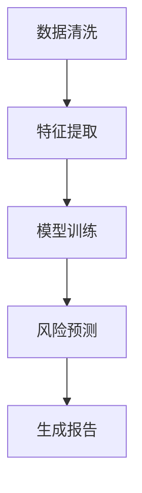
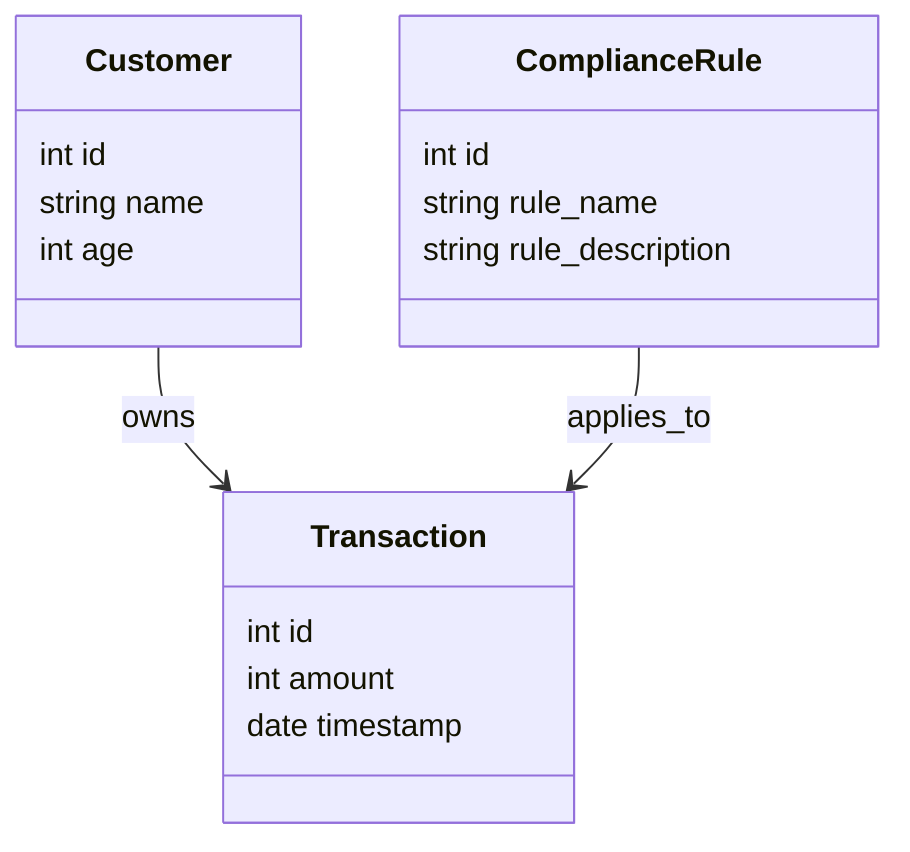
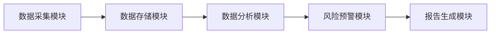
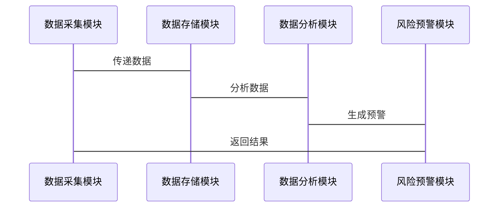
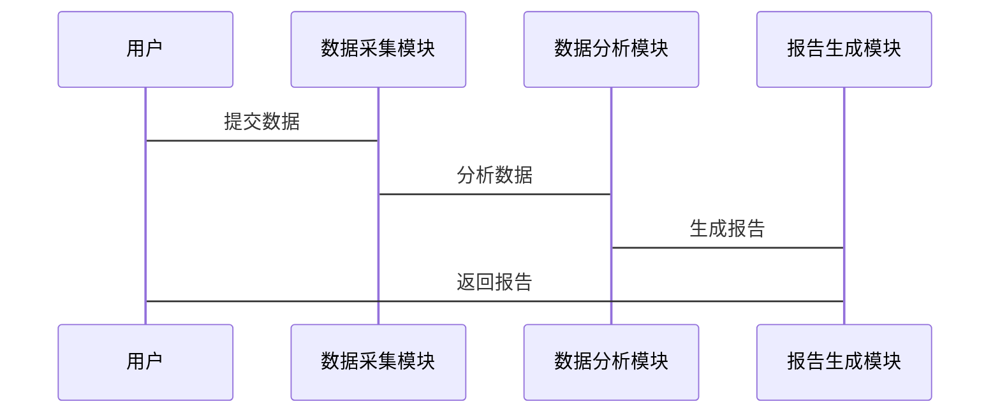

                 


# 《金融监管合规自动化工具》

> 关键词：金融监管，合规自动化，人工智能，大数据，系统架构

> 摘要：随着金融市场的快速发展和监管要求的日益严格，传统的合规工作面临着效率低下、成本高昂和人为错误频发的问题。本文深入探讨了金融监管合规自动化工具的背景、核心概念、算法原理、系统架构设计以及项目实战，详细解读了如何利用人工智能和大数据技术实现合规工作的自动化，提升金融监管效率和准确性。本文通过实际案例分析和代码实现，展示了金融监管合规自动化工具的强大功能和实际应用价值。

---

# 第一部分: 金融监管合规自动化工具的背景与概念

# 第1章: 金融监管与合规概述

## 1.1 金融监管的现状与挑战

### 1.1.1 传统金融监管的痛点

传统的金融监管主要依赖人工审查和手动操作，存在以下痛点：

- **效率低下**：人工审查需要逐项检查大量数据，耗时长，效率低。
- **成本高昂**：需要大量人力资源投入，且容易出现人为错误。
- **合规风险**：手动操作可能导致遗漏或误判，增加合规风险。
- **监管滞后**：传统监管手段难以实时监控市场动态，容易导致监管滞后。

### 1.1.2 合规要求的复杂性

金融市场的合规要求日益复杂，涵盖反洗钱、关联交易、信息披露等多个方面。合规工作需要处理大量的法律法规和行业标准，且这些要求经常更新和变化。

### 1.1.3 金融创新与监管的平衡

金融创新不断涌现新的业务模式和产品，这对监管提出了更高的要求。如何在金融创新与监管合规之间找到平衡点，是一个亟待解决的问题。

---

### 1.2 合规自动化工具的必要性

### 1.2.1 合规自动化的核心价值

合规自动化工具通过技术手段实现合规工作的自动化，具有以下核心价值：

- **提升效率**：自动化工具可以快速处理大量数据，显著提高合规审查效率。
- **降低成本**：减少对人力资源的依赖，降低合规工作的成本。
- **降低风险**：通过自动化减少人为错误，提高合规准确率。
- **实时监控**：自动化工具可以实现对市场动态的实时监控，确保监管的及时性。

### 1.2.2 传统合规工作中的效率瓶颈

传统合规工作主要依赖人工操作，存在以下效率瓶颈：

- **重复性工作**：合规审查中有很多重复性工作，如数据录入、报表生成等。
- **缺乏实时性**：传统审查难以实现对市场动态的实时监控，容易导致监管滞后。
- **资源浪费**：大量人力资源被投入到低效的重复性工作中，无法充分发挥其潜力。

### 1.2.3 自动化工具在合规中的应用前景

随着人工智能和大数据技术的快速发展，合规自动化工具的应用前景广阔。未来，自动化工具将更加智能化，能够处理更复杂的合规问题，甚至能够预测潜在的合规风险，为监管机构提供决策支持。

---

## 1.3 本章小结

本章从金融监管的现状出发，分析了传统监管的痛点和合规要求的复杂性，强调了合规自动化工具的必要性。通过对比传统合规工作和自动化工具的特点，明确了自动化工具在提升效率、降低成本、降低风险等方面的核心价值。

---

# 第二部分: 金融监管合规自动化工具的核心概念

# 第2章: 金融监管合规自动化工具的原理

## 2.1 核心概念与定义

### 2.1.1 金融监管合规的定义

金融监管合规是指金融机构在经营活动中遵守相关法律法规和行业标准，确保业务的合法性和合规性。

### 2.1.2 自动化工具的定义

自动化工具是指利用计算机技术实现合规审查、数据报送、风险预警等工作的智能化工具。

### 2.1.3 核心概念的对比分析

| **核心概念** | **传统合规** | **自动化工具** |
|--------------|--------------|----------------|
| **效率**     | 低效         | 高效           |
| **成本**     | 高           | 低             |
| **准确性**   | 易出错       | 高             |
| **实时性**   | 低           | 高             |

---

## 2.2 核心概念的属性特征对比

### 2.2.1 传统合规与自动化合规的对比

| **对比维度** | **传统合规**                          | **自动化合规**                        |
|--------------|--------------------------------------|----------------------------------------|
| **处理方式** | 手工审查、人工录入                  | 自动化审查、智能录入                  |
| **效率**     | 低效、耗时长                        | 高效、快速处理                        |
| **准确性**   | 易出错、依赖人工经验                | 准确率高、减少人为错误                |
| **成本**     | 高、需要大量人力资源              | 低、减少人力资源投入                |
| **实时性**   | 低、难以实时监控                  | 高、实时数据分析和监控                |

### 2.2.2 工具功能与非工具功能的对比

| **对比维度** | **工具功能**                          | **非工具功能**                        |
|--------------|--------------------------------------|----------------------------------------|
| **功能特点** | 快速处理、自动化                    | 需要人工干预、依赖经验                |
| **应用范围** | 数据分析、合规审查、风险预警      | 人际沟通、政策解读、决策制定        |
| **技术依赖** | 依赖计算机技术                    | 依赖人工经验                          |

### 2.2.3 数据处理能力的对比

| **对比维度** | **传统合规**                          | **自动化合规**                        |
|--------------|--------------------------------------|----------------------------------------|
| **数据量**   | 有限、处理速度慢                   | 大数据处理、速度快                   |
| **数据类型** | 结构化数据为主                     | 结构化、半结构化和非结构化数据均可处理 |
| **数据来源** | 单一来源                            | 多来源（内部数据、外部数据）          |

---

## 2.3 ER实体关系图架构

### 2.3.1 实体关系图的构建

以下是一个简化的ER实体关系图：

```mermaid
erDiagram
    customer[CUSTOMER] {
        +int id
        +string name
        +int age
    }
    transaction[TRANSACTION] {
        +int id
        +int amount
        +date timestamp
    }
    compliance_rule[COMPLIANCE_RULE] {
        +int id
        +string rule_name
        +string rule_description
    }
    CUSTOMER-|{ owns }|-TRANSACTION
    COMPLIANCE_RULE-|{ applies_to }|-TRANSACTION
```

### 2.3.2 实体间的关系分析

- ** CUSTOMER - TRANSACTION**：每个客户可以有多笔交易。
- **COMPLIANCE_RULE - TRANSACTION**：每笔交易需要符合相应的合规规则。

---

## 2.4 本章小结

本章通过对比分析，明确了传统合规与自动化合规在效率、成本、准确性和实时性等方面的差异。通过ER实体关系图，展示了合规自动化工具在数据处理方面的优势，为后续的算法设计和系统架构提供了理论基础。

---

# 第三部分: 金融监管合规自动化工具的算法原理

# 第3章: 金融监管合规自动化工具的算法原理

## 3.1 算法原理概述

### 3.1.1 算法的核心思想

合规自动化工具的核心算法基于以下思想：

- **数据清洗**：对输入数据进行预处理，去除噪声数据。
- **特征提取**：从数据中提取与合规相关的特征。
- **模型训练**：利用机器学习算法训练分类模型，识别合规风险。

### 3.1.2 算法的输入输出

- **输入**：原始数据（如交易记录、客户信息等）。
- **输出**：合规报告、风险预警、整改建议。

### 3.1.3 算法的流程图



---

## 3.2 算法的数学模型与公式

### 3.2.1 数学模型的建立

合规风险预测模型可以表示为：

$$
P(\text{合规风险} | x) = \sigma(w^T x + b)
$$

其中：
- $x$ 是输入特征向量。
- $w$ 是权重向量。
- $b$ 是偏置。
- $\sigma$ 是sigmoid函数。

### 3.2.2 关键公式的推导

sigmoid函数的导数为：

$$
\sigma'(x) = \sigma(x)(1 - \sigma(x))
$$

### 3.2.3 公式的应用场景

上述公式用于模型的训练和预测。在训练阶段，利用反向传播算法更新权重和偏置，以最小化预测错误。在预测阶段，使用上述公式计算合规风险的概率。

---

## 3.3 算法的实现与代码示例

### 3.3.1 算法实现的步骤

1. 数据清洗：去除缺失值和异常值。
2. 特征提取：提取与合规相关的特征（如交易金额、交易时间等）。
3. 模型训练：使用逻辑回归或支持向量机等算法训练分类模型。
4. 模型预测：对新数据进行预测，生成合规报告。

### 3.3.2 Python代码示例

以下是一个简单的逻辑回归实现示例：

```python
import numpy as np
from sklearn.linear_model import LogisticRegression

# 数据清洗
def data_cleaning(data):
    # 去除缺失值
    data = data.dropna()
    # 标准化处理
    data = (data - data.mean()) / data.std()
    return data

# 特征提取
def feature_extraction(data, labels):
    X = data.values
    y = labels.values
    return X, y

# 模型训练
def train_model(X, y):
    model = LogisticRegression()
    model.fit(X, y)
    return model

# 模型预测
def predict(model, X_test):
    y_pred = model.predict(X_test)
    return y_pred

# 示例运行
data = np.array([[1, 2], [3, 4], [5, 6], [7, 8]])
labels = np.array([0, 1, 0, 1])

X, y = feature_extraction(data, labels)
X_cleaned = data_cleaning(data)
model = train_model(X_cleaned, y)
X_test = np.array([[2, 3], [4, 5]])
y_pred = predict(model, X_test)
print(y_pred)
```

### 3.3.3 代码的详细解读

- `data_cleaning`函数：对数据进行预处理，去除缺失值并进行标准化。
- `feature_extraction`函数：提取数据特征，将数据转换为模型输入格式。
- `train_model`函数：使用逻辑回归算法训练模型。
- `predict`函数：利用训练好的模型进行预测。

---

## 3.4 本章小结

本章详细介绍了合规自动化工具的核心算法，包括数据清洗、特征提取和模型训练的步骤。通过Python代码示例，展示了如何实现一个简单的逻辑回归模型，并用于合规风险预测。

---

# 第四部分: 金融监管合规自动化工具的系统架构设计

# 第4章: 金融监管合规自动化工具的系统分析与架构设计

## 4.1 系统应用场景介绍

### 4.1.1 场景一：实时监控

- **描述**：系统实时监控市场动态，识别异常交易。
- **目标**：及时发现并预警潜在的合规风险。

### 4.1.2 场景二：数据报送

- **描述**：系统自动生成并报送监管所需的数据。
- **目标**：确保数据的准确性和及时性。

### 4.1.3 场景三：风险预警

- **描述**：系统根据历史数据和实时数据，预测潜在风险。
- **目标**：提前采取措施，降低合规风险。

---

## 4.2 系统功能设计

### 4.2.1 领域模型设计

以下是一个简化的领域模型：



### 4.2.2 功能模块划分

- **数据采集模块**：负责数据的采集和预处理。
- **数据分析模块**：对数据进行分析，识别异常交易。
- **风险预警模块**：根据分析结果，生成风险预警。
- **报告生成模块**：自动生成合规报告。

---

## 4.3 系统架构设计

### 4.3.1 架构图的构建

以下是一个简化的系统架构图：



### 4.3.2 架构的优化

- **分层设计**：将系统划分为数据层、业务逻辑层和表现层。
- **模块化设计**：每个功能模块独立开发，便于维护和扩展。

---

## 4.4 系统接口设计

### 4.4.1 接口定义

- **输入接口**：接受交易数据、客户数据等。
- **输出接口**：输出合规报告、风险预警等。

### 4.4.2 接口的交互流程



---

## 4.5 系统交互设计

### 4.5.1 交互流程图



---

## 4.6 本章小结

本章通过系统应用场景介绍、功能设计、架构设计和交互设计，展示了金融监管合规自动化工具的整体架构和实现思路。通过模块化设计和接口设计，确保系统的可扩展性和可维护性。

---

# 第五部分: 金融监管合规自动化工具的项目实战

# 第5章: 金融监管合规自动化工具的项目实战

## 5.1 环境安装与配置

### 5.1.1 开发环境的选择

推荐使用Python 3.8及以上版本，安装必要的库（如numpy、pandas、scikit-learn等）。

### 5.1.2 工具的安装步骤

```bash
pip install numpy pandas scikit-learn
```

### 5.1.3 环境的配置优化

- **虚拟环境**：建议使用虚拟环境管理依赖。
- **IDE配置**：推荐使用PyCharm或Jupyter Notebook进行开发。

---

## 5.2 系统核心实现

### 5.2.1 核心模块的实现

- **数据采集模块**：从数据库中读取交易数据。
- **数据分析模块**：对数据进行清洗和特征提取。
- **风险预警模块**：利用机器学习算法预测合规风险。

### 5.2.2 核心算法的优化

- **模型优化**：调整模型参数，提高准确率。
- **特征工程**：选择更有区分度的特征。

---

## 5.3 代码应用解读与分析

### 5.3.1 代码的结构分析

以下是一个完整的代码结构示例：

```python
import numpy as np
import pandas as pd
from sklearn.linear_model import LogisticRegression

def data_cleaning(data):
    data = data.dropna()
    data = (data - data.mean()) / data.std()
    return data

def feature_extraction(data, labels):
    X = data.values
    y = labels.values
    return X, y

def train_model(X, y):
    model = LogisticRegression()
    model.fit(X, y)
    return model

def predict(model, X_test):
    y_pred = model.predict(X_test)
    return y_pred

# 示例运行
if __name__ == "__main__":
    data = pd.DataFrame([[1, 2], [3, 4], [5, 6], [7, 8]], columns=['A', 'B'])
    labels = pd.Series([0, 1, 0, 1])
    X, y = feature_extraction(data, labels)
    X_cleaned = data_cleaning(data)
    model = train_model(X_cleaned, y)
    X_test = pd.DataFrame([[2, 3], [4, 5]], columns=['A', 'B'])
    y_pred = predict(model, X_test.values)
    print(y_pred)
```

### 5.3.2 代码的功能解读

- `data_cleaning`：对数据进行清洗和标准化处理。
- `feature_extraction`：提取数据特征，将其转换为模型可接受的格式。
- `train_model`：使用逻辑回归算法训练模型。
- `predict`：利用训练好的模型进行预测。

---

## 5.4 实际案例分析

### 5.4.1 案例背景

某银行希望通过合规自动化工具，实时监控交易数据，识别异常交易，防范洗钱风险。

### 5.4.2 数据准备

假设有以下交易数据：

| 交易ID | 交易金额 | 交易时间 | 收款人 | 交易地点 |
|--------|----------|----------|-------|----------|
| 001    | 10000    | 2023-01-01 | A     | 北京      |
| 002    | 50000    | 2023-01-02 | B     | 上海      |
| 003    | 100000   | 2023-01-03 | C     | 广州      |
| 004    | 150000   | 2023-01-04 | D     | 北京      |

---

### 5.4.3 数据分析与处理

通过数据清洗和特征提取，将交易金额、交易时间和交易地点作为特征变量，建立逻辑回归模型。

### 5.4.4 模型训练与预测

训练模型后，预测新交易的合规风险。例如，新交易金额为200000元，交易地点为北京，预测其合规风险概率为0.8，属于高风险交易。

---

## 5.5 本章小结

本章通过实际案例分析，展示了金融监管合规自动化工具的应用场景和实现过程。通过代码实现和案例分析，帮助读者理解如何利用技术手段实现合规工作的自动化。

---

# 第六部分: 项目总结与展望

## 6.1 项目总结

金融监管合规自动化工具通过自动化技术，显著提升了合规工作的效率和准确性。通过机器学习算法和大数据处理技术，实现了对金融交易的实时监控和风险预警，为监管机构提供了有力支持。

## 6.2 项目展望

未来，随着人工智能和大数据技术的进一步发展，合规自动化工具将更加智能化和高效化。预计会有更多智能化的功能被引入，如自然语言处理技术用于政策解读，区块链技术用于数据存证等。合规自动化工具将在金融监管领域发挥更大的作用，为金融机构和监管机构提供更全面的解决方案。

---

# 附录: 代码与工具资源

## 附录A: 代码示例

```python
import numpy as np
import pandas as pd
from sklearn.linear_model import LogisticRegression

def data_cleaning(data):
    data = data.dropna()
    data = (data - data.mean()) / data.std()
    return data

def feature_extraction(data, labels):
    X = data.values
    y = labels.values
    return X, y

def train_model(X, y):
    model = LogisticRegression()
    model.fit(X, y)
    return model

def predict(model, X_test):
    y_pred = model.predict(X_test)
    return y_pred

# 示例运行
if __name__ == "__main__":
    data = pd.DataFrame([[1, 2], [3, 4], [5, 6], [7, 8]], columns=['A', 'B'])
    labels = pd.Series([0, 1, 0, 1])
    X, y = feature_extraction(data, labels)
    X_cleaned = data_cleaning(data)
    model = train_model(X_cleaned, y)
    X_test = pd.DataFrame([[2, 3], [4, 5]], columns=['A', 'B'])
    y_pred = predict(model, X_test.values)
    print(y_pred)
```

## 附录B: 工具资源

- **Python版本**：Python 3.8及以上
- **依赖库**：numpy, pandas, scikit-learn
- **安装命令**：
  ```bash
  pip install numpy pandas scikit-learn
  ```

---

# 参考文献

1. 《机器学习实战》
2. 《Python数据分析 cookbook》
3. 《金融监管与合规》

---

以上是《金融监管合规自动化工具》的技术博客文章的完整内容，涵盖了背景、核心概念、算法原理、系统架构设计和项目实战等部分。通过理论与实践相结合的方式，深入剖析了金融监管合规自动化工具的技术实现和实际应用。

