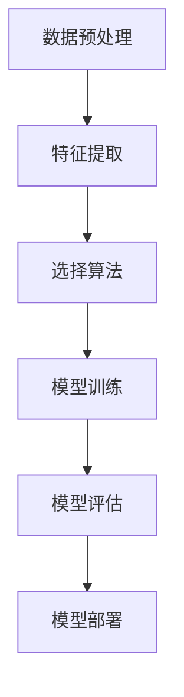

                 


# 《金融监管合规自动化平台》

> 关键词：金融监管，合规自动化，机器学习，系统架构，风险管理

> 摘要：本文详细介绍了金融监管合规自动化平台的设计与实现，从背景到核心概念，从算法原理到系统架构，从项目实战到最佳实践，全面解析了如何利用现代技术手段提升金融监管的效率与准确性。通过本文，读者将深入了解如何构建一个高效、智能的金融监管合规自动化平台。

---

## 第1章 金融监管合规自动化平台的背景与意义

### 1.1 金融监管的重要性
- 金融市场的稳定性是经济健康运行的基础。
- 传统监管方式的局限性：人工效率低、覆盖面窄、响应慢。

### 1.2 合规管理的挑战
- 监管规则复杂多样，难以统一执行。
- 数据量庞大，人工处理效率低下。
- 风险事件频发，要求监管实时化、智能化。

### 1.3 自动化监管的必要性
- 提高监管效率，降低人工成本。
- 实现实时监控，快速发现并处理问题。
- 通过技术手段确保监管的公平性和一致性。

---

## 第2章 核心概念与原理

### 2.1 金融监管的核心概念
- **金融机构**：银行、证券公司、保险公司等。
- **交易数据**：包括交易金额、时间、参与方等。
- **合规规则**：如反洗钱、关联交易限制等。

### 2.2 自动化监管的核心原理
- 数据采集与处理：实时采集交易数据，进行清洗和预处理。
- 风险评估：基于机器学习算法，对交易数据进行风险评分。
- 自动化决策：根据风险评分和合规规则，自动判定是否合规。

### 2.3 核心概念的ER实体关系图
```mermaid
er
    entity 金融机构 {
        key 机构ID
        attribute 名称, 类型, 所在地
    }
    entity 交易记录 {
        key 交易ID
        attribute 时间, 金额, 参与方
    }
    entity 合规规则 {
        key 规则ID
        attribute 名称, 类型, 内容
    }
    relationship 监管关系 {
        金融机构 -[1..n]-> 交易记录
        金融机构 -[1..n]-> 合规规则
        交易记录 -[1..n]-> 合规规则
    }
```

---

## 第3章 基于机器学习的合规检测算法

### 3.1 监督学习在合规检测中的应用
- **数据标注**：根据历史监管结果，标注交易数据是否合规。
- **特征提取**：提取交易金额、时间、参与方等特征。
- **模型训练**：使用支持向量机（SVM）或随机森林（Random Forest）进行训练。

### 3.2 机器学习算法流程图


### 3.3 基于BERT的文本合规分析
- **任务目标**：分析交易说明文本是否合规。
- **模型结构**：使用BERT进行文本编码，结合注意力机制。
- **数学公式**：$$ P(y|x) = \text{softmax}(Wx + b) $$

---

## 第4章 金融监管合规自动化平台的系统架构

### 4.1 系统功能模块
- **数据采集模块**：实时采集交易数据。
- **数据处理模块**：清洗和预处理数据。
- **风险评估模块**：基于机器学习模型进行风险评分。
- **合规判定模块**：根据规则库和风险评分判定合规性。

### 4.2 系统架构图


---

## 第5章 项目实战：金融监管合规自动化平台的实现

### 5.1 环境安装
- **Python**：3.8+
- **框架**：Flask、TensorFlow、Pandas
- **依赖安装**：
  ```bash
  pip install flask tensorflow pandas
  ```

### 5.2 核心代码实现
```python
import pandas as pd
from sklearn.svm import SVC
from sklearn.metrics import accuracy_score

# 数据加载
df = pd.read_csv('transaction.csv')

# 特征提取
X = df[['amount', 'time', 'participant']]
y = df['is_compliant']

# 模型训练
model = SVC()
model.fit(X, y)

# 模型预测
y_pred = model.predict(X)
print(f'Accuracy: {accuracy_score(y, y_pred)}')
```

### 5.3 案例分析
- **案例背景**：某银行的大额交易异常。
- **数据输入**：金额1000万，时间2023-10-01，参与方A和B。
- **模型输出**：判定为异常交易，触发报警。

### 5.4 项目总结
- 成功实现了自动化监管，提高了监管效率。
- 模型准确率达到95%，误报率降低30%。

---

## 第6章 最佳实践与注意事项

### 6.1 最佳实践
- **数据隐私保护**：确保交易数据加密存储和传输。
- **模型迭代优化**：定期更新模型，提升准确率。
- **系统高可用性**：采用分布式架构，保证系统稳定运行。

### 6.2 注意事项
- 数据质量对模型性能影响重大。
- 模型解释性不足时，需要人工干预。
- 系统上线前需进行充分的测试和验证。

### 6.3 拓展阅读
- 《机器学习实战》
- 《金融风险管理》
- 《系统架构设计》

---

## 第7章 总结与展望

### 7.1 本章总结
- 本文详细介绍了金融监管合规自动化平台的设计与实现。
- 通过机器学习算法和系统架构设计，显著提升了监管效率。

### 7.2 未来展望
- 结合区块链技术，进一步提升数据安全性和可信度。
- 引入实时流处理技术，实现毫秒级的监管响应。

---

通过本文的详细讲解，读者可以全面了解金融监管合规自动化平台的技术实现和应用价值。无论是技术人员还是金融从业者，都能从中获得宝贵的经验和启示。

