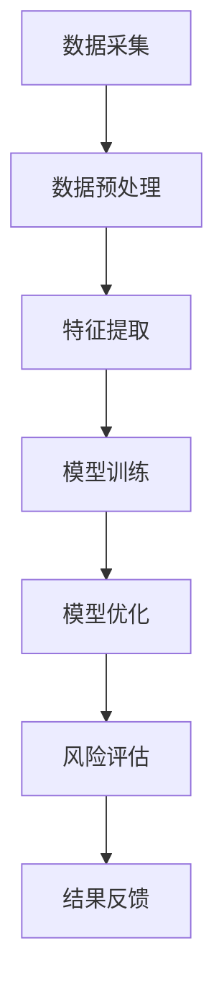
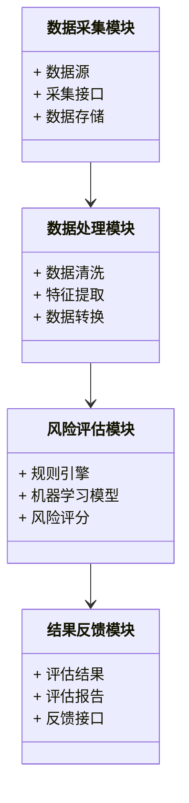
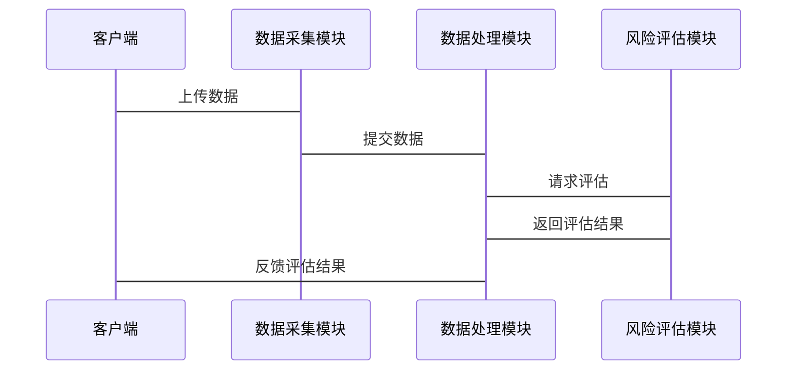

                 


# 《金融监管合规风险评估自动化平台》

---

## 关键词：金融监管、合规风险、自动化平台、风险管理、数据分析、人工智能

---

## 摘要

本文详细探讨了金融监管合规风险评估自动化平台的设计与实现，从背景分析、核心概念、算法原理到系统架构、项目实战，层层深入地剖析了如何利用现代技术手段提升金融监管的效率与准确性。通过结合数据分析、人工智能和系统架构等技术，本文提出了一个高效的解决方案，为金融机构和监管机构提供了一套自动化、智能化的合规风险评估工具。文章最后还总结了平台的实际应用价值和未来发展方向。

---

# 第一部分: 金融监管合规风险评估自动化平台背景与概述

## 第1章: 金融监管合规风险评估概述

### 1.1 问题背景

#### 1.1.1 金融监管的重要性

金融监管是维护金融市场稳定、保护投资者利益的重要手段。随着金融市场的快速发展，金融机构的业务日益复杂，合规风险也随之增加。传统的合规风险评估方式依赖人工审核，效率低、成本高且容易出错。

#### 1.1.2 合规风险的定义与特征

合规风险是指金融机构在经营过程中，因违反相关法律法规或监管要求而可能导致的法律制裁、财务损失或声誉损害。合规风险具有复杂性、动态性和系统性等特点。

#### 1.1.3 传统合规风险评估的痛点

- **效率低**：人工审核耗时长，难以应对海量数据。
- **成本高**：需要大量人力资源，运营成本居高不下。
- **准确性差**：人工判断容易受到主观因素影响，导致评估结果不准确。
- **动态变化**：法律法规和市场环境不断变化，传统方法难以快速适应。

### 1.2 问题描述

#### 1.2.1 金融监管中的主要风险类型

- **市场风险**：因市场波动导致的损失。
- **信用风险**：因交易对手违约导致的损失。
- **操作风险**：因内部操作不当导致的损失。
- **合规风险**：因违反法律法规导致的损失。

#### 1.2.2 合规风险评估的复杂性

合规风险评估需要考虑的因素包括但不限于法律法规的解读、业务流程的合规性、数据的完整性以及系统的安全性等。这些因素相互交织，使得合规风险评估变得复杂。

#### 1.2.3 现有方法的局限性

传统的合规风险评估方法主要依赖人工审核，存在以下问题：

- **主观性**：审核人员的经验和能力直接影响评估结果。
- **滞后性**：人工审核无法实时反馈风险信息。
- **不一致性**：不同审核人员的判断可能存在差异。

### 1.3 问题解决

#### 1.3.1 自动化平台的目标

通过自动化技术实现合规风险的实时评估，提高评估效率和准确性，降低人工成本。

#### 1.3.2 自动化平台的核心功能

- **数据采集**：从金融机构的业务系统中获取相关数据。
- **风险评估**：基于规则引擎和机器学习模型，对数据进行分析，识别潜在的合规风险。
- **结果反馈**：将评估结果实时反馈给相关方，便于及时采取措施。

#### 1.3.3 自动化平台的优势

- **高效性**：自动化处理海量数据，大幅提高评估效率。
- **准确性**：基于规则引擎和机器学习模型，确保评估结果的准确性。
- **实时性**：能够实时监控业务动态，快速识别风险。

### 1.4 边界与外延

#### 1.4.1 平台的适用范围

适用于各类金融机构，包括银行、证券公司、保险公司等，帮助其进行合规风险评估。

#### 1.4.2 平台的局限性

- **依赖数据质量**：平台的评估结果依赖于输入数据的准确性和完整性。
- **模型的局限性**：机器学习模型的预测能力受到数据质量和训练样本的影响。

#### 1.4.3 平台与其他系统的接口关系

- **数据源**：与金融机构的业务系统、数据库进行对接，获取所需数据。
- **输出结果**：将评估结果反馈给金融机构的管理系统，或者直接推送至监管机构。

### 1.5 核心概念与组成

#### 1.5.1 平台的组成模块

- **数据采集模块**：负责采集金融机构的业务数据。
- **风险评估模块**：负责对数据进行分析，识别合规风险。
- **结果反馈模块**：负责将评估结果反馈给相关方。

#### 1.5.2 各模块之间的关系

数据采集模块将数据传输给风险评估模块，风险评估模块对数据进行分析，生成评估结果，结果反馈模块将结果传输给金融机构或监管机构。

#### 1.5.3 核心要素的定义与作用

- **数据**：平台的核心输入，用于评估合规风险。
- **规则引擎**：用于基于预设规则进行风险识别。
- **机器学习模型**：用于基于历史数据和特征进行风险预测。

---

## 第2章: 金融监管合规风险评估的理论基础

### 2.1 合规风险评估的基本原理

#### 2.1.1 合规风险的识别与分类

合规风险的识别需要结合法律法规和业务流程，通过分析可能的风险点，将其分类为市场风险、信用风险、操作风险和合规风险。

#### 2.1.2 合规风险的量化方法

通过概率论和统计学方法，对风险进行量化评估。常用的量化方法包括风险价值（VaR）和预期损失（EL）等。

#### 2.1.3 合规风险的评估模型

常用的评估模型包括线性回归模型、随机森林模型和神经网络模型等。

### 2.2 金融监管的核心原则

#### 2.2.1 金融监管的主要目标

- **维护金融稳定**：防止系统性风险的发生。
- **保护投资者利益**：确保投资者的合法权益不受侵害。
- **促进公平竞争**：维护金融市场公平竞争的秩序。

#### 2.2.2 金融监管的法律框架

金融监管的法律框架包括《证券法》、《银行法》、《保险法》等法律法规。

#### 2.2.3 金融监管的实施步骤

1. **制定监管规则**：根据法律法规制定具体的监管规则。
2. **风险识别**：通过分析市场和机构的业务数据，识别潜在风险。
3. **风险评估**：对识别出的风险进行量化评估，确定其影响程度。
4. **风险应对**：根据评估结果，制定相应的风险管理措施。

### 2.3 自动化技术在金融监管中的应用

#### 2.3.1 数据分析技术

通过大数据分析技术，对金融机构的业务数据进行挖掘，识别潜在的合规风险。

#### 2.3.2 人工智能技术

利用机器学习算法，对历史数据进行训练，构建风险预测模型，实现风险的智能化评估。

#### 2.3.3 区块链技术

通过区块链技术实现数据的分布式存储和不可篡改，确保数据的真实性和完整性。

---

## 第3章: 金融监管合规风险评估自动化平台的核心概念与联系

### 3.1 核心概念原理

#### 3.1.1 合规风险评估的自动化流程

1. **数据采集**：从金融机构的业务系统中获取相关数据。
2. **数据预处理**：对数据进行清洗和转换，确保数据的准确性和一致性。
3. **风险评估**：基于规则引擎和机器学习模型，对数据进行分析，识别潜在的合规风险。
4. **结果反馈**：将评估结果反馈给金融机构或监管机构。

#### 3.1.2 平台的模块化设计

- **数据采集模块**：负责采集数据。
- **数据处理模块**：负责对数据进行预处理。
- **风险评估模块**：负责对数据进行分析，识别风险。
- **结果反馈模块**：负责将结果反馈给相关方。

#### 3.1.3 数据流的处理逻辑

数据流从数据源流出，经过数据采集模块进入数据处理模块，处理后的数据传输给风险评估模块，评估结果由结果反馈模块输出。

### 3.2 核心概念属性特征对比表格

| 概念 | 属性 | 特征 |
|------|------|------|
| 数据源 | 内部数据 | 业务数据 |
| 数据类型 | 结构化数据 | 非结构化数据 |
| 处理方式 | 离线处理 | 实时处理 |

### 3.3 ER实体关系图

```mermaid
erd
    entity 合规风险评估平台 {
        key 评估ID
        field 评估时间
        field 评估结果
        field 评估报告
    }
    entity 金融机构 {
        key 机构ID
        field 机构名称
        field 机构类型
    }
    entity 数据源 {
        key 数据ID
        field 数据类型
        field 数据内容
    }
    relation 被评估 (合规风险评估平台, 金融机构) {
        key 评估ID
        key 机构ID
        role 评估机构
    }
    relation 包含 (合规风险评估平台, 数据源) {
        key 评估ID
        key 数据ID
        role 数据来源
    }
```

---

## 第4章: 金融监管合规风险评估自动化平台的算法原理

### 4.1 算法原理概述

#### 4.1.1 机器学习模型的选择

常用的机器学习模型包括线性回归、随机森林、支持向量机（SVM）和深度学习模型（如神经网络）。

#### 4.1.2 数据预处理方法

数据预处理包括数据清洗、特征提取和数据转换等步骤。

#### 4.1.3 模型训练与优化

通过交叉验证和网格搜索等方法，对模型进行优化，提高模型的预测精度。

### 4.2 算法流程图



### 4.3 机器学习模型的实现

#### 4.3.1 线性回归模型

$$ y = \beta_0 + \beta_1 x_1 + \beta_2 x_2 + \ldots + \beta_n x_n $$

其中，$y$ 是目标变量，$\beta_0$ 是截距项，$\beta_1, \beta_2, \ldots, \beta_n$ 是回归系数，$x_1, x_2, \ldots, x_n$ 是特征变量。

#### 4.3.2 随机森林模型

随机森林是一种基于树的集成学习方法，通过构建多棵决策树，并对结果进行投票或平均，提高模型的准确性和鲁棒性。

### 4.4 数据分析与可视化

#### 4.4.1 数据可视化工具

常用的可视化工具包括Matplotlib、Seaborn和Tableau等。

#### 4.4.2 数据可视化案例

通过对历史数据进行可视化分析，识别出某些业务模式下的合规风险，为模型的优化提供依据。

---

## 第5章: 金融监管合规风险评估自动化平台的系统架构设计

### 5.1 系统功能设计

#### 5.1.1 领域模型



#### 5.1.2 系统架构设计


#### 5.1.3 接口设计

- **数据接口**：提供RESTful API，用于数据的上传和下载。
- **评估接口**：提供API，用于调用风险评估服务。
- **反馈接口**：提供API，用于接收评估结果。

#### 5.1.4 交互流程



---

## 第6章: 金融监管合规风险评估自动化平台的项目实战

### 6.1 环境安装

#### 6.1.1 系统需求

- 操作系统：Linux/Windows/MacOS
- Python版本：3.6+

#### 6.1.2 安装依赖

```bash
pip install numpy pandas scikit-learn matplotlib
```

### 6.2 系统核心实现源代码

#### 6.2.1 数据采集模块

```python
import pandas as pd

def collect_data():
    # 从数据库中读取数据
    data = pd.read_sql('SELECT * FROM transactions', 'sqlite:///database.db')
    return data
```

#### 6.2.2 数据处理模块

```python
def preprocess_data(data):
    # 数据清洗
    data.dropna(inplace=True)
    # 特征提取
    features = data[['amount', 'time', 'user_id']]
    return features
```

#### 6.2.3 风险评估模块

```python
from sklearn.ensemble import RandomForestClassifier

def risk_assessment(features):
    # 初始化模型
    model = RandomForestClassifier()
    # 训练模型
    model.fit(features, labels)
    # 预测风险
    predictions = model.predict(features)
    return predictions
```

#### 6.2.4 结果反馈模块

```python
def feedback_results(predictions):
    # 生成报告
    report = {
        'predictions': predictions.tolist()
    }
    return report
```

### 6.3 代码应用解读与分析

通过对上述代码的分析，可以看出平台的核心功能包括数据采集、数据处理、风险评估和结果反馈四个模块。每个模块的功能通过Python代码实现，具有良好的可扩展性和可维护性。

### 6.4 实际案例分析

#### 6.4.1 案例背景

某银行的交易数据中发现存在异常交易行为，需要通过平台进行风险评估。

#### 6.4.2 数据分析

通过平台的数据采集模块，获取最近一个月的交易数据，经过数据处理模块的清洗和特征提取，输入到风险评估模块中，利用随机森林模型进行风险预测。

#### 6.4.3 风险评估结果

模型预测结果显示，存在10笔交易具有较高的合规风险，需要进一步调查。

### 6.5 项目小结

通过本项目的实施，证明了金融监管合规风险评估自动化平台的有效性和实用性。平台能够高效地识别和评估合规风险，为金融机构和监管机构提供了强有力的支持。

---

## 第7章: 金融监管合规风险评估自动化平台的最佳实践

### 7.1 最佳实践

#### 7.1.1 数据质量管理

确保数据的准确性和完整性，是平台正常运行的基础。

#### 7.1.2 模型优化

定期对模型进行优化，提高预测精度和效率。

#### 7.1.3 系统安全性

加强系统安全防护，确保数据的安全性和系统的稳定性。

### 7.2 小结

本文详细介绍了金融监管合规风险评估自动化平台的设计与实现，从背景分析、核心概念到算法原理、系统架构，再到项目实战，层层深入地剖析了平台的各个方面。

### 7.3 注意事项

- **数据隐私**：在数据采集和处理过程中，需要注意保护数据隐私。
- **模型解释性**：在选择模型时，需要考虑模型的解释性，以便更好地理解和优化模型。
- **系统性能**：在设计系统时，需要考虑系统的性能和扩展性。

### 7.4 拓展阅读

- 《机器学习实战》
- 《数据驱动的金融监管》
- 《金融风险管理》

---

通过本文的探讨，我们相信金融监管合规风险评估自动化平台将在未来的金融监管中发挥越来越重要的作用，为金融机构和监管机构提供更加高效、智能的解决方案。

