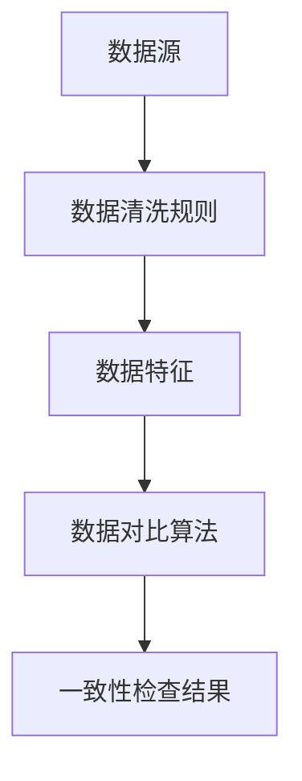
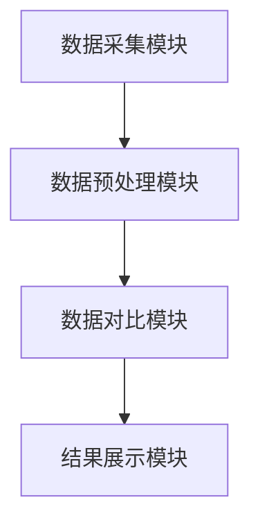

                 


# 《金融监管报告数据一致性检查工具》

---

## 关键词  
金融监管，数据一致性，数据清洗，数据对比，机器学习

---

## 摘要  
金融监管是保障金融市场健康运行的重要环节，而数据一致性是金融监管工作的核心要求之一。本文介绍了一种基于数据清洗、特征提取和对比算法的金融监管报告数据一致性检查工具。通过详细分析数据一致性检查的背景、核心概念、算法原理和系统架构，本文为金融监管领域的技术实现提供了理论支持和实践指导。

---

## 第一部分：背景与概述

### 第1章：金融监管报告数据一致性检查工具概述

#### 1.1 数据一致性检查的背景与意义
金融监管的核心目标是确保金融市场的透明性、合规性和公平性。然而，金融机构在报送监管报告时，由于数据来源复杂、格式多样以及人为操作等因素，常常导致数据不一致的问题。数据不一致不仅会影响监管机构的决策，还可能引发金融风险。因此，开发一种能够自动检测数据一致性的工具显得尤为重要。

#### 1.2 问题背景与目标
- **问题背景**：金融监管报告数据来源多样，格式复杂，容易出现数据不一致的问题。
- **问题目标**：通过自动化手段，检测监管报告中的数据一致性问题，并提供修复建议。

#### 1.3 数据一致性检查的解决思路
- 数据清洗：对数据进行预处理，去除冗余和错误数据。
- 数据对比：使用特征提取和对比算法，检测数据一致性。
- 结果反馈：生成一致性检查报告，并提供修复建议。

#### 1.4 边界与外延
- 数据一致性检查的边界：仅针对监管报告的数据格式和内容一致性。
- 工具的适用范围：适用于金融机构的监管报告数据。
- 工具的扩展性：未来可以扩展到其他类型数据的一致性检查。

#### 1.5 核心要素与概念结构
- 数据源：监管报告中的原始数据。
- 数据清洗规则：数据预处理的规则和标准。
- 数据特征：数据的关键属性和特征。
- 数据对比算法：用于检测数据一致性的算法。

---

## 第二部分：核心概念与联系

### 第2章：数据一致性检查的核心概念

#### 2.1 数据一致性检查的原理
数据一致性检查的核心在于通过数据清洗和预处理，提取数据特征，然后使用对比算法检测数据一致性。

#### 2.2 核心概念的属性特征对比
| 概念 | 属性 | 描述 |
|------|------|------|
| 数据源 | 类型 | 监管报告 |
| 数据清洗规则 | 方法 | 去重、格式化 |
| 数据特征 | 类别 | 文本特征、数值特征 |
| 数据对比算法 | 类型 | 基于规则、基于特征 |

#### 2.3 ER实体关系图


---

## 第三部分：算法原理与数学模型

### 第3章：数据一致性检查算法原理

#### 3.1 数据清洗与预处理算法
数据清洗是数据一致性检查的第一步，主要包括去重、格式化和标准化。

- **去重**：通过唯一标识符去除非唯一数据。
- **格式化**：将数据转换为统一的格式。
- **标准化**：将数据映射到统一的特征空间。

#### 3.2 数据特征提取算法
数据特征提取是数据一致性检查的关键步骤，主要包括统计特征和机器学习特征。

- **统计特征**：如数据的平均值、方差等。
- **机器学习特征**：如TF-IDF、Word2Vec等。

#### 3.3 数据对比算法
数据对比算法是数据一致性检查的核心，主要包括基于规则的对比和基于特征的对比。

- **基于规则的对比**：使用预定义的规则进行数据匹配。
- **基于特征的对比**：使用余弦相似度等算法进行数据相似性计算。

#### 3.4 数据对比算法的数学模型
$$ \text{余弦相似度} = \frac{\vec{A} \cdot \vec{B}}{|\vec{A}| |\vec{B}|} $$

---

## 第四部分：系统分析与架构设计方案

### 第4章：系统架构设计

#### 4.1 问题场景介绍
金融机构需要对监管报告进行数据一致性检查，确保数据的准确性和完整性。

#### 4.2 项目介绍
本项目旨在开发一个金融监管报告数据一致性检查工具，帮助金融机构自动检测数据一致性问题。

#### 4.3 系统功能设计
- 数据采集模块：接收监管报告数据。
- 数据预处理模块：清洗和标准化数据。
- 数据对比模块：提取特征并进行数据对比。
- 结果展示模块：生成一致性检查报告。

#### 4.4 系统架构设计


---

## 第五部分：项目实战

### 第5章：项目实战与代码实现

#### 5.1 环境安装
- Python 3.8+
- NumPy、Pandas、Scikit-learn

#### 5.2 系统核心实现源代码
```python
import numpy as np
from sklearn.metrics.pairwise import cosine_similarity

# 数据清洗
def data_cleaning(data):
    # 去重
    unique_data = data.drop_duplicates()
    # 格式化
    processed_data = unique_data.apply(formatize)
    return processed_data

# 特征提取
def feature_extraction(data):
    # 统计特征
    stats = data.describe()
    # 机器学习特征
    vectorizer = TfidfVectorizer()
    feature_vectors = vectorizer.fit_transform(data)
    return feature_vectors

# 数据对比
def data_comparison(data1, data2):
    # 余弦相似度计算
    similarity = cosine_similarity(data1, data2)
    return similarity
```

#### 5.3 代码应用解读与分析
- 数据清洗：去除重复数据，格式化数据。
- 特征提取：提取统计特征和机器学习特征。
- 数据对比：使用余弦相似度算法进行数据对比。

#### 5.4 实际案例分析
- 案例背景：某金融机构监管报告数据不一致。
- 数据清洗：去除重复数据。
- 特征提取：提取文本特征和数值特征。
- 数据对比：计算余弦相似度，发现数据不一致。

#### 5.5 项目小结
通过本项目，我们开发了一个金融监管报告数据一致性检查工具，能够自动检测数据一致性问题，并提供修复建议。

---

## 第六部分：最佳实践

### 第6章：最佳实践与总结

#### 6.1 小结
- 数据一致性检查是金融监管的重要环节。
- 通过数据清洗、特征提取和对比算法，可以有效检测数据一致性问题。

#### 6.2 注意事项
- 数据清洗规则需要根据具体场景定制。
- 数据对比算法的选择需要考虑数据类型和特征。

#### 6.3 拓展阅读
- 《数据清洗实战》
- 《机器学习在金融中的应用》

---

## 结语  
通过本文的介绍，我们详细讲解了金融监管报告数据一致性检查工具的设计与实现。希望本文能够为金融监管领域的技术人员提供有价值的参考和指导。

