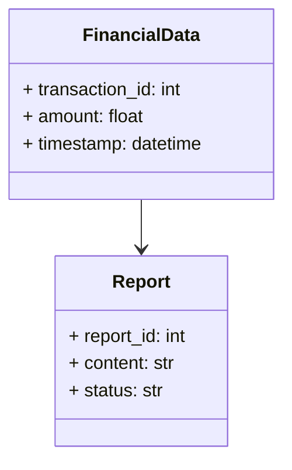
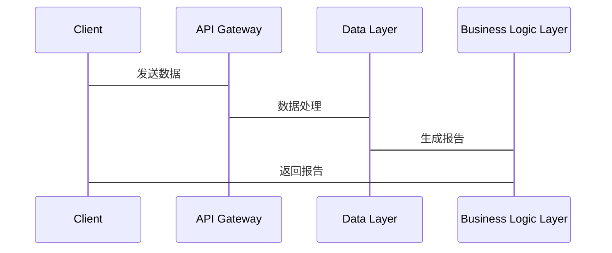

                 


# 《金融监管报告自动化生成》

**关键词**：金融监管、自动化生成、数据处理、算法原理、系统架构、项目实战

**摘要**：本文详细探讨了金融监管报告自动化生成的技术实现，从背景分析到算法原理，再到系统架构和项目实战，全面解析了如何利用技术手段提高金融监管效率和准确性。

---

# 第一部分: 金融监管报告自动化生成概述

## 第1章: 金融监管报告自动化生成的背景与挑战

### 1.1 问题背景

#### 1.1.1 金融监管的重要性
金融监管是维护金融市场稳定、保护投资者利益的重要手段。传统的监管报告生成方式依赖人工操作，效率低且易出错。

#### 1.1.2 传统监管报告生成的痛点
- 数据收集耗时，人工处理误差大。
- 报告格式多样，生成复杂。
- 规则更新频繁，维护成本高。

#### 1.1.3 自动化生成的必要性
自动化生成技术可以显著提高效率、减少错误，适应监管规则的快速变化。

### 1.2 问题描述

#### 1.2.1 监管报告的核心要素
包括市场数据、交易记录、主体信息和合规指标等。

#### 1.2.2 生成过程中的关键问题
- 数据来源多样，清洗复杂。
- 规则复杂，生成逻辑复杂。
- 输出格式多，生成难度大。

#### 1.2.3 自动化生成的目标与边界
目标是高效、准确生成报告；边界包括仅处理结构化数据，不涉及实时监控。

### 1.3 问题解决

#### 1.3.1 自动化生成的优势
- 提高效率，降低成本。
- 减少人为错误，提升准确性。
- 支持快速响应规则变化。

#### 1.3.2 技术实现的关键点
- 数据清洗与整合。
- 自动化规则引擎。
- 多格式输出支持。

#### 1.3.3 应用场景的扩展性
适用于银行、证券、保险等金融机构的监管报告生成。

### 1.4 概念结构与核心要素

#### 1.4.1 核心概念的定义
- **监管机构**：负责制定和执行监管规则。
- **金融机构**：被监管的主体。
- **监管数据**：金融机构的业务数据。
- **报告生成系统**：自动化生成报告的工具。
- **监管报告**：最终输出的报告。

#### 1.4.2 各要素之间的关系
监管机构制定规则，金融机构提供数据，系统利用数据生成报告，报告反馈给监管机构。

#### 1.4.3 概念结构的可视化
```mermaid
graph TD
    Regulator[监管机构] --> Financial Institutions[金融机构]
    Financial Institutions --> Regulatory Data[监管数据]
    Regulatory Data --> Report Generation System[报告生成系统]
    Report Generation System --> Regulatory Report[监管报告]
```

### 1.5 本章小结
本章分析了金融监管报告自动化生成的背景、问题及解决方案，明确了核心概念和要素关系。

---

## 第2章: 核心概念与联系

### 2.1 核心概念的原理

#### 2.1.1 金融监管的定义与特征
金融监管是通过法律和规则确保金融机构的稳健运行，具有合规性、系统性和动态性。

#### 2.1.2 自动化生成技术的原理
基于规则和AI的生成技术，利用数据处理和模式识别生成报告。

#### 2.1.3 数据处理的关键步骤
数据清洗、转换、整合和分析。

### 2.2 概念属性特征对比

| 概念       | 属性特征 |
|------------|----------|
| 传统监管   | 人工主导、效率低 |
| 自动化监管   | 高效、准确 |
| 基于规则生成 | 简单、可定制 |
| 基于AI生成  | 智能、灵活 |
| 数据来源    | 多样、复杂 |

#### 2.2.1 传统监管 vs 自动化监管
传统监管依赖人工，效率低；自动化监管利用技术，提高效率。

#### 2.2.2 不同生成技术的优劣势
- 基于规则：简单但缺乏灵活性。
- 基于AI：智能但复杂。

#### 2.2.3 数据来源的多样性
监管数据来自交易记录、财务报表等，需清洗和整合。

### 2.3 ER实体关系图
```mermaid
graph TD
    Regulator[监管机构] --> Financial Institutions[金融机构]
    Financial Institutions --> Transaction Records[交易记录]
    Transaction Records --> Financial Data[财务数据]
    Financial Data --> Report Generation System[报告生成系统]
    Report Generation System --> Regulatory Report[监管报告]
```

### 2.4 本章小结
本章分析了核心概念及其属性，通过对比和图表展示了各概念的关系。

---

## 第3章: 算法原理讲解

### 3.1 算法概述

#### 3.1.1 基于规则的生成
根据预定义规则生成报告，适用于规则明确的场景。

#### 3.1.2 基于AI的生成
利用自然语言处理生成报告，适用于规则复杂的场景。

#### 3.1.3 混合生成模型
结合规则和AI，兼顾准确性和灵活性。

### 3.2 算法流程图
```mermaid
graph TD
    Start --> Input[输入数据]
    Input --> Data Cleaning[数据清洗]
    Data Cleaning --> Rule Application[规则应用]
    Rule Application --> Report Generation[生成报告]
    Report Generation --> Output[输出报告]
```

### 3.3 算法实现

#### 3.3.1 基于规则的生成算法
```python
def generate_report(rule_set, data):
    report = []
    for rule in rule_set:
        if rule.apply(data):
            report.append(rule.result)
    return report
```

#### 3.3.2 基于AI的生成算法
```python
import tensorflow as tf
model = tf.keras.Sequential([
    tf.keras.layers.Dense(64, activation='relu'),
    tf.keras.layers.Dense(1, activation='sigmoid')
])
model.compile(optimizer='adam', loss='binary_crossentropy')
```

#### 3.3.3 数学模型与公式
- 规则匹配公式：$result = \sum_{i=1}^{n} (data_i \times rule_i)$
- 概率生成公式：$P(output|input) = \sigma(W \cdot input + b)$，其中$\sigma$是sigmoid函数。

### 3.4 本章小结
本章详细讲解了生成模型的算法原理，包括流程图和代码示例。

---

## 第4章: 系统分析与架构设计

### 4.1 问题场景介绍

#### 4.1.1 监管报告类型
包括合规报告、风险报告、市场报告等。

#### 4.1.2 系统功能需求
- 数据采集：从金融机构获取数据。
- 数据处理：清洗和转换数据。
- 报告生成：根据规则生成报告。
- 审核与反馈：人工审核报告。

### 4.2 系统功能设计

#### 4.2.1 领域模型


#### 4.2.2 系统架构设计
```mermaid
graph TD
    Client[用户] --> API Gateway[网关]
    API Gateway --> Data Layer[数据层]
    Data Layer --> Business Logic Layer[业务逻辑层]
    Business Logic Layer --> Database[数据库]
    Business Logic Layer --> Report Generation Layer[报告生成层]
    Report Generation Layer --> Output[输出]
```

#### 4.2.3 系统接口设计
- 数据接口：REST API。
- 报告生成接口：调用生成模型。

#### 4.2.4 系统交互


### 4.3 本章小结
本章分析了系统架构和功能设计，展示了各部分的协作关系。

---

## 第5章: 项目实战

### 5.1 环境安装

#### 5.1.1 安装Python
```bash
python --version
pip install --upgrade pip
```

#### 5.1.2 安装依赖
```bash
pip install numpy pandas scikit-learn
```

### 5.2 核心代码实现

#### 5.2.1 数据处理
```python
import pandas as pd

def clean_data(data):
    # 删除空值
    data = data.dropna()
    # 转换数据类型
    data['amount'] = data['amount'].astype(float)
    return data
```

#### 5.2.2 报告生成
```python
from sklearn import tree

def generate_report(data, model):
    # 预测结果
    y_pred = model.predict(data)
    return y_pred
```

### 5.3 代码解读与分析

#### 5.3.1 数据处理代码
- `clean_data`函数用于清洗数据，去除空值和转换数据类型。

#### 5.3.2 报告生成代码
- `generate_report`函数利用机器学习模型生成报告。

### 5.4 案例分析

#### 5.4.1 数据准备
```python
data = pd.read_csv('financial_data.csv')
cleaned_data = clean_data(data)
```

#### 5.4.2 模型训练
```python
model = tree.DecisionTreeClassifier()
model.fit(cleaned_data, target)
```

#### 5.4.3 生成报告
```python
report = generate_report(cleaned_data, model)
```

### 5.5 本章小结
本章通过实际案例展示了如何实现监管报告的自动化生成。

---

## 第6章: 最佳实践与总结

### 6.1 小结

#### 6.1.1 核心内容回顾
- 金融监管的重要性。
- 自动化生成的技术实现。
- 系统架构设计。

#### 6.1.2 实践中的关键点
- 数据处理是关键。
- 算法选择影响性能。
- 系统架构设计影响扩展性。

### 6.2 注意事项

#### 6.2.1 数据安全
确保数据处理过程中的安全性。

#### 6.2.2 系统稳定性
确保系统运行稳定，避免中断。

#### 6.2.3 规则更新
及时更新规则，适应监管变化。

### 6.3 拓展阅读

#### 6.3.1 推荐书籍
- 《金融监管的数字化转型》
- 《机器学习在金融中的应用》

#### 6.3.2 在线资源
- 金融监管相关的学术论文。
- 开源项目和工具。

### 6.4 本章小结
本章总结了最佳实践，提供了注意事项和拓展阅读建议。

---

# 结语

金融监管报告的自动化生成是一项复杂的任务，需要结合技术与业务知识。通过本文的分析，读者可以全面了解其技术实现和应用，为实际工作提供参考。

--- 

**关键词**：金融监管、自动化生成、数据处理、算法原理、系统架构、项目实战

