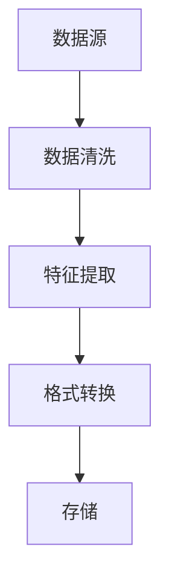
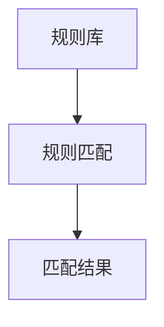
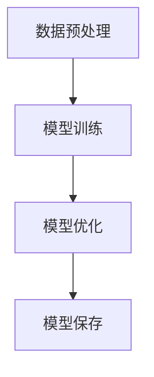
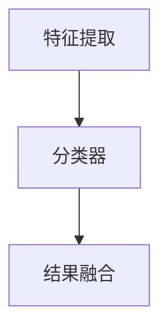
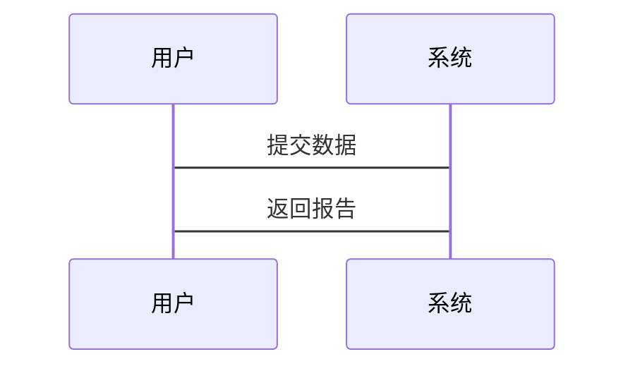

                 


# 《金融监管报告自动化生成与审核系统》

> **关键词**：金融监管，报告生成，自然语言处理，机器学习，审核系统，系统架构

> **摘要**：本文系统地介绍金融监管报告的自动化生成与审核系统的构建过程。从问题背景、核心概念、算法原理到系统架构设计，详细阐述了如何利用自然语言处理与机器学习技术实现监管报告的自动化生成与智能审核。文章通过实际案例分析与代码实现，深入探讨了系统的应用场景、功能设计与实现细节，为读者提供了全面的技术参考。

---

## 第1章: 问题背景与需求分析

### 1.1 问题背景

#### 1.1.1 传统金融监管报告的痛点
传统的金融监管报告生成与审核过程存在以下痛点：
- **人工依赖**：报告生成和审核主要依赖人工操作，效率低且易出错。
- **数据冗余**：重复性数据处理导致时间浪费，且难以保证一致性。
- **规则复杂**：金融监管规则繁多且更新频繁，人工审核难以全面覆盖。
- **合规风险**：人为疏忽可能导致报告内容不符合监管要求，引发合规风险。

#### 1.1.2 自动化监管的需求驱动
随着金融业务的复杂化和监管要求的严格化，市场对自动化监管的需求日益增加：
- **提高效率**：通过自动化技术缩短报告生成与审核的时间。
- **降低错误率**：利用智能算法减少人为失误，提升报告准确性。
- **适应变化**：快速响应监管规则的更新，确保报告内容与时俱进。

#### 1.1.3 技术进步带来的解决方案
近年来，自然语言处理（NLP）和机器学习技术的快速发展为金融监管报告的自动化提供了技术支撑：
- **文本生成**：利用NLP技术自动生成符合监管要求的报告内容。
- **智能审核**：通过机器学习模型快速识别报告中的潜在问题。
- **知识图谱**：构建金融监管知识库，支持智能规则匹配与审核。

### 1.2 问题描述

#### 1.2.1 监管报告的核心要素
金融监管报告的核心要素包括：
- **报告主体**：金融机构的业务数据与合规情况。
- **报告内容**：风险评估、合规检查、整改建议等。
- **报告格式**：固定的模板与标准化输出要求。

#### 1.2.2 现有流程的效率瓶颈
传统监管报告的生成与审核流程存在以下效率瓶颈：
- **人工编写**：报告内容需反复修改，耗时且效率低。
- **规则匹配**：人工审核难以快速匹配复杂多变的监管规则。
- **数据孤岛**：各部门数据分散，难以实现高效协同。

#### 1.2.3 数据准确性的关键挑战
数据准确性是金融监管报告的核心要求，主要挑战包括：
- **数据源多样性**：数据来自多个系统，可能导致不一致。
- **数据清洗难度**：需处理脏数据与异常值。
- **数据安全风险**：数据泄露或篡改可能引发合规问题。

### 1.3 问题解决

#### 1.3.1 自动化生成的目标
金融监管报告自动化生成的目标是：
- **快速生成**：基于模板自动生成标准化报告。
- **内容准确**：利用知识库确保报告内容符合监管要求。
- **实时更新**：根据最新数据与规则动态调整报告内容。

#### 1.3.2 智能审核的核心价值
智能审核的核心价值体现在：
- **高效审核**：利用机器学习快速识别潜在问题。
- **规则匹配**：精准匹配最新监管规则，减少遗漏。
- **决策支持**：为监管机构提供数据支持与决策参考。

#### 1.3.3 系统化管理的实现路径
实现金融监管报告系统化管理的路径包括：
- **数据集成**：整合多源数据，构建统一数据平台。
- **知识建模**：建立金融监管知识图谱，支持智能规则匹配。
- **流程优化**：设计标准化流程，提升系统运行效率。

### 1.4 系统的边界与外延

#### 1.4.1 系统功能的边界
金融监管报告自动化生成与审核系统的功能边界包括：
- **数据采集**：从金融机构系统中获取业务数据。
- **报告生成**：基于模板自动生成监管报告。
- **智能审核**：利用算法对报告内容进行审核。
- **结果输出**：生成审核结果并反馈给相关方。

#### 1.4.2 与外部系统的交互
系统需与以下外部系统进行交互：
- **金融机构系统**：获取业务数据与交易信息。
- **监管机构平台**：对接监管平台，上传审核结果。
- **知识库系统**：获取最新监管规则与行业知识。

#### 1.4.3 系统的可扩展性
系统设计需考虑以下可扩展性：
- **规则扩展**：支持新增监管规则的快速接入。
- **功能扩展**：方便新增其他监管相关的功能模块。
- **数据扩展**：支持更多数据源的接入与处理。

### 1.5 核心概念结构

#### 1.5.1 概念属性特征对比表

| 概念       | 属性         | 特征描述                                   |
|------------|--------------|------------------------------------------|
| 数据流     | 来源         | 金融机构业务系统、外部数据源             |
|            | 处理方式     | 数据清洗、特征提取、格式转换             |
|            | 输出形式     | 结构化数据、非结构化数据                 |
| 审核规则   | 类型         | 风险规则、合规规则、数据质量规则         |
|            | 表达方式     | �正则表达式、关键词匹配、机器学习模型       |
|            | 更新频率     | 实时更新、定期更新                       |
| 知识库     | 数据类型     | 文本数据、结构化数据                     |
|            | 更新机制     | 手动更新、自动学习                       |
|            | 存储方式     | 数据库、知识图谱                         |

#### 1.5.2 ER实体关系图

```mermaid
erd
    图例
    数据库名：监管报告数据库

    实体：
    金融机构（ID，名称，类型，注册信息）
    业务数据（ID，交易时间，交易金额，交易类型）
    监管规则（ID，规则名称，规则内容，生效时间）
    报告模板（ID，模板名称，模板内容，版本号）
    审核结果（ID，报告ID，审核意见，审核时间）

    关系：
    金融机构 --》 业务数据：一个金融机构有多个业务数据
    业务数据 --》 审核结果：每个业务数据对应多个审核结果
    审核结果 --》 监管规则：每个审核结果关联多个监管规则
    审核结果 --》 报告模板：每个审核结果基于一个报告模板生成
```

---

## 第2章: 核心概念与系统架构

### 2.1 数据流与处理流程

#### 2.1.1 数据来源分析
数据来源包括：
- **金融机构业务系统**：交易数据、客户信息、财务报表。
- **外部数据源**：市场数据、行业报告、政策法规。

#### 2.1.2 数据处理逻辑
数据处理流程如下：



#### 2.1.3 数据输出形式
数据输出形式包括：
- **结构化数据**：JSON、XML格式。
- **非结构化数据**：自然语言文本。

### 2.2 审核规则与知识库

#### 2.2.1 规则定义与分类
审核规则分为以下几类：
- **风险规则**：识别潜在风险。
- **合规规则**：检查是否符合监管要求。
- **数据质量规则**：验证数据准确性。

#### 2.2.2 知识库构建方法
知识库构建方法包括：
- **文本抽取**：从法规文件中提取关键规则。
- **知识图谱**：构建金融监管知识图谱。
- **机器学习模型**：训练分类模型识别规则。

#### 2.2.3 规则匹配机制
规则匹配机制如下：



### 2.3 系统架构设计

#### 2.3.1 分层架构概述
系统采用分层架构，包括：
- **数据层**：数据采集与存储。
- **业务逻辑层**：生成与审核逻辑。
- **表现层**：用户界面与结果展示。

#### 2.3.2 模块化设计原则
模块化设计原则包括：
- **高内聚**：每个模块功能单一。
- **松耦合**：模块之间接口清晰。
- **可扩展**：模块功能易于扩展。

#### 2.3.3 高可用性保障
高可用性保障措施包括：
- **负载均衡**：分担系统压力。
- **容错设计**：单点故障冗余。
- **数据备份**：确保数据安全。

---

## 第3章: 算法原理与实现

### 3.1 自然语言处理算法

#### 3.1.1 文本生成模型
文本生成模型采用Transformer架构：

$$
\text{Decoder}(\text{Input}) = \text{softmax}(W_{\text{output}} \cdot \text{Decoder}_{\text{hidden}})
$$

#### 3.1.2 文本理解模型
文本理解模型基于BERT：

$$
\text{BERT}(x) = \text{last\_hidden\_state} \times W_{\text{cls}} + b_{\text{cls}}
$$

#### 3.1.3 模型训练流程
模型训练流程如下：



### 3.2 机器学习审核算法

#### 3.2.1 特征提取方法
特征提取方法包括：
- **文本特征**：词袋模型、TF-IDF。
- **数据特征**：数值特征、时间特征。

#### 3.2.2 分类器设计
分类器设计采用随机森林：

$$
\text{预测概率} = \sum_{i=1}^{n} w_i \cdot x_i
$$

#### 3.2.3 联合学习策略
联合学习策略如下：



---

## 第4章: 系统分析与架构设计

### 4.1 系统功能设计

#### 4.1.1 数据采集模块
数据采集模块负责从金融机构系统中获取业务数据：

```python
def fetch_data(source):
    if source == 'database':
        return db.query()
    elif source == 'api':
        return api.request()
```

#### 4.1.2 报告生成模块
报告生成模块基于模板生成监管报告：

```python
def generate_report(template, data):
    return template.render(data)
```

#### 4.1.3 审核引擎模块
审核引擎模块利用机器学习模型对报告内容进行审核：

```python
def review_report(report):
    return model.predict(report)
```

### 4.2 系统架构设计

#### 4.2.1 系统架构图
系统架构图如下：


#### 4.2.2 系统交互流程
系统交互流程如下：



---

## 第5章: 项目实战

### 5.1 环境安装

#### 5.1.1 安装Python环境
安装Python和相关库：

```bash
pip install numpy pandas transformers
```

#### 5.1.2 安装依赖项
安装NLP和机器学习库：

```bash
pip install transformers scikit-learn
```

### 5.2 系统核心实现

#### 5.2.1 数据预处理代码
数据预处理代码如下：

```python
import pandas as pd

def preprocess_data(data):
    data = data.dropna()
    data = data.drop_duplicates()
    return data
```

#### 5.2.2 模型训练代码
模型训练代码如下：

```python
from transformers import AutoModelForMaskedLM
from torch.utils.data import Dataset

class MyDataset(Dataset):
    def __init__(self, texts):
        self.texts = texts

    def __len__(self):
        return len(self.texts)

    def __getitem__(self, idx):
        return self.texts[idx]

model = AutoModelForMaskedLM.from_pretrained('bert-base')
```

### 5.3 实际案例分析

#### 5.3.1 案例背景
案例背景：某银行需要生成季度监管报告。

#### 5.3.2 数据准备
数据准备包括：
- 业务数据：交易记录、客户信息。
- 监管规则：最新金融监管法规。

#### 5.3.3 系统运行
系统运行步骤：
1. 数据采集：从银行系统获取业务数据。
2. 报告生成：基于模板生成初步报告。
3. 智能审核：利用机器学习模型进行审核。
4. 结果输出：生成最终报告并反馈。

### 5.4 项目小结
通过本项目，我们成功实现了金融监管报告的自动化生成与审核系统。系统具备以下优势：
- **高效性**：显著缩短报告生成与审核时间。
- **准确性**：利用智能算法提升报告准确性。
- **扩展性**：支持新增规则与功能模块的快速接入。

---

## 第6章: 最佳实践与总结

### 6.1 最佳实践 tips
- **数据质量**：确保数据清洗与预处理的准确性。
- **模型优化**：定期更新模型参数，提升审核效果。
- **系统安全**：加强数据安全防护，防止信息泄露。
- **用户体验**：设计友好的用户界面，提升用户体验。

### 6.2 总结
本文系统地介绍了金融监管报告自动化生成与审核系统的构建过程。通过自然语言处理与机器学习技术，我们成功实现了高效、准确的监管报告生成与智能审核。系统具备良好的扩展性和可维护性，为金融机构提供了强有力的技术支持。

### 6.3 注意事项
- **数据隐私**：严格遵守数据隐私保护法规。
- **系统维护**：定期更新规则库与模型。
- **用户培训**：对系统使用人员进行培训，确保正确使用。

### 6.4 拓展阅读
- **NLP技术**：深入学习自然语言处理技术。
- **机器学习**：研究更多机器学习算法与应用。
- **系统架构**：学习更多系统架构设计方法。

---

## 附录: 更多资源

### 附录1: 参考文献
- [1] BERT论文：[链接](https://arxiv.org/abs/1810.0469)
- [2] Transformer论文：[链接](https://arxiv.org/abs/1706.03798)

### 附录2: 工具与库
- **Python库**：pandas、scikit-learn、transformers。
- **开发工具**：Jupyter Notebook、VS Code。

### 附录3: 项目代码仓库
[GitHub仓库链接](https://github.com/yourusername/financial-report-system)

---

**感谢您的阅读！希望本文能为金融监管报告的自动化生成与审核系统提供有价值的参考与启发。**

