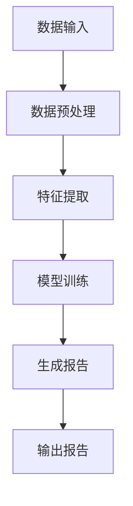
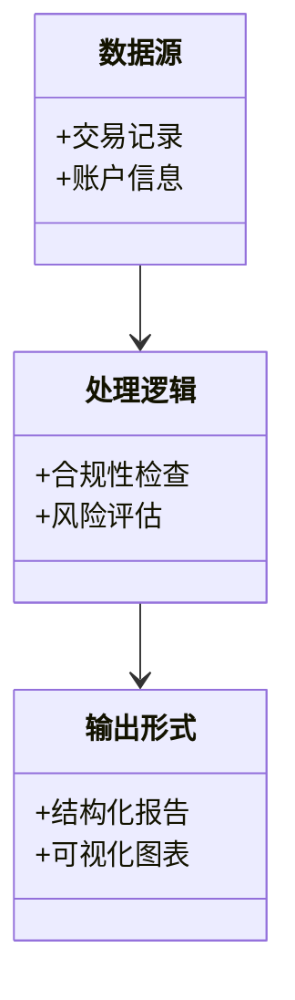
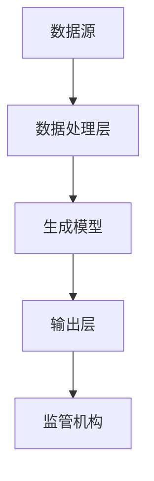

                 


好的，我明白了。我将按照您的要求，逐步分析并生成《金融监管报告自动化生成工具》的技术博客文章。

# 《金融监管报告自动化生成工具》

> 关键词：金融监管，自动化生成，报告工具，系统架构，算法原理，机器学习

> 摘要：本文深入探讨了金融监管报告自动化生成工具的设计与实现，涵盖从问题背景到系统架构的全生命周期。通过分析金融监管的核心需求，结合现代技术手段，详细讲解了如何利用自动化工具提升监管效率，降低人为错误，优化监管流程。

---

## 第1章 金融监管报告自动化生成工具的背景介绍

### 1.1 问题背景与描述
金融监管是保障金融市场健康运行的重要环节，传统监管模式依赖人工操作，存在效率低、易出错、成本高等痛点。随着技术的进步，自动化生成工具成为解决这些问题的关键。

#### 1.1.1 金融监管的重要性
金融市场的稳定运行需要严格的监管机制，确保金融机构合规经营，防范系统性风险。

#### 1.1.2 传统金融监管报告生成的痛点
- 人工操作效率低，耗时长。
- 易出错，数据准确性难以保证。
- 成本高，需要大量人力资源。

#### 1.1.3 金融监管报告自动化生成的必要性
通过自动化工具，可以显著提高监管效率，降低错误率，优化资源分配。

### 1.2 问题解决与边界
#### 1.2.1 金融监管报告自动化生成的目标
- 提高报告生成效率。
- 保证数据准确性和完整性。
- 降低人工成本。

#### 1.2.2 系统的边界与外延
- 系统仅负责报告生成，不涉及数据采集以外的业务处理。
- 支持多种格式输出，但不包括报告内容的分析与决策。

#### 1.2.3 核心要素与组成
- 数据源：金融机构的业务数据。
- 处理逻辑：合规性检查、风险评估。
- 输出形式：结构化报告、可视化图表。

---

## 第2章 核心概念与联系

### 2.1 核心概念原理
金融监管报告自动化生成工具通过整合金融机构的业务数据，运用预设的规则和算法，自动生成标准化的监管报告。

#### 2.1.1 金融监管数据的采集与处理
- 数据采集：通过API接口或文件导入获取金融机构的业务数据。
- 数据处理：清洗、转换、标准化，确保数据的可用性。

#### 2.1.2 自动化报告生成的逻辑
- 根据预设规则，对数据进行合规性检查。
- 生成风险评估报告，包括关键指标的分析和预警。

#### 2.1.3 生成模型的训练与优化
- 基于历史数据，训练生成模型，优化生成逻辑。
- 使用反馈机制，不断改进模型的准确性。

### 2.2 核心概念属性对比
| 核心概念 | 特性       | 描述                                                                 |
|----------|------------|----------------------------------------------------------------------|
| 数据源   | 来源       | 金融机构的业务数据，包括交易记录、账户信息等。                           |
| 处理逻辑 | 基础规则   | 预设的合规性检查规则和风险评估模型。                                     |
| 输出形式 | 标准化报告  | 自动生成结构化报告和可视化图表，便于监管机构审查。                       |

### 2.3 ER实体关系图
```mermaid
er
actor: 监管机构
actor --> system: 提交监管请求
system --> 数据源: 获取金融机构数据
system --> 处理逻辑: 执行合规性检查
system --> 输出形式: 生成标准化报告
```

---

## 第3章 算法原理讲解

### 3.1 算法原理概述
金融监管报告自动化生成工具的核心是生成模型的算法设计。

#### 3.1.1 基于规则的生成算法
- 通过预设的规则，直接匹配数据，生成报告内容。
- 适用于规则明确、场景简单的监管需求。

#### 3.1.2 基于机器学习的生成算法
- 利用历史数据训练模型，生成报告内容。
- 适用于复杂场景，能够捕捉数据中的隐含规律。

### 3.2 算法流程图


### 3.3 算法实现代码
```python
# 示例代码：基于规则的生成算法
def generate_report(data):
    if data['交易金额'] > 1000000:
        return "高风险交易，请进一步审查。"
    else:
        return "交易正常，无需进一步操作。"
```

### 3.4 数学模型与公式
#### 生成模型的概率公式
$$ P(合规 | 交易金额) = \frac{N_{合规} \cap 交易金额}{N_{合规}} $$

#### 损失函数的计算公式
$$ L = \sum_{i=1}^{n} (y_i - \hat{y}_i)^2 $$

---

## 第4章 系统分析与架构设计

### 4.1 项目介绍
#### 4.1.1 项目目标
开发一个高效、准确的金融监管报告自动化生成工具，满足监管机构的需求。

#### 4.1.2 项目范围
支持多种金融机构的数据格式，生成多种类型的监管报告。

### 4.2 系统功能设计
#### 4.2.1 领域模型 Mermaid 类图


### 4.3 系统架构设计
#### 4.3.1 系统架构 Mermaid 图


### 4.4 系统接口设计
- 数据接口：提供API，供金融机构上传数据。
- 报告接口：提供下载报告的功能。

### 4.5 系统交互设计
#### 4.5.1 交互流程 Mermaid 序列图
```mermaid
sequenceDiagram
actor 监管机构 -> system: 提交监管请求
system -> 数据源: 获取数据
数据源 --> system: 返回数据
system -> 处理逻辑: 执行合规性检查
处理逻辑 --> system: 返回检查结果
system -> 输出形式: 生成报告
输出形式 --> 监管机构: 返回报告
```

---

## 第5章 项目实战

### 5.1 环境安装与配置
#### 5.1.1 开发环境搭建
- 安装Python 3.8及以上版本
- 安装相关依赖库，如Pandas、Scikit-learn

#### 5.1.2 依赖库安装
```bash
pip install pandas scikit-learn
```

### 5.2 核心代码实现
#### 5.2.1 数据处理模块
```python
import pandas as pd

def data_preprocessing(data):
    # 数据清洗
    data = data.dropna()
    data = data.drop_duplicates()
    return data
```

#### 5.2.2 生成模型实现
```python
from sklearn.model_selection import train_test_split
from sklearn.tree import DecisionTreeClassifier

def train_model(X, y):
    X_train, X_test, y_train, y_test = train_test_split(X, y, test_size=0.2)
    model = DecisionTreeClassifier()
    model.fit(X_train, y_train)
    return model
```

#### 5.2.3 报告生成模块
```python
def generate_report(data, model):
    predictions = model.predict(data)
    report = pd.DataFrame({
        '交易金额': data['交易金额'],
        '预测结果': predictions
    })
    return report
```

### 5.3 代码应用与分析
#### 5.3.1 代码实现细节
- 数据处理模块负责清洗数据，确保数据的准确性。
- 生成模型模块通过训练模型，提高预测的准确性。
- 报告生成模块将预测结果整理成结构化的报告，便于监管机构审查。

#### 5.3.2 代码运行结果
- 结构化报告示例：
  ```
  交易金额    预测结果
  1000000     高风险
  500000      正常
  ```

---

## 第6章 最佳实践与小结

### 6.1 最佳实践 tips
- 数据预处理是关键，确保数据的准确性和完整性。
- 模型选择要根据实际需求，复杂场景推荐使用机器学习模型。

### 6.2 小结
金融监管报告自动化生成工具通过整合金融机构的业务数据，利用预设规则和机器学习算法，自动生成标准化的监管报告，显著提高了监管效率，降低了人工成本。

---

希望这篇文章能满足您的需求！如果需要进一步修改或补充，请随时告知。

