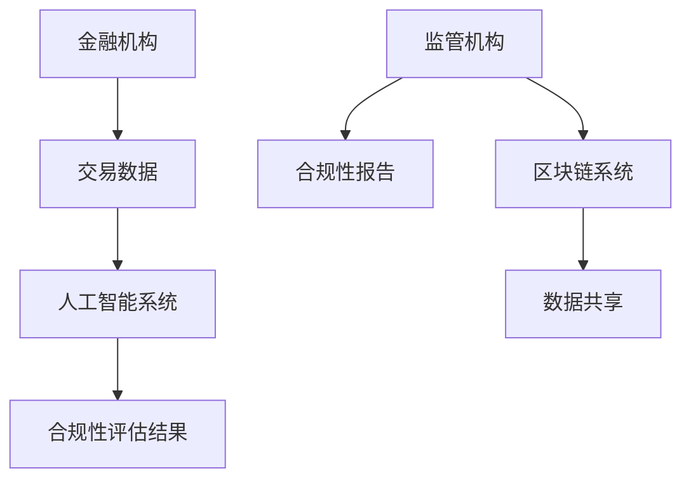
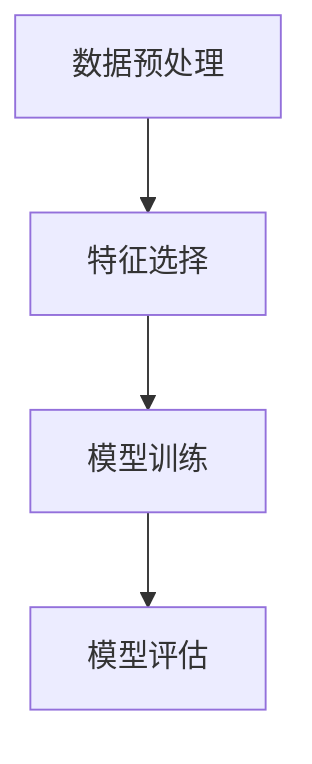
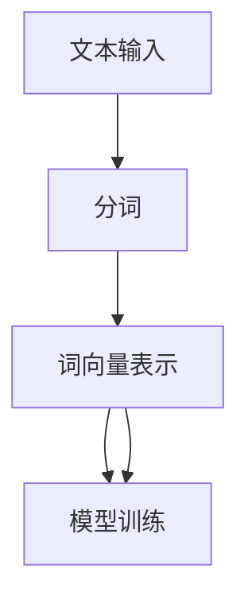
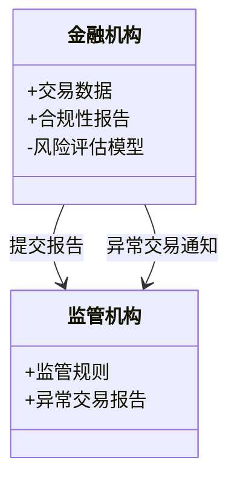
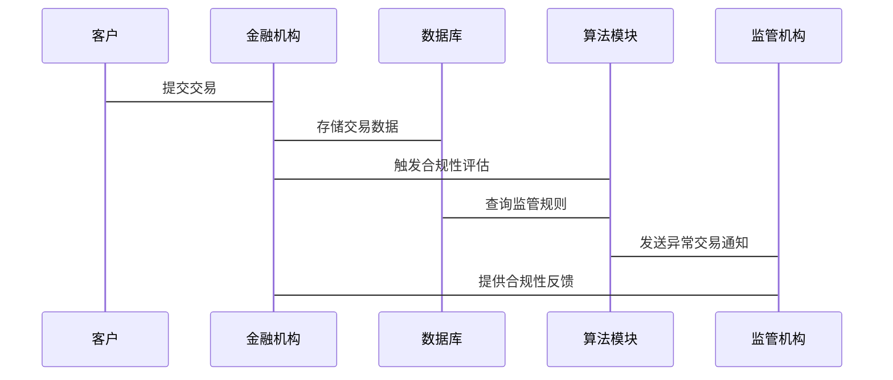

                 


# 《金融监管科技合规性评估》

## 关键词：金融监管科技、合规性评估、人工智能、区块链、大数据

## 摘要：  
本文详细探讨了金融监管科技（RegTech）在合规性评估中的应用，从背景、核心概念、算法原理到系统架构和项目实战，全面解析RegTech如何利用技术手段提高金融监管效率和合规性。文章通过具体案例和图表分析，展示了RegTech在实际应用中的潜力和挑战。

---

# 第一部分: 金融监管科技合规性评估背景介绍

# 第1章: 金融监管科技合规性评估的背景与现状

## 1.1 金融监管科技的起源与发展

### 1.1.1 传统金融监管的局限性
传统金融监管依赖人工审查和规则制定，存在效率低、成本高、覆盖面有限等问题。金融机构和监管机构需要处理海量数据，但传统方法难以实时监控和分析。

### 1.1.2 科技在金融监管中的应用演变
随着技术的发展，金融监管逐渐引入自动化工具，如规则引擎和数据分析平台。近年来，人工智能、区块链和大数据等技术的兴起，为金融监管科技（RegTech）的发展提供了新的契机。

### 1.1.3 金融监管科技的定义与内涵
RegTech是指利用新兴技术（如人工智能、区块链、大数据）来优化金融监管流程、提高合规性评估效率的新兴领域。RegTech的核心目标是通过技术手段解决传统金融监管中的痛点。

---

## 1.2 金融监管科技合规性评估的重要性

### 1.2.1 合规性评估的定义与目标
合规性评估是指金融机构通过内部或外部手段，确保其业务操作符合相关法律法规和监管要求的过程。其目标是降低合规风险，避免罚款和声誉损失。

### 1.2.2 金融监管科技在合规性评估中的作用
RegTech通过自动化数据采集、智能分析和实时监控，帮助金融机构快速识别和解决合规性问题，提高监管效率。

### 1.2.3 合规性评估对金融机构和监管机构的意义
对金融机构而言，合规性评估是避免法律风险和提升客户信任的重要手段。对监管机构而言，RegTech有助于降低监管成本，提高监管透明度。

---

## 1.3 金融监管科技合规性评估的现状

### 1.3.1 全球范围内RegTech的发展现状
全球范围内，RegTech正在快速发展，尤其是在英国、美国和新加坡等金融科技发达的地区。监管机构和技术公司合作，推动RegTech的创新应用。

### 1.3.2 中国RegTech发展的特点与挑战
中国RegTech发展迅速，但面临数据隐私、技术标准化和监管政策不统一等挑战。如何在技术创新与合规性之间找到平衡点是当前的主要问题。

### 1.3.3 未来RegTech合规性评估的趋势
未来，RegTech将更加智能化、自动化和全球化。人工智能和区块链等技术将进一步深度融合，推动合规性评估的创新。

---

## 1.4 本章小结

本章从背景、重要性和发展现状三个方面，详细介绍了金融监管科技合规性评估的必要性及其在金融行业中的地位。通过RegTech技术的应用，金融机构和监管机构能够更高效地应对合规性挑战。

---

# 第二部分: 金融监管科技合规性评估的核心概念与联系

# 第2章: 金融监管科技的核心技术与应用场景

## 2.1 人工智能在金融监管中的应用

### 2.1.1 人工智能的基本概念与技术特点
人工智能（AI）是指计算机系统模拟人类智能的能力，包括学习、推理和自适应等特性。在金融监管中，AI主要用于风险评估、异常检测和预测分析。

### 2.1.2 人工智能在合规性评估中的应用
人工智能可以通过自然语言处理（NLP）技术分析法律法规文本，提取关键信息并生成合规性报告。同时，机器学习算法可以识别交易中的异常行为，帮助监管机构发现潜在的违法行为。

### 2.1.3 人工智能与金融监管的结合案例
例如，某银行使用机器学习算法监控交易数据，识别洗钱行为。通过训练模型，系统能够自动标记可疑交易，减少人工审查的工作量。

---

## 2.2 区块链在金融监管中的应用

### 2.2.1 区块链的基本概念与技术特点
区块链是一种分布式账本技术，具有去中心化、不可篡改和透明性等特点。在金融监管中，区块链可以用于记录交易数据，确保数据的真实性和完整性。

### 2.2.2 区块链在合规性评估中的应用
区块链可以用于监管机构的数据共享和隐私保护。例如，通过区块链技术，监管机构可以实时监控金融机构的交易数据，确保其合规性。

### 2.2.3 区块链与金融监管的结合案例
某监管机构使用区块链技术记录金融机构的合规性报告，确保数据不可篡改，提高监管透明度。

---

## 2.3 大数据在金融监管中的应用

### 2.3.1 大数据的基本概念与技术特点
大数据是指海量、多样化和高速度的数据集合，通常需要使用分布式计算和数据挖掘技术进行处理。

### 2.3.2 大数据在合规性评估中的应用
大数据分析可以帮助监管机构识别市场风险和异常交易行为。例如，通过分析社交媒体数据，监管机构可以预测市场情绪，提前采取监管措施。

### 2.3.3 大数据与金融监管的结合案例
某监管机构使用大数据分析技术监控市场操纵行为，通过实时数据分析发现异常交易模式。

---

## 2.4 核心技术对比分析

### 2.4.1 人工智能、区块链和大数据的技术对比
| 技术 | 特点 | 应用场景 |
|------|------|----------|
| AI    | 数据驱动、自适应性强 | 风险评估、异常检测 |
| 区块链 | 去中心化、不可篡改 | 数据共享、隐私保护 |
| 大数据 | 数据量大、分析能力强 | 市场监控、风险预警 |

### 2.4.2 人工智能、区块链和大数据的实体关系图



---

## 2.5 本章小结

本章介绍了人工智能、区块链和大数据三种核心技术在金融监管中的应用场景，并通过对比分析和实体关系图展示了它们在合规性评估中的协同作用。

---

# 第三部分: 金融监管科技合规性评估的算法原理

# 第3章: 常见算法原理与实现

## 3.1 机器学习算法原理

### 3.1.1 监督学习算法
#### 3.1.1.1 线性回归
线性回归是一种回归算法，用于预测连续型变量。其数学模型如下：

$$ y = \beta_0 + \beta_1x + \epsilon $$

其中，$y$ 是目标变量，$x$ 是特征变量，$\beta_0$ 和 $\beta_1$ 是回归系数，$\epsilon$ 是误差项。

#### 3.1.1.2 逻辑回归
逻辑回归用于分类问题，其数学模型如下：

$$ P(Y=1|X) = \frac{e^{\beta_0 + \beta_1x}}{1 + e^{\beta_0 + \beta_1x}} $$

#### 3.1.1.3 决策树
决策树是一种树状结构，用于分类和回归。其核心是选择最优特征进行分裂，常用的分裂标准包括信息增益和基尼指数。

### 3.1.2 无监督学习算法
#### 3.1.2.1 K-means聚类
K-means是一种无监督聚类算法，用于将数据分成K个簇。其目标是最小化簇内平方和距离。

#### 3.1.2.2 层次聚类
层次聚类是一种基于层次结构的聚类算法，通过不断合并或分割簇来构建树状结构。

### 3.1.3 算法流程图



### 3.1.4 Python实现示例

```python
from sklearn.linear_model import LinearRegression
from sklearn.tree import DecisionTreeClassifier
from sklearn.cluster import KMeans

# 线性回归
model_lr = LinearRegression()
model_lr.fit(X_train, y_train)

# 决策树
model_dt = DecisionTreeClassifier()
model_dt.fit(X_train, y_train)

# K-means聚类
model_kmeans = KMeans(n_clusters=3)
model_kmeans.fit(X_train)
```

---

## 3.2 自然语言处理算法原理

### 3.2.1 NLP基础
自然语言处理（NLP）用于理解和生成人类语言。常用技术包括分词、词干提取和句法分析。

### 3.2.2 常见NLP算法
#### 3.2.2.1 词袋模型
词袋模型是一种文本表示方法，将文本表示为词频向量。

#### 3.2.2.2 TF-IDF
TF-IDF是一种用于衡量关键词重要性的统计方法，常用于文本相似度计算。

#### 3.2.2.3 Word2Vec
Word2Vec是一种用于词向量表示的技术，通过神经网络模型学习词的语义表示。

### 3.2.3 NLP流程图



### 3.2.4 Python实现示例

```python
from sklearn.feature_extraction.text import TfidfVectorizer
from gensim.models import Word2Vec

# TF-IDF
vectorizer = TfidfVectorizer()
tfidf_matrix = vectorizer.fit_transform(text_data)

# Word2Vec
model = Word2Vec(sentences, vector_size=100, window=5, min_count=1, workers=4)
```

---

## 3.3 算法对比分析

| 算法类型 | 适用场景 | 优缺点 |
|----------|-----------|--------|
| 监督学习 | 分类、回归 | 数据需求高，适合明确目标 |
| 无监督学习 | 聚类、降维 | 数据需求低，适合未知问题 |
| NLP | 文本处理 | 需要大量文本数据，适合语义分析 |

---

## 3.4 本章小结

本章详细介绍了机器学习和自然语言处理的核心算法及其在金融监管中的应用，并通过Python代码示例展示了算法的实现过程。

---

# 第四部分: 金融监管科技合规性评估的系统架构设计

# 第4章: 系统分析与架构设计方案

## 4.1 问题场景介绍

### 4.1.1 问题背景
某金融机构需要通过技术手段实现合规性评估的自动化，降低合规成本并提高监管效率。

### 4.1.2 问题描述
金融机构需要实时监控交易数据，识别异常交易行为，并生成合规性报告。

---

## 4.2 系统功能设计

### 4.2.1 领域模型设计



---

## 4.3 系统架构设计

### 4.3.1 分层架构设计


### 4.3.2 关键接口设计

- 数据接口：金融机构与监管机构之间的数据交互接口。
- API接口：系统对外提供的应用程序编程接口。

---

## 4.4 系统交互设计

### 4.4.1 交互流程图



---

## 4.5 本章小结

本章通过问题场景、系统功能和架构设计，详细展示了RegTech合规性评估系统的构建过程。

---

# 第五部分: 金融监管科技合规性评估的项目实战

# 第5章: 项目实战与案例分析

## 5.1 项目背景与目标

### 5.1.1 项目背景
某银行需要通过技术手段实现客户交易的合规性评估，降低洗钱风险。

### 5.1.2 项目目标
开发一个基于机器学习的合规性评估系统，实现交易数据的实时监控和异常检测。

---

## 5.2 项目环境与工具安装

### 5.2.1 环境要求
- 操作系统：Windows/Mac/Linux
- Python版本：3.6+
- 安装依赖：`scikit-learn`, `pandas`, `numpy`, `matplotlib`

### 5.2.2 工具安装
```bash
pip install scikit-learn pandas numpy matplotlib
```

---

## 5.3 系统核心实现

### 5.3.1 数据预处理

```python
import pandas as pd
import numpy as np

# 加载数据
data = pd.read_csv('transaction.csv')

# 数据清洗
data.dropna(inplace=True)
data = pd.get_dummies(data)
```

### 5.3.2 模型训练与评估

```python
from sklearn.model_selection import train_test_split
from sklearn.linear_model import LogisticRegression
from sklearn.metrics import accuracy_score

# 划分训练集和测试集
X_train, X_test, y_train, y_test = train_test_split(data.drop('label', axis=1), data['label'], test_size=0.2)

# 训练模型
model = LogisticRegression()
model.fit(X_train, y_train)

# 模型评估
y_pred = model.predict(X_test)
print(accuracy_score(y_test, y_pred))
```

---

## 5.4 项目小结

本章通过一个具体案例，展示了RegTech合规性评估系统的开发过程，包括环境搭建、数据预处理和模型训练等步骤。

---

# 第六部分: 金融监管科技合规性评估的最佳实践

# 第6章: 最佳实践与注意事项

## 6.1 最佳实践

### 6.1.1 数据隐私保护
在处理金融数据时，必须遵守相关法律法规，确保数据隐私和安全。

### 6.1.2 模型可解释性
选择可解释性强的模型，方便监管机构理解和审核。

### 6.1.3 技术与业务结合
RegTech技术的应用必须与业务需求紧密结合，避免技术驱动的盲目性。

---

## 6.2 小结与展望

### 6.2.1 小结
本文从背景、技术、算法、系统架构和项目实战五个方面，全面解析了金融监管科技合规性评估的核心内容。

### 6.2.2 展望
未来，RegTech将更加智能化和自动化，技术与业务的结合将更加紧密，合规性评估将更加高效和精准。

---

## 6.3 注意事项

1. **数据隐私**：在处理金融数据时，必须严格遵守数据隐私保护法规。
2. **模型优化**：定期更新模型，确保其准确性和稳定性。
3. **技术选型**：根据业务需求选择合适的技术方案，避免过度技术化。

---

## 6.4 拓展阅读

1. 《金融监管科技：原理与应用》
2. 《人工智能在金融领域的应用》
3. 《区块链技术与金融监管》

---

# 结语

金融监管科技合规性评估是金融行业的重要发展趋势，通过技术手段的创新应用，金融机构和监管机构能够更高效地应对合规性挑战。未来，随着技术的不断进步，RegTech将在金融监管中发挥更加重要的作用。

--- 

希望这篇文章能为您提供有价值的内容和启发。如果需要进一步探讨或补充，请随时联系！

