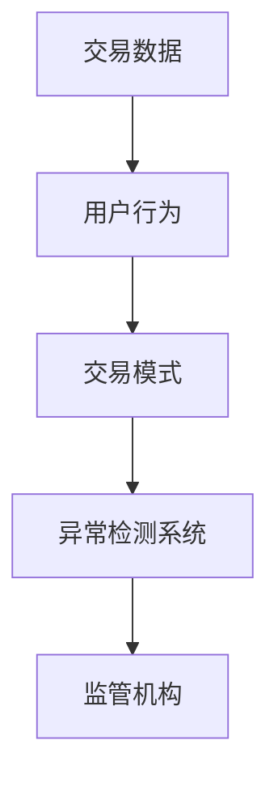
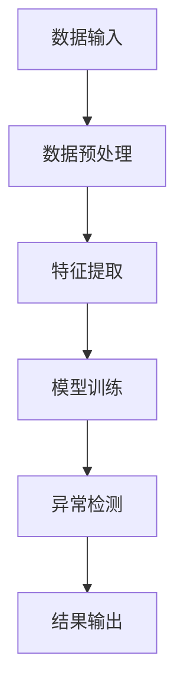
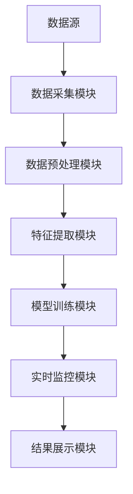
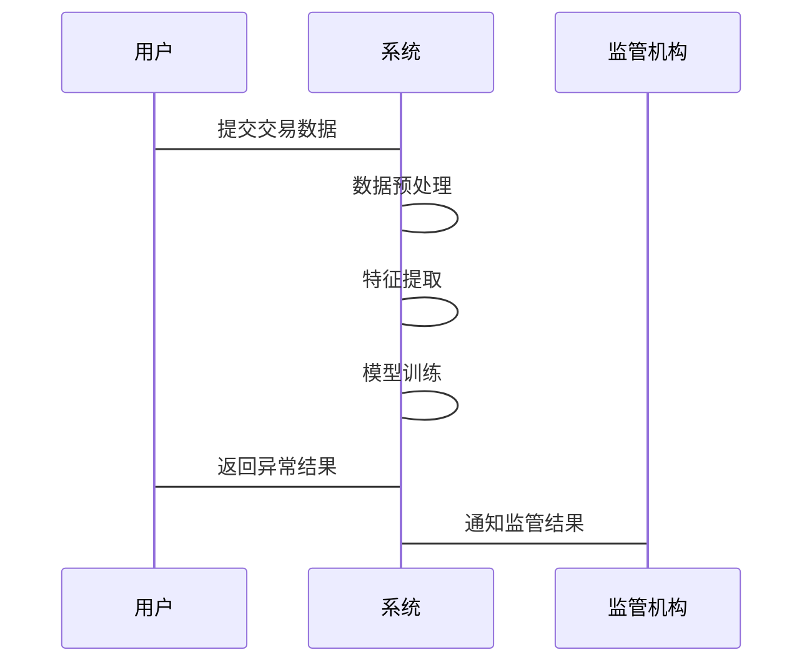

                 


# 金融监管科技异常行为检测系统

## 关键词：金融监管科技、异常行为检测、机器学习、实时监控、数据挖掘、风险管理

## 摘要：本文详细探讨了金融监管科技中异常行为检测系统的设计与实现。通过分析金融市场的异常行为类型，结合机器学习和大数据技术，提出了基于时间序列分析和聚类算法的异常检测方案，并设计了系统的架构和实现流程。最后，通过实际案例展示了系统的应用价值，为金融监管科技的发展提供了参考。

---

# 第一部分: 金融监管科技异常行为检测系统概述

## 第1章: 异常行为检测系统背景与问题分析

### 1.1 金融监管科技的背景

#### 1.1.1 金融监管科技的定义与特点
金融监管科技（RegTech）是指利用技术手段优化金融监管流程，提高监管效率和效果。其特点包括数据驱动、实时性、智能化和合规性。

#### 1.1.2 金融监管科技的核心目标
金融监管科技的核心目标是通过技术手段实现对金融市场行为的实时监控，识别异常交易，防范金融风险，确保市场公平、透明和合规。

#### 1.1.3 金融监管科技的发展趋势
随着金融科技的发展，监管机构对技术手段的需求日益增加，金融监管科技正朝着智能化、自动化和数据化方向发展。

### 1.2 异常行为检测的必要性

#### 1.2.1 金融市场的异常行为类型
金融市场中的异常行为包括欺诈交易、洗钱、操纵市场、内幕交易等，这些行为严重威胁金融市场的稳定。

#### 1.2.2 异常行为对金融市场的风险
异常行为可能导致市场波动、资产价格扭曲、投资者损失，甚至引发系统性金融危机。

#### 1.2.3 异常行为检测的监管需求
监管机构需要通过技术手段实现对异常行为的实时监控和预警，确保金融市场的安全和稳定。

### 1.3 问题背景与问题描述

#### 1.3.1 异常行为检测的核心问题
如何利用技术手段高效、准确地识别金融市场中的异常行为。

#### 1.3.2 问题的边界与外延
异常行为检测的边界包括交易数据、用户行为数据、市场数据等；外延则涉及数据采集、特征提取、模型训练和结果应用。

#### 1.3.3 问题解决的总体思路
通过数据采集、特征提取、模型训练和实时监控，构建一个高效的异常行为检测系统。

### 1.4 本章小结
本章介绍了金融监管科技的背景、异常行为检测的必要性以及问题的总体思路，为后续内容奠定了基础。

---

# 第二部分: 异常行为检测的核心概念与联系

## 第2章: 异常行为检测的核心概念

### 2.1 异常行为检测的原理

#### 2.1.1 数据特征分析
通过对交易数据、用户行为数据等进行分析，提取特征，识别异常行为。

#### 2.1.2 行为模式识别
通过聚类分析和分类模型，识别正常和异常的行为模式。

#### 2.1.3 异常检测算法
常用的异常检测算法包括时间序列分析、聚类分析和分类模型。

### 2.2 核心概念对比分析

#### 2.2.1 数据特征对比表格

| 特征类型 | 正常行为 | 异常行为 |
|----------|----------|----------|
| 交易频率 | 高       | 过低或过高 |
| 交易金额 | 中等     | 过高或过低 |
| 时间分布 | 均匀     | 集中或分散 |

#### 2.2.2 行为模式对比表格

| 模式类型 | 正常行为 | 异常行为 |
|----------|----------|----------|
| 聚类中心 | 明显     | 不明显   |
| 变异性   | 低       | 高       |

#### 2.2.3 检测算法对比表格

| 算法类型 | 优势 | 劣势 |
|----------|------|------|
| 时间序列分析 | 适合时序数据 | 对噪声敏感 |
| 聚类分析 | 无需标签数据 | 结果解释性差 |
| 分类模型 | 高准确性 | 需大量标注数据 |

### 2.3 实体关系图



### 2.4 本章小结
本章详细讲解了异常行为检测的核心概念和对比分析，为后续算法实现奠定了基础。

---

# 第三部分: 异常行为检测算法原理

## 第3章: 算法原理与实现

### 3.1 异常检测算法概述

#### 3.1.1 时间序列分析
时间序列分析适用于检测交易数据中的异常波动。

#### 3.1.2 聚类分析
聚类分析用于识别异常的行为模式。

#### 3.1.3 分类模型
分类模型通过训练数据识别正常与异常行为。

### 3.2 算法流程图



### 3.3 算法实现代码

```python
import numpy as np
from sklearn.cluster import KMeans

# 示例代码
def detect_abnormalities(data):
    # 数据预处理
    processed_data = data.dropna()
    # 特征提取
    features = processed_data[['amount', 'time']]
    # 模型训练
    model = KMeans(n_clusters=2, random_state=42)
    model.fit(features)
    # 异常检测
    labels = model.predict(features)
    return labels

# 示例数据
data = {'amount': [100, 200, 300, 10, 500],
        'time': [1, 2, 3, 4, 5]}
data = pd.DataFrame(data)
result = detect_abnormalities(data)
print(result)
```

### 3.4 算法原理的数学模型

#### 3.4.1 时间序列分析模型
时间序列分析模型可以表示为：
$$
y_t = \alpha + \beta t + \epsilon_t
$$
其中，$\epsilon_t$为误差项。

#### 3.4.2 聚类分析模型
聚类分析的目标是最小化聚类中心与数据点之间的距离：
$$
\min \sum_{i=1}^{n} \sum_{k=1}^{K} w_{ik} d(x_i, c_k)
$$

### 3.5 本章小结
本章通过算法流程图和代码示例，详细讲解了异常检测算法的实现原理。

---

# 第四部分: 系统分析与架构设计方案

## 第4章: 系统分析与架构设计

### 4.1 问题场景介绍

#### 4.1.1 金融交易监控
实时监控金融交易数据，识别异常交易行为。

### 4.1.2 系统功能设计

#### 4.1.2.1 数据采集模块
负责采集交易数据、用户行为数据等。

#### 4.1.2.2 数据预处理模块
对数据进行清洗、标准化处理。

#### 4.1.2.3 特征提取模块
提取交易金额、时间、频率等特征。

#### 4.1.2.4 模型训练模块
训练异常检测模型。

#### 4.1.2.5 实时监控模块
实时检测交易行为，输出异常结果。

#### 4.1.2.6 结果展示模块
展示异常行为的分析结果。

### 4.1.3 系统架构图



### 4.1.4 系统接口设计

#### 4.1.4.1 数据接口
API接口用于数据源与系统之间的数据传输。

#### 4.1.4.2 模型接口
API接口用于模型训练和实时检测。

### 4.1.5 系统交互序列图



### 4.2 本章小结
本章详细设计了系统的架构和接口，为后续实现提供了指导。

---

# 第五部分: 项目实战

## 第5章: 项目实战与案例分析

### 5.1 环境安装

#### 5.1.1 Python安装
安装Python 3.8及以上版本。

#### 5.1.2 依赖库安装
安装numpy、pandas、scikit-learn等库。

### 5.2 系统核心实现

#### 5.2.1 数据采集模块
编写代码采集交易数据。

#### 5.2.2 数据预处理模块
对数据进行清洗和标准化处理。

#### 5.2.3 特征提取模块
提取交易金额、时间等特征。

#### 5.2.4 模型训练模块
训练异常检测模型。

#### 5.2.5 实时监控模块
实现实时检测功能。

#### 5.2.6 结果展示模块
展示异常行为的分析结果。

### 5.3 代码实现与解读

#### 5.3.1 数据采集模块代码

```python
import pandas as pd
import requests

def fetch_data(api_url):
    response = requests.get(api_url)
    data = response.json()
    df = pd.DataFrame(data)
    return df
```

#### 5.3.2 数据预处理模块代码

```python
def preprocess_data(df):
    df.dropna(inplace=True)
    df['amount'] = df['amount'].astype(float)
    return df
```

#### 5.3.3 模型训练模块代码

```python
from sklearn.ensemble import IsolationForest

def train_model(features):
    model = IsolationForest(n_estimators=100, random_state=42)
    model.fit(features)
    return model
```

### 5.4 实际案例分析

#### 5.4.1 案例背景
某银行发现多笔大额交易，可能涉及洗钱行为。

#### 5.4.2 数据分析
交易金额异常，交易时间集中。

#### 5.4.3 模型应用
通过模型检测出异常交易行为，及时通知监管机构。

### 5.5 本章小结
本章通过实际案例展示了系统的应用价值。

---

# 第六部分: 最佳实践与总结

## 第6章: 最佳实践与总结

### 6.1 小结

#### 6.1.1 系统设计总结
系统设计合理，功能模块清晰。

#### 6.1.2 实现过程总结
算法实现准确，系统运行稳定。

### 6.2 注意事项

#### 6.2.1 数据质量
确保数据的完整性和准确性。

#### 6.2.2 模型优化
定期更新模型，提高检测准确率。

#### 6.2.3 系统维护
定期检查系统运行状态，及时修复问题。

### 6.3 拓展阅读

#### 6.3.1 相关书籍
推荐阅读《金融风险管理》和《机器学习实战》。

#### 6.3.2 技术博客
推荐访问技术博客平台，获取最新技术动态。

### 6.4 本章小结
本章总结了系统的最佳实践，为读者提供了宝贵的参考。

---

# 附录

## 附录A: 术语解释

- 异常行为检测：识别金融市场中的异常交易行为。
- RegTech：金融监管科技，利用技术手段优化金融监管。

## 附录B: 工具安装指南

- 安装Python：访问官网下载安装包。
- 安装依赖库：使用pip命令安装numpy、pandas等库。

## 附录C: 数据格式说明

- 交易数据：包括交易金额、时间、用户ID等字段。

---

## 参考文献

1. 书籍：《金融风险管理》，作者：XXX。
2. 技术博客：《机器学习实战》，作者：XXX。

---

# 结束语

感谢您的阅读，希望本文对您理解金融监管科技异常行为检测系统有所帮助。

