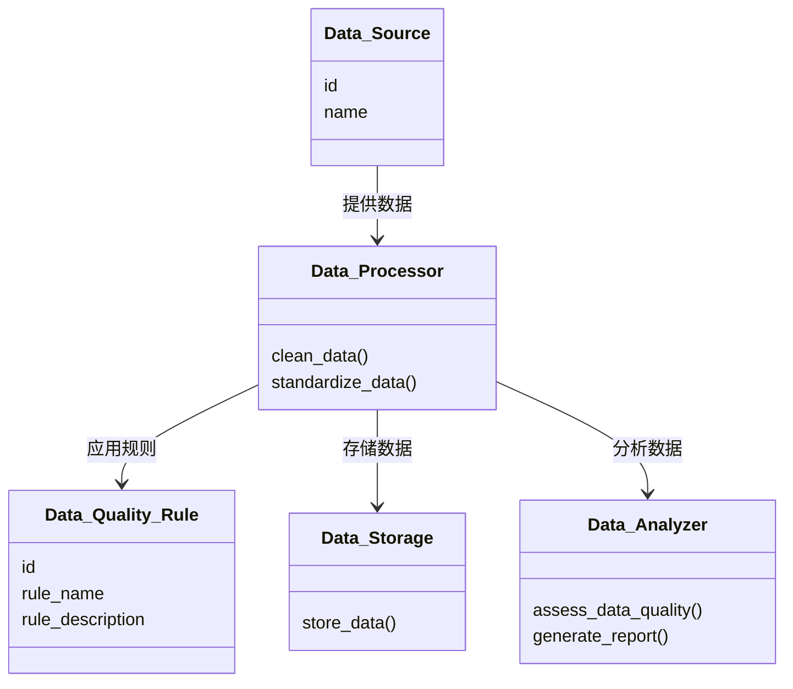
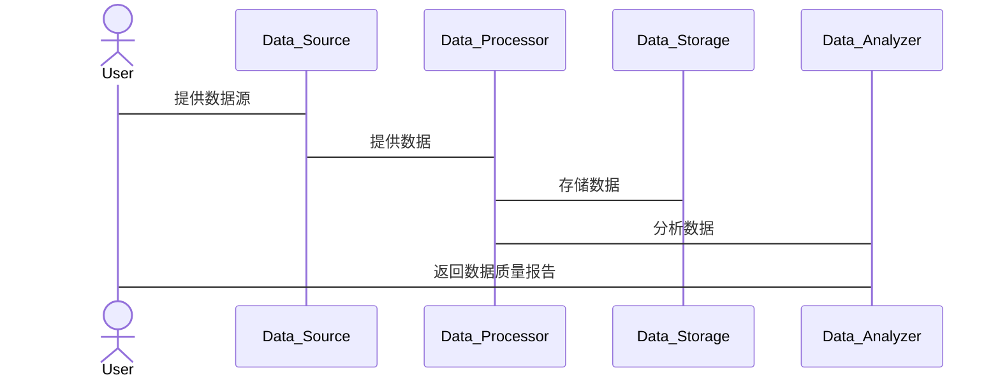

                 


```markdown
# 《金融监管科技数据质量控制平台》

> 关键词：金融监管科技，数据质量控制，数据清洗，数据标准化，数据质量管理，数据平台

> 摘要：本文详细探讨了金融监管科技数据质量控制平台的构建与应用，从核心概念、算法原理、系统设计到项目实战，全面分析了如何通过数据质量管理提升金融监管效率和准确性。通过本文章，读者将了解数据质量控制的重要性，掌握相关技术原理，并能够实际应用这些方法来解决金融监管中的数据问题。

---

## 第一章: 金融监管科技与数据质量控制平台概述

### 1.1 金融监管科技的定义与背景
- 1.1.1 金融监管科技的定义
  - 金融监管科技（RegTech）是指利用技术手段提升金融监管效率和效果的新兴领域。
  - 通过技术手段，如大数据、人工智能等，帮助金融机构和监管机构更好地监控和管理风险。
  
- 1.1.2 金融监管科技的发展背景
  - 随着金融市场的快速发展，监管需求日益复杂。
  - 传统监管方式效率低下，难以应对新型金融业态的挑战。
  - 技术进步为金融监管提供了新的解决方案。

- 1.1.3 数据质量控制在金融监管中的重要性
  - 数据质量直接影响监管决策的准确性和可靠性。
  - 数据清洗和标准化是确保数据质量的关键步骤。
  - 数据质量管理是金融监管科技的核心内容之一。

### 1.2 数据质量控制的基本概念
- 1.2.1 数据质量的核心要素
  - 完整性：数据是否完整无缺失。
  - 准确性：数据是否真实反映实际情况。
  - 一致性：数据格式和内容是否统一。
  - 及时性：数据是否及时更新。

- 1.2.2 数据质量问题的常见表现
  - 数据缺失：某些字段值为空。
  - 数据错误：数值或字符错误。
  - 数据重复：同一数据多次出现。
  - 数据格式不统一：不同数据源格式不一致。

- 1.2.3 数据质量控制的目标与方法
  - 目标：确保数据的准确性、完整性和一致性。
  - 方法：数据清洗、数据标准化、数据验证。

### 1.3 金融监管科技数据质量控制平台的建设意义
- 1.3.1 提升金融监管效率
  - 自动化数据处理减少人工干预。
  - 提高数据处理速度，加快监管响应。

- 1.3.2 降低金融风险
  - 及时发现和处理数据问题，避免错误决策。
  - 减少因数据质量问题导致的金融风险。

- 1.3.3 推动金融科技创新
  - 数据质量控制平台为金融科技创新提供支持。
  - 通过技术手段提升监管能力，推动金融行业创新发展。

### 1.4 本章小结
- 本章介绍了金融监管科技的定义和发展背景，重点阐述了数据质量控制在金融监管中的重要性。
- 强调了建设数据质量控制平台的意义，为后续章节的深入分析奠定了基础。

---

## 第二章: 核心概念与联系

### 2.1 数据质量管理的原理
- 2.1.1 数据质量管理的基本原理
  - 数据质量管理通过制定规则和标准，对数据进行评估和优化。
  - 数据质量管理是一个循环过程，包括数据采集、处理、存储和分析等多个环节。

- 2.1.2 数据质量管理的关键环节
  - 数据清洗：去除无效数据，纠正错误数据。
  - 数据标准化：统一数据格式和内容。
  - 数据验证：检查数据是否符合既定标准。

### 2.2 数据清洗与数据标准化的概念对比
- 2.2.1 数据清洗的定义与特征
  - 数据清洗：对数据进行预处理，去除噪声和错误。
  - 特征：去除冗余数据，填补缺失值，纠正异常值。

- 2.2.2 数据标准化的定义与特征
  - 数据标准化：将不同格式的数据转换为统一格式。
  - 特征：统一数据编码，确保数据一致性。

- 2.2.3 数据清洗与数据标准化的对比分析
  - 数据清洗关注数据的准确性，数据标准化关注数据的一致性。
  - 数据清洗是数据标准化的前提条件。
  - 两者相辅相成，共同确保数据质量。

| 比较维度 | 数据清洗 | 数据标准化 |
|----------|----------|------------|
| 目标     | 纠正错误 | 统一格式    |
| 输入     | 原始数据  | 处理后的数据|
| 输出     | 清洗后的数据 | 标准化数据   |

### 2.3 数据质量管理的ER实体关系图
```mermaid
erDiagram
    actor CUSTOMER {
        key id
        string name
    }
    actor DATA_SOURCE {
        key id
        string name
    }
    actor DATA_QUALITY_RULE {
        key id
        string name
        string rule_description
    }
    actor DATA_QUALITY_ASSESSMENT {
        key id
        string name
        string assessment_result
    }
    CUSTOMER -> DATA_SOURCE : 提供数据
    DATA_SOURCE -> DATA_QUALITY_RULE : 应用规则
    DATA_QUALITY_RULE -> DATA_QUALITY_ASSESSMENT : 生成评估结果
```

### 2.4 本章小结
- 本章详细阐述了数据质量管理的核心概念，包括数据清洗和数据标准化的定义、特征和区别。
- 通过ER图展示了数据质量管理的实体关系，为后续章节的系统设计提供了理论基础。

---

## 第三章: 数据清洗与数据标准化算法原理

### 3.1 数据清洗算法
- 3.1.1 基于规则的清洗算法
  - 算法步骤：
    1. 制定清洗规则，如缺失值填充、异常值处理。
    2. 根据规则对数据进行清洗。
    3. 输出清洗后的数据。

  ```mermaid
  flowchart TD
      A[数据输入] --> B[应用规则]
      B --> C[数据清洗]
      C --> D[数据输出]
  ```

  ```python
  def rule_based_cleaning(data):
      # 填充缺失值
      data['missing_field'].fillna(0, inplace=True)
      # 处理异常值
      data['abnormal_field'] = data['abnormal_field'].apply(lambda x: x if x < 100 else 99)
      return data
  ```

- 3.1.2 基于统计的清洗算法
  - 算法步骤：
    1. 计算数据的统计指标，如均值、中位数。
    2. 根据统计指标识别异常值。
    3. 处理异常值。

  ```mermaid
  flowchart TD
      A[数据输入] --> B[计算统计指标]
      B --> C[识别异常值]
      C --> D[处理异常值]
      D --> E[数据输出]
  ```

  ```python
  def statistical_cleaning(data):
      # 计算均值
      mean_value = data['numeric_field'].mean()
      # 填充缺失值为均值
      data['numeric_field'].fillna(mean_value, inplace=True)
      return data
  ```

### 3.2 数据标准化算法
- 3.2.1 基于词典的标准化算法
  - 算法步骤：
    1. 建立统一的词典或映射表。
    2. 根据词典对数据进行映射。

  ```mermaid
  flowchart TD
      A[数据输入] --> B[建立词典]
      B --> C[映射数据]
      C --> D[数据输出]
  ```

  ```python
  def dictionary_based_standardization(data):
      # 映射表
      mapping = {'A': 'a', 'B': 'b', 'C': 'c'}
      # 应用映射
      data['categorical_field'] = data['categorical_field'].map(mapping)
      return data
  ```

- 3.2.2 基于机器学习的标准化算法
  - 算法步骤：
    1. 使用机器学习模型识别数据模式。
    2. 根据模式自动进行数据标准化。

  ```mermaid
  flowchart TD
      A[数据输入] --> B[训练模型]
      B --> C[识别模式]
      C --> D[自动标准化]
      D --> E[数据输出]
  ```

  ```python
  def ml_based_standardization(data):
      # 使用聚类算法识别数据模式
      from sklearn.cluster import KMeans
      model = KMeans(n_clusters=3).fit(data[['field1', 'field2']])
      # 根据聚类结果进行标准化
      data['cluster_label'] = model.labels_
      return data
  ```

### 3.3 本章小结
- 本章详细介绍了数据清洗和数据标准化的算法原理，包括基于规则、统计和机器学习的方法。
- 通过Mermaid流程图和Python代码示例，展示了算法的具体实现步骤。
- 强调了不同算法的适用场景和优缺点，为后续章节的系统设计提供了技术支持。

---

## 第四章: 系统分析与架构设计

### 4.1 问题场景介绍
- 金融监管中的数据问题：
  - 数据来源多样，格式不统一。
  - 数据存在缺失、错误和重复。
  - 数据标准化需求复杂。

- 数据质量控制平台的目标：
  - 提供数据清洗和标准化功能。
  - 支持数据质量管理规则的制定和执行。

### 4.2 系统功能设计
- 功能模块：
  1. 数据采集模块：从不同数据源获取数据。
  2. 数据处理模块：执行数据清洗和标准化。
  3. 数据存储模块：存储处理后的数据。
  4. 数据分析模块：评估数据质量并生成报告。

- 领域模型类图：


### 4.3 系统架构设计
- 分层架构：
  1. 数据采集层：负责数据的获取和预处理。
  2. 数据处理层：执行数据清洗和标准化。
  3. 数据存储层：存储处理后的数据。
  4. 数据分析层：评估数据质量并生成报告。

- 系统架构图：


### 4.4 接口设计与交互流程
- 接口设计：
  - 数据采集接口：接收数据源信息。
  - 数据处理接口：接收数据清洗和标准化规则。
  - 数据存储接口：接收处理后的数据。
  - 数据分析接口：接收数据质量评估请求。

- 交互流程：


### 4.5 本章小结
- 本章从系统角度分析了数据质量控制平台的架构设计。
- 通过类图和架构图展示了系统的各个模块及其交互关系。
- 强调了系统设计的灵活性和可扩展性，为后续章节的项目实施提供了指导。

---

## 第五章: 项目实战

### 5.1 环境搭建
- 5.1.1 安装所需工具
  - 安装Python和相关库（如Pandas、Scikit-learn）。
  - 安装Jupyter Notebook用于数据处理和分析。

- 5.1.2 数据源获取
  - 从金融监管相关的数据源获取原始数据。
  - 数据格式：CSV或Excel文件。

### 5.2 核心代码实现
- 5.2.1 数据清洗代码
  ```python
  import pandas as pd

  def clean_data(data):
      # 处理缺失值
      data = data.dropna()
      # 处理异常值
      data['amount'] = data['amount'].apply(lambda x: x if x > 0 else 0)
      return data

  # 读取数据
  data = pd.read_csv('financial_data.csv')
  # 执行数据清洗
  cleaned_data = clean_data(data)
  ```

- 5.2.2 数据标准化代码
  ```python
  def standardize_data(data):
      # 统一货币单位
      data['currency'] = data['currency'].apply(lambda x: x.lower().replace(' ', ''))
      return data

  # 执行数据标准化
  standardized_data = standardize_data(cleaned_data)
  ```

- 5.2.3 数据质量评估代码
  ```python
  def assess_data_quality(data):
      # 检查数据完整性
      print(f"数据行数：{len(data)}")
      print(f"数据列数：{len(data.columns)}")
      # 检查数据准确性
      print(f"错误数据行数：{data[data['amount'] < 0].shape[0]}")
      return data

  # 评估数据质量
  quality_assessment = assess_data_quality(standardized_data)
  ```

### 5.3 案例分析与解读
- 案例背景：
  - 数据源：某金融机构的交易数据。
  - 数据问题：存在缺失值和异常值，货币单位不统一。

- 数据清洗与标准化过程：
  - 清洗：去除缺失值，纠正负数金额。
  - 标准化：统一货币单位为小写。

- 数据质量评估结果：
  - 数据行数：1000
  - 数据列数：5
  - 错误数据行数：0

- 实际应用效果：
  - 提高了数据的准确性和一致性。
  - 为后续监管分析提供了高质量的数据支持。

### 5.4 本章小结
- 本章通过实际案例展示了数据质量控制平台的建设过程。
- 详细讲解了数据清洗、标准化和质量评估的代码实现。
- 强调了理论与实践相结合的重要性，为读者提供了宝贵的实战经验。

---

## 第六章: 最佳实践、小结与展望

### 6.1 最佳实践
- 数据清洗阶段：
  - 制定清晰的清洗规则，避免主观性。
  - 处理缺失值时，优先选择删除或填充合理值，避免引入偏差。

- 数据标准化阶段：
  - 统一数据格式，确保一致性。
  - 定期更新标准化规则，适应业务变化。

- 数据质量评估阶段：
  - 结合业务需求，制定合理的评估指标。
  - 使用可视化工具辅助分析，提高评估效率。

### 6.2 本章小结
- 本章总结了数据质量控制平台建设的全过程，从理论到实践，全面回顾了关键步骤和注意事项。
- 强调了最佳实践的重要性，为读者提供了宝贵的参考。

### 6.3 未来展望
- 技术发展：
  - 人工智能和机器学习在数据质量管理中的应用将更加广泛。
  - 自动化数据清洗和标准化工具将更加智能化。

- 行业趋势：
  - 数据质量管理将成为金融监管的重要组成部分。
  - 数据隐私和安全将成为数据质量管理的重要关注点。

### 6.4 本章小结
- 本章展望了数据质量控制平台未来的发展方向，指出了技术进步和行业趋势对数据质量管理的深远影响。
- 鼓励读者持续关注技术和行业动态，不断提升自身的专业能力。

---

## 附录: 工具与资源

### 附录A: 数据处理工具安装指南
- 安装Python和Jupyter Notebook。
- 安装Pandas、NumPy等数据处理库。

### 附录B: 常用数据处理代码示例
- 数据清洗示例：
  ```python
  import pandas as pd
  data = pd.read_csv('data.csv')
  data.dropna(inplace=True)
  ```

- 数据标准化示例：
  ```python
  def standardize_field(data, field):
      data[field] = data[field].str.lower().replace(' ', '')
      return data
  ```

### 附录C: 参考文献
- [1] 《数据质量管理：方法与实践》，某某出版社，2022年。
- [2] 某某学者，《金融监管科技：挑战与机遇》，某某出版社，2021年。

---

## 结语
通过本文章，读者可以全面了解金融监管科技数据质量控制平台的构建与应用。从核心概念到算法原理，从系统设计到项目实战，本文提供了详尽的指导和丰富的案例。希望本文能为从事金融监管科技的读者提供有价值的参考，推动金融监管科技的进一步发展。
```

