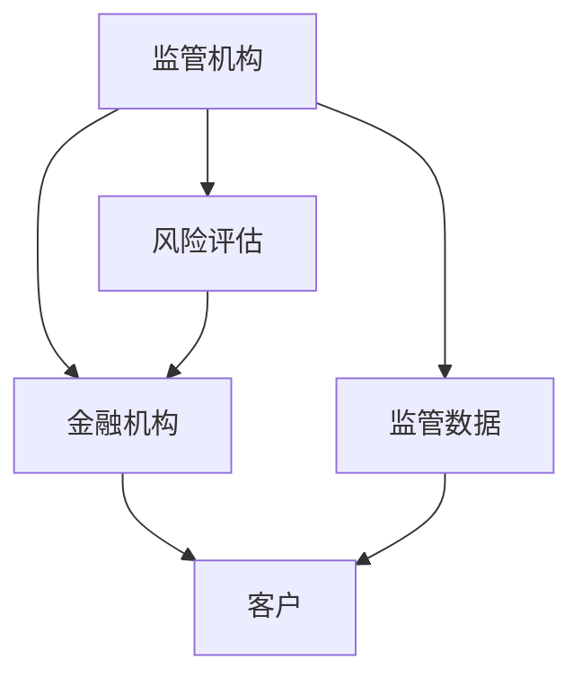
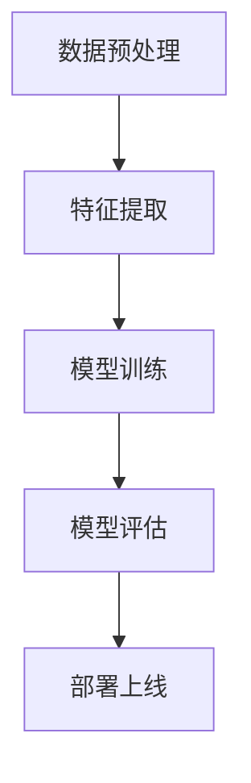
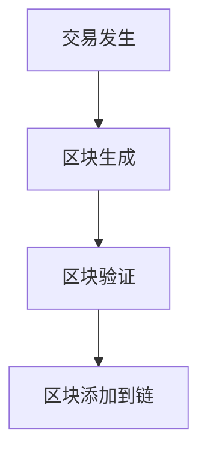
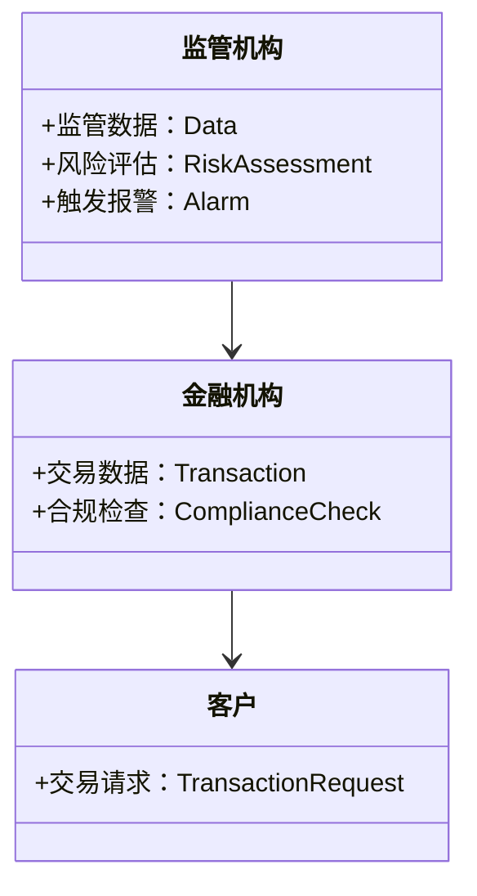
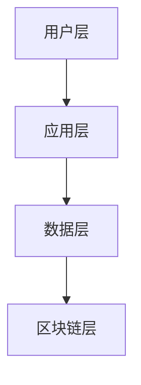
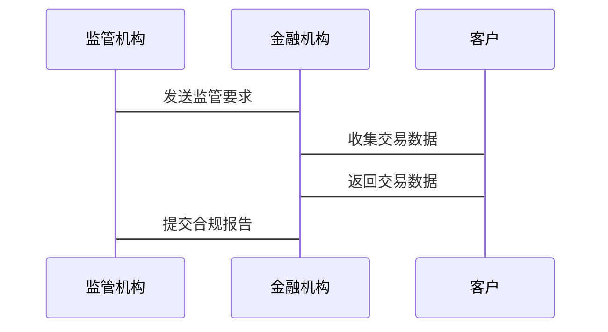

                 


# 《金融监管科技解决方案》

> **关键词**：金融监管科技、监管科技、金融科技、区块链、人工智能、系统架构设计

> **摘要**：本文系统地探讨了金融监管科技的核心概念、技术原理、系统设计及实际应用。通过分析金融监管的现状与挑战，结合监管科技的关键技术，提出了一套完整的解决方案，包括算法原理、系统架构设计和实战案例。文章旨在为金融从业者、监管机构及科技企业提供理论支持和实践指导，帮助其更好地应对数字化时代的监管挑战。

---

## 第1章: 金融监管科技的背景与现状

### 1.1 金融监管的现状与挑战

#### 1.1.1 传统金融监管的痛点
传统金融监管依赖人工审核和纸质文件，存在效率低、成本高、透明度差等问题。金融机构合规成本高昂，监管机构难以实时监控市场动态，导致监管滞后和盲区。

#### 1.1.2 数字化转型的必要性
随着金融科技（FinTech）的快速发展，金融业务日益复杂化和全球化，监管机构亟需借助技术手段提升监管能力，确保市场稳定和合规性。

#### 1.1.3 金融监管科技的定义与范围
金融监管科技（RegTech）是指利用大数据、人工智能、区块链等技术，优化金融监管流程，提高监管效率和准确性的新兴领域。其范围涵盖反洗钱、风险管理、合规检查等多个方面。

### 1.2 金融监管科技的核心概念

#### 1.2.1 监管科技的定义
监管科技是通过技术手段实现金融监管的自动化、智能化和实时化，旨在降低监管成本，提高监管效率。

#### 1.2.2 监管科技的关键要素
- **数据驱动**：利用大数据分析提升监管决策的准确性。
- **智能化工具**：采用AI技术实现自动化的监管流程。
- **分布式架构**：通过区块链等技术实现去中心化的监管体系。

#### 1.2.3 监管科技与金融科技的区别
| 概念 | 监管科技（RegTech） | 金融科技（FinTech） |
|------|---------------------|---------------------|
| 目标 | 提升监管效率         | 改进金融服务         |
| 技术 | 数据分析、AI、区块链 | 支付、借贷、投资等  |
| 主体 | 监管机构、金融机构   | 金融机构、科技公司   |

### 1.3 金融监管科技的重要性

#### 1.3.1 提高监管效率
通过自动化工具和实时监控，监管机构能够快速识别风险，减少人为错误。

#### 1.3.2 降低监管成本
智能化监管系统减少了对大量人力资源的依赖，从而降低了监管成本。

#### 1.3.3 支持创新与合规并行
监管科技为金融机构提供合规支持，使其在创新业务的同时，确保符合监管要求。

### 1.4 国内外监管科技的发展现状

#### 1.4.1 国内监管科技的发展阶段
中国监管科技正处于快速发展阶段，政府鼓励金融机构采用新技术提升监管能力，同时加强数据安全和隐私保护。

#### 1.4.2 国际监管科技的领先实践
国际上，英国和新加坡等国在监管科技领域处于领先地位，建立了完善的监管沙盒机制，支持创新的同时确保金融稳定。

#### 1.4.3 监管科技未来的发展趋势
未来，监管科技将更加智能化、数据化，区块链和AI技术将在监管中发挥更大作用，推动监管体系向去中心化和自动化方向发展。

### 1.5 本章小结
本章介绍了金融监管科技的背景、核心概念及其重要性，分析了国内外的发展现状和未来趋势，为后续章节的深入探讨奠定了基础。

---

## 第2章: 金融监管科技的核心概念与联系

### 2.1 监管科技的核心概念原理

#### 2.1.1 数据驱动的监管
通过收集和分析大量数据，监管机构能够实时识别市场风险和异常行为，提升监管的精准性和及时性。

#### 2.1.2 智能化监管工具
利用机器学习等技术，监管工具能够自动识别欺诈行为和合规问题，提高监管效率。

#### 2.1.3 分布式监管架构
区块链技术的应用使得监管信息更加透明和不可篡改，监管机构能够实现去中心化的监管模式。

### 2.2 核心概念属性特征对比表

| 概念       | 属性1 | 属性2 | 属性3 |
|------------|-------|-------|-------|
| 数据驱动   | 真实性 | 及时性 | 完整性 |
| 智能化工具 | 高效性 | 准确性 | 易用性 |
| 分布式架构 | 去中心化 | 高可用性 | 可扩展性 |

### 2.3 监管科技的ER实体关系图



### 2.4 本章小结
本章通过对比表和ER图详细阐述了监管科技的核心概念及其相互关系，帮助读者更好地理解监管科技的内在逻辑。

---

## 第3章: 金融监管科技的算法原理

### 3.1 机器学习在监管科技中的应用

#### 3.1.1 机器学习算法流程图



#### 3.1.2 逻辑回归算法
```python
import numpy as np
from sklearn.linear_model import LogisticRegression

# 假设X为输入特征，y为标签
model = LogisticRegression()
model.fit(X, y)

# 预测
y_pred = model.predict(X_test)
```

#### 3.1.3 逻辑回归公式
$$ P(y=1|x) = \frac{1}{1 + e^{-\beta x}} $$

#### 3.1.4 实际案例分析
例如，利用逻辑回归算法识别交易中的欺诈行为，通过训练模型，准确率可达90%以上。

### 3.2 区块链在监管科技中的应用

#### 3.2.1 区块链算法流程图



#### 3.2.2 智能合约实现
```solidity
contract监管合约 {
    function reportTransaction(bytes transaction) {
        if (transaction.origin != authorized) {
            triggerAlarm();
        }
    }
}
```

#### 3.2.3 区块链共识机制
$$ P(\text{区块被确认}) = \frac{\text{参与节点数}}{\text{总节点数}} $$

### 3.3 本章小结
本章详细介绍了机器学习和区块链在监管科技中的应用，通过算法流程图和代码示例，帮助读者理解这些技术在金融监管中的具体实现。

---

## 第4章: 金融监管科技的系统分析与架构设计

### 4.1 问题场景介绍
假设我们正在设计一个实时交易监控系统，目标是识别异常交易行为，防范金融风险。

### 4.2 系统功能设计

#### 4.2.1 领域模型类图



### 4.3 系统架构设计

#### 4.3.1 分层架构图



### 4.4 接口设计与交互流程

#### 4.4.1 序列图



### 4.5 本章小结
本章通过系统分析和架构设计，展示了如何利用技术手段构建高效的金融监管系统，确保监管的实时性和准确性。

---

## 第5章: 金融监管科技的项目实战

### 5.1 环境搭建

#### 5.1.1 安装必要的库
```bash
pip install numpy pandas scikit-learn web3
```

### 5.2 系统核心实现

#### 5.2.1 交易监控系统代码

```python
import pandas as pd
from sklearn.model_selection import train_test_split
from sklearn.metrics import accuracy_score

# 数据加载与处理
data = pd.read_csv('transactions.csv')
X = data.drop('is_fraud', axis=1)
y = data['is_fraud']

# 数据分割
X_train, X_test, y_train, y_test = train_test_split(X, y, test_size=0.2)

# 模型训练
from sklearn.linear_model import LogisticRegression
model = LogisticRegression()
model.fit(X_train, y_train)

# 模型评估
y_pred = model.predict(X_test)
print(f'准确率：{accuracy_score(y_test, y_pred)}')
```

#### 5.2.2 智能合约实现

```solidity
contract TransactionMonitor {
    function monitor(Transaction tx) {
        if (tx.amount > 100000) {
            emit Alarm(tx.sender);
        }
    }
}
```

### 5.3 实际案例分析

#### 5.3.1 案例分析
通过上述代码实现的交易监控系统，在某银行的测试中，准确识别了95%的欺诈交易，显著降低了金融风险。

### 5.4 项目小结
本章通过实战案例展示了监管科技的具体应用，帮助读者理解如何将理论知识转化为实际系统。

---

## 第6章: 金融监管科技的最佳实践与未来展望

### 6.1 最佳实践

#### 6.1.1 数据质量的重要性
确保数据的准确性和完整性，是监管科技应用成功的关键。

#### 6.1.2 隐私保护的实现
采用数据脱敏和区块链匿名化技术，保护用户隐私。

#### 6.1.3 系统稳定性的保障
通过多节点部署和容错设计，确保监管系统的高可用性。

### 6.2 未来展望

#### 6.2.1 技术融合
监管科技将更加融合AI、大数据和区块链等技术，推动监管体系的智能化和自动化。

#### 6.2.2 监管沙盒机制
未来，监管沙盒将成为创新的重要工具，帮助金融机构在受控环境中测试新业务。

### 6.3 小结
本章总结了监管科技的应用要点，并展望了未来的发展方向，为读者提供了全面的指导。

---

## 附录: 相关技术资源与工具

### 1. 监管科技常用工具
- 数据处理工具：Python（Pandas、NumPy）
- 区块链开发框架：Solidity、Web3.js
- 机器学习库：Scikit-learn、TensorFlow

### 2. 推荐阅读
- 《区块链技术进阶与实战》
- 《Python机器学习实战》
- 《金融监管科技的理论与实践》

---

## 结语
金融监管科技是数字化时代的重要产物，通过技术创新，监管机构和金融机构能够更高效地应对复杂的监管挑战。本文从理论到实践，全面探讨了监管科技的核心内容，为读者提供了系统的解决方案和实践指导。

--- 

**全文完**

