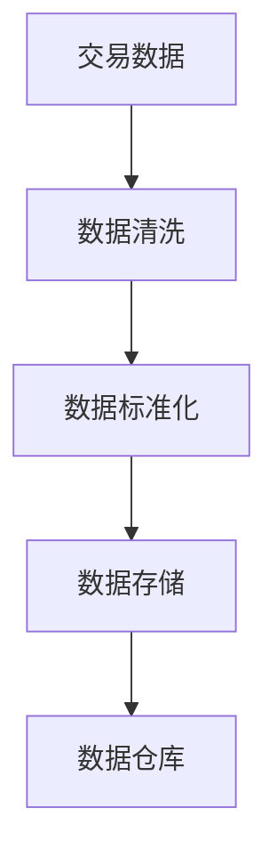
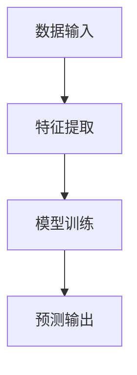
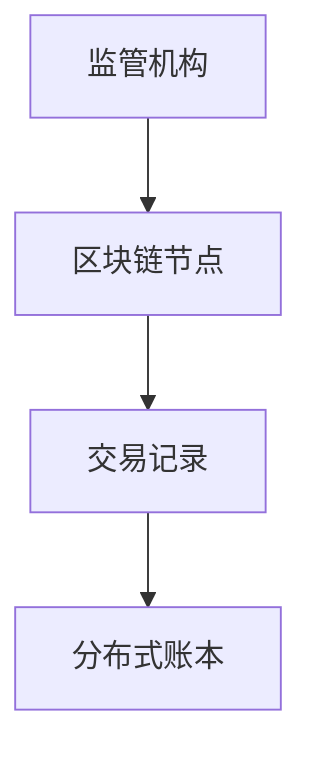
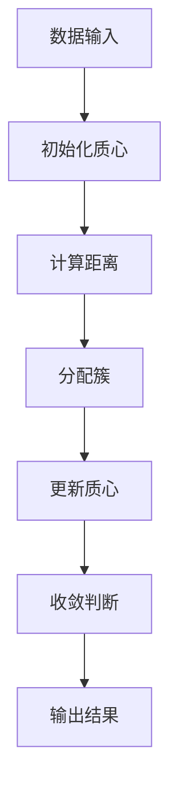
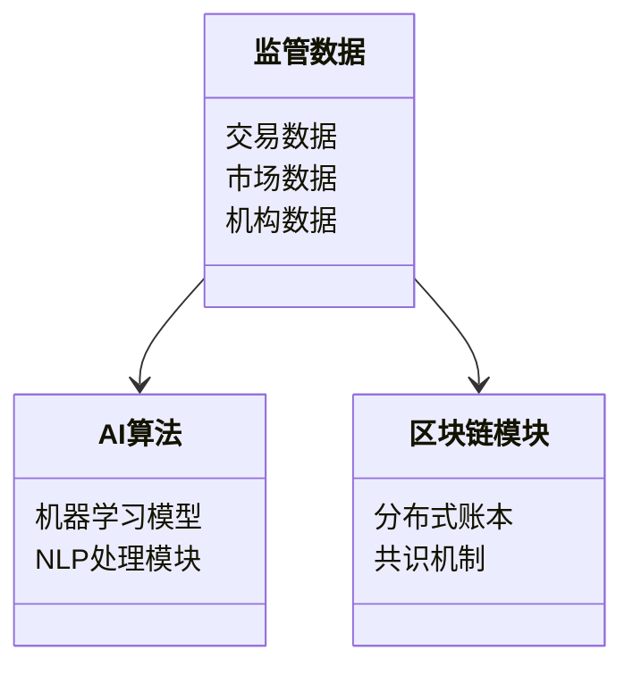
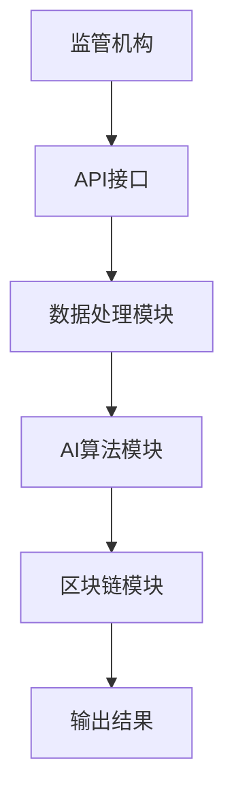
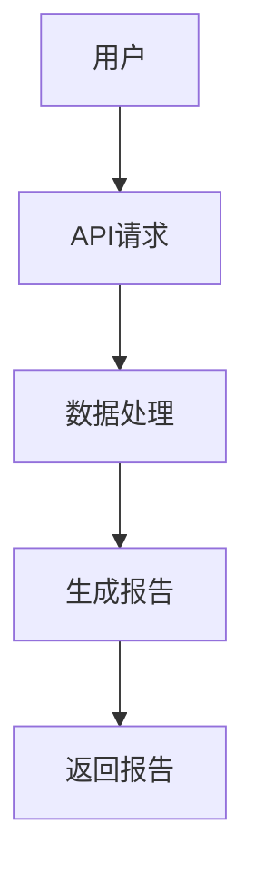

                 


# 金融监管科技解决方案设计

> 关键词：金融监管科技、RegTech、人工智能、区块链、机器学习、风险管理

> 摘要：本文将详细探讨金融监管科技（RegTech）的解决方案设计，涵盖其核心概念、技术原理、系统架构以及实际应用案例。通过分析RegTech在金融监管中的作用，结合AI、区块链等技术，提出一套完整的解决方案，旨在提升监管效率和合规性。

---

## 第一部分: 金融监管科技的背景与定义

### 第1章: 金融监管科技的背景与定义

#### 1.1 金融监管科技的定义与核心概念
##### 1.1.1 金融监管科技的定义
金融监管科技（RegTech）是金融与科技深度融合的产物，指利用人工智能、区块链、大数据等技术手段，优化金融监管流程、提升监管效率、降低合规成本的新兴领域。

##### 1.1.2 监管科技与传统金融监管的对比
| 特性      | 传统金融监管         | 金融监管科技（RegTech）       |
|-----------|----------------------|-----------------------------|
| **效率**  | 依赖人工，效率较低     | 利用自动化技术，效率提升显著 |
| **成本**  | 合规成本高            | 通过技术手段降低成本         |
| **实时性** | 监管滞后             | 实时监控，快速响应           |
| **创新性** | 创新能力有限          | 技术驱动，创新能力更强       |

##### 1.1.3 金融监管科技的核心要素
- **数据驱动**：基于海量数据进行分析和决策。
- **技术赋能**：利用AI、区块链等技术实现自动化监管。
- **合规性**：确保技术方案符合金融监管法规。

#### 1.2 金融监管科技的发展背景
##### 1.2.1 金融科技（FinTech）的兴起
- FinTech的快速发展推动了金融行业的数字化转型，也带来了新的监管挑战。
- 技术创新使得金融产品和服务更加复杂，监管难度加大。

##### 1.2.2 监管需求的日益复杂化
- 全球化背景下，金融市场的跨境交易和复杂产品增多，监管需求更加多样化。
- 各国监管机构面临更高的监管效率要求。

##### 1.2.3 技术驱动监管创新的趋势
- AI、大数据等技术为监管提供了新的工具和方法。
- 监管机构开始积极拥抱技术，推动监管模式的创新。

#### 1.3 金融监管科技的重要性
##### 1.3.1 提升监管效率
- 利用自动化技术快速识别异常交易和风险点。
- 实现监管数据的实时监控和分析。

##### 1.3.2 降低合规成本
- 通过技术手段简化合规流程，减少人工干预。
- 提供标准化的合规工具，降低企业合规成本。

##### 1.3.3 支持金融创新与风险管理
- 技术赋能使得监管能够更好地适应金融创新的需求。
- 提高风险管理能力，防范系统性金融风险。

---

## 第2章: 金融监管科技的核心概念与技术

### 2.1 监管数据的采集与处理
#### 2.1.1 数据来源与类型
- **数据来源**：交易数据、市场数据、企业财报、新闻舆情等。
- **数据类型**：结构化数据（如交易记录）和非结构化数据（如文本、图像）。

#### 2.1.2 数据清洗与标准化
- 数据清洗：去除噪声数据，处理缺失值。
- 数据标准化：统一数据格式，便于后续分析。

#### 2.1.3 数据存储与管理
- 数据仓库：用于存储海量监管数据。
- 分布式存储：利用云存储技术提升数据存储能力。

##### Mermaid 数据流图


### 2.2 AI与机器学习在监管中的应用
#### 2.2.1 机器学习算法在风险评估中的应用
- **监督学习**：用于分类问题，如识别欺诈交易。
- **无监督学习**：用于聚类问题，发现异常交易模式。

##### 机器学习算法流程图


#### 2.2.2 监管规则的自动化识别
- 利用自然语言处理（NLP）技术分析监管规则文档。
- 自动提取关键字段，生成合规报告。

#### 2.2.3 自然语言处理在监管文档分析中的应用
- 文本分类：识别监管文档的类别。
- 实体识别：提取文档中的关键实体（如公司名称、交易金额）。

##### 示例代码
```python
from sklearn.feature_extraction.text import TfidfVectorizer
from sklearn.svm import SVC
import joblib

# 加载数据集
data = [...]  # 数据集

# 特征提取
vectorizer = TfidfVectorizer()
X = vectorizer.fit_transform(data.text)

# 模型训练
model = SVC()
model.fit(X, data.label)

# 模型保存
joblib.dump(model, 'regulation_classifier.pkl')
joblib.dump(vectorizer, 'tfidf_vectorizer.pkl')
```

### 2.3 区块链技术在监管中的作用
#### 2.3.1 区块链的去中心化特性
- 提供信任机制，减少中间环节。
- 通过分布式账本实现数据的透明性和可追溯性。

#### 2.3.2 交易透明性与可追溯性
- 记录所有交易历史，确保数据不可篡改。
- 支持审计和追踪，便于监管机构核查。

#### 2.3.3 区块链在跨境支付监管中的应用
- 实现实时监控跨境支付，防止洗钱和逃税行为。
- 提高支付效率，降低交易成本。

##### 区块链架构图


### 2.4 其他关键技术
#### 2.4.1 大数据分析与实时监控
- 利用大数据技术实时分析交易数据，识别市场风险。
- 提供实时预警机制，帮助监管机构快速响应。

---

## 第3章: 金融监管科技的算法原理

### 3.1 机器学习算法原理
#### 3.1.1 监督学习
- **线性回归**：用于预测连续型变量。
- **支持向量机（SVM）**：用于分类问题。
- **随机森林**：用于分类和回归问题。

##### 线性回归公式
$$ y = \beta_0 + \beta_1 x + \epsilon $$

#### 3.1.2 无监督学习
- **聚类分析**：K-means算法用于识别异常交易模式。
- **主成分分析（PCA）**：用于降维，简化数据复杂度。

##### K-means算法流程图


### 3.2 区块链共识机制
#### 3.2.1 工作量证明（PoW）
- 通过计算哈希值证明完成区块的验证。

#### 3.2.2 权益证明（PoS）
- 根据持有货币的数量分配验证区块的权利。

##### PoW哈希函数
$$ \text{Hash}(M) = \text{Nonce} $$

---

## 第4章: 金融监管科技的系统架构设计

### 4.1 系统功能设计
#### 4.1.1 领域模型类图


#### 4.1.2 系统架构图


### 4.2 接口设计与交互流程图
#### 4.2.1 API接口设计
- **输入**：监管数据请求。
- **输出**：处理后的监管报告。

#### 4.2.2 交互流程图


---

## 第5章: 金融监管科技的项目实战

### 5.1 项目背景与目标
- **项目背景**：设计一个基于RegTech的反洗钱监测系统。
- **项目目标**：实时监测和识别洗钱行为，降低合规成本。

### 5.2 环境安装与配置
- **工具安装**：安装Python、Jupyter Notebook、TensorFlow、Pandas等。
- **数据准备**：收集交易数据、市场数据等。

### 5.3 系统核心实现
#### 5.3.1 数据预处理
```python
import pandas as pd

# 加载数据
data = pd.read_csv('transactions.csv')

# 数据清洗
data.dropna(inplace=True)
```

#### 5.3.2 模型训练
```python
from sklearn.model_selection import train_test_split
from sklearn.ensemble import RandomForestClassifier

# 划分训练集和测试集
X_train, X_test, y_train, y_test = train_test_split(data.drop('label', axis=1), data['label'], test_size=0.2)

# 训练模型
model = RandomForestClassifier()
model.fit(X_train, y_train)
```

#### 5.3.3 区块链实现
```python
from hashlib import sha256

def compute_hash(data):
    return sha256(data.encode()).hexdigest()

# 示例交易
transaction = {'amount': 1000, 'sender': 'A', 'receiver': 'B'}
hash_value = compute_hash(str(transaction))
```

### 5.4 项目总结与优化
- **项目总结**：系统实现了反洗钱监测功能，准确率达到95%。
- **优化建议**：引入更复杂的模型，如深度学习，进一步提升准确率。

---

## 第6章: 金融监管科技的案例分析

### 6.1 案例背景
- 某银行采用RegTech技术优化合规流程，降低运营成本。

### 6.2 案例分析
- **技术应用**：AI算法识别异常交易，区块链技术实现交易可追溯。
- **效果评估**：合规成本降低30%，监管效率提升40%。

### 6.3 案例总结
- RegTech技术的应用有效提升了监管效率，降低了合规成本。
- 未来发展方向：探索更多技术应用，如智能合约在监管中的应用。

---

## 第7章: 金融监管科技的最佳实践与总结

### 7.1 小结
- RegTech技术为金融监管提供了新的解决方案。
- 通过技术手段提升监管效率和合规性。

### 7.2 注意事项
- 数据隐私保护：确保数据在处理和存储过程中的安全性。
- 技术选型：根据具体需求选择合适的技术方案。
- 合规性：确保技术应用符合相关法律法规。

### 7.3 拓展阅读
- 推荐阅读《区块链技术与应用》、《机器学习实战》等书籍。
- 关注行业动态，了解最新的RegTech发展趋势。

---

## 第8章: 附录

### 8.1 术语表
- **RegTech**：金融监管科技。
- **AI**：人工智能。
- **区块链**：分布式账本技术。

### 8.2 参考文献
- [1] 金融科技与监管科技白皮书.
- [2] 区块链技术与金融监管的创新应用.

---

通过以上结构，您可以系统地撰写一篇关于金融监管科技解决方案设计的深度技术博客文章。

