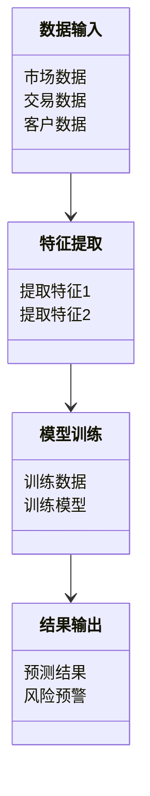
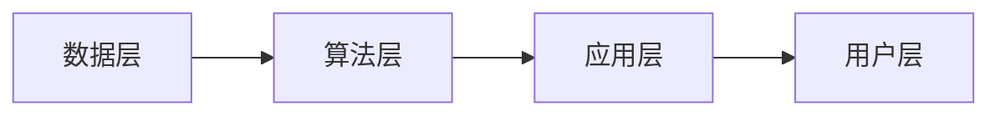

                 

# 《金融监管科技（RegTech）中的AI应用》

> **关键词**: 金融监管科技, AI, 机器学习, 深度学习, 自然语言处理, RegTech, 人工智能  
>
> **摘要**:  
> 本文探讨了人工智能（AI）在金融监管科技（RegTech）中的应用，分析了AI技术如何解决金融监管中的核心问题，如风险评估、欺诈检测和合规性管理。文章详细介绍了机器学习、深度学习和自然语言处理等AI技术的基本原理及其在RegTech中的具体应用，并通过实际案例展示了AI如何提升金融监管的效率和准确性。此外，本文还讨论了RegTech AI系统的架构设计、算法实现和未来发展趋势。

---

# 第一部分: 金融监管科技（RegTech）与AI概述

## 第1章: 金融监管科技（RegTech）概述

### 1.1 什么是RegTech

#### 1.1.1 金融监管的基本概念
金融监管是指通过法律、规则和制度来确保金融机构的稳定运行，保护投资者利益，维护金融市场的秩序。传统金融监管依赖人工审核、流程化操作和静态规则，存在效率低、成本高等问题。

#### 1.1.2 RegTech的定义与特点
RegTech（ Regulatory Technology）是指利用技术手段（如AI、大数据、区块链等）优化金融监管流程，提高监管效率和效果的新兴领域。其特点包括：
- **智能化**: 利用AI技术实现自动化监管。
- **数据驱动**: 依赖大数据分析进行决策支持。
- **实时性**: 提供实时监控和风险预警。
- **合规性**: 确保监管流程符合法律法规。

#### 1.1.3 RegTech的发展背景与驱动力
RegTech的兴起主要源于以下几点：
1. **金融监管需求增加**: 全球金融危机后，各国对金融监管的重视程度提高。
2. **技术进步**: AI、大数据和云计算等技术的发展为RegTech提供了技术基础。
3. **行业痛点**: 传统金融监管效率低、成本高，难以应对复杂多变的金融环境。

---

### 1.2 AI在金融监管中的作用

#### 1.2.1 AI技术的基本概念
人工智能（AI）是指通过模拟人类智能的计算机系统，实现感知、学习、推理和决策的能力。AI的核心技术包括机器学习、深度学习、自然语言处理（NLP）等。

#### 1.2.2 AI在金融监管中的应用领域
AI在金融监管中的主要应用领域包括：
1. **风险评估**: 利用AI模型分析市场风险、信用风险等。
2. **欺诈检测**: 通过AI算法识别异常交易行为。
3. **合规性管理**: 利用NLP技术解析监管规则，自动化合规检查。
4. **实时监控**: 实时分析市场数据，提供风险预警。

#### 1.2.3 AI如何提升金融监管效率
AI通过以下方式提升金融监管效率：
1. **自动化处理**: 将人工审核流程自动化，降低人力成本。
2. **实时分析**: 实时监控市场数据，快速识别风险。
3. **精准决策**: 基于数据分析提供个性化监管建议。

---

## 第2章: RegTech与AI的结合

### 2.1 RegTech的核心问题

#### 2.1.1 金融监管的主要挑战
金融监管面临的主要挑战包括：
1. **数据复杂性**: 金融市场数据种类繁多，难以处理。
2. **监管规则复杂**: 监管规则不断变化，人工解读难度大。
3. **效率低下**: 传统监管流程耗时长、成本高。

#### 2.1.2 RegTech的目标与边界
RegTech的目标是通过技术手段优化金融监管流程，提高监管效率和准确性。其边界包括：
- **数据范围**: 仅限于金融机构和市场的数据。
- **技术范围**: 主要依赖AI、大数据和区块链等技术。

#### 2.1.3 RegTech的核心要素
RegTech的核心要素包括：
1. **数据源**: 包括市场数据、交易数据、客户数据等。
2. **AI算法**: 包括机器学习、深度学习、NLP等技术。
3. **监管规则库**: 包含法律法规和监管标准的数据库。
4. **监管平台**: 用于展示和操作的可视化平台。

---

### 2.2 AI在RegTech中的核心作用

#### 2.2.1 AI技术如何解决RegTech问题
AI通过以下方式解决RegTech问题：
1. **数据处理**: 利用大数据技术处理海量金融数据。
2. **模式识别**: 通过机器学习识别市场风险和欺诈行为。
3. **规则解读**: 通过NLP技术解析监管规则，自动化合规检查。

#### 2.2.2 AI在RegTech中的应用场景
AI在RegTech中的应用场景包括：
1. **智能合规检查**: 自动化解读监管规则，检查金融机构的合规性。
2. **风险预警系统**: 实时监控市场数据，预测潜在风险。
3. **欺诈检测系统**: 利用AI算法识别异常交易行为。

#### 2.2.3 AI与RegTech的结合模式
AI与RegTech的结合模式主要包括：
1. **技术驱动**: 通过AI技术优化监管流程。
2. **数据驱动**: 利用大数据分析提高监管效率。
3. **规则驱动**: 基于监管规则构建AI模型。

---

## 第3章: RegTech中的AI技术基础

### 3.1 机器学习在RegTech中的应用

#### 3.1.1 机器学习的基本概念
机器学习是一种通过数据训练模型，使其能够从数据中学习并做出预测的技术。其核心包括特征提取、模型训练和预测评估。

#### 3.1.2 机器学习在金融监管中的应用
机器学习在金融监管中的应用包括：
1. **风险评估**: 利用机器学习模型预测市场风险。
2. **欺诈检测**: 通过监督学习识别欺诈交易。
3. **客户画像**: 利用无监督学习分析客户行为。

#### 3.1.3 常见机器学习算法在RegTech中的应用
常用的机器学习算法包括：
1. **线性回归**: 用于预测市场趋势。
2. **支持向量机（SVM）**: 用于分类问题，如合规性判断。
3. **随机森林**: 用于特征重要性分析和风险评估。
4. **K-近邻算法（KNN）**: 用于相似性分析，如客户画像。

---

### 3.2 深度学习在RegTech中的应用

#### 3.2.1 深度学习的基本概念
深度学习是一种基于人工神经网络的机器学习技术，能够处理非结构化数据，如图像和文本。

#### 3.2.2 深度学习在金融监管中的应用
深度学习在金融监管中的应用包括：
1. **图像识别**: 识别交易单据中的关键信息。
2. **自然语言处理**: 分析监管文档和市场报告。
3. **时间序列分析**: 预测市场波动。

#### 3.2.3 常见深度学习模型在RegTech中的应用
常用的深度学习模型包括：
1. **卷积神经网络（CNN）**: 用于图像识别和模式识别。
2. **循环神经网络（RNN）**: 用于时间序列分析和文本处理。
3. **Transformer模型**: 用于自然语言理解和文本生成。
4. **图神经网络（GNN）**: 用于复杂关系网络的分析，如客户关系图。

---

### 3.3 自然语言处理（NLP）在RegTech中的应用

#### 3.3.1 NLP的基本概念
自然语言处理是一种让计算机理解和生成人类语言的技术，常用于文本分析和信息提取。

#### 3.3.2 NLP在金融监管中的应用
NLP在金融监管中的应用包括：
1. **监管规则解析**: 自动化解读监管文档。
2. **市场情绪分析**: 分析新闻和社交媒体对市场的影响。
3. **合规性检查**: 检查金融机构的报告是否符合监管要求。

#### 3.3.3 常见NLP技术在RegTech中的应用
常用的NLP技术包括：
1. **词袋模型（Bag of Words）**: 用于文本分类和信息提取。
2. **TF-IDF**: 用于关键词提取和主题分析。
3. **BERT**: 用于文本摘要和问答系统。

---

## 第4章: AI在RegTech中的算法实现

### 4.1 机器学习算法实现

#### 4.1.1 线性回归
线性回归是一种简单但有效的回归算法，用于预测连续型变量。其数学模型如下：

$$ y = \beta_0 + \beta_1 x_1 + \beta_2 x_2 + \dots + \beta_n x_n $$

其中，$y$ 是目标变量，$\beta$ 是系数，$x$ 是特征变量。

#### 4.1.2 支持向量机（SVM）
支持向量机是一种分类算法，通过找到一个超平面将数据分为两类。其数学模型如下：

$$ \text{目标函数}: \min_{\beta, \beta_0} \frac{1}{2} \|\beta\|^2 $$
$$ \text{约束条件}: y_i (\beta \cdot x_i + \beta_0) \geq 1, \forall i $$

---

### 4.2 深度学习算法实现

#### 4.2.1 卷积神经网络（CNN）
卷积神经网络主要用于图像识别，其网络结构包括卷积层、池化层和全连接层。其数学模型如下：

$$ \text{卷积层}: f(x) = \sum_{k=1}^K w_{i,j,k} \cdot x_{i,j,k} $$ $$ \text{池化层}: f(x) = \max(x) $$

---

## 第5章: 系统架构设计

### 5.1 系统功能设计

#### 5.1.1 领域模型
领域模型是系统功能的核心，包括数据输入、特征提取、模型训练和结果输出。其类图如下：

---

### 5.2 系统架构设计

#### 5.2.1 系统架构
系统架构包括数据层、算法层、应用层和用户层。其架构图如下：

---

## 第6章: 案例分析与总结

### 6.1 案例分析

#### 6.1.1 智能合规检查
通过NLP技术解析监管规则，自动化检查金融机构的合规性。例如，利用BERT模型分析监管文档，生成合规性报告。

#### 6.1.2 风险预警系统
利用机器学习模型实时监控市场数据，预测潜在风险。例如，使用随机森林模型预测市场崩盘。

---

### 6.2 总结与展望

#### 6.2.1 总结
AI技术在RegTech中的应用显著提高了金融监管的效率和准确性。通过机器学习、深度学习和NLP技术，解决了传统监管中的痛点。

#### 6.2.2 展望
未来，随着AI技术的不断发展，RegTech将更加智能化和自动化。例如，通过强化学习优化监管策略，利用区块链技术提升数据安全性。

---

# 第三部分: 最佳实践与注意事项

## 第7章: 最佳实践

### 7.1 系统设计 tips
- **数据安全**: 确保金融数据的安全性和隐私性。
- **模型解释性**: 选择可解释性强的模型，便于监管人员理解。
- **实时性**: 确保系统能够实时处理数据，快速响应风险。

### 7.2 代码实现 tips
- **数据预处理**: 对数据进行清洗和特征工程，提高模型性能。
- **模型调优**: 通过交叉验证和超参数优化提升模型准确率。
- **部署与监控**: 将模型部署到生产环境，并实时监控模型性能。

---

## 第8章: 未来展望

### 8.1 未来趋势
- **AI与区块链结合**: 利用区块链技术提升RegTech的透明性和可信度。
- **多模态AI**: 结合图像、文本和语音等多种数据源，提高监管的全面性。
- **自动化监管**: 通过AI实现完全自动化的监管流程，减少人工干预。

---

# 结语

人工智能正在深刻改变金融监管的方式，RegTech作为AI与金融监管的结合体，将成为未来金融行业的重要支柱。通过不断的技术创新和实践积累，RegTech将为金融市场的稳定和健康发展提供有力支持。

--- 

# 接下来，我将按照上述目录结构，逐步完成文章的撰写。

