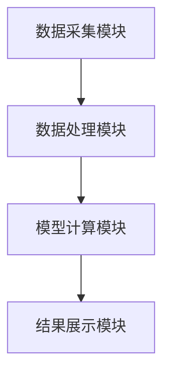
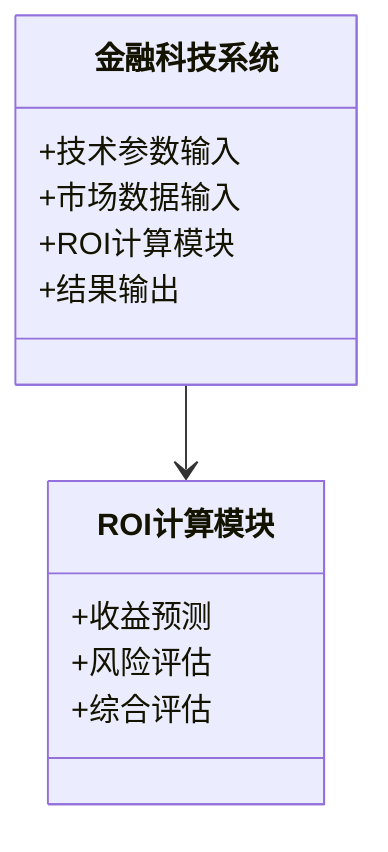
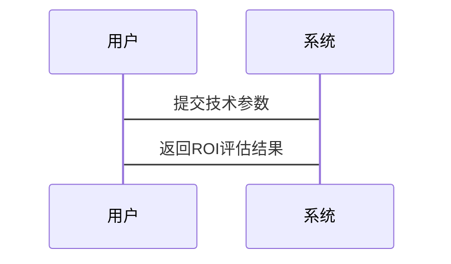

                 


# 《金融科技创新ROI评估框架》

## 关键词：金融科技创新, ROI评估, 金融科技, 投资回报率, 风险评估, 金融科技系统架构, 金融科技项目实战

## 摘要：  
随着金融科技的快速发展，金融机构在技术创新上的投入不断增加，如何科学评估这些投入的回报率（ROI）成为关键问题。本文将从金融科技创新的核心概念出发，结合数学模型、算法原理和系统架构，构建一套完整的ROI评估框架。通过实际案例分析和项目实战，深入探讨如何在金融科技创新中实现高效的投资回报评估，为金融机构提供理论支持和实践指导。

---

# 第一部分：金融科技创新背景与ROI评估框架概述

## 第1章：金融科技创新的背景与挑战

### 1.1 金融科技创新的现状与趋势

#### 1.1.1 金融科技的定义与核心领域
金融科技（FinTech）是指利用现代信息技术创新性地改善或提升金融活动效率的模式和手段。其核心领域包括支付清算、借贷融资、投资管理、保险业务、金融市场等。

#### 1.1.2 金融科技创新的驱动力
- **技术驱动**：大数据、人工智能、区块链等技术的发展推动了金融创新。
- **需求驱动**：用户对高效、便捷金融服务的需求促使机构不断创新。
- **政策驱动**：监管机构对金融创新的支持与规范为行业发展提供了保障。

#### 1.1.3 金融科技发展中的主要挑战
- **技术风险**：技术不稳定或被攻击可能导致重大损失。
- **合规风险**：金融创新需符合监管要求，否则可能面临法律风险。
- **用户信任**：技术创新可能引发用户对隐私和数据安全的担忧。

### 1.2 ROI评估的必要性与意义

#### 1.2.1 ROI的定义与核心要素
ROI（Return on Investment，投资回报率）是指投资所获得的收益与投资成本的比率。在金融科技创新中，ROI评估需要考虑以下核心要素：
- **收益**：技术创新带来的收入增长或成本节约。
- **成本**：技术研发、实施和运维的成本。
- **时间**：投资回收期的长短。

#### 1.2.2 金融科技创新中的ROI评估需求
- **投资决策**：帮助金融机构判断技术创新项目的可行性。
- **资源配置**：优化技术投入，集中资源于高回报项目。
- **绩效评估**：衡量技术创新的实际效果，为后续投资提供依据。

#### 1.2.3 ROI评估对金融机构的价值
- **提升效率**：通过科学评估，减少盲目投资。
- **降低风险**：通过风险分析，规避低效或失败项目。
- **促进创新**：激励金融机构持续投入创新，保持竞争优势。

### 1.3 本书的核心目标与框架

#### 1.3.1 本书的研究目标
构建一套适用于金融科技创新的ROI评估框架，帮助金融机构科学评估技术创新的投入产出。

#### 1.3.2 本书的结构安排
- 第一部分：背景与核心概念。
- 第二部分：数学模型与算法原理。
- 第三部分：系统架构与项目实战。
- 第四部分：最佳实践与未来发展。

#### 1.3.3 本书的创新点与特色
- 提供完整的ROI评估框架，涵盖技术、业务和风险因素。
- 结合数学模型和实际案例，注重理论与实践结合。
- 强调系统化思维，从整体视角优化技术创新投资。

---

## 第2章：金融科技创新与ROI评估的核心概念

### 2.1 金融科技创新的核心要素

#### 2.1.1 金融科技的主要技术手段
- **大数据分析**：利用海量数据进行精准决策。
- **人工智能**：通过机器学习优化金融服务。
- **区块链技术**：实现去中心化信任机制。
- **云计算**：提供弹性扩展的IT基础设施。

#### 2.1.2 金融科技创新的业务模式
- **支付创新**：移动支付、跨境支付等。
- **融资创新**：P2P借贷、供应链金融等。
- **投资创新**：智能投顾、量化交易等。

#### 2.1.3 金融科技创新的生态系统
- **参与者**：金融机构、科技公司、监管机构、用户。
- **协同关系**：各方合作推动金融创新。

### 2.2 ROI评估框架的构成与特点

#### 2.2.1 ROI评估框架的基本构成
- **收益预测模型**：估算技术创新带来的收益。
- **成本估算模型**：计算技术投入的成本。
- **风险评估模型**：分析可能的负面因素。
- **综合评估模型**：整合以上因素得出最终ROI。

#### 2.2.2 ROI评估框架的适用范围
- **项目层面**：单个技术创新项目的评估。
- **系统层面**：整体金融科技系统的优化评估。
- **战略层面**：长期技术创新战略的规划与评估。

#### 2.2.3 ROI评估框架的灵活性与可扩展性
- 灵活性：根据不同项目特点调整评估模型。
- 可扩展性：适用于不同规模和技术复杂度的项目。

### 2.3 金融科技创新与ROI评估的关联性

#### 2.3.1 金融科技创新对ROI的影响
- **正向影响**：技术创新带来收益增长。
- **反向影响**：技术失败可能导致成本超支。

#### 2.3.2 ROI评估对金融科技创新的反馈作用
- ROI评估为技术创新提供数据支持。
- 通过ROI反馈优化技术创新策略。

#### 2.3.3 金融科技创新与ROI评估的协同发展
- 技术创新推动金融业务发展。
- ROI评估为技术创新提供方向和动力。

---

## 第3章：金融科技创新ROI评估的数学模型与公式

### 3.1 金融科技创新的收益预测模型

#### 3.1.1 收益预测的基本公式
$$ ROI = \frac{净收益}{投资成本} \times 100\% $$

#### 3.1.2 金融科技创新的收益影响因素分析
- **市场需求**：技术创新是否满足用户需求。
- **技术成熟度**：技术的稳定性和可扩展性。
- **竞争环境**：市场上是否有类似的技术或产品。

### 3.2 风险评估与调整模型

#### 3.2.1 风险调整后的ROI计算公式
$$ ROI_{调整后} = ROI_{原始} \times (1 - 风险调整系数) $$

#### 3.2.2 风险评估的指标体系
- **技术风险**：技术实现的难度和不确定性。
- **市场风险**：市场需求变化带来的风险。
- **合规风险**：监管政策变化带来的风险。

### 3.3 综合评估模型

#### 3.3.1 综合评估模型的构建
综合考虑收益、成本、风险等多因素，构建一个多维评估模型。

#### 3.3.2 模型的参数设定与优化
- **参数设定**：根据具体项目调整各因素的权重。
- **优化方法**：通过回归分析或机器学习优化模型。

#### 3.3.3 模型的实际应用案例
通过一个具体案例，展示如何应用综合评估模型进行ROI计算。

---

## 第4章：金融科技创新ROI评估的算法原理与实现

### 4.1 算法原理概述

#### 4.1.1 基于机器学习的ROI预测算法
使用机器学习模型，根据历史数据预测技术创新的ROI。

#### 4.1.2 算法的基本流程
1. 数据收集：收集相关历史数据。
2. 数据预处理：清洗和特征提取。
3. 模型训练：训练机器学习模型。
4. 模型预测：预测新技术的ROI。

#### 4.1.3 算法的输入输出说明
- **输入**：历史数据和新项目的参数。
- **输出**：预测的ROI值。

### 4.2 算法实现步骤

#### 4.2.1 数据预处理代码
```python
import pandas as pd
from sklearn.preprocessing import StandardScaler

# 数据加载
data = pd.read_csv('fin-tech.csv')

# 特征提取
features = data[['技术复杂度', '开发成本', '市场潜力']]
target = data['ROI']

# 数据标准化
scaler = StandardScaler()
features_scaled = scaler.fit_transform(features)
```

#### 4.2.2 机器学习模型训练代码
```python
from sklearn.linear_model import LinearRegression

# 模型训练
model = LinearRegression()
model.fit(features_scaled, target)
```

#### 4.2.3 模型预测代码
```python
# 预测新项目的ROI
new_project = [[技术复杂度, 开发成本, 市场潜力]]
new_project_scaled = scaler.transform(new_project)
predicted_roi = model.predict(new_project_scaled)
print(f'预测ROI：{predicted_roi[0]}')
```

---

## 第5章：金融科技创新ROI评估的系统架构与设计

### 5.1 系统架构设计

#### 5.1.1 系统功能模块划分
- **数据采集模块**：收集金融科技创新相关数据。
- **数据处理模块**：清洗和转换数据。
- **模型计算模块**：运行ROI评估模型。
- **结果展示模块**：输出评估结果。

#### 5.1.2 系统架构图


### 5.2 系统功能设计

#### 5.2.1 系统功能设计图


### 5.3 系统接口设计

#### 5.3.1 系统接口设计
- **输入接口**：接收技术参数和市场数据。
- **输出接口**：展示评估结果。

#### 5.3.2 系统交互流程图


---

## 第6章：金融科技创新ROI评估的项目实战

### 6.1 环境配置与数据准备

#### 6.1.1 环境配置
- **操作系统**：Windows 10或更高版本。
- **开发工具**：Python 3.8及以上，Jupyter Notebook。
- **依赖库**：pandas、scikit-learn、mermaid。

#### 6.1.2 数据准备
加载金融科技创新相关数据，包括技术复杂度、开发成本、市场潜力等。

### 6.2 核心代码实现

#### 6.2.1 数据预处理代码
```python
import pandas as pd
from sklearn.model_selection import train_test_split

# 数据加载
data = pd.read_csv('fin-tech.csv')

# 数据分割
X_train, X_test, y_train, y_test = train_test_split(data[['技术复杂度', '开发成本', '市场潜力']], data['ROI'], test_size=0.2)
```

#### 6.2.2 模型训练代码
```python
from sklearn.ensemble import RandomForestRegressor

# 模型训练
model = RandomForestRegressor()
model.fit(X_train, y_train)
```

#### 6.2.3 模型评估代码
```python
from sklearn.metrics import mean_squared_error

# 模型预测
y_pred = model.predict(X_test)
print(f'MSE: {mean_squared_error(y_test, y_pred)}')
```

### 6.3 实际案例分析

#### 6.3.1 案例背景
假设某金融机构计划开发一个基于区块链的支付系统，需要评估其ROI。

#### 6.3.2 案例分析步骤
1. 收集相关数据。
2. 数据预处理。
3. 模型训练与预测。
4. 结果分析与优化。

---

## 第7章：最佳实践与未来发展

### 7.1 最佳实践

#### 7.1.1 数据质量的重要性
确保数据的准确性和完整性，避免因数据问题导致评估偏差。

#### 7.1.2 模型选择的灵活性
根据具体项目特点选择合适的评估模型，避免一刀切。

#### 7.1.3 持续优化
定期更新数据和模型，确保评估结果的时效性。

### 7.2 本书小结

#### 7.2.1 核心内容回顾
- ROI评估框架的构建。
- 数学模型与算法实现。
- 系统设计与项目实战。

#### 7.2.2 未来展望
- 更多技术手段的应用，如AI和区块链。
- 更加复杂的模型，如深度学习。
- 更广泛的应用场景，如金融监管。

### 7.3 注意事项

#### 7.3.1 数据隐私与合规
确保数据处理符合相关法律法规。

#### 7.3.2 模型局限性
认识到模型的局限性，避免过度依赖。

#### 7.3.3 项目风险管理
提前识别并应对可能的风险。

---

## 附录

### 附录A：ROI评估框架的数学公式汇总
- 收益预测公式：$$ ROI = \frac{净收益}{投资成本} \times 100\% $$
- 风险调整公式：$$ ROI_{调整后} = ROI_{原始} \times (1 - 风险调整系数) $$

### 附录B：金融科技项目开发工具推荐
- Python：数据分析与机器学习。
- Mermaid：图表绘制。
- Jupyter Notebook：代码实现与展示。

### 附录C：参考文献与拓展阅读
- 金融科技领域的经典文献。
- 相关技术的最新研究。

---

通过以上详细的目录和内容安排，本文将全面覆盖金融科技创新ROI评估的各个方面，为读者提供从理论到实践的完整指导。

