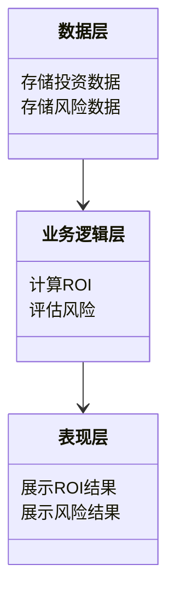
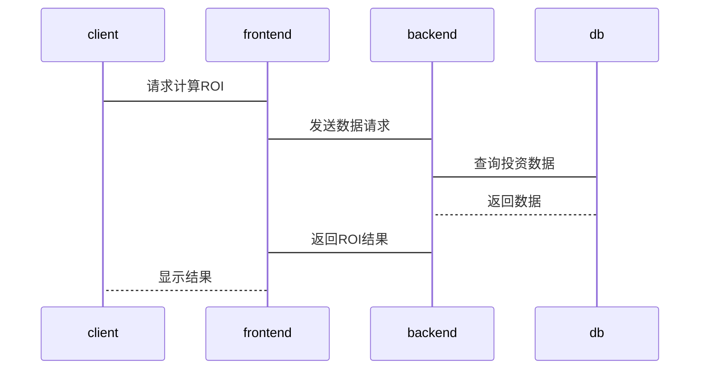
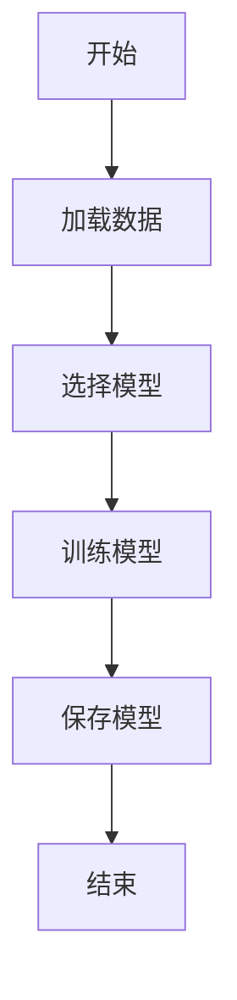
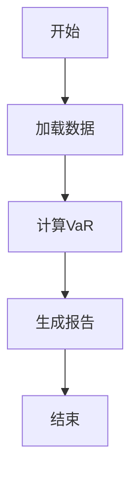

                 


# 《金融科技创新项目ROI预测与风险评估》

## 关键词：金融科技创新、ROI预测、风险评估、系统架构设计、数学模型、算法实现

## 摘要：  
本文系统地探讨了金融科技创新项目中投资回报率(ROI)预测与风险评估的核心概念、算法原理和系统架构设计。通过详细的数学模型和实际案例分析，本文为读者提供了从理论到实践的全面指导，帮助他们在金融科技创新项目中做出科学的投资决策。

---

# 第一部分: 金融科技创新项目背景与概述

## 第1章: 金融科技创新的概述

### 1.1 金融科技创新的定义与特点

#### 1.1.1 金融科技创新的定义  
金融科技创新是指利用新兴技术（如人工智能、大数据、区块链等）对传统金融业务进行创新和优化，以提高效率、降低成本并创造新的商业模式。

#### 1.1.2 金融科技创新的核心特点  
- **技术驱动**：依赖于技术创新，如AI、大数据、区块链等。  
- **场景化**：针对特定金融场景设计解决方案。  
- **数据驱动**：依赖大量数据进行决策。  
- **风险可控**：通过技术手段降低金融风险。  

#### 1.1.3 金融科技创新与传统金融的区别  
| 属性       | 传统金融         | 金融科技创新     |  
|------------|------------------|------------------|  
| 技术基础   | 传统金融工具     | 新兴数字技术     |  
| 服务效率   | 低效             | 高效             |  
| 数据利用   | 依赖经验         | 数据驱动         |  
| 产品创新   | 有限            | 丰富且多样化     |  

### 1.2 金融科技创新的背景与驱动因素

#### 1.2.1 数字化转型的推动  
金融机构为了应对数字化浪潮，纷纷引入新技术以提升竞争力。

#### 1.2.2 技术进步的助力  
人工智能、大数据等技术的发展为金融创新提供了强大支持。

#### 1.2.3 金融监管的适应与创新  
金融监管机构也在适应新技术的变化，推动金融体系的创新。

---

## 第2章: ROI预测与风险评估的基本概念

### 2.1 投资回报率(ROI)的定义

#### 2.1.1 ROI的计算公式  
$$ ROI = \frac{（净收益 - 初始投资）}{初始投资} \times 100\% $$  

#### 2.1.2 ROI在金融项目中的重要性  
ROI是衡量投资项目收益的重要指标，帮助决策者评估项目的可行性和盈利能力。

### 2.2 风险评估的基本概念

#### 2.2.1 风险的分类与特征  
| 风险类型     | 特征描述               |  
|--------------|------------------------|  
| 信用风险     | 借款人违约的可能性     |  
| 市场风险     | 市场波动带来的损失     |  
| 操作风险     | 操作失误导致的损失     |  

#### 2.2.2 风险评估的方法与工具  
- **VaR模型**：衡量潜在损失的极限情况。  
- **压力测试**：评估极端市场条件下的风险。  

### 2.3 金融科技创新项目中的ROI与风险关系

#### 2.3.1 ROI预测与风险评估的相互影响  
高风险项目可能带来高回报，但也可能导致重大损失。  

#### 2.3.2 金融科技创新项目中的主要风险因素  
- **技术风险**：技术故障或漏洞可能导致项目失败。  
- **市场风险**：市场需求变化影响项目的盈利能力。  

---

# 第二部分: ROI预测与风险评估的核心概念与联系

## 第3章: ROI预测的数学模型与算法原理

### 3.1 ROI预测的数学模型

#### 3.1.1 线性回归模型  
线性回归用于预测变量之间的线性关系。例如，预测贷款利率对ROI的影响。

$$ y = \beta_0 + \beta_1x + \epsilon $$  
其中，$y$为预测值，$x$为自变量，$\epsilon$为误差项。

#### 3.1.2 时间序列分析模型  
用于分析时间数据的模式和趋势，如ARIMA模型。

#### 3.1.3 随机过程模型  
适用于处理具有不确定性的金融数据，如布朗运动模型。

### 3.2 风险评估的数学模型

#### 3.2.1 风险中性定价模型  
通过无风险利率和风险溢价来评估资产定价。

$$ R = R_f + \lambda \times \text{风险溢价} $$  

#### 3.2.2 风险调整折现率模型  
调整折现率以反映项目风险。

$$ NPV = \sum_{t=0}^{n} \frac{CF_t}{(1 + r)^t} $$  

#### 3.2.3 风险价值(VaR)模型  
衡量在给定置信水平下的潜在损失。

---

## 第4章: 核心概念的ER实体关系图与流程图

### 4.1 ROI预测的ER实体关系图

#### 4.1.1 数据流图  
```
+-------------------+     投资数据     +-------------------+
|                   | <---------------- |                   |
| ROI预测系统       |                   |                   |
|                   | ----------------> | 投资回报率计算     |
+-------------------+     风险数据     +-------------------+
```

### 4.2 风险评估的ER实体关系图

#### 4.2.1 风险因素实体关系图  
```
+-------------------+     风险因素     +-------------------+
|                   | <---------------- |                   |
| 风险评估系统       |                   |                   |
|                   | ----------------> | 风险评估结果       |
+-------------------+     风险结果     +-------------------+
```

---

# 第三部分: ROI预测与风险评估的系统架构设计

## 第5章: 系统分析与架构设计方案

### 5.1 问题场景介绍

#### 5.1.1 金融科技创新项目的典型问题  
- 数据不足或质量差。  
- 技术实现复杂，难以集成。  

#### 5.1.2 ROI预测与风险评估的关键需求  
- 实时数据处理能力。  
- 高效的计算和分析能力。  

### 5.2 系统功能设计

#### 5.2.1 领域模型设计（Mermaid类图）  


#### 5.2.2 系统架构设计（Mermaid架构图）  
```mermaid
client
    /        \
   /          \
  /            \
frontend    backend
  \          /
   \        /
    db
```

### 5.2.3 系统接口设计  
- RESTful API：用于数据传输和功能调用。  
- 数据接口：与第三方数据源对接。  

#### 5.2.4 系统交互设计（Mermaid序列图）  


---

## 第6章: 算法原理的详细讲解与代码实现

### 6.1 ROI预测算法的详细讲解

#### 6.1.1 算法原理  
使用线性回归模型预测ROI，基于历史数据进行拟合。

#### 6.1.2 算法流程图（Mermaid）  


#### 6.1.3 Python源代码实现  
```python
import numpy as np
from sklearn.linear_model import LinearRegression

# 示例数据
X = np.array([1, 2, 3, 4, 5]).reshape(-1, 1)
y = np.array([2, 4, 5, 4, 6])

# 训练模型
model = LinearRegression()
model.fit(X, y)

# 预测
predicted = model.predict(X)
print(predicted)
```

### 6.2 风险评估算法的详细讲解

#### 6.2.1 算法原理  
使用VaR模型评估潜在损失。

#### 6.2.2 算法流程图（Mermaid）  


---

# 第四部分: 项目实战与最佳实践

## 第7章: 项目实战

### 7.1 环境安装与配置

#### 7.1.1 安装必要的库  
- Python：3.8及以上版本。  
- 库：numpy、pandas、scikit-learn、mermaid。  

### 7.2 系统核心实现源代码

#### 7.2.1 ROI预测代码  
```python
import numpy as np
from sklearn.linear_model import LinearRegression

# 示例数据
X = np.array([1, 2, 3, 4, 5]).reshape(-1, 1)
y = np.array([2, 4, 5, 4, 6])

# 训练模型
model = LinearRegression()
model.fit(X, y)

# 预测
predicted = model.predict(X)
print("预测的ROI为:", predicted)
```

#### 7.2.2 风险评估代码  
```python
import numpy as np
import pandas as pd
from sklearn.ensemble import RandomForestClassifier

# 示例数据
data = pd.DataFrame({
    '投资金额': [100, 200, 300, 400, 500],
    '风险因素': [0.1, 0.2, 0.3, 0.4, 0.5],
    '是否违约': [0, 0, 1, 1, 0]
})

# 训练模型
model = RandomForestClassifier()
model.fit(data[['投资金额', '风险因素']], data['是否违约'])

# 预测
predicted = model.predict([[300, 0.3]])
print("预测的违约概率为:", predicted)
```

### 7.3 实际案例分析与详细讲解剖析  
通过具体案例，展示如何应用上述算法进行ROI预测和风险评估。

---

## 第8章: 最佳实践、小结与注意事项

### 8.1 最佳实践  
- 数据清洗和特征工程至关重要。  
- 模型选择应基于实际业务需求。  

### 8.2 小结  
本文系统地介绍了金融科技创新项目中ROI预测与风险评估的核心概念、算法实现和系统架构设计，为读者提供了从理论到实践的全面指导。

### 8.3 注意事项  
- 数据隐私和安全问题需高度重视。  
- 模型需定期更新以适应市场变化。  

### 8.4 拓展阅读  
- 推荐阅读《金融风险管理》和《Python机器学习实战》。

---

通过以上内容，读者可以全面理解金融科技创新项目中ROI预测与风险评估的关键点，并能够将其应用于实际项目中。

