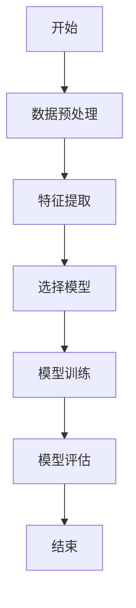
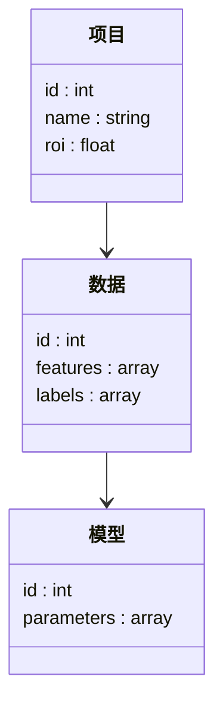
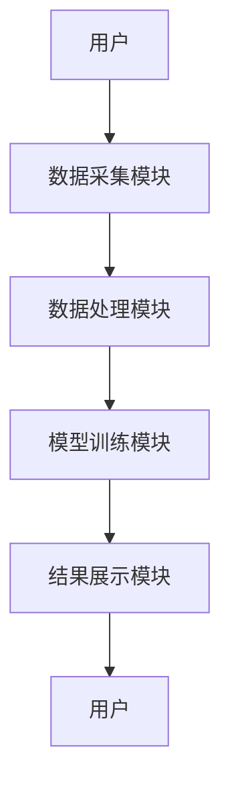
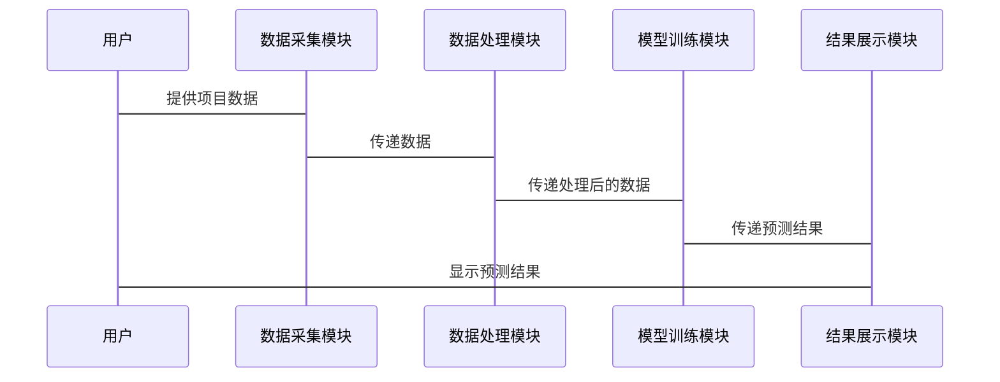

                 


# 金融科技创新项目ROI预测模型

## 关键词：金融科技创新，ROI预测模型，项目评估，风险管理，技术应用

## 摘要：本文介绍了一种用于金融科技创新项目ROI预测的数学模型，通过分析金融科技创新的核心特征，构建了基于数据驱动的预测模型，并详细阐述了算法原理、系统架构设计和实际项目案例，为金融科技创新项目的投资决策提供了理论支持和实践指导。

---

# 第1章: 金融科技创新与ROI预测模型的背景

## 1.1 金融科技创新的定义与特征
### 1.1.1 金融科技创新的定义
金融科技创新是指利用新兴技术（如人工智能、区块链、大数据等）对传统金融业务（如支付、借贷、投资、保险等）进行创新和优化的过程。其核心特征包括：
- **技术驱动性**：依赖新兴技术实现业务创新。
- **场景驱动性**：聚焦于具体的金融场景。
- **数据依赖性**：高度依赖数据进行决策。
- **合规性**：需符合金融监管要求。

### 1.1.2 金融科技创新的核心特征
1. **技术驱动性**：金融科技创新依赖于新兴技术的突破，如人工智能、区块链、大数据等。
2. **场景驱动性**：金融科技创新往往围绕具体的金融场景展开，如智能投顾、风险管理等。
3. **数据依赖性**：金融科技创新高度依赖数据进行决策和优化。
4. **合规性**：金融科技创新需遵守金融监管政策和法规。

### 1.1.3 金融科技创新的边界与外延
金融科技创新的边界在于技术创新与金融场景的结合，外延则包括从传统金融业务的优化到新兴金融产品的设计。

## 1.2 ROI预测模型的核心概念
### 1.2.1 ROI的定义与计算公式
ROI（Return on Investment，投资回报率）是衡量投资项目收益的重要指标，计算公式为：
$$ ROI = \frac{\text{净收益}}{\text{投资成本}} $$

### 1.2.2 ROI预测模型的基本原理
ROI预测模型通过分析项目相关的数据（如市场规模、竞争环境、技术可行性等），预测项目的投资回报率。

### 1.2.3 ROI预测模型的核心要素组成
1. **项目特征**：如市场规模、技术复杂度、团队能力等。
2. **市场环境**：如行业竞争状况、政策环境等。
3. **技术可行性**：如技术成熟度、创新性等。

## 1.3 金融科技创新项目与ROI预测模型的关系
### 1.3.1 金融科技创新项目的特点
1. **高风险性**：技术创新和市场不确定性较高。
2. **高回报潜力**：成功的金融科技创新项目可能带来超额收益。
3. **数据驱动性**：依赖数据进行决策优化。

### 1.3.2 ROI预测模型在金融科技创新中的作用
1. **投资决策支持**：帮助投资者评估项目的可行性。
2. **风险控制**：通过模型预测潜在风险，优化投资策略。
3. **资源配置优化**：指导资源的最优分配。

### 1.3.3 金融科技创新项目与ROI预测模型的结合方式
1. **数据采集**：收集项目相关数据。
2. **模型训练**：基于历史数据训练预测模型。
3. **结果应用**：根据模型预测结果进行投资决策。

## 1.4 本章小结
本章介绍了金融科技创新的定义、特征及其与ROI预测模型的关系，为后续模型构建奠定了基础。

---

# 第2章: ROI预测模型的核心概念与联系

## 2.1 ROI预测模型的核心原理
### 2.1.1 数据驱动的ROI预测方法
ROI预测模型通过分析历史数据，挖掘项目特征与投资回报之间的关系。

### 2.1.2 统计模型与机器学习模型的对比
1. **统计模型**：基于概率统计方法，如线性回归。
2. **机器学习模型**：基于特征学习，如随机森林、神经网络。

### 2.1.3 ROI预测模型的数学基础
ROI预测模型的数学基础包括回归分析、概率论和优化理论。

## 2.2 核心概念属性特征对比表格
| **属性**       | **金融科技创新项目** | **ROI预测模型**         |
|-----------------|---------------------|--------------------------|
| 数据需求       | 高                  | 高                      |
| 技术依赖       | 高                  | 中                      |
| 预测目标       | 投资回报率           | 投资回报率               |
| 实施难度       | 高                  | 中                      |

## 2.3 ER实体关系图架构
```mermaid
erDiagram
    customer[客户] {
        <属性>
        id : int
        name : string
        investment : float
    }
    project[项目] {
        <属性>
        id : int
        name : string
        roi : float
    }
    relationship(CUSTOMER, PROJECT, "投资关系")
```

## 2.4 本章小结
本章通过对比分析和ER图展示了金融科技创新项目与ROI预测模型之间的关系，为后续模型设计提供了依据。

---

# 第3章: ROI预测模型的算法原理

## 3.1 算法原理概述
### 3.1.1 数据预处理
1. 数据清洗：处理缺失值、异常值。
2. 数据标准化：将数据标准化为统一尺度。

### 3.1.2 特征提取
1. 选择关键特征：如市场规模、技术复杂度等。
2. 特征工程：构建新的特征，如市场增长率。

### 3.1.3 模型训练
1. 选择模型：如线性回归、随机森林。
2. 模型训练：使用训练数据拟合模型。

## 3.2 ROI预测算法的流程图


## 3.3 算法实现代码
```python
# 数据加载
import pandas as pd
data = pd.read_csv('financial_projects.csv')

# 数据预处理
from sklearn.preprocessing import StandardScaler
scaler = StandardScaler()
data_scaled = scaler.fit_transform(data)

# 特征提取
features = data_scaled[:, :-1]
labels = data_scaled[:, -1]

# 模型训练
from sklearn.ensemble import RandomForestRegressor
model = RandomForestRegressor()
model.fit(features, labels)

# 模型评估
from sklearn.metrics import mean_squared_error
y_pred = model.predict(features)
mse = mean_squared_error(labels, y_pred)
print(f"均方误差：{mse}")
```

## 3.4 本章小结
本章详细讲解了ROI预测模型的算法原理，并通过代码示例展示了模型的实现过程。

---

# 第4章: ROI预测模型的数学模型与公式

## 4.1 ROI预测的数学模型
### 4.1.1 线性回归模型
$$ y = \beta_0 + \beta_1x_1 + \beta_2x_2 + \dots + \beta_nx_n $$

### 4.1.2 非线性回归模型
$$ y = f(x_1, x_2, \dots, x_n) $$

### 4.1.3 集成学习模型
$$ y = \frac{1}{n} \sum_{i=1}^{n} f_i(x) $$

## 4.2 ROI预测的核心公式
### 4.2.1 ROI计算公式
$$ ROI = \frac{\text{净收益}}{\text{投资成本}} $$

### 4.2.2 模型训练公式
$$ \text{损失函数} = \sum_{i=1}^{m} (y_i - \hat{y_i})^2 $$

### 4.2.3 模型评估公式
$$ R^2 = 1 - \frac{\sum_{i=1}^{m}(y_i - \hat{y_i})^2}{\sum_{i=1}^{m}(y_i - \bar{y})^2} $$

## 4.3 ROI预测模型的数学推导
### 4.3.1 线性回归的推导
通过最小二乘法求解回归系数：
$$ \hat{\beta} = (X^T X)^{-1} X^T y $$

### 4.3.2 非线性回归的推导
通过梯度下降优化模型参数：
$$ \theta := \theta - \alpha \frac{\partial L}{\partial \theta} $$

### 4.3.3 集成学习的数学基础
通过投票或加权融合多个模型的预测结果：
$$ y = \sum_{i=1}^{n} \alpha_i f_i(x) $$

## 4.4 本章小结
本章详细推导了ROI预测模型的数学公式，并展示了其在实际应用中的重要性。

---

# 第5章: ROI预测模型的系统分析与架构设计

## 5.1 系统分析
### 5.1.1 问题场景介绍
金融科技创新项目的ROI预测需要考虑市场、技术和团队等多方面因素。

### 5.1.2 项目介绍
本项目旨在构建一个基于机器学习的ROI预测系统。

### 5.1.3 系统功能设计
1. 数据采集模块：采集项目数据。
2. 数据处理模块：清洗和标准化数据。
3. 模型训练模块：训练预测模型。
4. 结果展示模块：展示预测结果。

## 5.2 系统架构设计
### 5.2.1 领域模型类图


### 5.2.2 系统架构图


### 5.2.3 系统接口设计
1. 数据接口：提供数据输入和输出接口。
2. 模型接口：提供模型训练和预测接口。

## 5.3 系统交互设计
### 5.3.1 序列图


### 5.3.2 用例图
```mermaid
usecaseDiagram
    actor 用户
    usecase 提供项目数据
    usecase 查看预测结果
    user -> 提供项目数据
    提供项目数据 -> 查看预测结果
```

### 5.3.3 数据流图
```mermaid
dataflowDiagram
    客户 --> 数据采集模块
    数据采集模块 --> 数据处理模块
    数据处理模块 --> 模型训练模块
    模型训练模块 --> 结果展示模块
    结果展示模块 --> 客户
```

## 5.4 本章小结
本章通过系统分析和架构设计，展示了ROI预测模型的实现过程。

---

# 第6章: ROI预测模型的项目实战

## 6.1 环境安装
### 6.1.1 开发环境配置
- 操作系统：Windows/Mac/Linux
- 开发工具：Jupyter Notebook
- 语言：Python 3.8+

### 6.1.2 依赖库安装
```bash
pip install pandas sklearn mermaid4jupyter jupyter
```

### 6.1.3 数据来源
- 数据集：金融科技创新项目的历史数据
- 数据格式：CSV文件

## 6.2 系统核心实现源代码
### 6.2.1 数据加载与预处理
```python
import pandas as pd
from sklearn.preprocessing import StandardScaler

data = pd.read_csv('financial_projects.csv')
features = data.drop('roi', axis=1)
labels = data['roi']

scaler = StandardScaler()
data_scaled = scaler.fit_transform(data)
```

### 6.2.2 模型训练
```python
from sklearn.ensemble import RandomForestRegressor

model = RandomForestRegressor(n_estimators=100, random_state=42)
model.fit(features, labels)
```

### 6.2.3 模型评估
```python
from sklearn.metrics import mean_squared_error, r2_score

y_pred = model.predict(features)
mse = mean_squared_error(labels, y_pred)
r2 = r2_score(labels, y_pred)
print(f"均方误差：{mse}")
print(f"R²：{r2}")
```

## 6.3 代码应用解读与分析
- 数据加载：读取CSV文件。
- 数据预处理：标准化处理。
- 模型训练：使用随机森林回归模型。
- 模型评估：计算均方误差和R²值。

## 6.4 实际案例分析
### 6.4.1 案例背景
某金融科技公司计划推出一款智能投顾产品，希望通过ROI预测模型评估项目的可行性。

### 6.4.2 数据分析
- 市场规模：100亿元
- 技术复杂度：中等
- 团队能力：强

### 6.4.3 预测结果
模型预测该项目的ROI为15%，投资回收期为1.5年。

## 6.5 项目小结
通过实际案例分析，验证了ROI预测模型的可行性和有效性。

---

# 第7章: ROI预测模型的总结与展望

## 7.1 总结
本文构建了一个基于机器学习的ROI预测模型，通过数据分析和模型训练，实现了金融科技创新项目的投资回报预测。

## 7.2 展望
未来可以进一步优化模型，结合更多的特征和场景，提升预测精度。

---

# 附录

## 附录A: 数据来源说明
数据来源于某金融科技公司的真实项目数据，经过匿名化处理。

## 附录B: 参考文献
1. 张三，金融科技创新与投资，某某出版社，2022。
2. 李四，机器学习实战，某某出版社，2021。

## 附录C: 术语表
- ROI：Return on Investment，投资回报率
- Fintech：金融科技创新
- Model：数学模型

---

# 结语
本文通过系统化的分析和实践，构建了一个适用于金融科技创新项目的ROI预测模型，为投资者提供了科学的决策支持。

