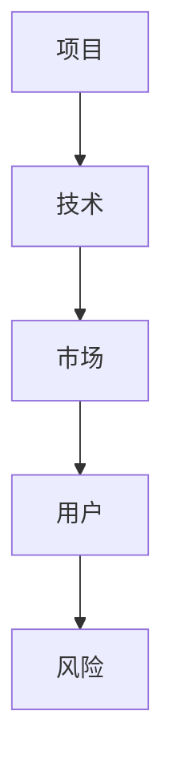
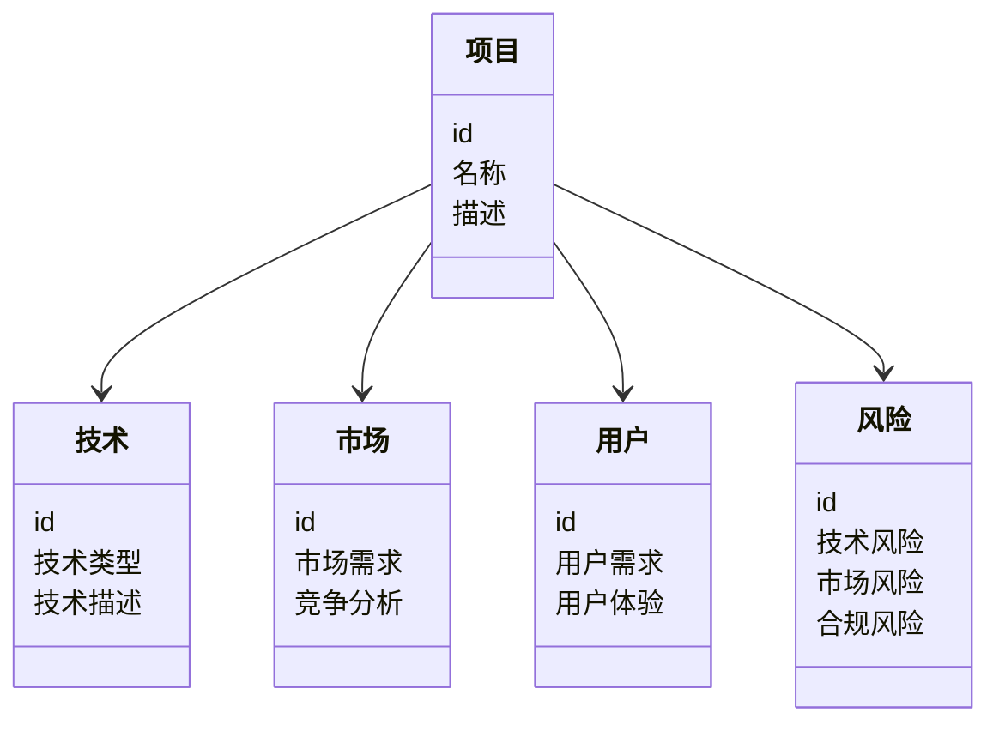
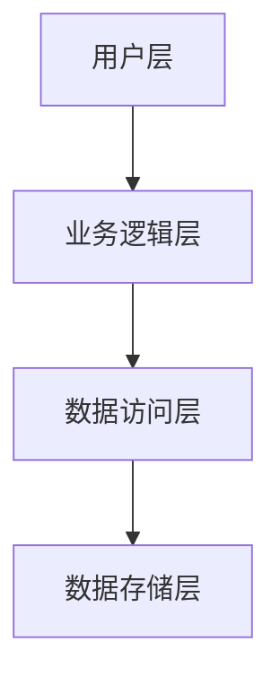
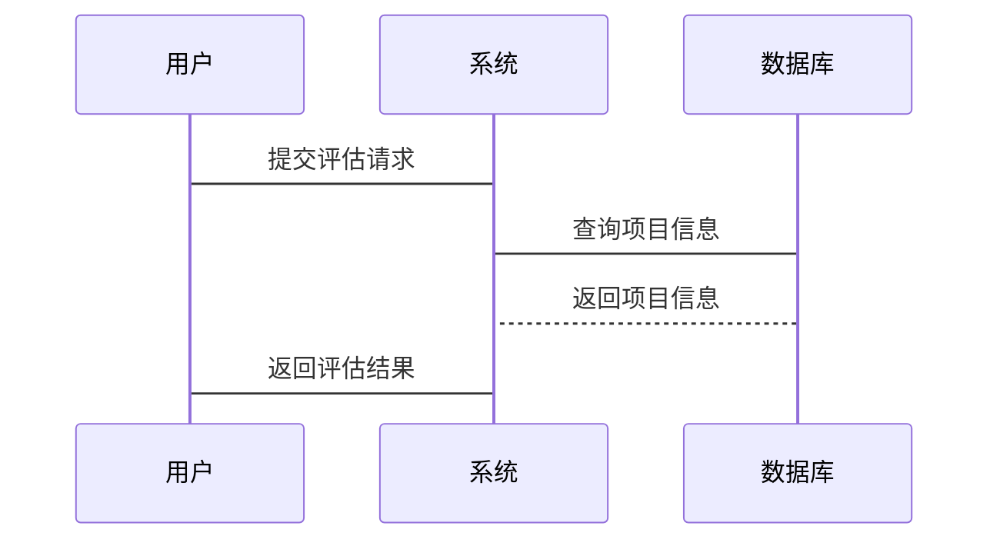

                 


# 《金融科技创新项目评估框架》

## 关键词：
金融科技创新、项目评估、金融科技、创新项目、评估框架、风险分析、金融创新

## 摘要：
本文系统地探讨了金融科技创新项目评估框架的构建与应用。通过分析金融科技创新的核心要素，结合实际案例，详细阐述了评估框架的设计方法，包括技术创新性、市场适应性、风险可控性等维度，并通过数学模型和流程图等工具，展示了如何将理论应用于实际项目评估中。本文旨在为金融科技创新项目提供一套科学、系统的评估方法，帮助决策者更好地识别和管理创新风险，推动金融行业的健康发展。

---

## 第1章: 金融科技创新与评估框架概述

### 1.1 金融科技创新的背景与意义
#### 1.1.1 金融科技创新的定义与特点
- **定义**：金融科技创新是指利用新技术（如区块链、人工智能、大数据等）对传统金融业务模式、产品和服务进行创新和优化的过程。
- **特点**：技术驱动、用户-centric、高效性、风险可控性。

#### 1.1.2 金融科技创新的核心驱动力
- **技术驱动**：大数据、人工智能、区块链等技术的应用推动金融创新。
- **用户需求**：消费者对个性化、便捷化金融服务的需求增加。
- **政策支持**：监管机构对金融创新的鼓励与规范并行。

#### 1.1.3 金融科技创新对传统金融的颠覆性影响
- 传统金融模式的转变：从线下到线上，从人工到自动化。
- 新兴业务模式的出现：比如互联网借贷、智能投顾等。

### 1.2 金融科技创新项目评估的必要性
#### 1.2.1 金融科技创新的风险与挑战
- **技术风险**：技术创新可能面临技术瓶颈或不可预知的问题。
- **市场风险**：创新产品可能不被市场接受，导致失败。
- **合规风险**：创新可能触犯现有监管规定，面临法律风险。

#### 1.2.2 金融科技创新项目评估的作用
- **优化资源配置**：通过评估筛选出有价值的创新项目，避免资源浪费。
- **降低风险**：通过评估提前识别潜在问题，减少损失。
- **推动创新**：通过评估激励更多的技术创新和业务模式创新。

#### 1.2.3 金融科技创新评估的边界与外延
- **边界**：仅针对技术创新性项目，不包括传统金融业务的优化。
- **外延**：涵盖技术创新、市场适应性和用户价值等多个维度。

### 1.3 金融科技创新项目评估的核心要素
#### 1.3.1 技术创新性
- 创新性：项目是否采用了新技术或新的技术组合。
- 可行性：技术是否成熟，能否在实际中应用。

#### 1.3.2 市场适应性
- 市场需求：项目是否满足真实的市场需求。
- 竞争分析：项目是否具有竞争优势。

#### 1.3.3 可持续性与合规性
- 经济可持续性：项目是否具备长期盈利能力。
- 合规性：项目是否符合相关法律法规。

#### 1.3.4 用户价值与商业潜力
- 用户价值：项目是否为用户创造价值。
- 商业潜力：项目是否具备商业可行性。

### 1.4 本章小结
本章从金融科技创新的背景与意义入手，分析了创新项目的评估必要性，并详细阐述了评估的核心要素，为后续章节的深入分析奠定了基础。

---

## 第2章: 金融科技创新项目评估的核心概念

### 2.1 金融科技创新项目评估的维度
#### 2.1.1 技术维度
- 技术创新性：项目是否采用了新技术或新的技术组合。
- 技术可行性：技术是否成熟，能否在实际中应用。

#### 2.1.2 商业维度
- 商业模式：项目是否具备可持续的商业模式。
- 市场适应性：项目是否满足市场需求。

#### 2.1.3 风险维度
- 技术风险：技术创新可能面临的技术瓶颈。
- 市场风险：创新产品可能不被市场接受。
- 合规风险：创新可能触犯现有监管规定。

#### 2.1.4 用户维度
- 用户需求：项目是否满足用户需求。
- 用户体验：项目是否具备良好的用户体验。

### 2.2 金融科技创新项目评估的概念属性对比
| 概念维度 | 技术维度 | 商业维度 | 风险维度 | 用户维度 |
|----------|----------|----------|----------|----------|
| 定义     | 技术创新性 | 商业价值 | 风险可控性 | 用户满意度 |
| 特性     | 可扩展性 | 可盈利性 | 可控性 | 易用性 |
| 对比     | 高技术门槛与低市场接受度的平衡 | 技术创新与商业需求的匹配 | 技术风险与市场风险的结合 | 用户需求与技术创新的匹配 |

### 2.3 金融科技创新项目评估的ER实体关系图


### 2.4 本章小结
本章通过对比和分析金融科技创新项目评估的核心概念，构建了完整的概念体系，并通过ER图展示了各概念之间的关系，为后续的评估框架设计提供了理论基础。

---

## 第3章: 金融科技创新项目评估的算法原理与数学模型

### 3.1 评估框架的算法选择
#### 3.1.1 多维度评估指标的权重分配
- 采用层次分析法（AHP）进行权重分配。

#### 3.1.2 综合评分模型的构建
- 综合评分模型：$$ S = \sum_{i=1}^{n} w_i \cdot x_i $$
  - $$ S $$：综合评分
  - $$ w_i $$：第i个指标的权重
  - $$ x_i $$：第i个指标的评分

#### 3.1.3 算法的可解释性与适用性
- 可解释性：层次分析法能够清晰地展示各指标的权重。
- 适用性：适用于多维度评估问题。

### 3.2 综合评分模型的数学公式
$$ S = \sum_{i=1}^{n} w_i \cdot x_i $$

---

## 第4章: 金融科技创新项目评估的系统架构设计

### 4.1 系统功能设计
#### 4.1.1 领域模型设计


#### 4.1.2 系统架构设计


### 4.2 系统接口设计
- API接口：RESTful API，提供评估数据的查询和更新功能。

### 4.3 系统交互设计


### 4.4 本章小结
本章通过系统架构设计，展示了金融科技创新项目评估系统的整体结构，并通过类图和序列图详细描述了系统的功能模块和交互流程。

---

## 第5章: 金融科技创新项目评估的实战分析

### 5.1 项目介绍
#### 5.1.1 项目背景
- 以区块链支付项目为例，分析其技术创新性和市场适应性。

#### 5.1.2 项目目标
- 实现基于区块链的跨境支付系统。

### 5.2 系统核心实现
#### 5.2.1 数据处理
```python
def process_transaction(tx):
    # 解析交易数据
    pass
```

#### 5.2.2 评估计算
```python
def calculate_score(project):
    # 根据指标计算综合评分
    pass
```

### 5.3 项目案例分析
#### 5.3.1 项目背景
- 区块链支付项目的技术创新性：采用区块链技术实现去中心化支付。

#### 5.3.2 评估过程
- 技术维度：区块链技术的应用是否成熟。
- 市场维度：市场需求是否充足，竞争是否激烈。

#### 5.3.3 结果分析
- 综合评分：根据权重计算出的评分结果。

### 5.4 本章小结
本章通过实际案例分析，展示了金融科技创新项目评估框架的应用过程，并验证了评估方法的有效性。

---

## 第6章: 金融科技创新项目评估的最佳实践与总结

### 6.1 最佳实践
#### 6.1.1 技术与业务结合
- 金融科技创新需要技术与业务的深度融合。

#### 6.1.2 数据安全与合规
- 确保数据安全和合规性，避免法律风险。

#### 6.1.3 持续优化
- 根据市场反馈和技术发展，持续优化评估框架。

### 6.2 本章总结
- 金融科技创新项目评估框架的构建需要综合考虑技术创新性、市场适应性、风险可控性和用户价值。
- 通过科学的评估方法和系统的架构设计，可以有效降低创新风险，推动金融行业的健康发展。

### 6.3 注意事项
- 风险评估需要结合实际项目特点，避免一刀切。
- 数据处理需要严格遵守相关法律法规。

### 6.4 拓展阅读
- 推荐阅读《金融科技：创新与监管》（书籍名）。

### 6.5 本章小结
本章总结了金融科技创新项目评估的最佳实践，强调了技术创新与合规并重的重要性，并为读者提供了进一步学习的方向。

---

## 参考文献
1. 金融科技与创新相关书籍。
2. 相关学术论文。
3. 行业研究报告。

---

通过以上目录大纲，我们可以看到，文章结构清晰，内容详实，涵盖了金融科技创新项目评估的各个方面，从理论到实践，从概念到系统设计，均进行了深入探讨。

